# A03 · Cálculo y gradientes

> Un modelo aprende porque alguien sabe responder a esta pregunta: **«si muevo este peso un
> poquito, ¿cuánto cambia el error?»**. Eso es una derivada, y nada más.
>
> **Usado en:** [P02](../foundational/P02_backpropagation/README.md) ·
> [P03](../foundational/P03_lstm/README.md) · [P05](../foundational/P05_word2vec/README.md) ·
> [P12](../foundational/P12_instructgpt_rlhf/README.md) ·
> [P15](../foundational/P15_dpo/README.md)

## 1. Derivada: la pregunta que resuelve

```text
f'(x) = lim_{h→0}  ( f(x+h) − f(x) ) / h
```

En castellano: **cuánto cambia la salida por unidad de cambio en la entrada**. El signo indica
la dirección; la magnitud, la sensibilidad.

**Gradiente** es lo mismo con varias variables: un vector con una derivada parcial por
parámetro. Apunta en la dirección de **máximo crecimiento**, así que para minimizar se va en
contra:

```text
θ ← θ − η · ∂L/∂θ           η = tasa de aprendizaje
```

**Ejemplo resuelto.** `L(x) = (x−3)²`, empezando en `x = 8` con `η = 0,1`:

```text
∂L/∂x = 2(x−3)

x=8   → grad = 10   → x ← 8 − 0,1·10 = 7,0     L: 25 → 16
x=7   → grad =  8   → x ← 7 − 0,1·8  = 6,2     L: 16 → 10,24
x=6,2 → grad =  6,4 → x ← 6,2 − 0,64 = 5,56    L: 10,24 → 6,55
```

Converge hacia `x = 3`, donde el gradiente vale 0. Haz dos pasos más a mano.

> ⚠️ **Error común:** creer que gradiente 0 significa «óptimo global». Significa punto crítico:
> puede ser mínimo, máximo o punto de silla.

## 2. Regla de la cadena

Si `y = f(u)` y `u = g(x)`, entonces:

```text
dy/dx = (dy/du) · (du/dx)
```

Las sensibilidades **se multiplican** a lo largo de la composición. Toda la retropropagación es
esta regla aplicada con orden.

**Ejemplo resuelto.** `y = (3x + 1)²` en `x = 2`:

```text
u = 3x+1 = 7        du/dx = 3
y = u²  = 49        dy/du = 2u = 14

dy/dx = 14 · 3 = 42
```

Comprobación numérica: `((3·2,001+1)² − (3·1,999+1)²) / 0,002 = 42,0` ✓

## 3. Retropropagación

Para la red `x → h = σ(W₁x + b₁) → o = σ(W₂h + b₂)` con `L = (o − y)²`:

```text
σ(z) = 1/(1+e^{−z})           σ'(z) = σ(z)·(1 − σ(z))

δ_o = ∂L/∂o_in = 2(o − y) · σ'(o_in)
∂L/∂W₂ = δ_o · h

δ_h = (W₂ᵀ δ_o) ⊙ σ'(h_in)          ← el error VIAJA hacia atrás
∂L/∂W₁ = δ_h · x
```

**Por qué es eficiente.** Calcular cada derivada parcial por separado costaría una evaluación
por parámetro. Al reutilizar los `δ` ya calculados, el coste total es del orden de una sola
pasada hacia adelante — sea la red de 9 parámetros o de 9 000 millones.

```mermaid
flowchart LR
    X["x"] -->|"W₁"| H["h"] -->|"W₂"| O["o"] --> L["L(o,y)"]
    L -.->|"δ_o"| O2["∂L/∂W₂"]
    O -.->|"W₂ᵀδ_o ⊙ σ'"| H2["δ_h"]
    H2 -.-> W1["∂L/∂W₁"]
    style L fill:#3a1a1a,stroke:#f85149
```



## 4. Por qué el gradiente se desvanece

La sigmoide tiene un techo: `σ'(z) ≤ 0,25`, y ese máximo solo se alcanza en `z = 0`.

Al encadenar capas, los factores se **multiplican**:

| capas | factor acumulado (con σ' ≈ 0,25) |
|---:|---|
| 1 | 0,25 |
| 5 | 0,00098 |
| 10 | 0,00000095 |
| 20 | ≈ 9·10⁻¹³ |

Las primeras capas dejan de recibir señal útil. Es exactamente el problema de
[P03](../foundational/P03_lstm/README.md) trasladado al tiempo en vez de a la profundidad, y la
razón de que existan la LSTM y las conexiones residuales.

**La solución estructural en una línea:**

```text
Camino multiplicativo:  ∂h_T/∂h_0 = Π σ'(·)·W     → colapsa o explota
Camino aditivo:         c_t = f·c_{t−1} + …       → ∂c_t/∂c_{t−1} = f ≈ 1
```

Sumar en vez de multiplicar. Esa es la idea que comparten la celda LSTM, las residuales de
ResNet y cada bloque del Transformer.

## 5. Comprobación numérica del gradiente

La única forma de saber que tu derivación es correcta:

```text
Diferencia centrada:   f'(x) ≈ ( f(x+ε) − f(x−ε) ) / (2ε)
```

**Ejemplo resuelto.** `f(x) = (x−3)²` en `x = 2`, cuya derivada real es `−2`:

| ε | resultado | error |
|---|---|---|
| 1e-1 | −2,0000000 | ~1e-16 (esta función es exacta con centrada) |
| 1e-5 | −2,0000000 | ~1e-11 |
| 1e-12 | −2,000178 | 1,8e-4 ← **peor**: la precisión de coma flotante se come el resultado |

Hay un punto óptimo: **ε demasiado grande** mide una secante en vez de la tangente; **ε
demasiado pequeño** hace que `f(x+ε) − f(x−ε)` sea ruido de redondeo.

**Regla práctica:** `ε ≈ 1e-5`, diferencia **centrada**, y se compara el error relativo:

```text
error_relativo = |analítico − numérico| / max(|analítico|, |numérico|, 1e-8)

< 1e-7  →  correcto
< 1e-4  →  sospechoso, revisa
> 1e-2  →  hay un error en la derivación
```

> ⚠️ **Error común:** usar diferencia hacia adelante `(f(x+ε) − f(x))/ε`. Su error es `O(ε)`
> frente a `O(ε²)` de la centrada: pierdes varios dígitos de precisión con el mismo número de
> evaluaciones.

## 6. Gradiente de política (REINFORCE)

Cuando la salida se **muestrea** en vez de calcularse —el caso de
[P12](../foundational/P12_instructgpt_rlhf/README.md) y
[P22](../foundational/P22_deepseek_r1/README.md)— no se puede derivar directamente a través del
muestreo. Se usa:

```text
∇θ E[r] = E[ r · ∇θ log π_θ(a) ]
```

En castellano: **sube la probabilidad de lo que salió bien y baja la de lo que salió mal**,
proporcionalmente a la recompensa.

**Línea base.** Restar la recompensa media reduce muchísimo la varianza sin sesgar el estimador:

```text
∇θ E[r] = E[ (r − b) · ∇θ log π_θ(a) ]
```

Sin línea base, si todas las recompensas son positivas, **todas** las acciones suben de
probabilidad y solo el ruido decide cuál sube más. Con línea base, solo suben las que están por
encima de la media.

---

[⬅️ Anexos](README.md) ·
[A02 · Probabilidad](A02_PROBABILIDAD_Y_VEROSIMILITUD.md) ·
[A05 · Complejidad y coste](A05_COMPLEJIDAD_Y_COSTE.md) ·
[🏫 Clase 050 del programa](../../classes/part-04-neural-networks-and-deep-learning/050-mlp-y-backpropagation/README.md)
