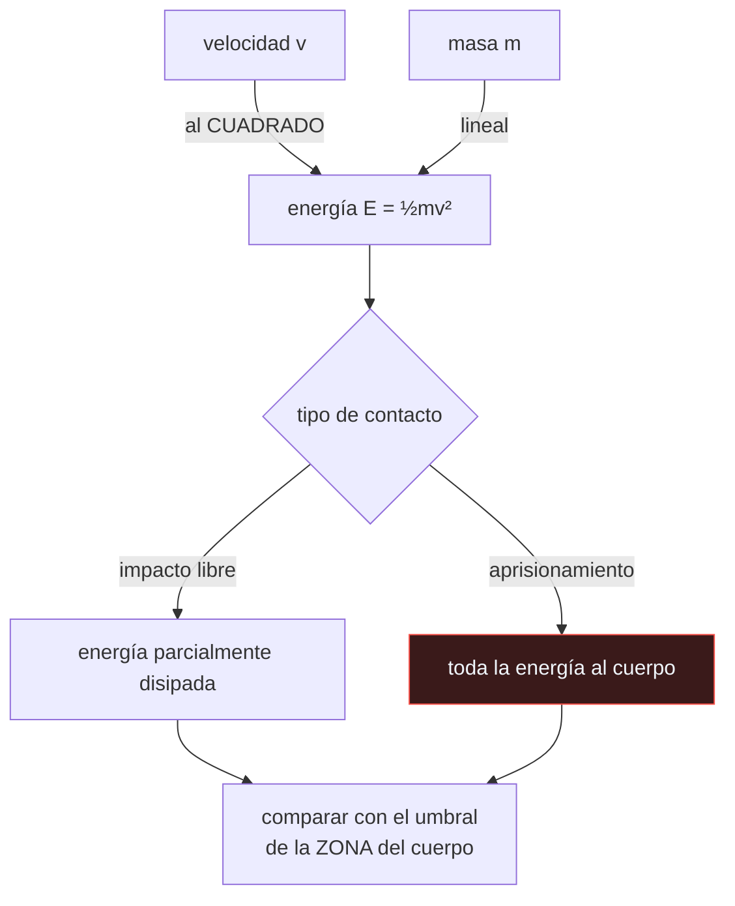

# P100 — Seguridad física

> Ruta encarnada · «Colaborativo» no es una propiedad del robot. La energía de impacto
> crece con el cuadrado de la velocidad, y eso decide si una célula es segura.

**Nivel:** L2 · **Motor:** `seguridad_fisica` · **Notebook:** [`P100_seguridad_fisica.ipynb`](../../../notebooks/papers/P100_seguridad_fisica.ipynb)
· **Anexo:** [complejidad y coste](../../annexes/A05_COMPLEJIDAD_Y_COSTE.md)

> [!WARNING]
> Los umbrales de esta ficha son **ilustrativos**. Los valores normativos están en
> ISO/TS 15066 y dependen de la zona del cuerpo, del tipo de contacto y de la
> geometría. Ninguna evaluación real debe partir de aquí.

## 1. Identificación

| Campo | Valor |
|---|---|
| **Título original** | *Requirements for Safe Robots: Measurements, Analysis and New Insights* |
| **Autoría** | Sami Haddadin, Alin Albu-Schäffer, Gerd Hirzinger |
| **Año** | 2009 |
| **Venue** | The International Journal of Robotics Research, 28(11–12), 1507–1527 |
| **Fuente primaria** | [doi:10.1177/0278364909343970](https://doi.org/10.1177/0278364909343970) |
| **Acceso** | Restringido |
| **Fecha de consulta** | 2026-08-17 |

## 2. Problema anterior

La seguridad de los robots industriales se resolvía por separación física: vallas, barreras
inmateriales y parada total si alguien entra. Funciona, y hace imposible que un robot y una persona
trabajen en la misma tarea.

Para permitir el contacto hacía falta un dato que no existía: **qué daño produce realmente un
impacto de robot**. Sin él, las normas se escribían por analogía y los diseñadores trabajaban con
intuiciones —«pesa mucho, luego es peligroso»— que nadie había comprobado.

## 3. Propuesta

Medir. El artículo instrumenta impactos reales con maniquíes de ensayo de la industria del
automóvil y con voluntarios, sobre robots de distinta masa y a distintas velocidades, y aplica los
criterios de lesión establecidos en biomecánica.

Sus conclusiones son contraintuitivas y por eso importan:

- para impactos libres, la masa del robot importa **mucho menos** de lo que se creía a partir de
  cierto umbral;
- la **velocidad** es el factor dominante;
- el caso realmente peligroso no es el impacto libre sino el **aprisionamiento**, donde la energía
  no se disipa en el movimiento.

## 4. Intuición sin fórmulas

Un golpe con una pelota. Una de tenis lanzada muy fuerte hace más daño que una medicinal que se
te apoya encima despacio. La masa importa, pero la velocidad importa al cuadrado.

Y hay una diferencia más: si la pelota te golpea y sale rebotada, la energía se reparte. Si te
queda atrapada contra una pared, toda va a ti.

**Dónde deja de funcionar la analogía:** el daño biológico no depende solo de la energía sino de
cómo se distribuye —área de contacto, rigidez, zona del cuerpo—. Por eso los criterios de lesión
son específicos por zona y no una sola cifra.

## 5. Matemática mínima

```text
E = ½·m·v²            la masa entra LINEAL, la velocidad al CUADRADO

fuerza ≈ E / distancia de frenado    (aproximación grosera; el modelo real es biomecánico)
```

La miniatura compara cuatro configuraciones:

| Escenario | Masa | Velocidad | Energía |
|---|---:|---:|---:|
| brazo industrial | 120 kg | 1,5 m/s | **135 J** |
| cobot ligero | 12 kg | 1,5 m/s | 13,5 J |
| cobot a media velocidad | 12 kg | 0,75 m/s | 3,375 J |
| brazo pesado muy lento | 120 kg | 0,25 m/s | **3,75 J** |

La última fila es la lección: el brazo **pesado** a baja velocidad lleva prácticamente la misma
energía que el **ligero** a media velocidad. Y dividir la masa por 10 deja 13,5 J mientras dividir
la velocidad por 2 deja 33,75 J — frenar rinde más, y suele ser más barato.

<!-- puente:inicio -->
> [!TIP]
> **Puente matemático.** Esta sección da por sabido lo siguiente. Si algo no te suena,
> léelo primero: está explicado una sola vez, en un solo sitio, y sirve para todas las fichas.

| Dónde | Qué necesitas de ahí |
|---|---|
| [**A05 §1** · Notación O(): qué dice y qué no](../../annexes/A05_COMPLEJIDAD_Y_COSTE.md#1-notación-o-qué-dice-y-qué-no) | por qué una dependencia cuadrática domina a una lineal en cuanto el factor crece |
<!-- puente:fin -->

## 6. Arquitectura o flujo



## 7. Qué observar en el paper original

- El **protocolo de medición**: maniquíes instrumentados, sensores de fuerza, criterios de lesión
  tomados de la industria del automóvil. Es lo que convierte opiniones en datos.
- La distinción entre **impacto libre** y **aprisionamiento**, y por qué el segundo es mucho más
  peligroso aunque la energía sea la misma.
- El resultado sobre la **masa**: por encima de cierto umbral, aumentar la masa del robot apenas
  cambia el daño en impacto libre. Va contra la intuición y contra el diseño de la época.
- La discusión sobre **detección de colisión y reacción**: qué puede hacer el control cuando el
  contacto ya ha ocurrido.

## 8. Evidencia y resultados

Mediciones experimentales sistemáticas con maniquíes de ensayo y con voluntarios, sobre robots
reales de distinta masa, con criterios de lesión validados en biomecánica.

> Es de los pocos artículos del programa cuya evidencia es **física y medida**, no simulada. Esa es
> exactamente su aportación: sustituir la intuición por datos.

La miniatura no reproduce nada de eso: aplica la fórmula de la energía cinética con un modelo de
fuerza deliberadamente grosero, para exhibir la dependencia cuadrática con la velocidad. Sus
umbrales son inventados.

## 9. Impacto

- Es una de las bases técnicas de **ISO/TS 15066** (2016), la especificación que define los límites
  biomecánicos para robots colaborativos.
- Habilitó una categoría de producto entera: los cobots que trabajan sin valla junto a personas.
- Cambió el criterio de diseño de «hacer el robot más ligero» a «limitar la velocidad por zona y
  detectar el contacto».
- Y aporta al programa un caso donde la seguridad **no es una propiedad del componente** sino de la
  tarea, la velocidad y la geometría — un patrón que se repite en cualquier sistema autónomo.

## 10. Limitaciones

1. **Los criterios de lesión vienen de la automoción** y su traslado a impactos robóticos, de
   menor energía y otra geometría, tiene supuestos discutibles.
2. **Los maniquíes no son personas.** Los ensayos con voluntarios son necesariamente de baja
   energía.
3. **No cubre todos los tipos de contacto**: aristas, herramientas afiladas y aprisionamientos
   complejos requieren análisis específico.
4. **Los umbrales dependen de la zona del cuerpo**, y una cifra única no significa nada.
5. **La normativa evoluciona.** Cualquier evaluación real debe partir de la versión vigente de
   ISO/TS 15066 y de un análisis de riesgos de la instalación concreta.

## 11. Errores comunes

| Error | Corrección |
|---|---|
| «Un robot ligero es un robot seguro» | La velocidad domina. Un cobot de 12 kg a 1,5 m/s lleva más energía que un brazo de 120 kg a 0,25 m/s. |
| ««Colaborativo» es una certificación del robot» | La evaluación es de la aplicación completa: robot, herramienta, tarea, velocidad y geometría de la célula. El mismo robot puede ser seguro en una tarea y no en otra. |
| «Si el robot puede parar rápido, es seguro» | El aprisionamiento no se resuelve parando: si la persona queda atrapada, la energía ya está aplicada y el robot inmóvil sigue ejerciendo fuerza. |
| «Reducir la masa es la vía principal» | Reducir la velocidad rinde mucho más porque entra al cuadrado, y suele costar menos que rediseñar la mecánica. |
| «Con los números de esta ficha se puede evaluar una célula» | No. Los umbrales de aquí son ilustrativos y el modelo de fuerza es grosero. La evaluación real parte de la norma y de un análisis de riesgos. |

## 12. Relación con trabajos anteriores

- **ISO 10218** — la norma de robots industriales basada en separación física, que es el punto de
  partida que este trabajo permite superar.
- **[P97 Subsunción](../P97_subsuncion/README.md) (1986)** — la arquitectura reactiva, que es lo
  que permite reaccionar a un contacto en milisegundos.
- **Criterios de lesión de la automoción** (HIC y familia) — la biomecánica que se traslada.

## 13. Relación con trabajos posteriores

- **ISO/TS 15066:2016** — límites biomecánicos para robots colaborativos, cuya base técnica
  incluye este trabajo. [iso.org/standard/62996](https://www.iso.org/standard/62996.html)
- **Haddadin y Croft (2016)** — interacción física humano-robot, el capítulo de referencia.
  [doi:10.1007/978-3-319-32552-1_69](https://doi.org/10.1007/978-3-319-32552-1_69)
- **[P103 Aleatorización de dominio](../P103_domain_randomization/README.md) (2017)** — entrenar en
  simulación es también una decisión de seguridad: los errores ocurren donde no hay nadie.

## 14. Notebook asociado

[`P100_seguridad_fisica.ipynb`](../../../notebooks/papers/P100_seguridad_fisica.ipynb)

**Qué implementa:** el cálculo de energía cinética para cuatro configuraciones de masa y velocidad, la comparación entre reducir masa y reducir velocidad, y una evaluación contra umbrales ilustrativos por zona del cuerpo.

**Qué NO implementa:** el modelo de fuerza es una división grosera y los umbrales son inventados. No hay biomecánica, ni tipos de contacto, ni geometría: nada de esto sirve para evaluar nada real.

```bash
ai-evolution paper-lab P100 --seed 7
```

## 15. Actividades Bloom

| Nivel | Actividad |
|---|---|
| **Recordar** | Escribe la fórmula de la energía cinética e identifica qué factor domina. |
| **Explicar** | Explica la diferencia entre impacto libre y aprisionamiento. |
| **Aplicar** | Ejecuta el notebook y calcula la energía de una configuración propia. |
| **Analizar** | Analiza por qué reducir la velocidad rinde más que reducir la masa. |
| **Evaluar** | «Este robot es colaborativo, luego es seguro». Evalúa la afirmación. |
| **Crear** | Toma una célula robotizada real y calcula la energía de impacto en cada fase de su ciclo; identifica dónde habría que limitar la velocidad. |

## 16. Autoevaluación

1. ¿Qué factor domina la energía de impacto?
2. ¿Qué reduce más la energía: dividir la masa por 10 o la velocidad por 2?
3. ¿Por qué el aprisionamiento es más peligroso que el impacto libre?
4. ¿Es «colaborativo» una propiedad del robot?
5. ¿De dónde vienen los criterios de lesión que usa el artículo?
6. ¿Qué cambió este trabajo en el diseño de robots?
7. ¿Se puede evaluar una célula con los números de esta ficha?

## 17. Respuestas esperadas

1. La velocidad, porque entra al cuadrado mientras la masa entra lineal. Duplicar la velocidad cuadruplica la energía.
2. Dividir la velocidad por 2: en la miniatura deja 33,75 J frente a los 13,5 J de dividir la masa por 10... y en el caso extremo, el brazo pesado a 0,25 m/s lleva menos energía que el ligero a 1,5 m/s.
3. Porque en un impacto libre parte de la energía se disipa en el movimiento del cuerpo. Si la persona queda atrapada contra una superficie, toda la energía se aplica sobre ella.
4. No. Es una propiedad de la aplicación completa: robot, herramienta, tarea, velocidad y geometría de la célula. El mismo robot puede ser seguro en una tarea e inseguro en otra.
5. De la biomecánica de la industria del automóvil, adaptados a impactos de menor energía y otra geometría. Ese traslado tiene supuestos discutibles y el artículo los discute.
6. Desplazó el criterio de «hacer el robot más ligero» a «limitar la velocidad por zona y detectar el contacto», y aportó base técnica a ISO/TS 15066.
7. No. Los umbrales son ilustrativos y el modelo de fuerza es grosero. Una evaluación real parte de la norma vigente y de un análisis de riesgos de la instalación.

## 18. Fuentes primarias

- Haddadin, S., Albu-Schäffer, A. y Hirzinger, G. (2009). *Requirements for Safe Robots:
  Measurements, Analysis and New Insights*. **IJRR**, 28(11–12), 1507–1527.
  [doi:10.1177/0278364909343970](https://doi.org/10.1177/0278364909343970) · consultado 2026-08-17.
- ISO/TS 15066:2016. *Robots and robotic devices — Collaborative robots*.
  [iso.org/standard/62996](https://www.iso.org/standard/62996.html) · consultado 2026-08-17.
- Haddadin, S. y Croft, E. (2016). *Physical Human–Robot Interaction*.
  [doi:10.1007/978-3-319-32552-1_69](https://doi.org/10.1007/978-3-319-32552-1_69) ·
  consultado 2026-08-17.

---

[⬅️ Anterior: P99 SLAM](../P99_slam/README.md) ·
[📇 Índice](../../catalog/PAPERS_INDEX.md) ·
[📝 Evaluación](../../../assessments/papers/P100_seguridad_fisica.md) ·
[🏫 Clase 143 · Robots colaborativos y seguridad física](../../../classes/part-11-embodied-ai-robotics-and-computer-use/143-robots-colaborativos-y-seguridad-fisica/README.md) ·
[➡️ Siguiente: P101 DAgger](../P101_dagger/README.md)
