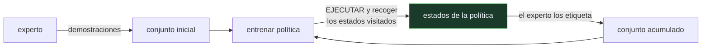

# P101 — DAgger

> Ruta encarnada · Clonar a un experto parece aprendizaje supervisado y no lo es: el
> modelo cambia la distribución sobre la que se ejecuta, y el error se acumula.

**Nivel:** L3 · **Motor:** `dagger` · **Notebook:** [`P101_dagger.ipynb`](../../../notebooks/papers/P101_dagger.ipynb)
· **Anexo:** [probabilidad y verosimilitud](../../annexes/A02_PROBABILIDAD_Y_VEROSIMILITUD.md)

## 1. Identificación

| Campo | Valor |
|---|---|
| **Título original** | *A Reduction of Imitation Learning and Structured Prediction to No-Regret Online Learning* |
| **Autoría** | Stéphane Ross, Geoffrey J. Gordon, J. Andrew Bagnell |
| **Año** | 2011 |
| **Venue** | AISTATS 2011 · arXiv:1011.0686 |
| **Fuente primaria** | [arXiv:1011.0686](https://arxiv.org/abs/1011.0686) |
| **Acceso** | Abierto |
| **Fecha de consulta** | 2026-08-17 |

## 2. Problema anterior

La clonación de comportamiento parece aprendizaje supervisado corriente: se recogen pares de
estado y acción de un experto y se entrena un modelo a predecir la acción.

El problema no está en el entrenamiento sino en el despliegue. El modelo se entrena con los estados
que visita **el experto** y se ejecuta sobre los estados que visita **él mismo**. Un solo error lo
lleva a un estado que el experto nunca visitó, donde no tiene ejemplos y comete más errores. La
desviación se realimenta, y el error total crece como **T²** con el horizonte.

## 3. Propuesta

Cerrar el bucle entre las dos distribuciones. En cada iteración:

1. **ejecutar** la política actual y recoger los estados que visita de verdad;
2. **preguntar al experto** cuál sería la acción correcta en esos estados;
3. **reentrenar** sobre el conjunto acumulado de todas las iteraciones.

La distribución de entrenamiento converge así a la de ejecución. El artículo demuestra, reduciendo
el problema a aprendizaje en línea sin arrepentimiento, que el error pasa a crecer como **T** en
lugar de T².

## 4. Intuición sin fórmulas

Aprender a conducir viendo a alguien que conduce perfectamente. Nunca le ves corregir un derrape,
porque nunca derrapa. El día que derrapas tú, no tienes ni idea de qué hacer.

Lo que hace DAgger es lo que hace un buen instructor: te deja conducir, y **te corrige en las
situaciones a las que tú llegas**, no en las que él llegaría.

**Dónde deja de funcionar la analogía:** el instructor está en el coche. DAgger necesita poder
consultar al experto sobre estados arbitrarios durante el entrenamiento, y en muchos dominios eso
es imposible o carísimo.

## 5. Matemática mínima

```text
Clonación:  entrena con  d_π*   (distribución del experto)
            ejecuta sobre d_π    (distribución de la política)

    si el error por paso es ε,  error total ~ O(ε·T²)

DAgger:     el conjunto de entrenamiento converge a d_π
            error total ~ O(ε·T)
```

La miniatura pone un pasillo de 25 pasos y 5 carriles, con el experto siempre en el central:

| Método | Éxito | Cobertura |
|---|---:|---:|
| clonación de comportamiento | **264/300** (88 %) | 25 estados |
| DAgger, iteración 1 | 271/300 | 25 |
| DAgger, iteración 3 | **300/300** | 119 estados |

La cobertura pasa de **25 a 119 estados**: los 25 del carril central más los 94 que la política
visita cuando se desvía. Con horizonte 100, la diferencia teórica es 10 000 frente a 100.

<!-- puente:inicio -->
> [!TIP]
> **Puente matemático.** Esta sección da por sabido lo siguiente. Si algo no te suena,
> léelo primero: está explicado una sola vez, en un solo sitio, y sirve para todas las fichas.

| Dónde | Qué necesitas de ahí |
|---|---|
| [**A02 §3** · Verosimilitud y entropía cruzada](../../annexes/A02_PROBABILIDAD_Y_VEROSIMILITUD.md#3-verosimilitud-y-entropía-cruzada) | por qué entrenar sobre una distribución y evaluar sobre otra invalida la garantía del aprendizaje supervisado |
<!-- puente:fin -->

## 6. Arquitectura o flujo



## 7. Qué observar en el paper original

- La **reducción a aprendizaje en línea**: el artículo no analiza DAgger directamente, lo reduce a
  un problema de arrepentimiento y hereda sus garantías. Es la aportación técnica.
- El análisis de **por qué T²**: cada error aumenta la probabilidad de estar en un estado no visto,
  y ese efecto se compone a lo largo del horizonte.
- La discusión de la variante con **mezcla de políticas** (β decreciente): en las primeras
  iteraciones se ejecuta parcialmente al experto, para no recoger basura.
- Que el resultado se aplica también a **predicción estructurada**, no solo a control. El título lo
  dice y casi nadie lo cita por eso.

## 8. Evidencia y resultados

Análisis teórico con las cotas de arrepentimiento, más experimentos sobre videojuegos de
conducción y sobre etiquetado de secuencias.

> La cota de O(T) es sobre el arrepentimiento acumulado bajo supuestos de convexidad. Trasladarla a
> un modelo profundo entrenado por descenso de gradiente es una extrapolación razonable, no un
> teorema aplicado.

La miniatura simula el efecto del cambio de distribución con una tasa de error que depende de si el
estado está cubierto. No entrena nada: exhibe el mecanismo.

## 9. Impacto

- Es la referencia obligada del aprendizaje por imitación, y la explicación estándar de por qué la
  clonación de comportamiento se degrada.
- Su diagnóstico —entrenar sobre una distribución y ejecutar sobre otra— reaparece en conducción
  autónoma, en robótica de manipulación y en agentes con modelos de lenguaje que se entrenan con
  trayectorias de éxito.
- La familia de métodos que sigue —agregación de conjuntos de datos, corrección en línea— es hoy
  práctica estándar en aprendizaje de políticas a partir de demostraciones.
- Y aporta al programa un criterio de evaluación: una política clonada hay que **ejecutarla** para
  medirla, no evaluarla sobre las trayectorias del experto.

## 10. Limitaciones

1. **Exige un experto consultable durante el entrenamiento**, sobre estados arbitrarios. En
   muchos dominios eso es imposible o inaceptablemente caro.
2. **El experto tiene que ser bueno en estados raros**, incluidos los que él nunca visitaría. Una
   persona puede no saber qué hacer en un estado absurdo.
3. **La cota es sobre arrepentimiento** bajo supuestos de convexidad; el traslado a modelos
   profundos es empírico.
4. **El conjunto de entrenamiento crece** en cada iteración, y con él el coste de reentrenar.
5. **No resuelve la calidad del experto.** Si el experto es mediocre, DAgger converge a una
   política mediocre con más eficiencia.

## 11. Errores comunes

| Error | Corrección |
|---|---|
| «La clonación de comportamiento es aprendizaje supervisado» | Lo es en el entrenamiento y no en el despliegue: la política cambia la distribución sobre la que se evalúa, y eso rompe la garantía del supervisado. |
| «Con más demostraciones del experto se arregla» | Más demostraciones cubren mejor la distribución del experto, que es justamente la que no se visita al ejecutar. El problema es de qué estados, no de cuántos. |
| «Basta con evaluar la política sobre los datos del experto» | Ahí acierta casi siempre. La evaluación honesta es ejecutarla y medir el resultado del episodio: la diferencia entre esas dos cifras es el problema del artículo. |
| «DAgger elimina el problema» | Reduce el crecimiento del error de T² a T. Sigue creciendo con el horizonte, solo que linealmente. |
| «Sirve siempre que haya un experto» | Hace falta poder consultarlo DURANTE el entrenamiento, sobre estados que él no eligió. Eso es mucho más exigente que tener demostraciones grabadas. |

## 12. Relación con trabajos anteriores

- **Pomerleau (1989)** — ALVINN: conducción autónoma por clonación de comportamiento, el caso
  original y el que exhibe el problema.
- **[P97 Subsunción](../P97_subsuncion/README.md) (1986)** — la alternativa de cablear el
  comportamiento en vez de aprenderlo.

## 13. Relación con trabajos posteriores

- **[P102 PPO](../P102_ppo/README.md) (2017)** — aprender la política de la propia experiencia, sin
  experto que consultar.
- **Chi et al. (2023)** — *Diffusion Policy*: imitación con modelos generativos, que mitiga parte
  del problema representando distribuciones multimodales de acción.
  [arXiv:2303.04137](https://arxiv.org/abs/2303.04137)
- **[P12 InstructGPT](../P12_instructgpt_rlhf/README.md) (2022)** — el mismo patrón en modelos de
  lenguaje: entrenar con demostraciones humanas y después corregir con retroalimentación sobre lo
  que el modelo genera de verdad.

## 14. Notebook asociado

[`P101_dagger.ipynb`](../../../notebooks/papers/P101_dagger.ipynb)

**Qué implementa:** la comparación entre clonación de comportamiento y DAgger sobre un pasillo con carriles, con la evolución de la cobertura de estados y la tasa de éxito por iteración.

**Qué NO implementa:** no entrena ningún modelo: la política es una moneda sesgada cuya tasa de error depende de si el estado está cubierto. Se simula el efecto del cambio de distribución, no se aprende.

```bash
ai-evolution paper-lab P101 --seed 7
```

## 15. Actividades Bloom

| Nivel | Actividad |
|---|---|
| **Recordar** | Explica por qué la clonación de comportamiento no es aprendizaje supervisado corriente. |
| **Explicar** | Describe el ciclo de DAgger en tres pasos. |
| **Aplicar** | Ejecuta el notebook y observa la evolución de la cobertura. |
| **Analizar** | Analiza por qué el error crece como T² y no como T. |
| **Evaluar** | «La política acierta el 98 % sobre los datos del experto». Evalúa qué mide esa cifra. |
| **Crear** | Entrena una política por clonación sobre un entorno simple, mídela ejecutándola y aplica una iteración de DAgger. |

## 16. Autoevaluación

1. ¿Cuál es el problema estructural de la clonación de comportamiento?
2. ¿Por qué el error crece como T²?
3. ¿Qué hace DAgger en cada iteración?
4. ¿A qué reduce el artículo el problema?
5. ¿Qué exige DAgger que no exige la clonación?
6. ¿Elimina el problema del todo?
7. ¿Cómo hay que evaluar una política clonada?

## 17. Respuestas esperadas

1. Que se entrena con los estados que visita el experto y se ejecuta sobre los estados que visita ella misma. Un error la saca de la distribución de entrenamiento.
2. Porque cada error aumenta la probabilidad de estar en un estado no visto, donde la tasa de error es mayor, lo que aumenta la probabilidad del siguiente error. El efecto se compone a lo largo del horizonte.
3. Ejecutar la política actual, recoger los estados que visita, pedir al experto la acción correcta en esos estados y reentrenar sobre el conjunto acumulado.
4. A aprendizaje en línea sin arrepentimiento, y de ahí hereda las garantías que dan la cota O(T).
5. Poder consultar al experto **durante** el entrenamiento, sobre estados arbitrarios que la política visita. No basta con tener demostraciones grabadas.
6. No. Reduce el crecimiento del error de T² a T: sigue creciendo con el horizonte, pero linealmente.
7. Ejecutándola y midiendo el resultado del episodio. Evaluarla sobre las trayectorias del experto mide algo distinto y siempre sale bien.

## 18. Fuentes primarias

- Ross, S., Gordon, G. y Bagnell, J. A. (2011). *A Reduction of Imitation Learning and Structured
  Prediction to No-Regret Online Learning*. **AISTATS 2011**.
  [arXiv:1011.0686](https://arxiv.org/abs/1011.0686) · consultado 2026-08-17.
- Pomerleau, D. (1989). *ALVINN: An Autonomous Land Vehicle in a Neural Network*.
  [NeurIPS 1988](https://proceedings.neurips.cc/paper/1988/hash/812b4ba287f5ee0bc9d43bbf5bbe87fb-Abstract.html)
  · consultado 2026-08-17.
- Chi, C. et al. (2023). *Diffusion Policy: Visuomotor Policy Learning via Action Diffusion*.
  [arXiv:2303.04137](https://arxiv.org/abs/2303.04137) · consultado 2026-08-17.

---

[⬅️ Anterior: P100 Seguridad física](../P100_seguridad_fisica/README.md) ·
[📇 Índice](../../catalog/PAPERS_INDEX.md) ·
[📝 Evaluación](../../../assessments/papers/P101_dagger.md) ·
[🏫 Clase 141 · Aprendizaje por imitación](../../../classes/part-11-embodied-ai-robotics-and-computer-use/141-aprendizaje-por-imitacion/README.md) ·
[➡️ Siguiente: P102 PPO](../P102_ppo/README.md)
