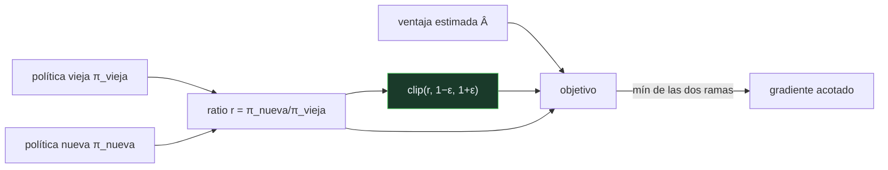

# P102 — PPO

> Ruta encarnada · Un lote con una estimación exagerada puede volver la política
> determinista y dejarla sin capacidad de rectificar. El recorte lo impide en una línea.

**Nivel:** L3 · **Motor:** `ppo` · **Notebook:** [`P102_ppo.ipynb`](../../../notebooks/papers/P102_ppo.ipynb)
· **Anexo:** [probabilidad y verosimilitud](../../annexes/A02_PROBABILIDAD_Y_VEROSIMILITUD.md)

## 1. Identificación

| Campo | Valor |
|---|---|
| **Título original** | *Proximal Policy Optimization Algorithms* |
| **Autoría** | John Schulman, Filip Wolski, Prafulla Dhariwal, Alec Radford, Oleg Klimov |
| **Año** | 2017 |
| **Venue** | arXiv:1707.06347 |
| **Fuente primaria** | [arXiv:1707.06347](https://arxiv.org/abs/1707.06347) |
| **Acceso** | Abierto |
| **Fecha de consulta** | 2026-08-17 |

## 2. Problema anterior

En gradiente de políticas, el tamaño del paso es crítico y no hay forma fácil de acertarlo. Un
paso pequeño aprende demasiado despacio; uno grande puede volver la política casi determinista.

Y ese fallo no es simétrico: una política saturada deja de explorar, y como el gradiente de la
sigmoide se anula en los extremos, **no puede volver**. Un solo lote con una estimación de ventaja
exagerada arruina un entrenamiento de horas.

TRPO lo resolvía imponiendo una restricción de divergencia KL entre la política nueva y la vieja,
pero exigía una optimización de segundo orden con producto Hessiano-vector: correcta, complicada de
implementar y difícil de combinar con arquitecturas modernas.

## 3. Propuesta

Cambiar la restricción por un **recorte** dentro de la propia función objetivo:

```text
r = π_nueva(a|s) / π_vieja(a|s)

L = mín( r·A ,  clip(r, 1−ε, 1+ε)·A )
```

Con ventaja positiva y `r` por encima de `1+ε`, el objetivo se queda plano: aumentar más la
probabilidad **no aporta nada**, así que el gradiente deja de empujar. Con ventaja negativa, el
mínimo hace el trabajo simétrico por el otro lado.

No hay restricciones, no hay segundo orden, no hay divergencia que calcular. Se optimiza con Adam
como cualquier otra pérdida, y se pueden dar varias épocas sobre el mismo lote.

## 4. Intuición sin fórmulas

Un sistema de recompensas para un equipo. Si premias sin techo el resultado de un solo trimestre,
alguien va a apostarlo todo a una jugada — y si sale mal, ya no hay equipo.

Poner un tope al premio no es desconfianza: es lo que impide que una señal ruidosa de un trimestre
destruya la capacidad de reaccionar el siguiente.

**Dónde deja de funcionar la analogía:** el tope de PPO no está en la recompensa sino en **cuánto
puede cambiar la política de una vez**. La recompensa se registra entera; lo que se acota es la
reacción a ella.

## 5. Matemática mínima

```text
L^CLIP(θ) = Ê [ mín( rₜ(θ)·Âₜ ,  clip(rₜ(θ), 1−ε, 1+ε)·Âₜ ) ]

    A > 0  y  r > 1+ε   →  objetivo plano: el gradiente se anula
    A < 0  y  r < 1−ε   →  objetivo plano por el otro lado
```

La miniatura compara el objetivo y el entrenamiento con un entorno que **cambia a mitad**: la
ventaja de la acción es +1,2 hasta el paso 40 y −1,2 después.

| Magnitud | Sin recorte | Con recorte |
|---|---:|---:|
| objetivo a ratio 5,0 | 6,0 | **1,44** |
| salto máximo de probabilidad en un paso | 0,4382 | **0,1727** |
| pasos saturados (p>0,99 o p<0,01) | 60 | 53 |
| probabilidad final tras el giro | 0,9412 | **0,6909** |

El recorte acota el salto por paso, y eso es lo que decide si la política puede rectificar cuando
la acción buena cambia.

<!-- puente:inicio -->
> [!TIP]
> **Puente matemático.** Esta sección da por sabido lo siguiente. Si algo no te suena,
> léelo primero: está explicado una sola vez, en un solo sitio, y sirve para todas las fichas.

| Dónde | Qué necesitas de ahí |
|---|---|
| [**A02 §1** · Softmax](../../annexes/A02_PROBABILIDAD_Y_VEROSIMILITUD.md#1-softmax) | de dónde sale la probabilidad de cada acción y por qué su gradiente se anula en los extremos |
<!-- puente:fin -->

## 6. Arquitectura o flujo



## 7. Qué observar en el paper original

- Por qué el objetivo usa el **mínimo** de las dos expresiones y no directamente la recortada: es
  lo que hace el comportamiento correcto con ventaja negativa.
- Que se pueden dar **varias épocas sobre el mismo lote**, que es de donde sale la eficiencia de
  muestras frente a los métodos de una sola pasada.
- La **estimación de ventaja generalizada** (GAE), que el artículo usa y que es la mitad del
  rendimiento real de PPO.
- Que el artículo también presenta una variante con **penalización KL adaptativa**, y concluye
  empíricamente que el recorte funciona mejor. Esa conclusión es empírica, no teórica.

## 8. Evidencia y resultados

Experimentos sobre entornos de control continuo de MuJoCo y sobre juegos de Atari, comparando con
TRPO, A2C y otros métodos, con curvas de aprendizaje y resultados agregados.

> Los resultados son empíricos y el artículo no reclama garantía teórica: TRPO sí tenía una cota de
> mejora monótona bajo sus supuestos, y PPO la cambia por simplicidad.

Trabajo posterior (Engstrom et al., 2020) mostró que buena parte de la ventaja atribuida al recorte
viene en realidad de **detalles de implementación** —normalización de observaciones, recorte de
gradiente, ajuste del ritmo de aprendizaje—, lo cual es un correctivo importante al citarlo.

## 9. Impacto

- Se convirtió en el algoritmo de referencia del aprendizaje por refuerzo profundo, por la relación
  entre rendimiento y simplicidad de implementación.
- Es el algoritmo con el que se hace **RLHF**: el ajuste por retroalimentación humana de
  [InstructGPT](../P12_instructgpt_rlhf/README.md) y de los modelos de chat posteriores usa PPO, con el
  modelo de referencia jugando el papel de la política vieja.
- Su idea central —no te alejes demasiado de la política anterior— es la misma que la penalización
  KL contra el modelo base en RLHF, y la misma que motiva
  [DPO](../P15_dpo/README.md) a buscar una alternativa sin bucle de refuerzo.
- Y aporta al programa un patrón de diseño: cuando la señal de aprendizaje es ruidosa, acotar la
  magnitud del cambio vale más que afinar su dirección.

## 10. Limitaciones

1. **No hereda la garantía de TRPO.** La mejora monótona no está demostrada para PPO; se justifica
   empíricamente.
2. **Muchos detalles de implementación importan** tanto como el recorte, y sin declararlos los
   resultados no son reproducibles (Engstrom et al., 2020).
3. **Sensible a epsilon y al ritmo de aprendizaje**, aunque menos que los métodos anteriores.
4. **Sigue siendo caro en muestras** comparado con métodos fuera de política.
5. **El recorte no impide todos los colapsos**: en la miniatura, la política recortada también pasa
   53 pasos saturada. Los acota, no los elimina.

## 11. Errores comunes

| Error | Corrección |
|---|---|
| «El recorte garantiza mejora monótona» | Eso lo tenía TRPO bajo sus supuestos. PPO cambia la garantía por simplicidad y se justifica empíricamente. |
| «El objetivo recortado es clip(r)·A» | Es el MÍNIMO entre r·A y clip(r)·A. Sin el mínimo, el comportamiento con ventaja negativa sería el contrario del deseado. |
| «PPO funciona bien por el recorte» | Engstrom et al. (2020) mostraron que buena parte de la ventaja viene de detalles de implementación: normalización, recorte de gradiente y ajuste del ritmo. |
| «Una política determinista es una política entrenada» | Es una política que dejó de explorar. Si el entorno cambia o la estimación era mala, no puede rectificar: el gradiente se anula en los extremos. |
| «Epsilon es un detalle» | Determina cuánto puede moverse la política por lote. En la miniatura, la diferencia entre 0,44 y 0,17 de salto máximo. |

## 12. Relación con trabajos anteriores

- **[P26 DQN](../P26_dqn/README.md) (2015)** — aprendizaje por refuerzo profundo basado en valor;
  PPO está en la otra familia, la de políticas.
- **Schulman et al. (2015)** — TRPO: la restricción de región de confianza que PPO simplifica.
  [arXiv:1502.05477](https://arxiv.org/abs/1502.05477)
- **[P101 DAgger](../P101_dagger/README.md) (2011)** — la alternativa cuando sí hay un experto que
  consultar.

## 13. Relación con trabajos posteriores

- **[P12 InstructGPT](../P12_instructgpt_rlhf/README.md) (2022)** — RLHF implementado con PPO: el uso
  que lo llevó a los modelos de lenguaje.
- **[P15 DPO](../P15_dpo/README.md) (2023)** — la alternativa que elimina el bucle de refuerzo
  entero.
- **Engstrom et al. (2020)** — qué parte de PPO importa realmente.
  [arXiv:2005.12729](https://arxiv.org/abs/2005.12729)
- **[P22 DeepSeek-R1](../P22_deepseek_r1/README.md) (2025)** — refuerzo a gran escala para
  razonamiento, heredero directo de esta familia.

## 14. Notebook asociado

[`P102_ppo.ipynb`](../../../notebooks/papers/P102_ppo.ipynb)

**Qué implementa:** la forma del objetivo con y sin recorte para varios ratios, y un entrenamiento sobre un entorno cuya ventaja cambia de signo a mitad, midiendo el salto máximo por paso y la capacidad de rectificar.

**Qué NO implementa:** no hay estados, ni episodios, ni descuento, ni estimación de ventaja generalizada, ni varias épocas por lote. Falta casi todo el algoritmo real: se aísla el efecto del recorte.

```bash
ai-evolution paper-lab P102 --seed 7
```

## 15. Actividades Bloom

| Nivel | Actividad |
|---|---|
| **Recordar** | Escribe la función objetivo de PPO. |
| **Explicar** | Explica por qué usa el mínimo de las dos expresiones. |
| **Aplicar** | Ejecuta el notebook y compara el salto máximo por paso. |
| **Analizar** | Analiza por qué una política saturada no se recupera. |
| **Evaluar** | «PPO es mejor que TRPO». Evalúa la afirmación. |
| **Crear** | Entrena PPO en un entorno de control clásico barriendo epsilon entre 0,05 y 0,5, y documenta la frontera entre aprender demasiado despacio y colapsar. |

## 16. Autoevaluación

1. ¿Qué problema del gradiente de políticas resuelve?
2. ¿Qué es el ratio r?
3. ¿Qué hace el recorte cuando la ventaja es positiva y r es grande?
4. ¿Por qué el objetivo usa el mínimo?
5. ¿Hereda la garantía de TRPO?
6. ¿Por qué una política saturada es un problema?
7. ¿Dónde se usa PPO fuera de la robótica?

## 17. Respuestas esperadas

1. Que un paso demasiado grande vuelve la política casi determinista y le quita la capacidad de rectificar, y acertar el tamaño del paso a mano es inviable.
2. El cociente entre la probabilidad que la política nueva asigna a la acción y la que le asignaba la vieja. Mide cuánto ha cambiado la política.
3. Deja el objetivo plano: por encima de 1+ε, aumentar más la probabilidad no incrementa el objetivo, así que el gradiente deja de empujar.
4. Para que el comportamiento con ventaja negativa sea el correcto. Con solo la expresión recortada, el gradiente empujaría en la dirección equivocada en ese caso.
5. No. TRPO tenía una cota de mejora monótona bajo sus supuestos; PPO la cambia por simplicidad y se justifica por rendimiento empírico.
6. Porque deja de explorar y el gradiente de la sigmoide se anula en los extremos: salir de ahí cuesta muchísimos pasos, si es que sale.
7. En RLHF: el ajuste de modelos de lenguaje con retroalimentación humana usa PPO, con el modelo de referencia haciendo de política vieja.

## 18. Fuentes primarias

- Schulman, J. et al. (2017). *Proximal Policy Optimization Algorithms*.
  [arXiv:1707.06347](https://arxiv.org/abs/1707.06347) · consultado 2026-08-17.
- Schulman, J. et al. (2015). *Trust Region Policy Optimization*.
  [arXiv:1502.05477](https://arxiv.org/abs/1502.05477) · consultado 2026-08-17.
- Engstrom, L. et al. (2020). *Implementation Matters in Deep RL: A Case Study on PPO and TRPO*.
  [arXiv:2005.12729](https://arxiv.org/abs/2005.12729) · consultado 2026-08-17.

---

[⬅️ Anterior: P101 DAgger](../P101_dagger/README.md) ·
[📇 Índice](../../catalog/PAPERS_INDEX.md) ·
[📝 Evaluación](../../../assessments/papers/P102_ppo.md) ·
[🏫 Clase 140 · Control clásico y control aprendido](../../../classes/part-11-embodied-ai-robotics-and-computer-use/140-control-clasico-y-control-aprendido/README.md) ·
[➡️ Siguiente: P103 Aleatorización de dominio](../P103_domain_randomization/README.md)
