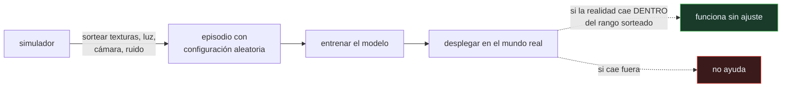

# P103 — Aleatorización de dominio

> Ruta encarnada · Deja de perseguir un simulador fiel. Haz que varíe tanto que la
> realidad sea una configuración más de las que el modelo ya ha visto.

**Nivel:** L2 · **Motor:** `domain_randomization` · **Notebook:** [`P103_domain_randomization.ipynb`](../../../notebooks/papers/P103_domain_randomization.ipynb)
· **Anexo:** [probabilidad y verosimilitud](../../annexes/A02_PROBABILIDAD_Y_VEROSIMILITUD.md)

## 1. Identificación

| Campo | Valor |
|---|---|
| **Título original** | *Domain Randomization for Transferring Deep Neural Networks from Simulation to the Real World* |
| **Autoría** | Josh Tobin, Rachel Fong, Alex Ray, Jonas Schneider, Wojciech Zaremba, Pieter Abbeel |
| **Año** | 2017 |
| **Venue** | IROS 2017, 23–30 · arXiv:1703.06907 |
| **Fuente primaria** | [arXiv:1703.06907](https://arxiv.org/abs/1703.06907) |
| **Acceso** | Abierto |
| **Fecha de consulta** | 2026-08-17 |

## 2. Problema anterior

Entrenar un robot en el mundo real es lento, caro y peligroso: cada episodio consume tiempo de
máquina y cada error puede romper algo. En simulación es instantáneo, paralelo y sin consecuencias.

El problema es que lo entrenado en simulación no funciona fuera. El **hueco entre simulación y
realidad** se atacaba mejorando el simulador —más física, mejores texturas, calibración más fina—,
una carrera cara y sin final: siempre queda algún fenómeno que nadie modeló, y el modelo aprendió a
depender de la ausencia de ese fenómeno.

## 3. Propuesta

Dar la vuelta al objetivo. En vez de que el simulador se parezca a la realidad, que **varíe tanto
que la realidad quede dentro de su rango**:

```text
en cada episodio, sortear:
    texturas · colores · iluminación · posición y ángulo de la cámara
    posiciones de los objetos · ruido de los sensores
```

Si la variabilidad es suficiente, el modelo no puede resolver la tarea apoyándose en ninguno de
esos detalles, porque cambian todo el tiempo. Está obligado a usar lo invariante. Y al desplegarlo,
la realidad le parece una configuración más.

El artículo lo demuestra con detección de posición de objetos entrenada **solo con imágenes
sintéticas no realistas**, transferida a un robot real sin ningún ajuste.

## 4. Intuición sin fórmulas

Aprender a leer con una sola tipografía frente a aprender con cincuenta. Quien aprendió con una
sola falla ante una letra manuscrita; quien vio cincuenta ha tenido que quedarse con la forma
esencial de cada letra.

Ninguna de las cincuenta era la manuscrita. Da igual: era una más.

**Dónde deja de funcionar la analogía:** las tipografías varían dentro de un espacio conocido. En
robótica hay que **decidir qué aleatorizar**, y un fenómeno en el que nadie pensó —una superficie
reflectante, un retardo de comunicación— cae fuera del rango y el método no ayuda.

## 5. Matemática mínima

No hay formalismo: el modelo se entrena minimizando la pérdida esperada sobre la distribución de
configuraciones sorteadas, en lugar de sobre una configuración fija.

La miniatura entrena un regresor sobre un «mundo» donde la observación depende de tres factores de
molestia:

| Modelo | Error en su propio simulador | Error en la realidad |
|---|---:|---:|
| entrenado con simulador **fijo** | **0,0501** | 0,8275 |
| entrenado con parámetros **aleatorizados** | 0,6828 | **0,5292** |

Las dos filas dicen lo mismo desde lados opuestos: el modelo del simulador fijo es excelente
**donde entrenó** e inútil fuera; el aleatorizado es mediocre en todas partes y por eso funciona
donde importa.

Ese es el precio, y hay que decirlo: se cambia rendimiento en el caso nominal por robustez ante el
caso desconocido.

## 6. Arquitectura o flujo



## 7. Qué observar en el paper original

- Que las imágenes de entrenamiento son **deliberadamente poco realistas**: texturas aleatorias,
  colores imposibles. La fidelidad no es el objetivo y el artículo lo hace visible.
- La lista concreta de **qué se aleatoriza** y con qué rangos. Es la parte transferible y la que
  exige criterio.
- La transferencia **sin ningún ajuste** con datos reales, que es la afirmación fuerte del trabajo.
- La discusión sobre **cuánta aleatorización**: demasiada hace la tarea imposible de aprender,
  demasiado poca no cubre la realidad. No hay receta.

## 8. Evidencia y resultados

Experimentos de detección de posición de objetos sobre un robot real, con modelos entrenados
exclusivamente con imágenes sintéticas, midiendo el error de localización en centímetros.

> La afirmación fuerte —transferencia sin ajuste con datos reales— está respaldada por el
> experimento. Su alcance es una tarea de percepción concreta, no una garantía general.

La miniatura no reproduce nada de eso: construye un problema de regresión con factores de molestia
para exhibir el compromiso con cuatro números. Y hay un detalle honesto que declara: **la realidad
está dentro del rango aleatorizado por construcción**, que es justamente el supuesto que en la
práctica hay que ganarse.

## 9. Impacto

- Se convirtió en una técnica estándar de sim-to-real, y buena parte de la robótica de manipulación
  actual la usa por defecto.
- OpenAI la llevó al extremo con la manipulación diestra de un cubo de Rubik (2019), aleatorizando
  también la **dinámica** —masas, fricciones, retardos— y no solo el aspecto.
- La idea general —entrenar sobre una distribución de entornos en vez de sobre uno— reaparece en
  robustez adversaria, en generalización fuera de distribución y en el diseño de conjuntos de
  entrenamiento diversos.
- Y da un criterio operativo: si tu modelo depende de una condición que no varía en entrenamiento,
  esa condición es una dependencia oculta y va a fallar.

## 10. Limitaciones

1. **Solo cubre lo que se aleatoriza.** Un fenómeno en el que nadie pensó cae fuera del rango y
   el método no ayuda en absoluto.
2. **Hay un óptimo y no hay receta.** Aleatorizar de más hace la tarea imposible de aprender; de
   menos, no cubre la realidad.
3. **Cuesta rendimiento en el caso nominal.** El modelo aleatorizado es peor en cualquier
   configuración concreta, y eso puede no compensar si el entorno de despliegue es estable.
4. **Necesita más cómputo de entrenamiento** para cubrir la variabilidad añadida.
5. **La aleatorización del aspecto es la fácil.** La de la dinámica —fricciones, retardos,
   elasticidades— es mucho más difícil de parametrizar bien.

## 11. Errores comunes

| Error | Corrección |
|---|---|
| «Aleatorizar cierra el hueco entre simulación y realidad» | Lo cierra si la realidad cae dentro del rango sorteado. Un fenómeno no aleatorizado sigue siendo un hueco. |
| «Cuanta más aleatorización, mejor» | Con demasiada, la tarea se vuelve imposible de aprender: no queda señal invariante que explotar. Hay un óptimo y se busca por experimento. |
| «El modelo aleatorizado es mejor» | Es peor en cualquier configuración concreta, incluida la suya. Es mejor **en promedio sobre configuraciones desconocidas**, que es otra cosa. |
| «Sirve para cualquier hueco de sim-to-real» | Aleatorizar el aspecto es relativamente fácil; la dinámica es mucho más difícil de parametrizar, y ahí está el hueco que más cuesta. |
| «Hace innecesario un buen simulador» | Hace innecesario un simulador FIEL. Sigue haciendo falta que la física sea razonable y que los rangos cubran lo que va a pasar. |

## 12. Relación con trabajos anteriores

- **[P102 PPO](../P102_ppo/README.md) (2017)** — la política que se entrena en el simulador y se
  quiere desplegar fuera.
- **[P04 AlexNet](../P04_alexnet/README.md) (2012)** — el aumento de datos como forma de imponer
  invarianzas; esto es la misma idea llevada al entorno completo.
- **[P100 Seguridad física](../P100_seguridad_fisica/README.md) (2009)** — por qué entrenar en el
  mundo real es caro y peligroso.

## 13. Relación con trabajos posteriores

- **OpenAI et al. (2019)** — aleatorización automática del dominio para manipulación diestra.
  [arXiv:1910.07113](https://arxiv.org/abs/1910.07113)
- **Peng et al. (2018)** — aleatorizar la dinámica, no solo el aspecto.
  [arXiv:1710.06537](https://arxiv.org/abs/1710.06537)
- **[P106 OSWorld](../P106_osworld/README.md) (2024)** — entornos reproducibles para agentes: el
  mismo problema de tener dónde entrenar y evaluar sin romper nada.

## 14. Notebook asociado

[`P103_domain_randomization.ipynb`](../../../notebooks/papers/P103_domain_randomization.ipynb)

**Qué implementa:** el entrenamiento de un regresor sobre un simulador fijo y sobre uno aleatorizado, con la evaluación cruzada de ambos en su propio simulador y en la «realidad».

**Qué NO implementa:** el mundo es una regresión lineal con tres factores de molestia: no hay imágenes, ni física, ni dinámica. Y la realidad cae dentro del rango aleatorizado por construcción, que es el supuesto que en la práctica hay que ganarse.

```bash
ai-evolution paper-lab P103 --seed 7
```

## 15. Actividades Bloom

| Nivel | Actividad |
|---|---|
| **Recordar** | Explica en qué consiste el hueco entre simulación y realidad. |
| **Explicar** | Describe la inversión conceptual que propone el artículo. |
| **Aplicar** | Ejecuta el notebook y compara los cuatro errores. |
| **Analizar** | Analiza por qué el modelo aleatorizado es peor en su propio simulador. |
| **Evaluar** | «Aleatorizamos, luego el modelo transferirá». Evalúa la afirmación. |
| **Crear** | Entrena un modelo con una sola configuración de datos y otro con condiciones aleatorizadas, y evalúa ambos fuera de distribución. |

## 16. Autoevaluación

1. ¿Cuál es el enfoque clásico para cerrar el hueco sim-to-real?
2. ¿Qué propone este artículo en su lugar?
3. ¿Por qué el modelo aleatorizado es peor en su propio simulador?
4. ¿Cuál es el precio del método?
5. ¿Cuándo NO ayuda?
6. ¿Qué es más difícil de aleatorizar: el aspecto o la dinámica?
7. ¿Hace innecesario un buen simulador?

## 17. Respuestas esperadas

1. Mejorar la fidelidad del simulador: más física, mejores texturas, calibración más fina. Es una carrera cara y sin final.
2. Aleatorizar agresivamente los parámetros del simulador para que la realidad sea una configuración más dentro del rango de entrenamiento.
3. Porque no puede especializarse en ninguna configuración: la tarea que aprende es la que funciona en todas, y esa es menos precisa en cada una.
4. Rendimiento en el caso nominal a cambio de robustez ante el caso desconocido. Solo compensa si de verdad no se sabe dónde se va a desplegar.
5. Cuando la realidad cae fuera del rango sorteado: un fenómeno que nadie pensó en aleatorizar sigue siendo un hueco, y el método no lo cubre.
6. La dinámica —fricciones, masas, retardos, elasticidades— es mucho más difícil de parametrizar bien que las texturas y la iluminación.
7. Hace innecesario un simulador **fiel**, no un simulador razonable. La física tiene que ser sensata y los rangos tienen que cubrir lo que va a ocurrir.

## 18. Fuentes primarias

- Tobin, J. et al. (2017). *Domain Randomization for Transferring Deep Neural Networks from
  Simulation to the Real World*. **IROS 2017**.
  [arXiv:1703.06907](https://arxiv.org/abs/1703.06907) · consultado 2026-08-17.
- OpenAI et al. (2019). *Solving Rubik's Cube with a Robot Hand*.
  [arXiv:1910.07113](https://arxiv.org/abs/1910.07113) · consultado 2026-08-17.
- Peng, X. B. et al. (2018). *Sim-to-Real Transfer of Robotic Control with Dynamics Randomization*.
  [arXiv:1710.06537](https://arxiv.org/abs/1710.06537) · consultado 2026-08-17.

---

[⬅️ Anterior: P102 PPO](../P102_ppo/README.md) ·
[📇 Índice](../../catalog/PAPERS_INDEX.md) ·
[📝 Evaluación](../../../assessments/papers/P103_domain_randomization.md) ·
[🏫 Clase 142 · Simulación, sim-to-real y digital twins](../../../classes/part-11-embodied-ai-robotics-and-computer-use/142-simulacion-sim-to-real-y-digital-twins/README.md) ·
[➡️ Siguiente: P104 WebArena](../P104_webarena/README.md)
