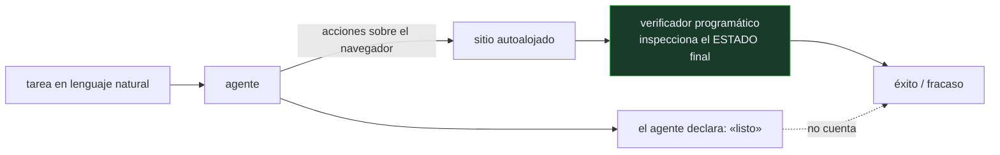

# P104 — WebArena

> Ruta encarnada · Un agente dice que ha terminado. Preguntárselo no es una evaluación:
> WebArena comprueba el estado del sitio.

**Nivel:** L3 · **Motor:** `webarena` · **Notebook:** [`P104_webarena.ipynb`](../../../notebooks/papers/P104_webarena.ipynb)
· **Anexo:** [complejidad y coste](../../annexes/A05_COMPLEJIDAD_Y_COSTE.md)

## 1. Identificación

| Campo | Valor |
|---|---|
| **Título original** | *WebArena: A Realistic Web Environment for Building Autonomous Agents* |
| **Autoría** | Shuyan Zhou, Frank F. Xu, Hao Zhu, Xuhui Zhou, Robert Lo y otros |
| **Año** | 2023 |
| **Venue** | arXiv:2307.13854 · ICLR 2024 |
| **Fuente primaria** | [arXiv:2307.13854](https://arxiv.org/abs/2307.13854) |
| **Acceso** | Abierto |
| **Fecha de consulta** | 2026-08-17 |

## 2. Problema anterior

Los agentes que operan navegadores se evaluaban de tres formas, y las tres miden lo que no es: el
propio informe del agente, una captura de pantalla revisada a ojo, o el juicio de otro modelo sobre
la transcripción.

Un agente elocuente puntúa alto sin haber completado nada. Y como cada trabajo usaba sus propias
tareas y sus propios sitios, los resultados no eran comparables entre artículos. El campo no podía
acumular conocimiento sobre qué funciona.

## 3. Propuesta

Un entorno **reproducible** con sitios reales autoalojados —comercio electrónico, foro,
repositorio de código, gestor de contenidos, más herramientas auxiliares como un mapa y una wiki—,
con estado reiniciable entre tareas.

Y, para cada tarea, un **verificador programático** que inspecciona el estado final del sitio:

```text
¿existe el pedido con esos artículos?     ¿el comentario está publicado?
¿el fichero tiene el contenido esperado?  ¿la respuesta coincide con la consulta a la base?
```

No se le pregunta al agente si lo consiguió. Se comprueba.

## 4. Intuición sin fórmulas

Encargar la compra por teléfono. Si al colgar preguntas «¿lo has apuntado todo?» y la respuesta es
que sí, no sabes nada: lo sabrás cuando llegue el pedido.

La única evaluación que informa es mirar lo que llegó.

**Dónde deja de funcionar la analogía:** el pedido llega solo. Aquí hay que **escribir el
comprobador** para cada tarea, y eso es caro. Ese coste es lo que limita el tamaño del banco de
pruebas, y es también lo que lo hace fiable.

## 5. Matemática mínima

No hay formalismo: la aportación es de diseño experimental. Lo medible es la distancia entre lo
declarado y lo verificado.

La miniatura evalúa ocho tareas:

| Medida | Valor |
|---|---:|
| el agente declara haber terminado | **8/8** |
| confianza declarada media | 0,793 |
| **verificado por estado final** | **4/8** |
| exceso medio de pasos sobre el óptimo | 5,12 |

Por tipo de tarea: información **0,667** · navegación **1,0** · **transacción 0,0**.

Las que fallan son justamente las que **cambian el estado** del sitio. Consultar es fácil; comprar,
publicar o modificar exige mantener el objetivo a lo largo de varios pasos irreversibles.

<!-- puente:inicio -->
> [!TIP]
> **Puente matemático.** Esta sección da por sabido lo siguiente. Si algo no te suena,
> léelo primero: está explicado una sola vez, en un solo sitio, y sirve para todas las fichas.

| Dónde | Qué necesitas de ahí |
|---|---|
| [**A05 §8** · Checklist antes de creerte una cifra de rendimiento](../../annexes/A05_COMPLEJIDAD_Y_COSTE.md#8-checklist-antes-de-creerte-una-cifra-de-rendimiento) | qué preguntar antes de aceptar cualquier tasa de éxito publicada |
<!-- puente:fin -->

## 6. Arquitectura o flujo



## 7. Qué observar en el paper original

- La **infraestructura**: sitios reales autoalojados con estado reiniciable. Es la mitad del
  trabajo y lo que hace comparables los resultados entre artículos.
- Los **tipos de verificador**: coincidencia exacta, coincidencia difusa, consulta a la base de
  datos y comprobación de la URL final. Cada tarea usa el que corresponde.
- La distinción entre tareas de **información**, **navegación** y **transacción**, y la enorme
  diferencia de dificultad entre ellas.
- El **límite de pasos** por tarea: sin él, un agente que se atasca consume presupuesto
  indefinidamente. No es una restricción arbitraria.

## 8. Evidencia y resultados

Evaluación de varios modelos de lenguaje como agentes sobre las 812 tareas del entorno, con tasas
de éxito verificadas y análisis de modos de fallo, más una línea base humana.

> Las cifras concretas envejecen con cada modelo nuevo, y el artículo lo asume. Lo que no envejece
> es el **protocolo**: el entorno y los verificadores siguen valiendo.

La miniatura usa ocho tareas inventadas para exhibir el modo de evaluación —la distancia entre
declarado y verificado— y no reproduce ninguna cifra del artículo.

## 9. Impacto

- Fijó el estándar de evaluación de agentes de navegador: verificación funcional sobre entornos
  reproducibles.
- Hizo visible el patrón que sigue vigente: los agentes consultan bien y **transaccionan mal**, y
  esa es la clase de tarea que interesa automatizar.
- Es antecedente directo de [OSWorld](../P106_osworld/README.md), que lleva el mismo diseño al
  escritorio completo.
- Y aporta al programa un criterio que se aplica a cualquier agente: **verificar el efecto, no el
  relato**. Es la misma idea que hace fiable a
  [SWE-bench](../P51_swebench/README.md).

## 10. Limitaciones

1. **Escribir un verificador por tarea es caro**, y eso acota el tamaño del banco de pruebas.
2. **Los sitios son autoalojados y estáticos**: no capturan la variabilidad, las defensas
   anti-bot ni los cambios de interfaz de la web real.
3. **La verificación por estado final no distingue el camino**: un agente puede acertar por suerte
   tras veinte pasos absurdos.
4. **Las cifras envejecen** con cada modelo, y compararlas entre artículos exige que todos declaren
   la misma versión del entorno.
5. **No mide el daño de un fallo.** Una transacción errónea en un sitio real tiene consecuencias
   que una tasa de éxito no captura.

## 11. Errores comunes

| Error | Corrección |
|---|---|
| «El agente reportó éxito en el 90 % de las tareas» | El autoinforme no es una medida. En la miniatura, declara 8 de 8 y la verificación confirma 4. |
| «Una captura de pantalla correcta demuestra que la tarea se hizo» | Demuestra que la pantalla lo parece. El estado de la base de datos es lo que decide. |
| «Si acierta la tarea, el número de pasos da igual» | El exceso de pasos es coste y es señal: en la miniatura, 5,12 pasos de más de media. Un agente que da vueltas está a un paso de un bucle caro. |
| «Las tareas de información y las transaccionales son comparables» | En la miniatura, 0,667 frente a 0,0. Cambiar el estado del sitio es una clase de dificultad distinta. |
| «Con un modelo mejor el problema se resuelve» | Parte del problema es de evaluación y de entorno. Sin verificación funcional no se sabría siquiera si mejoró. |

## 12. Relación con trabajos anteriores

- **[P51 SWE-bench](../P51_swebench/README.md) (2023)** — la misma idea en código: el criterio de
  éxito es ejecutable y externo al agente.
- **[P62 Validez de benchmarks](../P62_benchmark_validez/README.md) (2021)** — por qué un número
  alto no prueba la capacidad que se dice medir.
- **Shi et al. (2017)** — *World of Bits*: el antecedente de agentes web, con tareas mucho más
  simples. [PMLR 70](https://proceedings.mlr.press/v70/shi17a.html)

## 13. Relación con trabajos posteriores

- **[P105 SeeClick](../P105_seeclick/README.md) (2024)** — la capacidad de anclaje que estos
  agentes necesitan para poder actuar.
- **[P106 OSWorld](../P106_osworld/README.md) (2024)** — el mismo diseño llevado al escritorio
  completo, con tareas que cruzan aplicaciones.
- **Deng et al. (2023)** — Mind2Web: generalización entre sitios no vistos.
  [arXiv:2306.06070](https://arxiv.org/abs/2306.06070)

## 14. Notebook asociado

[`P104_webarena.ipynb`](../../../notebooks/papers/P104_webarena.ipynb)

**Qué implementa:** la comparación entre lo que el agente declara y lo que confirma la verificación del estado final, desglosada por tipo de tarea, con el exceso de pasos sobre el óptimo.

**Qué NO implementa:** no hay navegador, ni sitios, ni agente: las tareas y sus resultados son inventados para exhibir el modo de evaluación. Ninguna cifra reproduce las del artículo.

```bash
ai-evolution paper-lab P104 --seed 7
```

## 15. Actividades Bloom

| Nivel | Actividad |
|---|---|
| **Recordar** | Explica qué es la verificación funcional y en qué se diferencia del autoinforme. |
| **Explicar** | Describe los tres tipos de tarea y su dificultad relativa. |
| **Aplicar** | Ejecuta el notebook y compara declarado con verificado. |
| **Analizar** | Analiza por qué las tareas transaccionales fallan más. |
| **Evaluar** | «El agente resuelve el 60 % de las tareas». Evalúa qué falta para que la cifra signifique algo. |
| **Crear** | Define tres tareas de un sitio que uses, escribe su verificador programático y ejecútalas con un agente. |

## 16. Autoevaluación

1. ¿Cómo se evaluaban antes los agentes de navegador?
2. ¿Qué comprueba el verificador de WebArena?
3. ¿Qué tipo de tarea falla más y por qué?
4. ¿Por qué importa el número de pasos aunque la tarea acabe bien?
5. ¿Qué hace comparables los resultados entre trabajos?
6. ¿Qué limita el tamaño del banco de pruebas?
7. ¿Qué no mide una tasa de éxito?

## 17. Respuestas esperadas

1. Con el propio informe del agente, con capturas revisadas a ojo o con el juicio de otro modelo sobre la transcripción. Las tres miden algo distinto de si la tarea se hizo.
2. El estado final del sitio: si el pedido existe, si el comentario está publicado, si el fichero tiene el contenido esperado. No la narración del agente.
3. Las transaccionales, las que cambian el estado del sitio. Exigen mantener el objetivo a lo largo de varios pasos irreversibles, y en la miniatura tienen tasa 0,0.
4. Porque es coste directo y es señal de que el agente está dando vueltas. Un límite de pasos impide que un fallo se convierta en un bucle caro.
5. Que el entorno sea reproducible —sitios autoalojados con estado reiniciable— y que la verificación sea programática y esté publicada con el banco de pruebas.
6. El coste de escribir un verificador por tarea. Es lo que hace fiable la evaluación y lo que impide tener millones de tareas.
7. El daño de un fallo. Una transacción errónea en un sitio real tiene consecuencias que la tasa de éxito no captura.

## 18. Fuentes primarias

- Zhou, S. et al. (2023). *WebArena: A Realistic Web Environment for Building Autonomous Agents*.
  [arXiv:2307.13854](https://arxiv.org/abs/2307.13854) · consultado 2026-08-17.
- Deng, X. et al. (2023). *Mind2Web: Towards a Generalist Agent for the Web*.
  [arXiv:2306.06070](https://arxiv.org/abs/2306.06070) · consultado 2026-08-17.
- Shi, T. et al. (2017). *World of Bits: An Open-Domain Platform for Web-Based Agents*.
  [PMLR 70](https://proceedings.mlr.press/v70/shi17a.html) · consultado 2026-08-17.

---

[⬅️ Anterior: P103 Aleatorización de dominio](../P103_domain_randomization/README.md) ·
[📇 Índice](../../catalog/PAPERS_INDEX.md) ·
[📝 Evaluación](../../../assessments/papers/P104_webarena.md) ·
[🏫 Clase 145 · Agentes de navegador](../../../classes/part-11-embodied-ai-robotics-and-computer-use/145-agentes-de-navegador/README.md) ·
[➡️ Siguiente: P105 SeeClick](../P105_seeclick/README.md)
