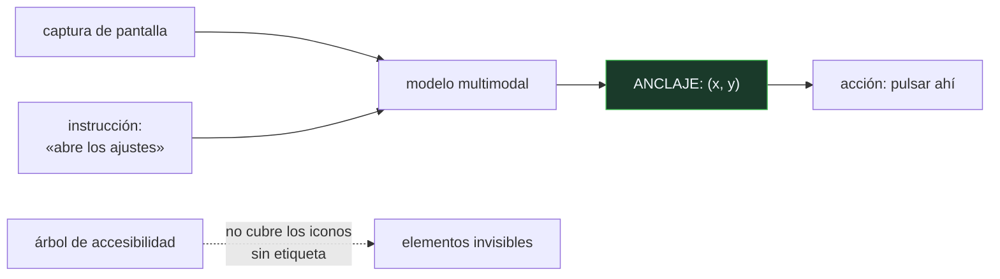

# P105 — SeeClick

> Ruta encarnada · Describir una pantalla y poder usarla son capacidades distintas. La
> segunda exige convertir una instrucción en coordenadas, y se mide aparte.

**Nivel:** L2 · **Motor:** `seeclick` · **Notebook:** [`P105_seeclick.ipynb`](../../../notebooks/papers/P105_seeclick.ipynb)
· **Anexo:** [álgebra y geometría](../../annexes/A01_ALGEBRA_Y_GEOMETRIA.md)

## 1. Identificación

| Campo | Valor |
|---|---|
| **Título original** | *SeeClick: Harnessing GUI Grounding for Advanced Visual GUI Agents* |
| **Autoría** | Kanzhi Cheng, Qiushi Sun, Yougang Chu, Fangzhi Xu, Yantao Li y otros |
| **Año** | 2024 |
| **Venue** | ACL 2024 · arXiv:2401.10935 |
| **Fuente primaria** | [arXiv:2401.10935](https://arxiv.org/abs/2401.10935) |
| **Acceso** | Abierto |
| **Fecha de consulta** | 2026-08-17 |

## 2. Problema anterior

Los agentes de interfaz gráfica dependían del **texto estructurado**: el árbol de accesibilidad,
el HTML o el DOM. Con eso pueden razonar sobre qué elementos hay y elegir uno.

El problema es doble. Muchas aplicaciones —de escritorio, móviles, juegos, aplicaciones nativas— no
exponen ese árbol o lo exponen incompleto. Y aunque lo expongan, los elementos que **solo son un
icono** no tienen etiqueta de texto: para un agente que lee texto, sencillamente no existen.

Sin poder referirse al botón, no hay nada que planificar.

## 3. Propuesta

Trabajar directamente sobre la **captura de pantalla** y entrenar específicamente la capacidad de
**anclaje**: dada una instrucción en lenguaje natural, devolver las coordenadas del elemento al que
se refiere.

```text
«abre los ajustes»  ⟶  (380, 40)
```

El artículo construye datos de anclaje a escala —web, móvil y escritorio—, entrena un modelo
multimodal sobre ellos, y publica **ScreenSpot**, un banco de pruebas para medir el anclaje **por
separado** de la planificación de la tarea.

## 4. Intuición sin fórmulas

Darle instrucciones por teléfono a alguien que está delante de un panel de control. Puedes
describirle perfectamente qué hay que hacer; si no consigues que ponga el dedo en el botón
correcto, no pasa nada.

Y si el botón no tiene etiqueta —solo un dibujo— describirlo por su texto no sirve de nada.

**Dónde deja de funcionar la analogía:** la persona al otro lado del teléfono entiende
descripciones espaciales («el segundo por la izquierda»). Un modelo tiene que aprender esa
correspondencia entre lenguaje y píxeles, y esa es exactamente la capacidad que se está midiendo.

## 5. Matemática mínima

No hay formalismo: es un problema de aprendizaje supervisado con salida de coordenadas. Lo
relevante es que la métrica es **acierto de localización**, no similitud de texto.

La miniatura pone una interfaz de seis elementos, tres de ellos solo con icono:

| Agente | Aciertos |
|---|---:|
| solo lee el árbol de accesibilidad | **2/5** |
| con anclaje visual | **5/5** |

Y la razón está en la interfaz misma: **3 de 6** elementos no tienen etiqueta de texto. El agente
que solo lee texto no falla por razonar mal — falla porque no puede **nombrar** el elemento al que
tendría que referirse.

<!-- puente:inicio -->
> [!TIP]
> **Puente matemático.** Esta sección da por sabido lo siguiente. Si algo no te suena,
> léelo primero: está explicado una sola vez, en un solo sitio, y sirve para todas las fichas.

| Dónde | Qué necesitas de ahí |
|---|---|
| [**A01 §1** · Producto escalar](../../annexes/A01_ALGEBRA_Y_GEOMETRIA.md#1-producto-escalar) | cómo se compara una descripción con regiones de una imagen, que es lo que hace el anclaje |
<!-- puente:fin -->

## 6. Arquitectura o flujo



## 7. Qué observar en el paper original

- La construcción del **conjunto de datos de anclaje**: cómo se recogen pares de instrucción y
  coordenadas a escala, que es el trabajo pesado del artículo.
- **ScreenSpot**, el banco de pruebas, y su cobertura de web, móvil y escritorio. Que exista una
  métrica aislada del anclaje es la aportación más útil.
- La distinción entre **anclaje** y **planificación**, y la evidencia de que mejorar el primero
  mejora el rendimiento en tareas completas.
- Que el modelo trabaja **solo con píxeles**: no necesita que la aplicación exponga nada.

## 8. Evidencia y resultados

Entrenamiento de un modelo multimodal sobre datos de anclaje y evaluación en ScreenSpot y en
bancos de pruebas de tareas completas, comparando con modelos generalistas.

> El resultado que importa es la correlación: mejorar el anclaje mejora las tareas completas. Eso
> justifica tratarlo como capacidad separable, que es la tesis.

La miniatura no entrena nada: simula un agente con anclaje mediante una moneda sesgada y otro
limitado al texto. Sirve para ver por qué los iconos sin etiqueta son un muro, no para medir a
ningún sistema.

## 9. Impacto

- Consolidó el anclaje como capacidad que se mide por separado, y ScreenSpot se convirtió en
  referencia.
- Empujó la línea de agentes que operan **solo con píxeles**, sin depender de que la aplicación
  exponga estructura — que es la única vía para aplicaciones nativas y de escritorio.
- Es una pieza necesaria de los sistemas de uso de ordenador que llegaron después, incluidos los
  productos comerciales.
- Y aporta un criterio de diagnóstico práctico: cuando un agente falla en una interfaz, hay que
  saber si no entendió la tarea o no encontró el botón, porque se arreglan de formas distintas.

## 10. Limitaciones

1. **El anclaje no basta.** Saber dónde pulsar no dice qué pulsar: la planificación es un problema
   aparte y es donde fallan la mayoría de los agentes.
2. **Las interfaces cambian.** Un modelo anclado a una versión de una aplicación puede degradarse
   con el siguiente rediseño.
3. **Resolución y escalado** afectan al resultado, y los bancos de pruebas no siempre lo controlan.
4. **No cubre interacciones complejas**: arrastrar, gestos, menús contextuales que aparecen al
   pasar el ratón.
5. **Trabajar solo con píxeles descarta información útil** cuando el árbol de accesibilidad sí está
   disponible. Lo razonable es usar ambos.

## 11. Errores comunes

| Error | Corrección |
|---|---|
| «Un modelo que describe bien una captura puede operarla» | Describir y señalar son capacidades distintas. La miniatura lo separa: 2 de 5 frente a 5 de 5 sobre la misma interfaz. |
| «El árbol de accesibilidad basta» | No cubre los elementos que solo son un icono, ni existe en muchas aplicaciones nativas. En la miniatura, 3 de 6 elementos quedan fuera. |
| «Si el agente falla, es que no entiende la tarea» | Puede ser que no encuentre el elemento. Son dos fallos distintos con soluciones distintas, y por eso conviene medirlos por separado. |
| «Con anclaje perfecto el agente resuelve la tarea» | Un agente con puntería impecable y mal plan se equivoca con precisión. El anclaje es necesario y no suficiente. |
| «Trabajar solo con píxeles es siempre mejor» | Es lo único posible cuando no hay estructura expuesta. Cuando la hay, ignorarla desperdicia información fiable. |

## 12. Relación con trabajos anteriores

- **[P18 CLIP](../P18_clip/README.md) (2021)** — alinear imagen y texto, que es la base de poder
  referirse a un elemento visual con lenguaje.
- **[P104 WebArena](../P104_webarena/README.md) (2023)** — los agentes que necesitan esta capacidad
  para poder actuar.
- **[P46 Vision Transformer](../P46_vit/README.md) (2020)** — la arquitectura visual sobre la que
  se montan estos modelos.

## 13. Relación con trabajos posteriores

- **Yang et al. (2023)** — *Set-of-Mark*: marcar la pantalla con etiquetas numeradas para que el
  modelo pueda señalar sin coordenadas. [arXiv:2310.11441](https://arxiv.org/abs/2310.11441)
- **Zheng et al. (2024)** — SeeAct: agentes web con modelos multimodales.
  [arXiv:2401.01614](https://arxiv.org/abs/2401.01614)
- **[P106 OSWorld](../P106_osworld/README.md) (2024)** — el escritorio completo, donde el anclaje
  es condición necesaria.

## 14. Notebook asociado

[`P105_seeclick.ipynb`](../../../notebooks/papers/P105_seeclick.ipynb)

**Qué implementa:** una interfaz con elementos con y sin etiqueta de texto, y la comparación de aciertos entre un agente que solo lee el árbol de accesibilidad y otro con anclaje visual.

**Qué NO implementa:** no hay imagen, ni modelo de visión, ni entrenamiento: el anclaje se simula con una moneda sesgada. Los números no representan a ningún sistema real.

```bash
ai-evolution paper-lab P105 --seed 7
```

## 15. Actividades Bloom

| Nivel | Actividad |
|---|---|
| **Recordar** | Define anclaje en el contexto de interfaces gráficas. |
| **Explicar** | Explica por qué el árbol de accesibilidad no basta. |
| **Aplicar** | Ejecuta el notebook e identifica qué instrucciones falla el agente de solo texto. |
| **Analizar** | Analiza la diferencia entre anclaje y planificación. |
| **Evaluar** | «El modelo describe la pantalla perfectamente, luego puede operarla». Evalúa la afirmación. |
| **Crear** | Haz una captura de una aplicación que uses, lista sus elementos accionables y calcula qué proporción quedaría fuera del alcance de un agente sin anclaje visual. |

## 16. Autoevaluación

1. ¿Qué es el anclaje en una interfaz gráfica?
2. ¿Por qué falla un agente que solo lee el árbol de accesibilidad?
3. ¿Qué aporta trabajar solo con píxeles?
4. ¿Es suficiente el anclaje para resolver una tarea?
5. ¿Por qué conviene medirlo por separado?
6. ¿Qué es ScreenSpot?
7. ¿Cuál es el límite de este enfoque?

## 17. Respuestas esperadas

1. Convertir una instrucción en lenguaje natural en las coordenadas del elemento de la pantalla al que se refiere: de «abre los ajustes» a un punto donde pulsar.
2. Porque los elementos que solo son un icono no tienen etiqueta de texto, y muchas aplicaciones no exponen ese árbol o lo exponen incompleto. Sin nombre no puede referirse a ellos.
3. Que funciona en cualquier aplicación, incluidas las nativas y de escritorio que no exponen ninguna estructura.
4. No. Saber dónde pulsar no dice qué pulsar: la planificación de la tarea es un problema aparte y es donde fallan la mayoría de los agentes.
5. Para saber si un agente falla porque no entiende la tarea o porque no encuentra el elemento. Son dos problemas con soluciones distintas.
6. El banco de pruebas que el artículo publica para medir el anclaje aislado, con cobertura de web, móvil y escritorio.
7. Que las interfaces cambian con cada rediseño, que no cubre interacciones complejas como arrastrar o los menús contextuales, y que descartar la estructura cuando existe desperdicia información fiable.

## 18. Fuentes primarias

- Cheng, K. et al. (2024). *SeeClick: Harnessing GUI Grounding for Advanced Visual GUI Agents*.
  **ACL 2024**. [arXiv:2401.10935](https://arxiv.org/abs/2401.10935) · consultado 2026-08-17.
- Yang, J. et al. (2023). *Set-of-Mark Prompting Unleashes Extraordinary Visual Grounding in GPT-4V*.
  [arXiv:2310.11441](https://arxiv.org/abs/2310.11441) · consultado 2026-08-17.
- Zheng, B. et al. (2024). *GPT-4V(ision) is a Generalist Web Agent, if Grounded*.
  [arXiv:2401.01614](https://arxiv.org/abs/2401.01614) · consultado 2026-08-17.

---

[⬅️ Anterior: P104 WebArena](../P104_webarena/README.md) ·
[📇 Índice](../../catalog/PAPERS_INDEX.md) ·
[📝 Evaluación](../../../assessments/papers/P105_seeclick.md) ·
[🏫 Clase 144 · Computer use basado en visión](../../../classes/part-11-embodied-ai-robotics-and-computer-use/144-computer-use-basado-en-vision/README.md) ·
[➡️ Siguiente: P106 OSWorld](../P106_osworld/README.md)
