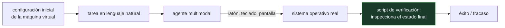

# P106 — OSWorld

> Ruta encarnada · El escritorio completo, con tareas que cruzan aplicaciones y un
> verificador por tarea que inspecciona el sistema real. Ahí se ve lo que falta.

**Nivel:** L3 · **Motor:** `osworld` · **Notebook:** [`P106_osworld.ipynb`](../../../notebooks/papers/P106_osworld.ipynb)
· **Anexo:** [complejidad y coste](../../annexes/A05_COMPLEJIDAD_Y_COSTE.md)

## 1. Identificación

| Campo | Valor |
|---|---|
| **Título original** | *OSWorld: Benchmarking Multimodal Agents for Open-Ended Tasks in Real Computer Environments* |
| **Autoría** | Tianbao Xie, Danyang Zhang, Jixuan Chen, Xiaochuan Li, Siheng Zhao y otros |
| **Año** | 2024 |
| **Venue** | NeurIPS 2024 · arXiv:2404.07972 |
| **Fuente primaria** | [arXiv:2404.07972](https://arxiv.org/abs/2404.07972) |
| **Acceso** | Abierto |
| **Fecha de consulta** | 2026-08-17 |

## 2. Problema anterior

Los bancos de pruebas de agentes se limitaban al navegador o a entornos de juguete. El trabajo de
oficina real no cabe ahí: descargar un fichero, abrirlo en una hoja de cálculo, ejecutar un script
en la terminal, guardar el resultado y actualizar un registro.

Esa clase de tarea cruza aplicaciones, depende del sistema de ficheros y produce efectos que solo
se pueden comprobar inspeccionando el sistema. Sin un entorno así, no había forma comparable de
medir si un agente sirve para automatizar trabajo real.

## 3. Propuesta

Un entorno de **escritorio completo** en máquina virtual con estado reiniciable —Ubuntu, con
navegador, suite ofimática, terminal, visor de imágenes, gestor de ficheros—, cientos de tareas
reales recogidas de usuarios, y para cada una:

- una **configuración inicial** que deja el sistema en el estado de partida;
- un **script de verificación** que inspecciona el estado final:

```text
leer la celda B7 y comparar     ·  comprobar que el fichero existe
diff contra el resultado esperado  ·  código de salida del script
estado en tres aplicaciones a la vez
```

Nadie le pregunta al agente si lo consiguió.

## 4. Intuición sin fórmulas

Una prueba práctica de un puesto administrativo. No se evalúa preguntando al candidato si sabe
hacerlo, ni mirando si parece que trabaja: se le da una tarea y al final se mira el resultado en el
ordenador.

Y las tareas que separan a los candidatos no son las difíciles de entender: son las que exigen
coordinar cuatro programas sin perder el hilo.

**Dónde deja de funcionar la analogía:** al candidato se le puede preguntar qué ha hecho y por qué.
Aquí, deliberadamente, no se le pregunta nada: solo cuenta el estado del sistema.

## 5. Matemática mínima

No hay formalismo: la aportación es de diseño experimental. Lo medible es la brecha entre lo que
resuelven las personas y lo que resuelven los agentes, y dónde se abre.

La miniatura evalúa ocho tareas:

| Medida | Valor |
|---|---:|
| tasa humana | **8/8** |
| tasa del agente | **3/8** |
| una sola aplicación | 3 de 6 · **0,5** |
| **varias aplicaciones** | 0 de 2 · **0,0** |

Lo que rompe no es la dificultad de cada paso —las tareas son rutinarias y están descritas sin
ambigüedad—: es **mantener el objetivo mientras se cambia de contexto**.

<!-- puente:inicio -->
> [!TIP]
> **Puente matemático.** Esta sección da por sabido lo siguiente. Si algo no te suena,
> léelo primero: está explicado una sola vez, en un solo sitio, y sirve para todas las fichas.

| Dónde | Qué necesitas de ahí |
|---|---|
| [**A05 §8** · Checklist antes de creerte una cifra de rendimiento](../../annexes/A05_COMPLEJIDAD_Y_COSTE.md#8-checklist-antes-de-creerte-una-cifra-de-rendimiento) | qué hay que declarar para que una tasa de éxito de agentes sea comparable |
<!-- puente:fin -->

## 6. Arquitectura o flujo



## 7. Qué observar en el paper original

- La **infraestructura**: máquina virtual con estado reiniciable e instantáneas. Es lo que hace
  reproducible la evaluación y lo que más trabajo cuesta.
- La variedad de **verificadores** —leer una celda, comparar ficheros, código de salida, estado en
  varias aplicaciones— y cómo cada tarea usa el que corresponde.
- El análisis de **modos de fallo**: dónde se pierden los agentes, qué proporción son errores de
  anclaje y cuáles de planificación.
- La **brecha con las personas**, y sobre todo dónde se abre: en las tareas que cruzan
  aplicaciones.

## 8. Evidencia y resultados

Evaluación de varios modelos multimodales como agentes sobre 369 tareas reales, con verificación
por ejecución, línea base humana y análisis de modos de fallo.

> Las cifras concretas envejecen con cada modelo. El **protocolo** —entorno reproducible más
> verificador por tarea— es lo que permanece, y es lo que hay que citar.

La miniatura usa ocho tareas inventadas para exhibir el diseño de la evaluación y la brecha entre
tareas de una y de varias aplicaciones. No reproduce ninguna cifra del artículo.

## 9. Impacto

- Se convirtió en la referencia para evaluar agentes de uso de ordenador, y en el banco de pruebas
  que citan los productos comerciales del área.
- Hizo visible y medible el patrón que define el estado actual: los agentes resuelven tareas de una
  aplicación y se pierden al cruzar varias.
- Consolidó la **verificación por ejecución** como estándar en agentes, cerrando la línea que abren
  [SWE-bench](../P51_swebench/README.md) y [WebArena](../P104_webarena/README.md).
- Y aporta al programa el criterio con el que leer cualquier anuncio sobre agentes: preguntar cómo
  se verificó, sobre qué entorno y con qué línea base humana.

## 10. Limitaciones

1. **Un verificador por tarea es caro**, y eso acota el banco de pruebas a cientos de tareas, no
   millones.
2. **La verificación por estado final no juzga el camino**: un agente puede acertar tras veinte
   pasos absurdos, o causar daños colaterales que el verificador no mira.
3. **El entorno es Linux con un conjunto fijo de aplicaciones**, y no captura la variedad de un
   escritorio corporativo real.
4. **Las cifras envejecen** con cada modelo, y comparar entre artículos exige declarar la versión
   exacta del entorno.
5. **No mide el riesgo.** Un agente con acceso a un escritorio real puede borrar cosas, y la tasa
   de éxito no dice nada sobre eso.

## 11. Errores comunes

| Error | Corrección |
|---|---|
| «El agente resuelve el 40 % de las tareas» | Sin decir sobre qué entorno, con qué verificación y con qué límite de pasos, la cifra no es comparable con ninguna otra. |
| «Las tareas fallan porque son difíciles» | Son rutinarias y están descritas sin ambigüedad; las personas las resuelven todas. Lo que falla es mantener el objetivo al cambiar de aplicación. |
| «Con mejor anclaje se resuelve» | El anclaje es necesario. La brecha de las tareas multiaplicación es de planificación y de memoria de trabajo, no de puntería. |
| «Verificar por estado final es suficiente» | Es lo mínimo honesto. No detecta daños colaterales ni caminos absurdos que acabaron bien por suerte. |
| «Un agente que puntúa alto se puede desplegar» | La tasa de éxito no mide el riesgo. Un agente con acceso a un escritorio real puede causar daño irreversible en las tareas que falla. |

## 12. Relación con trabajos anteriores

- **[P104 WebArena](../P104_webarena/README.md) (2023)** — el mismo diseño acotado al navegador.
- **[P105 SeeClick](../P105_seeclick/README.md) (2024)** — el anclaje, condición necesaria para
  operar un escritorio.
- **[P51 SWE-bench](../P51_swebench/README.md) (2023)** — la verificación por ejecución aplicada a
  código.
- **[P97 Subsunción](../P97_subsuncion/README.md) (1986)** — actuar sobre un entorno que cambia
  mientras se piensa: el mismo problema, otro cuerpo.

## 13. Relación con trabajos posteriores

- **Anthropic (2024)** — uso de ordenador con Claude: el producto que este banco de pruebas mide.
  [anthropic.com](https://www.anthropic.com/news/3-5-models-and-computer-use)
- **[P16 Sistemas agentic](../P16_agentic_systems/README.md)** — memoria, presupuesto y criterio de
  parada, que es lo que las tareas multiaplicación ponen a prueba.

## 14. Notebook asociado

[`P106_osworld.ipynb`](../../../notebooks/papers/P106_osworld.ipynb)

**Qué implementa:** la comparación entre tasa humana y tasa del agente sobre tareas de una y de varias aplicaciones, con el tipo de verificador que usa cada tarea.

**Qué NO implementa:** no hay máquina virtual, ni agente, ni tareas reales: los resultados son inventados para exhibir el diseño de la evaluación. Ninguna cifra reproduce las del artículo.

```bash
ai-evolution paper-lab P106 --seed 7
```

## 15. Actividades Bloom

| Nivel | Actividad |
|---|---|
| **Recordar** | Describe los dos componentes que trae cada tarea del banco de pruebas. |
| **Explicar** | Explica por qué la verificación se hace sobre el estado del sistema. |
| **Aplicar** | Ejecuta el notebook y compara la tasa en tareas de una y de varias aplicaciones. |
| **Analizar** | Analiza qué capacidad concreta falta en las tareas multiaplicación. |
| **Evaluar** | «El agente alcanza el 40 % en OSWorld». Evalúa qué habría que declarar para que la cifra sea comparable. |
| **Crear** | Define dos tareas de escritorio de tu trabajo y escribe su verificador programático; mide cuánto cuesta escribirlo. |

## 16. Autoevaluación

1. ¿Qué trae cada tarea además del enunciado?
2. ¿Por qué se verifica sobre el estado del sistema?
3. ¿Dónde se abre la brecha con las personas?
4. ¿Qué capacidad falta en las tareas multiaplicación?
5. ¿Qué limita el tamaño del banco de pruebas?
6. ¿Qué no detecta la verificación por estado final?
7. ¿Qué no mide una tasa de éxito?

## 17. Respuestas esperadas

1. Una configuración inicial que deja la máquina virtual en el estado de partida y un script de verificación que inspecciona el estado final.
2. Porque es lo único que no puede fingirse. El informe del agente, la captura de pantalla o el juicio de otro modelo miden algo distinto de si la tarea se hizo.
3. En las tareas que cruzan varias aplicaciones. Con una sola el agente resuelve la mitad; con varias, ninguna en la miniatura.
4. Mantener el objetivo mientras se cambia de contexto: memoria de trabajo y planificación a varios pasos, no dificultad de cada paso individual.
5. El coste de escribir un verificador por tarea. Es lo que la hace fiable y lo que impide escalarla a millones de tareas.
6. El camino: un agente puede acertar tras veinte pasos absurdos, o causar daños colaterales que el verificador no inspecciona.
7. El riesgo. Un agente con acceso a un escritorio real puede causar daño irreversible en las tareas que falla, y eso no aparece en la tasa.

## 18. Fuentes primarias

- Xie, T. et al. (2024). *OSWorld: Benchmarking Multimodal Agents for Open-Ended Tasks in Real
  Computer Environments*. **NeurIPS 2024**.
  [arXiv:2404.07972](https://arxiv.org/abs/2404.07972) · consultado 2026-08-17.
- Zhou, S. et al. (2023). *WebArena*.
  [arXiv:2307.13854](https://arxiv.org/abs/2307.13854) · consultado 2026-08-17.
- Anthropic (2024). *Introducing computer use*.
  [anthropic.com](https://www.anthropic.com/news/3-5-models-and-computer-use) ·
  consultado 2026-08-17.

---

[⬅️ Anterior: P105 SeeClick](../P105_seeclick/README.md) ·
[📇 Índice](../../catalog/PAPERS_INDEX.md) ·
[📝 Evaluación](../../../assessments/papers/P106_osworld.md) ·
[🏫 Clase 146 · Automatización de escritorio y RPA agéntica](../../../classes/part-11-embodied-ai-robotics-and-computer-use/146-automatizacion-de-escritorio-y-rpa-agentica/README.md) ·
[➡️ Siguiente: P107 Dapper](../P107_dapper/README.md)
