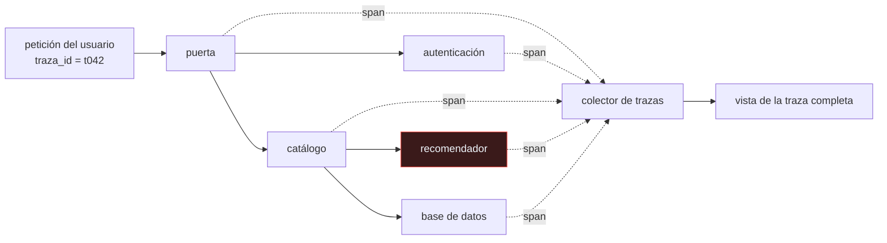

# P107 — Dapper

> Ruta de operación · Cada servicio dice que está bien y la petición tarda dos
> segundos. Un identificador que viaja con ella convierte eso en un diagnóstico.

**Nivel:** L2 · **Motor:** `trazas_distribuidas` · **Notebook:** [`P107_dapper.ipynb`](../../../notebooks/papers/P107_dapper.ipynb)
· **Anexo:** [complejidad y coste](../../annexes/A05_COMPLEJIDAD_Y_COSTE.md)

## 1. Identificación

| Campo | Valor |
|---|---|
| **Título original** | *Dapper, a Large-Scale Distributed Systems Tracing Infrastructure* |
| **Autoría** | Benjamin H. Sigelman, Luiz André Barroso, Michael Burrows y otros |
| **Año** | 2010 |
| **Venue** | Google Technical Report |
| **Fuente primaria** | [Informe técnico de Google](https://research.google/pubs/pub36356/) |
| **Acceso** | Abierto |
| **Fecha de consulta** | 2026-08-17 |

## 2. Problema anterior

Una petición de usuario atraviesa decenas de servicios. Cada uno tiene sus métricas —latencia
media, percentiles, tasa de error— y todas están en verde.

Y la petición tarda dos segundos. Nadie puede reconstruir por dónde pasó ni dónde se gastó el
tiempo, porque las métricas de cada servicio son **agregados**: dicen cómo va el servicio en
general, no qué le ocurrió a **esta** petición. El diagnóstico posible es «el sistema a veces va
lento», que no es un diagnóstico.

## 3. Propuesta

Tres decisiones de diseño que se han convertido en el estándar del área:

1. **Un identificador de traza** que se propaga con la petición por todos los servicios, en las
   cabeceras.
2. **Spans**: cada operación registra su inicio, su fin y su relación padre-hijo, de modo que la
   traza es un árbol y no una lista.
3. **Muestreo**: guardar solo una fracción de las trazas. Es lo que hace el sistema asumible en
   coste sin perder los agregados.

Y dos requisitos no funcionales que el artículo pone por delante: **impacto despreciable** en el
rendimiento de los servicios y **despliegue ubicuo** sin que cada equipo tenga que instrumentar a
mano.

## 4. Intuición sin fórmulas

Un paquete que pasa por seis almacenes. Cada almacén lleva su estadística: «procesamos 10 000
paquetes al día, tiempo medio 20 minutos». Todos van bien.

Tu paquete tardó cuatro días. Para saber por qué necesitas el número de seguimiento: la historia de
**ese** paquete, con la hora de entrada y salida de cada almacén.

**Dónde deja de funcionar la analogía:** un paquete pasa por los almacenes en serie. Una petición
puede abrir diez llamadas en paralelo, anidadas y con reintentos, y la traza es un árbol que hay
que saber leer.

## 5. Matemática mínima

```text
Traza  = árbol de spans unidos por un identificador que viaja con la petición
Span   = { servicio, operación, inicio, fin, span padre }

Muestreo uniforme a tasa s:
    coste ∝ s          error de los agregados ∝ 1/√(s·N)
```

La miniatura simula 200 peticiones por una cadena de cinco servicios:

| Vista | Qué permite concluir |
|---|---|
| **sin traza**: p50 230,71 ms · p99 1 147 ms | «el sistema a veces va lento» |
| **con traza**: el recomendador se lleva el **75,4 %** del total, p99 **1 078** ms frente a p50 158,88 | dónde mirar |

Y sobre el muestreo: guardando el **1 %** de las trazas, la estimación del p50 se desvía **5,12 ms**
del valor real. Trazar todo es caro; trazar una fracción basta para los agregados.

<!-- puente:inicio -->
> [!TIP]
> **Puente matemático.** Esta sección da por sabido lo siguiente. Si algo no te suena,
> léelo primero: está explicado una sola vez, en un solo sitio, y sirve para todas las fichas.

| Dónde | Qué necesitas de ahí |
|---|---|
| [**A05 §1** · Notación O(): qué dice y qué no](../../annexes/A05_COMPLEJIDAD_Y_COSTE.md#1-notación-o-qué-dice-y-qué-no) | por qué el coste de instrumentar tiene que ser proporcional a lo que se guarda, no a lo que ocurre |
<!-- puente:fin -->

## 6. Arquitectura o flujo



## 7. Qué observar en el paper original

- Los **tres requisitos** que el artículo pone antes que cualquier funcionalidad: impacto
  despreciable, despliegue ubicuo y disponibilidad de los datos con poca latencia. Sin ellos, un
  sistema de trazas no se adopta.
- Cómo se consigue el **despliegue ubicuo**: instrumentando las bibliotecas comunes de RPC y de
  hilos, no pidiendo a cada equipo que instrumente su código.
- El análisis del **coste del muestreo** y por qué una tasa fija baja basta para los agregados.
- La sección de **casos de uso reales** dentro de Google, que es lo que convierte el trabajo en
  algo más que una propuesta de arquitectura.

## 8. Evidencia y resultados

Es un informe técnico que describe un sistema en producción durante años, con datos de su
adopción, su coste de cómputo y ejemplos de problemas diagnosticados con él.

> La evidencia es operativa, no experimental: el sistema funciona a escala de Google y se usa. Ese
> es el tipo de argumento apropiado para una infraestructura.

La miniatura simula una cadena de cinco servicios para exhibir la diferencia entre ver el total y
poder atribuirlo. No implementa propagación de contexto, que es donde está la dificultad real.

## 9. Impacto

- Es el origen del **trazado distribuido** como categoría. Zipkin, Jaeger y finalmente
  **OpenTelemetry** descienden directamente de este diseño.
- Fijó el vocabulario —traza, span, contexto de propagación, muestreo— que hoy es estándar.
- La idea de que la observabilidad se instrumenta en las **bibliotecas comunes** y no en cada
  servicio es lo que la hizo viable, y sigue siendo el modelo.
- Para un sistema de IA en producción, la traza es lo que permite responder preguntas que las
  métricas no: por qué esta inferencia concreta tardó, qué herramientas invocó este agente y en qué
  orden.

## 10. Limitaciones

1. **El muestreo uniforme pierde los casos raros.** Si el fallo ocurre en una de cada mil
   peticiones, muestrear al 1 % probablemente no lo captura. Por eso hoy se usa muestreo dirigido
   por cola: decidir si guardar **después** de ver el resultado.
2. **La propagación de contexto es invasiva**: hay que pasar el identificador por cada frontera,
   incluidos hilos, colas y trabajos asíncronos.
3. **Relojes desincronizados** entre máquinas hacen que los tiempos absolutos de spans distintos no
   sean directamente comparables.
4. **El volumen de datos es enorme** y su retención, cara.
5. **Trazar no es entender.** Una traza dice dónde se fue el tiempo, no por qué.

## 11. Errores comunes

| Error | Corrección |
|---|---|
| «Con métricas por servicio ya hay observabilidad» | Las métricas son agregados: dicen cómo va el servicio, no qué le pasó a una petición concreta. Sin traza, el diagnóstico posible es «a veces va lento». |
| «Hay que trazar el 100 % de las peticiones» | El muestreo estima bien los agregados con una fracción mínima. En la miniatura, el 1 % estima el p50 con 5 ms de error. |
| «El muestreo uniforme es suficiente» | Pierde los casos raros, que suelen ser los que interesan. El muestreo dirigido por cola —guardar las trazas lentas o con error— existe por eso. |
| «La traza dice por qué falló» | Dice dónde se fue el tiempo y qué se invocó. El porqué sigue exigiendo mirar el código y los registros de ese servicio. |
| «Instrumentar es trabajo de cada equipo» | El artículo lo resuelve al revés: instrumentando las bibliotecas comunes de RPC. Pedirlo servicio por servicio es cómo no se adopta. |

## 12. Relación con trabajos anteriores

- **[P109 La cola a escala](../P109_cola_larga/README.md) (2013)** — posterior en el tiempo, pero
  el fenómeno que hace imprescindible la traza: con abanico grande, el problema está en un
  componente y no se sabe cuál.
- **Barroso y Hölzle** — *The Datacenter as a Computer*: el contexto de escala en el que este
  problema aparece.

## 13. Relación con trabajos posteriores

- **OpenTelemetry** — el estándar abierto de instrumentación que unificó el área.
  [opentelemetry.io](https://opentelemetry.io/docs/concepts/signals/traces/)
- **[P117 AgentBench](../P117_agentops/README.md) (2023)** — trazar la trayectoria de un agente es
  el mismo problema: reconstruir la historia de una ejecución que atraviesa muchos pasos.
- **Beyer et al.** — *Site Reliability Engineering*, capítulo de monitorización de sistemas
  distribuidos. [sre.google](https://sre.google/sre-book/monitoring-distributed-systems/)

## 14. Notebook asociado

[`P107_dapper.ipynb`](../../../notebooks/papers/P107_dapper.ipynb)

**Qué implementa:** la comparación entre lo que se puede diagnosticar con el tiempo total y con el desglose por servicio, y el efecto de tres tasas de muestreo sobre la estimación del p50.

**Qué NO implementa:** no hay propagación de contexto real, ni spans anidados, ni relojes desincronizados: la cadena es lineal y los tiempos, perfectos. Ahí está la dificultad de implementarlo.

```bash
ai-evolution paper-lab P107 --seed 7
```

## 15. Actividades Bloom

| Nivel | Actividad |
|---|---|
| **Recordar** | Define traza y span. |
| **Explicar** | Explica por qué las métricas por servicio no bastan. |
| **Aplicar** | Ejecuta el notebook y localiza el servicio que más gasta. |
| **Analizar** | Analiza por qué el muestreo estima bien los agregados y pierde los casos raros. |
| **Evaluar** | «Tenemos métricas de todos los servicios, luego tenemos observabilidad». Evalúa la afirmación. |
| **Crear** | Instrumenta una cadena de dos o tres servicios de tu trabajo y localiza dónde se va el tiempo del p99. |

## 16. Autoevaluación

1. ¿Qué problema no resuelven las métricas por servicio?
2. ¿Qué es un span y qué lo une a los demás?
3. ¿Para qué sirve el muestreo?
4. ¿Qué pierde el muestreo uniforme?
5. ¿Cómo se consigue el despliegue ubicuo?
6. ¿Qué requisitos pone el artículo por delante de la funcionalidad?
7. ¿Dice la traza por qué falló algo?

## 17. Respuestas esperadas

1. Reconstruir la historia de **una** petición concreta. Las métricas son agregados por servicio; la pregunta es qué le pasó a esta petición.
2. Una operación con inicio, fin, servicio y referencia a su span padre. Lo que une todos los spans de una petición es el identificador de traza que viaja con ella.
3. Para que el coste sea asumible. Guardar todas las trazas de un sistema a escala es prohibitivo, y una fracción basta para los agregados.
4. Los casos raros. Si un fallo ocurre en una de cada mil peticiones, muestrear al 1 % casi seguro no lo captura. De ahí el muestreo dirigido por cola.
5. Instrumentando las bibliotecas comunes —RPC, hilos, control de flujo— en lugar de pedir a cada equipo que instrumente su código.
6. Impacto despreciable en el rendimiento, despliegue ubicuo sin trabajo por equipo, y datos disponibles con poca latencia. Sin los tres, el sistema no se adopta.
7. No. Dice dónde se fue el tiempo y qué se invocó. El porqué exige mirar el código y los registros del servicio señalado.

## 18. Fuentes primarias

- Sigelman, B. H. et al. (2010). *Dapper, a Large-Scale Distributed Systems Tracing
  Infrastructure*. **Google Technical Report**.
  [research.google/pubs/pub36356](https://research.google/pubs/pub36356/) · consultado 2026-08-17.
- OpenTelemetry. *Traces*.
  [opentelemetry.io](https://opentelemetry.io/docs/concepts/signals/traces/) · consultado 2026-08-17.
- Beyer, B. et al. *Site Reliability Engineering*.
  [sre.google](https://sre.google/sre-book/monitoring-distributed-systems/) · consultado 2026-08-17.

---

[⬅️ Anterior: P106 OSWorld](../P106_osworld/README.md) ·
[📇 Índice](../../catalog/PAPERS_INDEX.md) ·
[📝 Evaluación](../../../assessments/papers/P107_dapper.md) ·
[🏫 Clase 153 · Observabilidad: logs, métricas y trazas](../../../classes/part-12-ai-engineering-mlops-llmops-and-agentops/153-observabilidad-logs-metricas-y-trazas/README.md) ·
[➡️ Siguiente: P108 CAP doce años después](../P108_cap/README.md)
