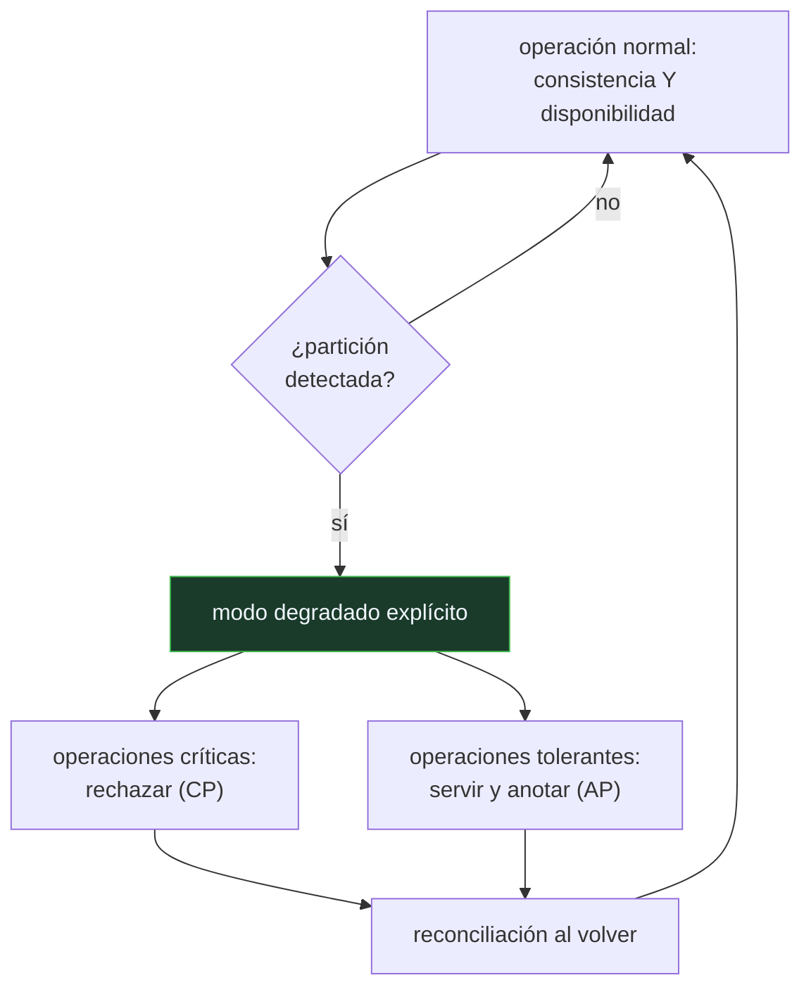

# P108 — CAP doce años después

> Ruta de operación · Brewer corrige la lectura de su propio teorema: no se eligen dos
> de tres. Se elige por operación, y solo mientras dura la partición.

**Nivel:** L2 · **Motor:** `resiliencia` · **Notebook:** [`P108_cap.ipynb`](../../../notebooks/papers/P108_cap.ipynb)
· **Anexo:** [complejidad y coste](../../annexes/A05_COMPLEJIDAD_Y_COSTE.md)

## 1. Identificación

| Campo | Valor |
|---|---|
| **Título original** | *CAP Twelve Years Later: How the «Rules» Have Changed* |
| **Autoría** | Eric Brewer |
| **Año** | 2012 |
| **Venue** | IEEE Computer, 45(2), 23–29 |
| **Fuente primaria** | [doi:10.1109/MC.2012.37](https://doi.org/10.1109/MC.2012.37) |
| **Acceso** | Restringido |
| **Fecha de consulta** | 2026-08-17 |

## 2. Problema anterior

El teorema CAP se convirtió en el eslogan «elige dos de consistencia, disponibilidad y tolerancia
a particiones», y esa lectura produjo una década de decisiones de arquitectura equivocadas:
sistemas enteros declarados **AP** o **CP** como si fuera una propiedad del producto.

La formulación popular esconde dos cosas. La primera: en un sistema distribuido real, la tolerancia
a particiones **no es opcional** — las redes se parten, y renunciar a tolerarlo no es una opción de
diseño. La segunda: cuando no hay partición, no hay que elegir nada.

## 3. Propuesta

Reformular el resultado con precisión:

```text
Sin partición  →  se pueden tener consistencia Y disponibilidad
Con partición  →  hay que elegir, y se elige POR OPERACIÓN
```

Y convertir eso en un plan de diseño con tres partes que hay que construir explícitamente:

1. **detectar** la partición;
2. entrar en un **modo degradado** explícito, decidiendo qué operaciones se siguen sirviendo y
   cuáles se rechazan;
3. **reconciliar** el estado y compensar los efectos cuando la partición termine.

La consecuencia práctica es que la elección no es una etiqueta de la arquitectura: cobrar una
tarjeta y mostrar un contador de «me gusta» pueden convivir en el mismo sistema con decisiones
opuestas.

## 4. Intuición sin fórmulas

Una cadena de tiendas que se queda sin conexión con la central. La caja puede seguir vendiendo
sin poder comprobar el stock —y arriesgarse a vender lo que no hay— o negarse a vender hasta que
vuelva la línea.

Y no es la misma decisión para todos los productos: para un artículo con stock de sobra conviene
seguir vendiendo; para el último de una serie limitada, no.

**Dónde deja de funcionar la analogía:** la tienda sabe que se quedó sin conexión. Un sistema
distribuido a menudo **no puede distinguir** una partición de un servicio lento, y esa
incertidumbre es la parte difícil.

## 5. Matemática mínima

```text
Teorema (Gilbert y Lynch, 2002): en presencia de particiones, ningún sistema puede garantizar
simultáneamente consistencia lineal y disponibilidad.

Lectura correcta:  P no es una elección → la elección es C o A, y SOLO durante la partición
```

La miniatura simula dos réplicas con una partición de cuatro pasos:

| Estrategia | Escrituras rechazadas | Escrituras servidas | Divergencia máxima |
|---|---:|---:|---:|
| **CP** | 4 | 0 | **0** |
| **AP** | 0 | 4 | **2** |

Y una segunda lección, independiente del teorema: reintentar un cobro sin clave de idempotencia lo
ejecuta **3 veces** en lugar de una. La resiliencia no es reintentar, es **reintentar de forma que
repetir no cambie el resultado**.

<!-- puente:inicio -->
> [!TIP]
> **Puente matemático.** Esta sección da por sabido lo siguiente. Si algo no te suena,
> léelo primero: está explicado una sola vez, en un solo sitio, y sirve para todas las fichas.

| Dónde | Qué necesitas de ahí |
|---|---|
| [**A05 §8** · Checklist antes de creerte una cifra de rendimiento](../../annexes/A05_COMPLEJIDAD_Y_COSTE.md#8-checklist-antes-de-creerte-una-cifra-de-rendimiento) | qué hay que declarar sobre el comportamiento en fallo antes de aceptar una cifra de disponibilidad |
<!-- puente:fin -->

## 6. Arquitectura o flujo



## 7. Qué observar en el paper original

- La **corrección explícita** de la lectura «dos de tres», hecha por el propio autor de la
  conjetura. Es un ejercicio de honestidad intelectual poco común.
- El énfasis en que **detectar la partición** es un problema en sí mismo: un servicio lento y una
  partición se parecen mucho desde fuera.
- La discusión sobre **compensación**: qué hacer con las operaciones servidas durante la partición
  cuando resulta que eran incompatibles.
- La relación con **latencia**: Abadi (2012) señala que fuera de la partición la disyuntiva real es
  entre consistencia y latencia (el modelo PACELC), y eso completa el cuadro.

## 8. Evidencia y resultados

Es un artículo de revisión y clarificación conceptual en una revista de divulgación técnica, con
ejemplos de sistemas reales.

> No hay experimentos ni demostración: la demostración formal es de Gilbert y Lynch (2002). Este
> artículo aporta la interpretación correcta y el plan de diseño.

La miniatura no reproduce nada del artículo: simula dos réplicas y una partición para que las dos
estrategias se puedan comparar con números, y añade la lección sobre idempotencia porque en la
práctica van juntas.

## 9. Impacto

- Corrigió una década de malentendidos y cambió cómo se enseña el teorema.
- La idea de **modo degradado explícito** es hoy práctica estándar en diseño de sistemas
  distribuidos: decidir de antemano qué se sirve y qué se rechaza cuando algo falla.
- Junto con PACELC (Abadi, 2012), completa el marco con el que se razona sobre compromisos en
  bases de datos distribuidas.
- Para sistemas de IA en producción es directamente aplicable: qué hace tu servicio de inferencia
  cuando no puede alcanzar el almacén de características, y si esa decisión está escrita en algún
  sitio.

## 10. Limitaciones

1. **Detectar la partición es difícil**, y el artículo lo reconoce sin resolverlo: un servicio
   lento y una red partida se parecen mucho.
2. **No dice cómo reconciliar.** La reconciliación es donde vive el trabajo real —CRDTs, vectores
   de versión, resolución manual— y queda fuera.
3. **Sigue siendo un marco cualitativo**: no da un criterio cuantitativo para decidir por
   operación.
4. **La disyuntiva fuera de la partición** —consistencia frente a latencia— no está en CAP y es la
   que más se paga en el día a día. La aporta PACELC.
5. **Se sigue citando mal.** Doce años después de la corrección, «elige dos de tres» sigue siendo
   la versión popular.

## 11. Errores comunes

| Error | Corrección |
|---|---|
| «Elige dos de las tres propiedades» | La tolerancia a particiones no es opcional en un sistema distribuido real. La elección es entre consistencia y disponibilidad, y solo durante la partición. |
| «Un sistema es AP o es CP» | La decisión es por operación. Cobrar una tarjeta pide CP y mostrar un contador pide AP, en el mismo sistema. |
| «Sin partición también hay que elegir» | Sin partición se pueden tener las dos. Lo que sí hay fuera de la partición es una disyuntiva entre consistencia y latencia, que es PACELC y no CAP. |
| «Reintentar es suficiente para ser resiliente» | Reintentar sin clave de idempotencia duplica efectos. En la miniatura, tres reintentos cobran tres veces. |
| «La partición es fácil de detectar» | Un servicio lento y una red partida son casi indistinguibles desde fuera, y el artículo lo señala como problema abierto. |

## 12. Relación con trabajos anteriores

- **Brewer (2000)** — la conjetura original, presentada en una charla invitada.
- **Gilbert y Lynch (2002)** — la demostración formal del teorema.
  [doi:10.1145/564585.564601](https://doi.org/10.1145/564585.564601)
- **[P107 Dapper](../P107_dapper/README.md) (2010)** — sin observabilidad no se puede ni detectar
  la partición.

## 13. Relación con trabajos posteriores

- **Abadi (2012)** — PACELC: fuera de la partición, la disyuntiva es entre consistencia y latencia.
- **Helland (2007)** — *Life beyond Distributed Transactions*: cómo se diseña sin transacciones
  distribuidas. [queue.acm.org](https://queue.acm.org/detail.cfm?id=3025012)
- **[P109 La cola a escala](../P109_cola_larga/README.md) (2013)** — el coste de la latencia cuando
  se elige esperar por consistencia.

## 14. Notebook asociado

[`P108_cap.ipynb`](../../../notebooks/papers/P108_cap.ipynb)

**Qué implementa:** la simulación de dos réplicas bajo una partición con las dos estrategias, midiendo escrituras rechazadas, servidas y divergencia máxima, más el efecto de reintentar sin clave de idempotencia.

**Qué NO implementa:** dos réplicas y un contador. No hay quórums, ni relojes desincronizados, ni particiones parciales, ni reconciliación —que es donde está el trabajo real—.

```bash
ai-evolution paper-lab P108 --seed 7
```

## 15. Actividades Bloom

| Nivel | Actividad |
|---|---|
| **Recordar** | Enuncia el teorema en su forma correcta. |
| **Explicar** | Explica por qué la tolerancia a particiones no es opcional. |
| **Aplicar** | Ejecuta el notebook y compara las dos estrategias. |
| **Analizar** | Analiza por qué la elección se hace por operación y no por sistema. |
| **Evaluar** | «Nuestro sistema es AP». Evalúa qué significa exactamente esa afirmación. |
| **Crear** | Elige tres operaciones de un servicio tuyo y decide, para cada una, qué hacer durante una partición. Documenta el modo degradado y la reconciliación. |

## 16. Autoevaluación

1. ¿Cuál es la lectura correcta del teorema?
2. ¿Por qué la tolerancia a particiones no es una elección?
3. ¿A qué nivel se toma la decisión entre C y A?
4. ¿Qué tres cosas hay que diseñar explícitamente?
5. ¿Qué es una clave de idempotencia y para qué sirve?
6. ¿Qué añade PACELC?
7. ¿Por qué es difícil detectar una partición?

## 17. Respuestas esperadas

1. Que **en presencia de particiones** hay que elegir entre consistencia y disponibilidad. Sin partición se pueden tener ambas.
2. Porque las redes se parten y eso no depende del diseño. Renunciar a tolerarlo significa que el sistema se comporta de forma indefinida cuando ocurre.
3. Por operación, no por sistema. En el mismo servicio, un cobro puede exigir CP y un contador de visitas puede tolerar AP.
4. La detección de la partición, el modo degradado —qué se sirve y qué se rechaza— y la reconciliación y compensación al volver.
5. Un identificador estable de la operación que permite al receptor reconocer un reintento y no ejecutarla dos veces. Sin ella, reintentar duplica el efecto.
6. Que fuera de la partición hay otra disyuntiva, entre consistencia y latencia. Es la que se paga todos los días, mientras que CAP solo aplica durante el fallo.
7. Porque desde fuera un servicio muy lento y una red partida se parecen mucho, y el tiempo de espera que se elija determina cuántos falsos positivos habrá.

## 18. Fuentes primarias

- Brewer, E. (2012). *CAP Twelve Years Later: How the «Rules» Have Changed*. **IEEE Computer**,
  45(2), 23–29. [doi:10.1109/MC.2012.37](https://doi.org/10.1109/MC.2012.37) ·
  consultado 2026-08-17.
- Gilbert, S. y Lynch, N. (2002). *Brewer's Conjecture and the Feasibility of Consistent,
  Available, Partition-Tolerant Web Services*.
  [doi:10.1145/564585.564601](https://doi.org/10.1145/564585.564601) · consultado 2026-08-17.
- Helland, P. (2007). *Life beyond Distributed Transactions*.
  [queue.acm.org](https://queue.acm.org/detail.cfm?id=3025012) · consultado 2026-08-17.

---

[⬅️ Anterior: P107 Dapper](../P107_dapper/README.md) ·
[📇 Índice](../../catalog/PAPERS_INDEX.md) ·
[📝 Evaluación](../../../assessments/papers/P108_cap.md) ·
[🏫 Clase 158 · Resiliencia, idempotencia, rollback y recuperación](../../../classes/part-12-ai-engineering-mlops-llmops-and-agentops/158-resiliencia-idempotencia-rollback-y-recuperacion/README.md) ·
[➡️ Siguiente: P109 La cola a escala](../P109_cola_larga/README.md)
