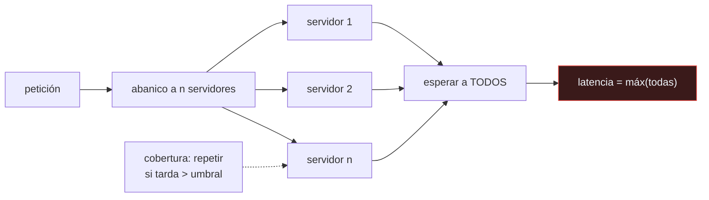

# P109 — La cola a escala

> Ruta de operación · Cien servidores con un p99 excelente producen un sistema cuya
> mediana es peor que la cola de cualquiera de ellos. Y eso es aritmética.

**Nivel:** L2 · **Motor:** `cola_larga` · **Notebook:** [`P109_cola_larga.ipynb`](../../../notebooks/papers/P109_cola_larga.ipynb)
· **Anexo:** [complejidad y coste](../../annexes/A05_COMPLEJIDAD_Y_COSTE.md)

## 1. Identificación

| Campo | Valor |
|---|---|
| **Título original** | *The Tail at Scale* |
| **Autoría** | Jeffrey Dean, Luiz André Barroso |
| **Año** | 2013 |
| **Venue** | Communications of the ACM, 56(2), 74–80 |
| **Fuente primaria** | [doi:10.1145/2408776.2408794](https://doi.org/10.1145/2408776.2408794) |
| **Acceso** | Restringido |
| **Fecha de consulta** | 2026-08-17 |

## 2. Problema anterior

Un servicio tiene una latencia media de 50 ms y un p99 de 70 ms. Excelente. La petición del
usuario necesita respuesta de cien servidores como ese, y tarda casi un segundo.

No hay ningún fallo: cada servidor cumple su objetivo. Lo que ocurre es que la petición completa
tarda lo que tarde **el más lento de los cien**, y con cien intentos, lo que ocurre el 1 % de las
veces ocurre casi siempre.

## 3. Propuesta

Tratar la variabilidad de latencia como una **propiedad de diseño** y no como ruido que se
elimina optimizando.

El artículo distingue entre reducir las causas de la variabilidad —difíciles, y nunca del todo: "
recolección de basura, contención de disco, vecinos ruidosos, gestión de energía— y **tolerarla**
con técnicas explícitas:

- **peticiones de cobertura**: pedir a una segunda réplica cuando la primera tarda más de un umbral;
- **peticiones atadas** con cancelación cruzada, para no duplicar trabajo innecesario;
- **micro-particionado** y migración de particiones calientes;
- **degradación selectiva**: responder con resultados parciales antes que tarde.

## 4. Intuición sin fórmulas

Organizar una cena con veinte invitados que llegan en coche. Cada uno llega puntual el 95 % de las
veces — excelente. La probabilidad de que **todos** lleguen puntuales es 0,95²⁰ ≈ 36 %.

La cena empieza cuando llega el último. Con veinte invitados, empezar tarde es lo normal aunque
cada invitado por separado sea puntual.

**Dónde deja de funcionar la analogía:** en la cena puedes empezar sin el último. Muchos sistemas
también pueden —es la degradación selectiva— y esa es precisamente una de las técnicas que el
artículo recomienda.

## 5. Matemática mínima

```text
Si cada servidor va lento con probabilidad p, la probabilidad de que ALGUNO de n lo esté es:

    1 − (1 − p)ⁿ

    p = 1 %,  n = 1      →   1 %
    p = 1 %,  n = 100    →   63 %
    p = 1 %,  n = 1000   →   99,996 %
```

La miniatura mide una petición que necesita respuesta de todos los servidores:

| Servidores | p50 | p99 |
|---:|---:|---:|
| 1 | 50,0 ms | 70,4 ms |
| 10 | 66,0 ms | 934,3 ms |
| **100** | **947,0 ms** | 969,7 ms |
| 1 000 | 967,5 ms | 985,4 ms |

Con 100 servidores, **la mediana del sistema es trece veces peor que la cola de uno solo**. Las
peticiones de cobertura bajan esa mediana a **69,7 ms** —un factor de 13,6×— y el p99 apenas se
mueve: la cobertura **recorta** la cola, no la elimina.

<!-- puente:inicio -->
> [!TIP]
> **Puente matemático.** Esta sección da por sabido lo siguiente. Si algo no te suena,
> léelo primero: está explicado una sola vez, en un solo sitio, y sirve para todas las fichas.

| Dónde | Qué necesitas de ahí |
|---|---|
| [**A05 §1** · Notación O(): qué dice y qué no](../../annexes/A05_COMPLEJIDAD_Y_COSTE.md#1-notación-o-qué-dice-y-qué-no) | por qué una probabilidad pequeña elevada a n deja de ser pequeña muy deprisa |
<!-- puente:fin -->

## 6. Arquitectura o flujo



## 7. Qué observar en el paper original

- El catálogo de **causas de variabilidad**: recolección de basura, contención de recursos
  compartidos, gestión de energía, mantenimiento en segundo plano. Ninguna se elimina del todo.
- La distinción entre **reducir** la variabilidad y **tolerarla**. La segunda es la aportación
  práctica del artículo.
- Las **peticiones atadas** con cancelación cruzada, que es la versión eficiente de la cobertura:
  se envían dos y la primera en empezar cancela a la otra.
- El paralelismo explícito con la **tolerancia a fallos**: igual que se diseñan sistemas que
  toleran que un componente falle, hay que diseñarlos para que toleren que uno vaya lento.

## 8. Evidencia y resultados

El artículo presenta mediciones de servicios reales de Google, con distribuciones de latencia y
el efecto medido de las técnicas de tolerancia.

> La evidencia es operativa y a escala. Las cifras concretas dependen del sistema, pero el
> fenómeno —la amplificación de la cola por el abanico— es aritmética y no depende de nadie.

La miniatura reproduce esa aritmética con un modelo de latencia simple, y añade un dato honesto que
matiza el entusiasmo: la cobertura mejora espectacularmente la mediana y apenas el p99, porque de
vez en cuando fallan las dos réplicas.

## 9. Impacto

- Es lectura obligada en ingeniería de sistemas a escala, y fijó el vocabulario —«latencia de
  cola», «tolerancia a la cola»— con el que se discute el problema.
- Las **peticiones de cobertura** son hoy una técnica estándar en sistemas de búsqueda,
  recomendación y almacenamiento distribuido.
- Cambió el objetivo de las conversaciones de rendimiento: de optimizar la media a acotar el
  percentil alto.
- En sistemas de IA es directamente aplicable: un agente que hace veinte llamadas a herramientas
  sufre exactamente esta amplificación, y su latencia percibida la determina la más lenta.

## 10. Limitaciones

1. **La cobertura duplica tráfico** si se usa sin cuidado. El artículo describe variantes más
   finas, y aun así hay un coste que presupuestar.
2. **Supone que se puede esperar y reintentar.** Con operaciones que mutan estado, repetir exige
   idempotencia — que es el problema de [P108](../P108_cap/README.md).
3. **No elimina la cola**: la recorta. En la miniatura, el p99 apenas se mueve porque a veces
   fallan las dos réplicas.
4. **Las causas de variabilidad siguen ahí.** Tolerarlas es más barato que eliminarlas, y también
   menos definitivo.
5. **Las cifras dependen del sistema** y no se pueden trasladar: lo transferible es el
   razonamiento.

## 11. Errores comunes

| Error | Corrección |
|---|---|
| «Si cada servicio cumple su p99, el sistema cumple su p99» | Con abanico grande, la petición tarda lo que el más lento. En la miniatura, cien servidores con p99 de 70 ms dan una mediana de 947 ms. |
| «Optimizar la media mejora la experiencia» | Con abanico grande lo que ve el usuario lo determina la cola, no la media. Bajar el p50 de un componente apenas cambia nada. |
| «Las peticiones de cobertura eliminan la cola» | La recortan. En la miniatura mejoran la mediana 13,6× y el p99 apenas: a veces fallan las dos réplicas. |
| «Basta con eliminar las causas de la variabilidad» | No se eliminan del todo: recolección de basura, contención, mantenimiento en segundo plano. El artículo propone tolerarlas, no perseguirlas. |
| «Esto solo pasa a escala de Google» | Es aritmética: depende del número de dependencias, no del tamaño de la empresa. Un agente con veinte llamadas a herramientas ya lo sufre. |

## 12. Relación con trabajos anteriores

- **[P107 Dapper](../P107_dapper/README.md) (2010)** — sin traza no se puede saber qué componente
  aportó la cola.
- **Barroso y Hölzle** — *The Datacenter as a Computer*: el contexto donde el abanico grande es la
  norma.

## 13. Relación con trabajos posteriores

- **[P108 CAP doce años después](../P108_cap/README.md) (2012)** — la otra cara: qué se sacrifica
  cuando se decide esperar.
- **Beyer et al.** — *Site Reliability Engineering*: cómo se fijan objetivos de nivel de servicio
  sobre percentiles. [sre.google](https://sre.google/sre-book/table-of-contents/)
- **[P117 AgentBench](../P117_agentops/README.md) (2023)** — un agente con muchas llamadas sufre
  esta misma amplificación, y por eso el límite de pasos importa.

## 14. Notebook asociado

[`P109_cola_larga.ipynb`](../../../notebooks/papers/P109_cola_larga.ipynb)

**Qué implementa:** la medición de la latencia de una petición con abanico de 1, 10, 100 y 1 000 servidores, con la probabilidad de que alguno vaya lento, y el efecto de las peticiones de cobertura sobre la mediana y sobre el p99.

**Qué NO implementa:** el modelo de latencia es una gaussiana con una parada ocasional. La cola real tiene estructura temporal —ráfagas, correlación entre servidores— que aquí no está.

```bash
ai-evolution paper-lab P109 --seed 7
```

## 15. Actividades Bloom

| Nivel | Actividad |
|---|---|
| **Recordar** | Escribe la fórmula de la probabilidad de que alguno de n servidores vaya lento. |
| **Explicar** | Explica por qué la mediana del sistema puede ser peor que el p99 de un componente. |
| **Aplicar** | Ejecuta el notebook y observa el efecto del abanico. |
| **Analizar** | Analiza por qué la cobertura mejora la mediana y no el p99. |
| **Evaluar** | «Cada servicio cumple su objetivo de latencia». Evalúa qué garantiza eso sobre el sistema. |
| **Crear** | Mide el p50 y el p99 de un servicio tuyo que haga llamadas en paralelo, y estima la contribución de la cola de cada dependencia. |

## 16. Autoevaluación

1. ¿Por qué el abanico amplifica la cola?
2. ¿Qué probabilidad hay de que alguno de 100 servidores vaya lento si cada uno lo hace el 1 % de las veces?
3. ¿Qué son las peticiones de cobertura?
4. ¿Eliminan la cola?
5. ¿Qué diferencia hay entre reducir la variabilidad y tolerarla?
6. ¿Qué coste tiene la cobertura?
7. ¿Aplica esto fuera de sistemas gigantes?

## 17. Respuestas esperadas

1. Porque la petición tarda lo que tarde el más lento de los componentes. Con n intentos, un suceso poco probable en uno se vuelve probable en el conjunto.
2. El 63 %: `1 − 0,99¹⁰⁰`. Con 1 000 servidores, prácticamente el 100 %.
3. Enviar la misma petición a una segunda réplica cuando la primera supera un umbral de tiempo, y quedarse con la que llegue antes.
4. No: la recortan. En la miniatura mejoran la mediana en un factor de 13,6× y el p99 apenas, porque a veces las dos réplicas van lentas.
5. Reducirla ataca las causas —recolección de basura, contención— y nunca se consigue del todo. Tolerarla acepta que existirán y diseña para que no lleguen al usuario.
6. Tráfico duplicado en las peticiones que superan el umbral. Hay variantes —peticiones atadas con cancelación cruzada— que lo reducen, y aun así hay que presupuestarlo.
7. Sí. Depende del número de dependencias, no del tamaño de la empresa. Un agente con veinte llamadas a herramientas ya sufre la amplificación.

## 18. Fuentes primarias

- Dean, J. y Barroso, L. A. (2013). *The Tail at Scale*. **Communications of the ACM**, 56(2),
  74–80. [doi:10.1145/2408776.2408794](https://doi.org/10.1145/2408776.2408794) ·
  consultado 2026-08-17.
- Barroso, L. A. et al. *The Datacenter as a Computer*.
  [doi:10.2200/S00874ED3V01Y201809CAC046](https://doi.org/10.2200/S00874ED3V01Y201809CAC046) ·
  consultado 2026-08-17.
- Beyer, B. et al. *Site Reliability Engineering*.
  [sre.google](https://sre.google/sre-book/table-of-contents/) · consultado 2026-08-17.

---

[⬅️ Anterior: P108 CAP doce años después](../P108_cap/README.md) ·
[📇 Índice](../../catalog/PAPERS_INDEX.md) ·
[📝 Evaluación](../../../assessments/papers/P109_cola_larga.md) ·
[🏫 Clase 152 · Serving online, batch y streaming](../../../classes/part-12-ai-engineering-mlops-llmops-and-agentops/152-serving-online-batch-y-streaming/README.md) ·
[➡️ Siguiente: P110 Deriva de concepto](../P110_deriva/README.md)
