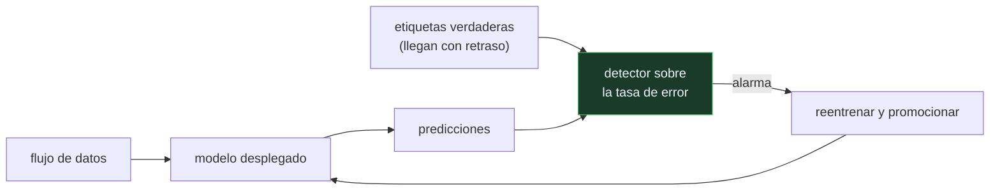

# P110 — Deriva de concepto

> Ruta de operación · El modelo no ha cambiado y las entradas tampoco. Lo que cambió es
> qué etiqueta les corresponde, y ningún panel de distribuciones lo detecta.

**Nivel:** L3 · **Motor:** `deriva` · **Notebook:** [`P110_deriva.ipynb`](../../../notebooks/papers/P110_deriva.ipynb)
· **Anexo:** [probabilidad y verosimilitud](../../annexes/A02_PROBABILIDAD_Y_VEROSIMILITUD.md)

## 1. Identificación

| Campo | Valor |
|---|---|
| **Título original** | *A Survey on Concept Drift Adaptation* |
| **Autoría** | João Gama, Indrė Žliobaitė, Albert Bifet, Mykola Pechenizkiy, Abdelhamid Bouchachia |
| **Año** | 2014 |
| **Venue** | ACM Computing Surveys, 46(4), 1–37 |
| **Fuente primaria** | [doi:10.1145/2523813](https://doi.org/10.1145/2523813) |
| **Acceso** | Restringido |
| **Fecha de consulta** | 2026-08-17 |

## 2. Problema anterior

Un modelo se entrena con los datos de un momento y se despliega sobre un flujo que sigue
llegando. El supuesto que sostiene todo el aprendizaje supervisado —que los datos de entrenamiento
y los de producción vienen de la misma distribución— deja de valer con el tiempo.

Y hay dos formas de dejar de valer que se confunden. Si cambia la distribución de las **entradas**,
un panel de histogramas lo detecta. Si cambia la relación entre entradas y **etiquetas** —deriva de
concepto— las entradas siguen teniendo el mismo aspecto y el modelo se degrada en silencio.

## 3. Propuesta

Una revisión que ordena el problema en dos ejes.

**Tipos de deriva**: abrupta, gradual, incremental y recurrente —estacionalidad—, cada una con
detectores que funcionan mejor o peor.

**Estrategias de adaptación**:

- **detectores** estadísticos sobre la tasa de error, como DDM: alarma cuando el error supera su
  mínimo histórico más varias desviaciones;
- **ventanas adaptativas** que ajustan solas cuánto pasado usar;
- **conjuntos** que reemplazan miembros obsoletos;
- **reentrenamiento** programado o disparado por la alarma.

Y una distinción que el artículo insiste en mantener: **detectar** y **adaptarse** son problemas
distintos, y resolver el primero sin el segundo no sirve de nada.

## 4. Intuición sin fórmulas

Un empleado que conoce perfectamente a la clientela de un barrio. Sabe quién compra qué, y acierta
siempre.

Cambia el barrio: llega gente nueva con otros hábitos. El empleado sigue viendo personas entrando
por la puerta —las entradas no han cambiado de aspecto— y sus recomendaciones empiezan a fallar sin
que él entienda por qué.

**Dónde deja de funcionar la analogía:** el empleado se da cuenta al recibir quejas. Un modelo solo
se entera si alguien le lleva las etiquetas verdaderas, y en muchos sistemas esas llegan tarde o no
llegan.

## 5. Matemática mínima

```text
Deriva de datos     :  cambia P(x)          ← visible en la distribución de entrada
Deriva de concepto  :  cambia P(y|x)        ← INVISIBLE en la distribución de entrada

Detector DDM sobre la tasa de error p con desviación s:
    alarma cuando  p + s  >  p_mín + 3·s_mín
```

La miniatura genera un flujo donde la etiqueta depende de `x₁` hasta el instante 300 y de `x₂`
después:

| Momento | Exactitud en ventana |
|---|---:|
| inicio | 1,0 |
| tras la deriva | **0,4** |

El detector avisa en el instante **301** —un retraso de **1 muestra** en este caso limpio— y tras
reentrenar sobre la nueva relación, la exactitud vuelve de **0,495** a **1,0**.

Nota importante: las entradas no cambiaron. Un panel de distribuciones de entrada habría seguido en
verde todo el tiempo.

<!-- puente:inicio -->
> [!TIP]
> **Puente matemático.** Esta sección da por sabido lo siguiente. Si algo no te suena,
> léelo primero: está explicado una sola vez, en un solo sitio, y sirve para todas las fichas.

| Dónde | Qué necesitas de ahí |
|---|---|
| [**A02 §3** · Verosimilitud y entropía cruzada](../../annexes/A02_PROBABILIDAD_Y_VEROSIMILITUD.md#3-verosimilitud-y-entropía-cruzada) | qué significa exactamente `P(y|x)` y por qué puede cambiar sin que cambie `P(x)` |
<!-- puente:fin -->

## 6. Arquitectura o flujo



## 7. Qué observar en el paper original

- La **taxonomía de tipos de deriva** y qué detector conviene a cada uno. Es la parte más útil para
  elegir herramienta.
- El compromiso entre **retraso de detección** y **falsas alarmas**: todo detector lo tiene, y
  ajustarlo es una decisión de negocio, no técnica.
- La discusión sobre **etiquetas retrasadas**, que es el caso realista: si las etiquetas llegan a
  los treinta días, el detector va treinta días por detrás.
- La sección de **evaluación en flujo**: cómo medir un modelo que se actualiza, donde la validación
  cruzada clásica no aplica.

## 8. Evidencia y resultados

Es una revisión sistemática: clasifica métodos, compara sus supuestos y recoge resultados
publicados sobre conjuntos de referencia de flujos.

> Su valor está en la organización del área y en las distinciones. No aporta un método nuevo ni
> experimentos propios a gran escala.

La miniatura simula una deriva abrupta y limpia, que es el caso fácil. En producción las derivas
suelen ser graduales o recurrentes, y ahí los detectores funcionan bastante peor.

## 9. Impacto

- Es la referencia estándar del área y el punto de partida para elegir un método de detección.
- La distinción entre deriva de datos y de concepto es hoy vocabulario básico de MLOps, y la razón
  de que los paneles de monitorización tengan que mirar la **calidad**, no solo las entradas.
- Las herramientas de monitorización de modelos en producción implementan directamente esta
  taxonomía.
- Y aporta al programa el argumento de por qué la monitorización es una categoría propia en la
  rúbrica de [P112](../P112_ml_test_score/README.md): sin ella, un modelo se degrada durante meses
  sin que nadie se entere.

## 10. Limitaciones

1. **Supone que llegan etiquetas verdaderas.** En muchos sistemas no llegan, o llegan tarde, y
   sin ellas hay que detectar con proxies mucho más débiles.
2. **Todo detector tiene retraso**, y reducirlo aumenta las falsas alarmas. No hay forma de tener
   las dos cosas.
3. **Las derivas graduales y recurrentes son mucho más difíciles** que la abrupta que se usa para
   ilustrar.
4. **Detectar no es adaptarse**: hace falta una cadena de reentrenamiento, validación y promoción
   detrás, y el artículo no la construye.
5. **Reentrenar tiene su propio riesgo**: sobre datos recientes y escasos, el modelo nuevo puede
   ser peor que el viejo.

## 11. Errores comunes

| Error | Corrección |
|---|---|
| «Vigilando las distribuciones de entrada se detecta la deriva» | Solo la de datos. La de concepto cambia P(y|x) sin cambiar P(x): en la miniatura, las entradas no cambian y la exactitud cae de 1,0 a 0,4. |
| «Si la exactitud baja, hay deriva» | Puede haberla, o puede ser un cambio en la mezcla de casos, un fallo de ingesta o un problema del propio sistema. La alarma es el principio del diagnóstico. |
| «Un detector bueno avisa sin retraso» | El retraso es el precio de no dar falsas alarmas. Reducirlo aumenta las falsas, y ese compromiso no tiene solución técnica. |
| «Detectada la deriva, se reentrena y ya está» | Reentrenar exige etiquetas recientes, validación y promoción. Y el modelo nuevo puede ser peor: hay que compararlo antes de sustituir. |
| «La deriva es un problema de modelos viejos» | Es un problema de sistemas desplegados. Cuanto más tiempo lleve en producción, más probable, y no depende de la arquitectura del modelo. |

## 12. Relación con trabajos anteriores

- **[P76 Validación cruzada](../P76_validacion_cruzada/README.md) (1995)** — la evaluación que
  supone datos independientes e idénticamente distribuidos, supuesto que aquí se rompe.
- **[P82 Calibración](../P82_calibracion/README.md) (2005)** — la calibración también se degrada
  con la deriva, y a menudo antes que la exactitud.

## 13. Relación con trabajos posteriores

- **Bifet y Gavaldà (2007)** — ADWIN: ventanas adaptativas que ajustan solas cuánto pasado usar.
  [doi:10.1137/1.9781611972771.42](https://doi.org/10.1137/1.9781611972771.42)
- **[P112 ML Test Score](../P112_ml_test_score/README.md) (2017)** — la monitorización como
  categoría obligatoria antes de promocionar.
- **[P111 Deuda técnica](../P111_deuda_tecnica/README.md) (2015)** — los bucles de realimentación,
  que son una fuente de deriva que el propio sistema provoca.

## 14. Notebook asociado

[`P110_deriva.ipynb`](../../../notebooks/papers/P110_deriva.ipynb)

**Qué implementa:** un flujo con deriva de concepto abrupta, la curva de exactitud en ventana, un detector tipo DDM con su retraso de aviso, y la comparación entre el modelo antiguo y uno reentrenado tras la alarma.

**Qué NO implementa:** la deriva es abrupta y en un solo punto, y las etiquetas verdaderas llegan al instante. Las dos cosas son el caso fácil: en producción son graduales y las etiquetas llegan tarde.

```bash
ai-evolution paper-lab P110 --seed 7
```

## 15. Actividades Bloom

| Nivel | Actividad |
|---|---|
| **Recordar** | Distingue deriva de datos y deriva de concepto. |
| **Explicar** | Explica por qué un panel de distribuciones de entrada no detecta la segunda. |
| **Aplicar** | Ejecuta el notebook y localiza el retraso del detector. |
| **Analizar** | Analiza el compromiso entre retraso de detección y falsas alarmas. |
| **Evaluar** | «La exactitud bajó, hay deriva». Evalúa la afirmación. |
| **Crear** | Define para un modelo tuyo qué señal vigilarías para detectar deriva sin esperar a las etiquetas verdaderas, y estima su retraso. |

## 16. Autoevaluación

1. ¿Qué cambia en una deriva de concepto?
2. ¿Por qué no la detecta un panel de distribuciones de entrada?
3. ¿Cómo funciona un detector tipo DDM?
4. ¿Por qué todo detector tiene retraso?
5. ¿Qué tipos de deriva son los más difíciles?
6. ¿Basta con detectar?
7. ¿Qué pasa si las etiquetas verdaderas llegan tarde?

## 17. Respuestas esperadas

1. La relación entre entradas y etiquetas, `P(y|x)`. Las entradas pueden seguir teniendo exactamente la misma distribución.
2. Porque `P(x)` no cambia. En la miniatura las entradas son idénticas antes y después, y la exactitud cae de 1,0 a 0,4.
3. Vigila la tasa de error acumulada y su desviación, y da la alarma cuando superan su mínimo histórico por varias desviaciones.
4. Porque necesita acumular suficiente evidencia para distinguir un cambio real de una racha de mala suerte. Avisar antes significa dar falsas alarmas.
5. Las graduales y las recurrentes. La abrupta que se usa para ilustrar es el caso fácil.
6. No. Hace falta una cadena de reentrenamiento, validación y promoción detrás. Detectar sin poder actuar solo produce alarmas que se acaban ignorando.
7. El detector va con ese mismo retraso. Y si no llegan nunca, hay que detectar con proxies —distribución de salidas, tasa de intervención humana— mucho más débiles.

## 18. Fuentes primarias

- Gama, J. et al. (2014). *A Survey on Concept Drift Adaptation*. **ACM Computing Surveys**,
  46(4), 1–37. [doi:10.1145/2523813](https://doi.org/10.1145/2523813) · consultado 2026-08-17.
- Gama, J. et al. (2004). *Learning with Drift Detection*.
  [doi:10.1007/978-3-540-28645-5_29](https://doi.org/10.1007/978-3-540-28645-5_29) ·
  consultado 2026-08-17.
- Bifet, A. y Gavaldà, R. (2007). *Learning from Time-Changing Data with Adaptive Windowing*.
  [doi:10.1137/1.9781611972771.42](https://doi.org/10.1137/1.9781611972771.42) ·
  consultado 2026-08-17.

---

[⬅️ Anterior: P109 La cola a escala](../P109_cola_larga/README.md) ·
[📇 Índice](../../catalog/PAPERS_INDEX.md) ·
[📝 Evaluación](../../../assessments/papers/P110_deriva.md) ·
[🏫 Clase 154 · Deriva, feedback y evaluación continua](../../../classes/part-12-ai-engineering-mlops-llmops-and-agentops/154-deriva-feedback-y-evaluacion-continua/README.md) ·
[➡️ Siguiente: P111 Deuda técnica](../P111_deuda_tecnica/README.md)
