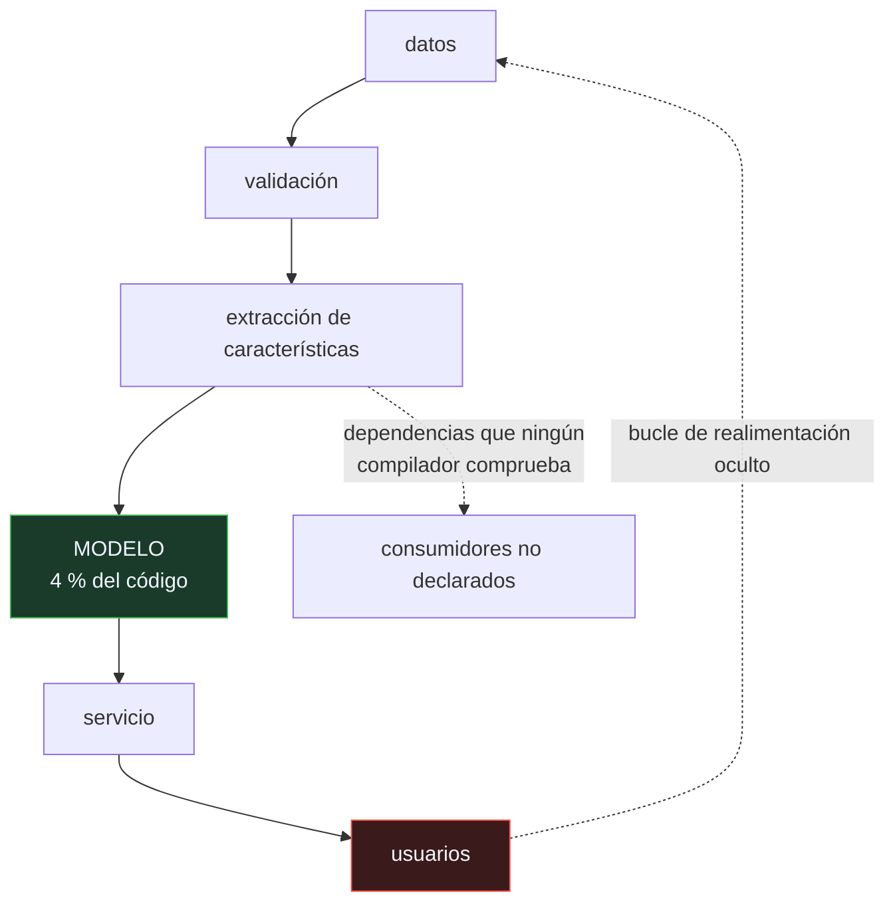

# P111 — Deuda técnica en ML

> Ruta de operación · El código del modelo es el 4 % del sistema. El otro 96 % acumula
> una deuda que ningún compilador detecta.

**Nivel:** L1 · **Motor:** `deuda_tecnica` · **Notebook:** [`P111_deuda_tecnica.ipynb`](../../../notebooks/papers/P111_deuda_tecnica.ipynb)
· **Anexo:** [complejidad y coste](../../annexes/A05_COMPLEJIDAD_Y_COSTE.md)

## 1. Identificación

| Campo | Valor |
|---|---|
| **Título original** | *Hidden Technical Debt in Machine Learning Systems* |
| **Autoría** | D. Sculley, Gary Holt, Daniel Golovin, Eugene Davydov y otros |
| **Año** | 2015 |
| **Venue** | NeurIPS 2015 |
| **Fuente primaria** | [NeurIPS 2015](https://papers.nips.cc/paper_files/paper/2015/hash/86df7dcfd896fcaf2674f757a2463eba-Abstract.html) |
| **Acceso** | Abierto |
| **Fecha de consulta** | 2026-08-17 |

## 2. Problema anterior

Los equipos miden su progreso por la calidad del modelo. Mientras tanto, el sistema que lo rodea
—ingestión de datos, extracción de características, servicio, monitorización, configuración,
pegamento entre sistemas— crece sin control y sin las herramientas que sí existen para el software
convencional.

Y acumula formas de deuda que **no tienen equivalente** fuera del aprendizaje automático. La más
grave: las dependencias de datos. Quitar una función rompe la compilación; quitar una característica
no rompe nada hasta que, semanas después, un modelo predice peor sin relación aparente con el
cambio.

## 3. Propuesta

Un catálogo de antipatrones específicos, con nombre, para que se puedan discutir:

- **dependencias de datos no declaradas**, que ningún compilador comprueba;
- **características huérfanas**, que se calculan y ya no usa nadie;
- **bucles de realimentación ocultos**, donde la salida del modelo influye en sus propios datos
  futuros;
- **código de pegamento**: la mayor parte del sistema, escrito para conectar piezas que no encajan;
- **deuda de configuración**, tan grande como la de código y sin ninguna herramienta;
- y el principio **CACE**: *Changing Anything Changes Everything*. Ninguna entrada de un modelo es
  independiente de las demás.

## 4. Intuición sin fórmulas

Una cocina de restaurante. La receta —el modelo— cabe en una tarjeta. Todo lo demás es
proveedores, cámaras frigoríficas, turnos, limpieza, inventario y las notas pegadas en la nevera
que solo entiende quien lleva años.

Cuando algo sale mal, casi nunca es la receta.

**Dónde deja de funcionar la analogía:** en la cocina, si falta un ingrediente, el plato no sale y
alguien se entera al momento. Aquí, si falta una característica, el modelo sigue produciendo
predicciones —peores— y nadie se entera hasta que alguien mira la métrica.

## 5. Matemática mínima

No hay formalismo: la aportación es un catálogo y un vocabulario. Lo que sí se puede exhibir es
la desproporción.

| Componente | Líneas | % |
|---|---:|---:|
| **código del modelo** | **800** | **4,0** |
| recogida y validación de datos | 3 200 | 16,2 |
| extracción de características | 2 600 | 13,1 |
| infraestructura de servicio | 4 100 | 20,7 |
| monitorización y alertas | 1 500 | 7,6 |
| gestión de configuración | 2 200 | 11,1 |
| **código de pegamento** | **5 400** | **27,3** |

Y las dependencias: retirar la característica `f_precio` afecta a **3 consumidores** que nadie tenía
apuntados; hay **1 característica huérfana** que se sigue calculando; y bajar el umbral del modelo A
de 0,5 a 0,45 hace que el modelo B, que consume su salida, reciba un **36 % más de entradas** sin
que nadie lo haya tocado.

<!-- puente:inicio -->
> [!TIP]
> **Puente matemático.** Esta sección da por sabido lo siguiente. Si algo no te suena,
> léelo primero: está explicado una sola vez, en un solo sitio, y sirve para todas las fichas.

| Dónde | Qué necesitas de ahí |
|---|---|
| [**A05 §8** · Checklist antes de creerte una cifra de rendimiento](../../annexes/A05_COMPLEJIDAD_Y_COSTE.md#8-checklist-antes-de-creerte-una-cifra-de-rendimiento) | por qué una métrica de modelo no dice nada sobre el sistema que lo rodea |
<!-- puente:fin -->

## 6. Arquitectura o flujo



## 7. Qué observar en el paper original

- La **figura** de la caja pequeña rodeada de cajas grandes. Es lo más citado del artículo y resume
  la tesis sin una palabra.
- El principio **CACE** y sus consecuencias: no se puede razonar sobre una entrada de un modelo de
  forma aislada, ni sobre la salida de un modelo que alimenta a otro.
- Los **bucles de realimentación**, directos y ocultos. Los ocultos —dos modelos que se influyen a
  través del mundo— son los que nadie ve venir.
- La sección sobre **deuda de configuración**, que el artículo señala como tan grande como la de
  código y con muchas menos herramientas.

## 8. Evidencia y resultados

Es un artículo de experiencia y posición, escrito desde la práctica de sistemas de producción en
Google.

> No hay experimentos ni mediciones sistemáticas: hay un catálogo de patrones observados. Su
> autoridad viene de la experiencia de sus autores y de que cualquiera que haya operado un sistema
> de este tipo los reconoce.

La miniatura construye conteos de líneas y un grafo de dependencias ilustrativos —el artículo no da
esa tabla— para hacer comprobable la desproporción y el efecto CACE.

## 9. Impacto

- Es el artículo fundacional de **MLOps** como disciplina, y el que dio nombre a problemas que los
  equipos sufrían sin poder discutirlos.
- Su figura es probablemente la más reproducida en presentaciones sobre sistemas de IA.
- Llevó directamente a la rúbrica de [P112](../P112_ml_test_score/README.md), que convierte el
  diagnóstico en una lista de comprobación.
- Y sigue vigente con los sistemas de agentes: el modelo es una llamada a una API, y todo el
  sistema es prompt, herramientas, orquestación, memoria, evaluación y pegamento.

## 10. Limitaciones

1. **No aporta mediciones**: es un catálogo de patrones observados, no un estudio.
2. **No da soluciones detalladas.** Nombra los problemas y esboza mitigaciones; construir las
   herramientas es trabajo posterior.
3. **Está escrito desde una organización con recursos enormes**, y algunas mitigaciones no son
   trasladables a un equipo pequeño.
4. **Los conteos que se citan por ahí son apócrifos**: el artículo da la figura, no porcentajes.
5. **Diez años después, buena parte sigue sin resolverse.** Las dependencias de datos siguen sin
   tener un compilador que las compruebe.

## 11. Errores comunes

| Error | Corrección |
|---|---|
| «El trabajo de un equipo de ML es entrenar modelos» | El modelo es una fracción pequeña del sistema. La mayor parte del trabajo —y de la deuda— está en todo lo demás. |
| «Una característica que no rompe nada al quitarla es que no se usaba» | No hay compilador que avise. El efecto aparece semanas después, en la métrica de un modelo que nadie relacionó con el cambio. |
| «Se puede razonar sobre cada entrada del modelo por separado» | CACE: cambiar cualquier cosa lo cambia todo. Las entradas no son independientes ni en el modelo ni aguas abajo. |
| «La deuda de configuración es un detalle» | El artículo la señala como comparable en tamaño a la de código, y con muchísimas menos herramientas para gestionarla. |
| «Con sistemas de agentes esto ya no aplica» | Aplica más: el modelo es una llamada a una API y todo el sistema es prompt, herramientas, orquestación, memoria y pegamento. |

## 12. Relación con trabajos anteriores

- **[P80 Las dos culturas](../P80_dos_culturas/README.md) (2001)** — la advertencia sobre confundir
  el modelo con el problema.
- **Sculley et al. (2014)** — la versión previa y más corta: *Machine Learning: The High-Interest
  Credit Card of Technical Debt*. [research.google](https://research.google/pubs/pub43146/)
- **Cunningham (1992)** — la metáfora original de la deuda técnica.

## 13. Relación con trabajos posteriores

- **[P112 ML Test Score](../P112_ml_test_score/README.md) (2017)** — la rúbrica que convierte este
  diagnóstico en una lista de comprobación puntuable.
- **[P115 Hojas de datos](../P115_hojas_de_datos/README.md) (2021)** — documentar los datos, que es
  la mitad de las dependencias invisibles.
- **[P110 Deriva de concepto](../P110_deriva/README.md) (2014)** — los bucles de realimentación son
  una fuente de deriva que el propio sistema provoca.

## 14. Notebook asociado

[`P111_deuda_tecnica.ipynb`](../../../notebooks/papers/P111_deuda_tecnica.ipynb)

**Qué implementa:** el desglose de líneas por componente con el porcentaje que representa el modelo, un grafo de dependencias de características con sus consumidores y huérfanas, y el efecto CACE de cambiar un umbral aguas arriba.

**Qué NO implementa:** los conteos de líneas y el grafo son ilustrativos: el artículo no los da. Y no cubre bucles de realimentación ni deuda de configuración, que son dos de sus secciones.

```bash
ai-evolution paper-lab P111 --seed 7
```

## 15. Actividades Bloom

| Nivel | Actividad |
|---|---|
| **Recordar** | Enumera cinco tipos de deuda específicos del aprendizaje automático. |
| **Explicar** | Explica el principio CACE. |
| **Aplicar** | Ejecuta el notebook y localiza las características huérfanas. |
| **Analizar** | Analiza por qué las dependencias de datos son invisibles. |
| **Evaluar** | «El modelo funciona bien, luego el sistema está bien». Evalúa la afirmación. |
| **Crear** | Dibuja el grafo de dependencias de datos de un sistema tuyo y busca las huérfanas. |

## 16. Autoevaluación

1. ¿Qué proporción del sistema es el código del modelo?
2. ¿Por qué las dependencias de datos son deuda invisible?
3. ¿Qué es una característica huérfana?
4. ¿Qué dice el principio CACE?
5. ¿Qué es un bucle de realimentación oculto?
6. ¿Qué evidencia aporta el artículo?
7. ¿Sigue aplicando con sistemas de agentes?

## 17. Respuestas esperadas

1. Una fracción pequeña. En la ilustración de la miniatura, el 4 %; el artículo lo muestra con una figura de una caja pequeña rodeada de cajas grandes.
2. Porque ningún compilador las comprueba. Retirar una característica no rompe nada de inmediato: el efecto aparece semanas después en la métrica de un modelo.
3. Una característica que se sigue calculando y ya no consume nadie. Cuesta cómputo cada día y nadie la retira porque nadie sabe que sobra.
4. Que cambiar cualquier cosa lo cambia todo: ninguna entrada de un modelo es independiente de las demás, ni la salida de un modelo es independiente de quien la consume.
5. Dos modelos que se influyen mutuamente a través del mundo, sin que exista ninguna conexión directa entre ellos en el código.
6. Ninguna cuantitativa: es un catálogo de patrones observados en producción. Su autoridad viene de la experiencia y del reconocimiento de quien ha operado estos sistemas.
7. Más que antes. El modelo es una llamada a una API, y todo el sistema es prompt, herramientas, orquestación, memoria, evaluación y pegamento.

## 18. Fuentes primarias

- Sculley, D. et al. (2015). *Hidden Technical Debt in Machine Learning Systems*. **NeurIPS 2015**.
  [papers.nips.cc](https://papers.nips.cc/paper_files/paper/2015/hash/86df7dcfd896fcaf2674f757a2463eba-Abstract.html)
  · consultado 2026-08-17.
- Sculley, D. et al. (2014). *Machine Learning: The High-Interest Credit Card of Technical Debt*.
  [research.google](https://research.google/pubs/pub43146/) · consultado 2026-08-17.
- Breck, E. et al. (2017). *The ML Test Score*.
  [doi:10.1109/BigData.2017.8258038](https://doi.org/10.1109/BigData.2017.8258038) ·
  consultado 2026-08-17.

---

[⬅️ Anterior: P110 Deriva de concepto](../P110_deriva/README.md) ·
[📇 Índice](../../catalog/PAPERS_INDEX.md) ·
[📝 Evaluación](../../../assessments/papers/P111_deuda_tecnica.md) ·
[🏫 Clase 148 · Ciclo de vida de datos, modelos y agentes](../../../classes/part-12-ai-engineering-mlops-llmops-and-agentops/148-ciclo-de-vida-de-datos-modelos-y-agentes/README.md) ·
[➡️ Siguiente: P112 ML Test Score](../P112_ml_test_score/README.md)
