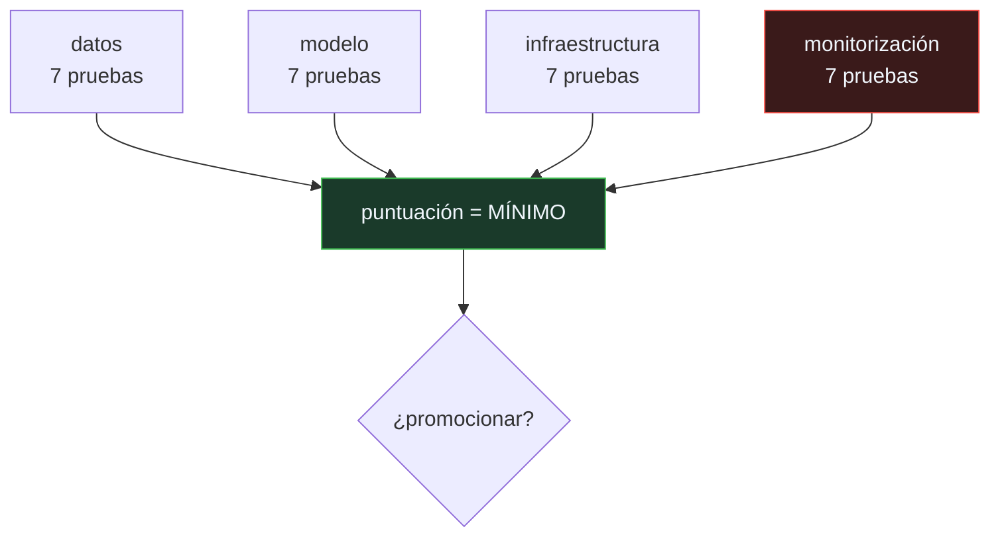

# P112 — ML Test Score

> Ruta de operación · Dos equipos con la misma exactitud y sistemas radicalmente
> distintos. La rúbrica los distingue; la métrica de calidad no.

**Nivel:** L2 · **Motor:** `ml_test_score` · **Notebook:** [`P112_ml_test_score.ipynb`](../../../notebooks/papers/P112_ml_test_score.ipynb)
· **Anexo:** [complejidad y coste](../../annexes/A05_COMPLEJIDAD_Y_COSTE.md)

## 1. Identificación

| Campo | Valor |
|---|---|
| **Título original** | *The ML Test Score: A Rubric for ML Production Readiness and Technical Debt Reduction* |
| **Autoría** | Eric Breck, Shanqing Cai, Eric Nielsen, Michael Salib, D. Sculley |
| **Año** | 2017 |
| **Venue** | IEEE Big Data 2017, 1123–1132 |
| **Fuente primaria** | [doi:10.1109/BigData.2017.8258038](https://doi.org/10.1109/BigData.2017.8258038) |
| **Acceso** | Restringido |
| **Fecha de consulta** | 2026-08-17 |

## 2. Problema anterior

La decisión de promocionar un modelo a producción se tomaba mirando su métrica de calidad. Si el
número era mejor que el del modelo anterior, se desplegaba.

Nada en esa decisión garantizaba que existieran pruebas del esquema de datos, que el entrenamiento
fuera reproducible, que se pudiera revertir a la versión anterior o que alguien fuera a enterarse si
el modelo se degradaba. El diagnóstico de [P111](../P111_deuda_tecnica/README.md) estaba escrito;
faltaba convertirlo en algo que un equipo pudiera aplicar el lunes.

## 3. Propuesta

Una **rúbrica de 28 pruebas** repartidas en cuatro categorías:

```text
datos · modelo · infraestructura · monitorización
```

con siete pruebas concretas en cada una —del tipo «el esquema de las características está
validado», «se puede revertir a la versión anterior», «se vigila la antigüedad del modelo»—.

Y una regla de puntuación que es la mitad de la aportación: la puntuación global es el **mínimo**
entre categorías, no la suma. Un sistema es tan robusto como su categoría más débil, y sumar
permitiría compensar la ausencia total de monitorización con pruebas de datos excelentes.

## 4. Intuición sin fórmulas

La inspección técnica de un vehículo. No se aprueba por tener un motor potente: se comprueban
frenos, luces, emisiones y dirección, y basta que una falle para no pasar.

Nadie propone compensar unos frenos inexistentes con un motor excelente.

**Dónde deja de funcionar la analogía:** la inspección técnica tiene criterios objetivos y
medibles. Muchas de estas pruebas admiten grados —«¿está el esquema validado?» tiene respuestas
intermedias— y la puntuación acaba dependiendo del criterio de quien la aplica.

## 5. Matemática mínima

```text
puntuación = mín( puntuación_datos, puntuación_modelo,
                  puntuación_infraestructura, puntuación_monitorización ) / 2

    0     : no hay pruebas — más un experimento que un producto
    1–2   : pruebas básicas
    3+    : razonablemente probado
```

La miniatura puntúa dos equipos con exactitudes casi idénticas:

| Equipo | Exactitud | Datos | Modelo | Infra. | Monit. | **Puntuación** |
|---|---:|---:|---:|---:|---:|---:|
| A | 0,912 | 4 | 3 | 4 | 4 | **1,5** |
| B | **0,918** | 1 | 1 | 1 | **0** | **0,0** |

El equipo B tiene **mejor exactitud** y ninguna prueba de monitorización: su modelo puede
degradarse durante meses sin que nadie se entere. La métrica de calidad no distingue estos dos
sistemas; la rúbrica sí.

<!-- puente:inicio -->
> [!TIP]
> **Puente matemático.** Esta sección da por sabido lo siguiente. Si algo no te suena,
> léelo primero: está explicado una sola vez, en un solo sitio, y sirve para todas las fichas.

| Dónde | Qué necesitas de ahí |
|---|---|
| [**A05 §8** · Checklist antes de creerte una cifra de rendimiento](../../annexes/A05_COMPLEJIDAD_Y_COSTE.md#8-checklist-antes-de-creerte-una-cifra-de-rendimiento) | el mismo hábito aplicado a cualquier número: qué hay que comprobar antes de aceptarlo |
<!-- puente:fin -->

## 6. Arquitectura o flujo



## 7. Qué observar en el paper original

- Las **28 pruebas concretas**. Son la parte directamente aplicable: se pueden copiar y usar como
  lista el mismo día.
- La regla del **mínimo**, y su justificación: los sistemas fallan por su parte más débil, no por su
  media.
- Los **datos de adopción** dentro de Google: qué puntuación tenían los equipos antes y después de
  introducir la rúbrica.
- Que la categoría de **monitorización** es la que peor puntúan casi todos los equipos, lo cual dice
  algo sobre dónde está el problema real.

## 8. Evidencia y resultados

El artículo presenta la rúbrica y los resultados de aplicarla a equipos reales dentro de Google,
con distribuciones de puntuación por categoría.

> La evidencia es de adopción y de diagnóstico, no de que la puntuación prediga incidentes. Esa
> correlación sería lo interesante y no se demuestra.

La miniatura usa cuatro pruebas por categoría en lugar de siete y dos equipos inventados, elegidos
para que el contraste entre exactitud y preparación sea nítido.

## 9. Impacto

- Se convirtió en la lista de comprobación de referencia para decidir si un sistema de aprendizaje
  automático está listo para producción.
- Está detrás de buena parte de las prácticas de MLOps que hoy se dan por supuestas: validación de
  esquema, pruebas de integración del proceso completo, capacidad de revertir, vigilancia de la
  antigüedad del modelo.
- La regla del mínimo se ha trasladado a otras rúbricas de madurez.
- Y aporta al programa el criterio con el que se evalúan sus propios proyectos: no basta con que el
  modelo funcione, hay que poder decir cómo se sabría si dejara de funcionar.

## 10. Limitaciones

1. **No demuestra que la puntuación prediga incidentes.** Es plausible y no está medido.
2. **Las pruebas admiten grados** y la puntuación depende del criterio de quien la aplica: dos
   personas pueden puntuar distinto el mismo sistema.
3. **Se puede rellenar de forma ritual**, marcando casillas sin que las pruebas aporten nada.
4. **Está pensada para modelos supervisados clásicos.** Trasladarla a sistemas de agentes exige
   adaptar varias pruebas.
5. **Una puntuación alta no garantiza que el sistema funcione**: garantiza que si falla, alguien se
   enterará y podrá revertir. Son cosas distintas.

## 11. Errores comunes

| Error | Corrección |
|---|---|
| «Si la métrica de calidad mejora, se puede promocionar» | La métrica mide el modelo. La rúbrica mide el sistema. En la miniatura, el equipo con mejor exactitud es el que no tiene ninguna prueba de monitorización. |
| «La puntuación es la suma de las categorías» | Es el mínimo. Sumar permitiría compensar la ausencia total de monitorización con pruebas de datos excelentes, y los sistemas no fallan así. |
| «Una puntuación alta significa que el sistema funciona bien» | Significa que es auditable y recuperable. Si falla, alguien se entera y se puede revertir. Eso es distinto de que funcione. |
| «La rúbrica es para equipos grandes» | Las 28 pruebas son concretas y baratas comparadas con el coste de un incidente. Un equipo pequeño puede aplicarlas el mismo día. |
| «Marcar las casillas equivale a tener las pruebas» | Se puede rellenar de forma ritual, y entonces la puntuación mide papeleo. La rúbrica es una guía, no un sustituto del criterio. |

## 12. Relación con trabajos anteriores

- **[P111 Deuda técnica](../P111_deuda_tecnica/README.md) (2015)** — el diagnóstico que esta
  rúbrica convierte en lista de comprobación.
- **[P110 Deriva de concepto](../P110_deriva/README.md) (2014)** — la razón de que la
  monitorización sea una categoría propia.
- **[P63 Reproducibilidad](../P63_reproducibilidad/README.md) (2021)** — la misma idea aplicada a
  la publicación en lugar de al despliegue.

## 13. Relación con trabajos posteriores

- **[P113 Deep RL que importa](../P113_trazabilidad/README.md) (2018)** — la trazabilidad de los
  experimentos que llevan a la decisión de promocionar.
- **[P114 Tarjetas de modelo](../P114_tarjetas_de_modelo/README.md) (2019)** — qué documentar del
  modelo que se promociona.
- **Google** — *Rules of Machine Learning*, la guía práctica del mismo grupo.
  [developers.google.com](https://developers.google.com/machine-learning/guides/rules-of-ml)

## 14. Notebook asociado

[`P112_ml_test_score.ipynb`](../../../notebooks/papers/P112_ml_test_score.ipynb)

**Qué implementa:** la puntuación de dos sistemas con exactitud casi idéntica sobre cuatro categorías de pruebas, con la regla del mínimo y el nivel de madurez resultante.

**Qué NO implementa:** cuatro pruebas por categoría en lugar de las siete del artículo, y dos equipos inventados elegidos para que el contraste sea nítido. No hay datos de adopción reales.

```bash
ai-evolution paper-lab P112 --seed 7
```

## 15. Actividades Bloom

| Nivel | Actividad |
|---|---|
| **Recordar** | Enumera las cuatro categorías de la rúbrica. |
| **Explicar** | Explica por qué la puntuación es el mínimo y no la suma. |
| **Aplicar** | Ejecuta el notebook y compara los dos equipos. |
| **Analizar** | Analiza por qué el equipo con mejor exactitud es el que más riesgo tiene. |
| **Evaluar** | «Tenemos una puntuación de 3, luego el sistema funciona». Evalúa la afirmación. |
| **Crear** | Puntúa un sistema tuyo con las cuatro categorías y escribe la prueba concreta que subiría la puntuación de la categoría más débil. |

## 16. Autoevaluación

1. ¿Qué mide la rúbrica que no mide la métrica de calidad?
2. ¿Cuáles son las cuatro categorías?
3. ¿Por qué la puntuación es el mínimo?
4. ¿Qué categoría suelen puntuar peor los equipos?
5. ¿Garantiza una puntuación alta que el sistema funcione?
6. ¿Qué evidencia aporta el artículo?
7. ¿Se puede aplicar a sistemas de agentes?

## 17. Respuestas esperadas

1. El sistema en lugar del modelo: si hay pruebas de los datos, si el entrenamiento es reproducible, si se puede revertir y si alguien se enteraría de una degradación.
2. Datos, modelo, infraestructura y monitorización, con siete pruebas concretas en cada una.
3. Porque un sistema es tan robusto como su parte más débil. Sumar permitiría compensar la ausencia total de monitorización con pruebas de datos excelentes, y los sistemas no fallan así.
4. La monitorización. Es la que menos se hace y la que más cuesta cuando falta, porque su ausencia solo se nota cuando ya es tarde.
5. No. Garantiza que sea auditable y recuperable: si falla, alguien se entera y se puede revertir. Que funcione es otra cosa.
6. Datos de adopción y de puntuación de equipos reales. Lo que no demuestra es que la puntuación prediga incidentes, que sería el resultado interesante.
7. Con adaptaciones. Varias pruebas se trasladan directamente —reproducibilidad, reversión, monitorización— y otras exigen reformularse para trayectorias y herramientas.

## 18. Fuentes primarias

- Breck, E. et al. (2017). *The ML Test Score: A Rubric for ML Production Readiness and Technical
  Debt Reduction*. **IEEE Big Data 2017**, 1123–1132.
  [doi:10.1109/BigData.2017.8258038](https://doi.org/10.1109/BigData.2017.8258038) ·
  consultado 2026-08-17.
- Sculley, D. et al. (2015). *Hidden Technical Debt in Machine Learning Systems*.
  [papers.nips.cc](https://papers.nips.cc/paper_files/paper/2015/hash/86df7dcfd896fcaf2674f757a2463eba-Abstract.html)
  · consultado 2026-08-17.
- Google. *Rules of Machine Learning*.
  [developers.google.com](https://developers.google.com/machine-learning/guides/rules-of-ml) ·
  consultado 2026-08-17.

---

[⬅️ Anterior: P111 Deuda técnica](../P111_deuda_tecnica/README.md) ·
[📇 Índice](../../catalog/PAPERS_INDEX.md) ·
[📝 Evaluación](../../../assessments/papers/P112_ml_test_score.md) ·
[🏫 Clase 151 · CI/CD y pruebas para sistemas de IA](../../../classes/part-12-ai-engineering-mlops-llmops-and-agentops/151-ci-cd-y-pruebas-para-sistemas-de-ia/README.md) ·
[➡️ Siguiente: P113 Deep RL que importa](../P113_trazabilidad/README.md)
