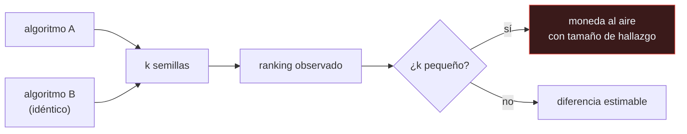

# P113 — Aprendizaje por refuerzo que importa

> Ruta de operación · Dos algoritmos idénticos comparados con tres semillas. El ranking
> sale a cara o cruz, y así se publicaron años de mejoras.

**Nivel:** L3 · **Motor:** `trazabilidad` · **Notebook:** [`P113_trazabilidad.ipynb`](../../../notebooks/papers/P113_trazabilidad.ipynb)
· **Anexo:** [probabilidad y verosimilitud](../../annexes/A02_PROBABILIDAD_Y_VEROSIMILITUD.md)

## 1. Identificación

| Campo | Valor |
|---|---|
| **Título original** | *Deep Reinforcement Learning That Matters* |
| **Autoría** | Peter Henderson, Riashat Islam, Philip Bachman, Joelle Pineau, Doina Precup, David Meger |
| **Año** | 2018 |
| **Venue** | AAAI 2018 |
| **Fuente primaria** | [doi:10.1609/aaai.v32i1.11694](https://doi.org/10.1609/aaai.v32i1.11694) |
| **Acceso** | Abierto |
| **Fecha de consulta** | 2026-08-17 |

## 2. Problema anterior

Los resultados en aprendizaje por refuerzo profundo se publicaban comparando curvas de tres o
cinco corridas, sin declarar las semillas, la implementación concreta ni los hiperparámetros.

El problema no es de higiene: es que **la varianza entre semillas es del mismo tamaño que las
diferencias que se anuncian**. Con ese protocolo, un experimento no distingue dos algoritmos —y a
veces ni siquiera dos ejecuciones del mismo algoritmo—.

## 3. Propuesta

Medirlo, en lugar de argumentarlo. Los autores ejecutan los mismos algoritmos variando por
separado cada fuente de variación:

- las **semillas** aleatorias,
- la **implementación** concreta (dos versiones del mismo algoritmo publicado),
- los **hiperparámetros** y la arquitectura de red,
- los **entornos** de evaluación.

Y muestran que cada una por sí sola puede invertir el ranking publicado. La conclusión operativa es
una lista de requisitos de reporte: número de corridas, dispersión, semillas, versión del código y
del entorno, y significación estadística cuando se afirme una mejora.

## 4. Intuición sin fórmulas

Dos corredores igual de rápidos. Los cronometras tres veces cada uno y comparas los promedios.
Con el viento, el carril y cómo durmieron, uno gana. Repites el experimento otro día y gana el otro.

Con tres carreras no estás midiendo quién corre más: estás midiendo qué día tuvo suerte.

**Dónde deja de funcionar la analogía:** en atletismo, todo el mundo sabe que tres carreras no
deciden nada. En aprendizaje por refuerzo, tres semillas se publicaban como resultado.

## 5. Matemática mínima

```text
Estimador de la media con k corridas de desviación σ:

    error estándar = σ / √k

    σ = 60,  k = 3    →  ±34,6
    σ = 60,  k = 30   →  ±11,0
```

La miniatura compara dos algoritmos **idénticos por construcción** (media real 300, desviación
entre semillas 60):

| Semillas | Veces que A «pierde» de 200 | Diferencia media observada | Diferencia máxima |
|---:|---:|---:|---:|
| 3 | 99 | **42,0** | 131,5 |
| 5 | 109 | 30,7 | 112,4 |
| 10 | 102 | 21,2 | 83,3 |
| **30** | 96 | **12,2** | 40,6 |

La proporción de inversiones **no baja** —y no debe: los algoritmos son iguales—. Lo que baja es la
**magnitud**: con 3 semillas la diferencia espuria media es 42 puntos y llega a 131. Con pocas
corridas, el ruido tiene tamaño de hallazgo.

Y el mismo experimento reportado de dos formas: «**411,4 frente a 267,4**, A supera a B por un
amplio margen» —el mejor de A contra el peor de B— o «326,9 (249–411) frente a 322,7 (267–410),
5 semillas: no se distinguen».

<!-- puente:inicio -->
> [!TIP]
> **Puente matemático.** Esta sección da por sabido lo siguiente. Si algo no te suena,
> léelo primero: está explicado una sola vez, en un solo sitio, y sirve para todas las fichas.

| Dónde | Qué necesitas de ahí |
|---|---|
| [**A02 §6** · Gaussianas y el proceso de difusión](../../annexes/A02_PROBABILIDAD_Y_VEROSIMILITUD.md#6-gaussianas-y-el-proceso-de-difusión) | qué son la media y la desviación de una distribución, que es exactamente lo que se está estimando con k corridas |
<!-- puente:fin -->

## 6. Arquitectura o flujo



## 7. Qué observar en el paper original

- La sección sobre **implementaciones**: dos versiones del mismo algoritmo publicado dan
  resultados distintos. El nombre del algoritmo no identifica el experimento.
- El efecto de la **arquitectura de red** y de la función de activación, que a menudo pesa más que
  el algoritmo comparado.
- La discusión sobre **cuántas corridas** hacen falta y por qué la respuesta depende de la varianza
  del entorno, que hay que medir.
- La lista final de **recomendaciones de reporte**: es la parte directamente aplicable a cualquier
  experimento, dentro y fuera del aprendizaje por refuerzo.

## 8. Evidencia y resultados

Son experimentos propios y sistemáticos: los autores reejecutan algoritmos publicados variando una
fuente de variación cada vez y publican las distribuciones completas.

> Es evidencia empírica de primer orden sobre la metodología del área, no una opinión. Y el
> resultado es incómodo: buena parte de las mejoras publicadas no sobrevive a la comprobación.

La miniatura no reproduce esos experimentos: simula dos algoritmos iguales para aislar el efecto
del número de corridas, que es el mecanismo. Las corridas se generan con una gaussiana, lo cual es
optimista —la distribución real suele ser bimodal—.

## 9. Impacto

- Cambió las normas de publicación del área. Hoy se piden diez o más semillas, intervalos de
  confianza y el código.
- Está detrás del programa de reproducibilidad de NeurIPS y de las listas de comprobación que
  acompañan a los envíos.
- Agarwal et al. (2021) continuaron el trabajo con estadística adecuada para pocas corridas:
  intervalos por bootstrap y perfiles de rendimiento en lugar de medias.
- Y aporta al programa el criterio con el que se lee cualquier tabla comparativa: sin número de
  corridas y dispersión, la tabla no dice nada.

## 10. Limitaciones

1. **Se centra en aprendizaje por refuerzo continuo**, donde la varianza es especialmente alta. En
   otras áreas el problema existe pero es menos brutal.
2. **No propone un protocolo estadístico completo**: señala el problema y recomienda, pero la
   estadística fina llegó después.
3. **Más semillas cuestan cómputo**, y para modelos grandes treinta corridas pueden ser inviables.
   La respuesta entonces es reportar la limitación, no fingir que no existe.
4. **Los resultados concretos envejecen**: los algoritmos que compara ya no son los que se usan.
5. **La recomendación no se cumple del todo.** Ocho años después, sigue habiendo tablas sin
   dispersión ni número de corridas.

## 11. Errores comunes

| Error | Corrección |
|---|---|
| «Con tres semillas se ve la tendencia» | Con tres semillas, dos algoritmos idénticos producen una diferencia media de 42 puntos y hasta 131. Eso tiene tamaño de hallazgo y es ruido. |
| «Con más semillas el ranking deja de invertirse» | Si los algoritmos son iguales, la inversión sigue al 50 %: eso es lo correcto. Lo que baja con más semillas es la magnitud de la diferencia espuria. |
| «El nombre del algoritmo identifica el experimento» | Dos implementaciones del mismo algoritmo publicado dan resultados distintos. Hace falta la versión del código, no el nombre. |
| «Reportar la media es suficiente» | El reporte mínimo son tres campos: media, dispersión y número de corridas. Sin el tercero, los dos primeros no se pueden interpretar. |
| «Esto solo pasa en aprendizaje por refuerzo» | Es más grave ahí porque la varianza es enorme, pero el mecanismo es el mismo en cualquier comparación con pocas repeticiones. |

## 12. Relación con trabajos anteriores

- **[P63 Reproducibilidad](../P63_reproducibilidad/README.md) (2021)** — el problema general del que
  este es el caso más agudo.
- **[P60 Por qué la mayoría de los hallazgos publicados son falsos](../P60_valor_predictivo/README.md)
  (2005)** — el mismo mecanismo en ciencia empírica: con poco poder estadístico, lo que se publica
  son en buena parte casualidades.
- **[P102 PPO](../P102_ppo/README.md) (2017)** — uno de los algoritmos cuya varianza entre semillas
  este artículo cuantifica.

## 13. Relación con trabajos posteriores

- **Agarwal et al. (2021)** — *Deep RL at the Edge of the Statistical Precipice*: estadística
  adecuada cuando hay pocas corridas. [arXiv:2108.13264](https://arxiv.org/abs/2108.13264)
- **Pineau et al. (2021)** — el programa de reproducibilidad de NeurIPS.
  [jmlr.org](https://jmlr.org/papers/v22/20-303.html)
- **[P112 ML Test Score](../P112_ml_test_score/README.md) (2017)** — la misma exigencia aplicada al
  despliegue en lugar de a la publicación.

## 14. Notebook asociado

[`P113_trazabilidad.ipynb`](../../../notebooks/papers/P113_trazabilidad.ipynb)

**Qué implementa:** el efecto del número de semillas sobre la comparación de dos algoritmos idénticos, con la proporción de inversiones y la magnitud de la diferencia espuria, y el mismo experimento reportado de forma optimista y de forma honesta.

**Qué NO implementa:** las corridas se generan con una gaussiana. En aprendizaje por refuerzo real la distribución entre semillas suele ser bimodal —o converge o no—, lo cual es peor. Y no cubre implementación, hiperparámetros ni entornos, que el artículo también mide.

```bash
ai-evolution paper-lab P113 --seed 7
```

## 15. Actividades Bloom

| Nivel | Actividad |
|---|---|
| **Recordar** | Escribe cómo cae el error de una media con el número de corridas. |
| **Explicar** | Explica por qué tres semillas no distinguen dos algoritmos. |
| **Aplicar** | Ejecuta el notebook y compara la diferencia espuria con 3 y con 30 semillas. |
| **Analizar** | Analiza por qué la proporción de inversiones no baja al aumentar las semillas. |
| **Evaluar** | «A obtiene 411 y B obtiene 267». Evalúa qué falta para poder interpretar esa frase. |
| **Crear** | Toma una comparación de tu trabajo y reejecútala con diez semillas. Reporta media, rango y número de corridas. |

## 16. Autoevaluación

1. ¿Qué mide la desviación entre semillas?
2. ¿Por qué la proporción de inversiones no baja con más semillas?
3. ¿Qué sí baja?
4. ¿Qué tres campos son el reporte mínimo?
5. ¿Por qué el nombre del algoritmo no identifica el experimento?
6. ¿Qué otras fuentes de variación mide el artículo?
7. ¿Qué hacer cuando treinta corridas son inviables?

## 17. Respuestas esperadas

1. Cuánto cambia el resultado del mismo algoritmo por la inicialización aleatoria y el orden de los datos. En aprendizaje por refuerzo es del mismo tamaño que las mejoras que se publican.
2. Porque si los dos algoritmos son iguales, la mitad de las veces uno saldrá por encima. Eso es el comportamiento correcto, no un defecto del muestreo.
3. La magnitud de la diferencia observada. En la miniatura pasa de 42 puntos de media con 3 semillas a 12,2 con 30, y de un máximo de 131 a 40.
4. Media, dispersión y número de corridas. Sin el tercero, los otros dos no se pueden interpretar.
5. Porque dos implementaciones del mismo algoritmo publicado dan resultados distintos. Hace falta la versión concreta del código y del entorno.
6. La implementación, los hiperparámetros y la arquitectura de red, y la elección de entornos. Cada una por separado puede invertir el ranking.
7. Reportarlo. Decir cuántas corridas se hicieron y qué dispersión tienen, y no afirmar una mejora que los datos no soportan.

## 18. Fuentes primarias

- Henderson, P. et al. (2018). *Deep Reinforcement Learning That Matters*. **AAAI 2018**.
  [doi:10.1609/aaai.v32i1.11694](https://doi.org/10.1609/aaai.v32i1.11694) · consultado 2026-08-17.
- Agarwal, R. et al. (2021). *Deep Reinforcement Learning at the Edge of the Statistical
  Precipice*. [arXiv:2108.13264](https://arxiv.org/abs/2108.13264) · consultado 2026-08-17.
- Pineau, J. et al. (2021). *Improving Reproducibility in Machine Learning Research*.
  [jmlr.org](https://jmlr.org/papers/v22/20-303.html) · consultado 2026-08-17.

---

[⬅️ Anterior: P112 ML Test Score](../P112_ml_test_score/README.md) ·
[📇 Índice](../../catalog/PAPERS_INDEX.md) ·
[📝 Evaluación](../../../assessments/papers/P113_trazabilidad.md) ·
[🏫 Clase 149 · Experimentos, semillas y trazabilidad](../../../classes/part-12-ai-engineering-mlops-llmops-and-agentops/149-experimentos-semillas-y-trazabilidad/README.md) ·
[➡️ Siguiente: P114 Tarjetas de modelo](../P114_tarjetas_de_modelo/README.md)
