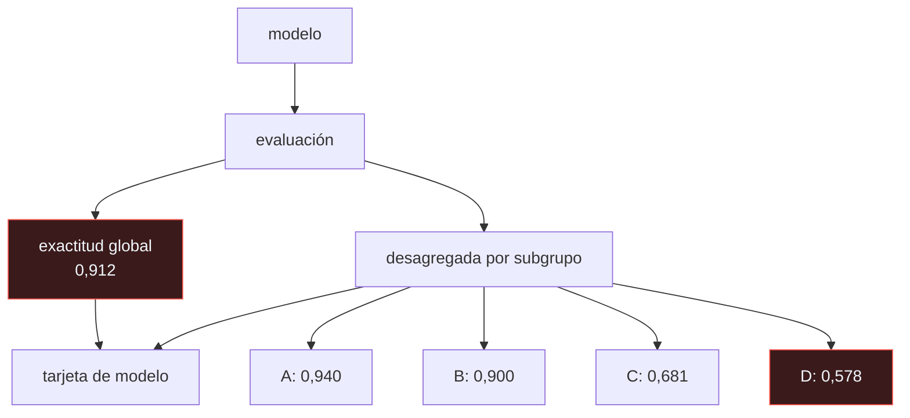

# P114 — Tarjetas de modelo

> Ruta de operación · Exactitud del 91 %. Desagregada, va del 94 % al 58 %, y el grupo
> peor servido es el 2 % de la muestra: por eso no mueve la cifra.

**Nivel:** L1 · **Motor:** `tarjetas_de_modelo` · **Notebook:** [`P114_tarjetas_de_modelo.ipynb`](../../../notebooks/papers/P114_tarjetas_de_modelo.ipynb)
· **Anexo:** [probabilidad y verosimilitud](../../annexes/A02_PROBABILIDAD_Y_VEROSIMILITUD.md)

## 1. Identificación

| Campo | Valor |
|---|---|
| **Título original** | *Model Cards for Model Reporting* |
| **Autoría** | Margaret Mitchell, Simone Wu, Andrew Zaldivar, Parker Barnes, Lucy Vasserman, Ben Hutchinson, Elena Spitzer, Inioluwa Deborah Raji, Timnit Gebru |
| **Año** | 2019 |
| **Venue** | FAT* '19, 220–229 |
| **Fuente primaria** | [doi:10.1145/3287560.3287596](https://doi.org/10.1145/3287560.3287596) |
| **Acceso** | Abierto |
| **Fecha de consulta** | 2026-08-17 |

## 2. Problema anterior

Un modelo se publica con una cifra: exactitud del 91 %. Con eso, quien lo va a integrar no puede
responder ninguna de las preguntas que necesita: para qué sirve, para qué **no**, con qué datos se
evaluó, a quién le funciona peor, qué umbral usa, quién lo mantiene.

La cifra agregada además esconde activamente el problema. Si un subgrupo es el 2 % de la muestra, su
rendimiento puede ser pésimo sin mover la media ni un punto.

## 3. Propuesta

Un documento corto —una o dos páginas— que acompaña a cada modelo, con secciones fijas:

```text
detalles del modelo · uso previsto · usos FUERA de alcance · factores relevantes
métricas y umbrales · datos de evaluación · datos de entrenamiento
ANÁLISIS CUANTITATIVO DESAGREGADO · consideraciones éticas · advertencias
```

Dos secciones son la aportación real. Los **usos fuera de alcance**, que obligan a escribir para qué
no sirve el modelo —la pregunta que nadie se hace hasta que ya es tarde—. Y el **análisis
cuantitativo desagregado**, que obliga a publicar la métrica por subgrupo y no solo la media.

## 4. Intuición sin fórmulas

El prospecto de un medicamento. No dice solo «eficaz»: dice para qué indicaciones, en qué dosis,
qué contraindicaciones tiene, qué pasa en embarazo o en insuficiencia renal, y qué efectos adversos
se observaron y con qué frecuencia.

Nadie aceptaría un medicamento cuya documentación fuera «funciona en el 91 % de los casos».

**Dónde deja de funcionar la analogía:** el prospecto está regulado y su contenido es obligatorio.
La tarjeta de modelo es voluntaria, y quien la escribe elige qué subgrupos mostrar.

## 5. Matemática mínima

```text
exactitud_global = Σᵢ nᵢ · aᵢ / Σᵢ nᵢ        ← una media ponderada por tamaño

Un subgrupo pequeño con exactitud baja casi no mueve la global.
```

La miniatura evalúa un modelo sobre 8 300 casos:

| Grupo | n | Exactitud |
|---|---:|---:|
| A | 6 200 | 0,940 |
| B | 1 500 | 0,900 |
| C | 420 | 0,681 |
| **D** | **180** | **0,578** |
| **global** | **8 300** | **0,912** |

La brecha entre el mejor y el peor subgrupo es de **36,2 puntos**. El grupo D es el **2,2 %** de la
muestra: por eso no mueve la cifra global, y por eso hace falta desagregar para verlo.

Con la cifra publicada —91 %— el modelo parece bueno. Para una de cada cincuenta personas, acierta
poco más que una moneda.

<!-- puente:inicio -->
> [!TIP]
> **Puente matemático.** Esta sección da por sabido lo siguiente. Si algo no te suena,
> léelo primero: está explicado una sola vez, en un solo sitio, y sirve para todas las fichas.

| Dónde | Qué necesitas de ahí |
|---|---|
| [**A02 §5** · Estimadores, sesgo y varianza](../../annexes/A02_PROBABILIDAD_Y_VEROSIMILITUD.md#5-estimadores-sesgo-y-varianza) | por qué una media ponderada puede ser alta con un componente pésimo, y cuánta incertidumbre tiene un subgrupo de 180 casos |
<!-- puente:fin -->

## 6. Arquitectura o flujo



## 7. Qué observar en el paper original

- La sección de **usos fuera de alcance**. Es la más difícil de escribir y la que más incidentes
  evita: obliga a decir explícitamente para qué no vale el modelo.
- Los **factores relevantes**: qué dimensiones hay que desagregar y por qué. No es solo demografía;
  incluye instrumentación —qué cámara, qué micrófono— y entorno.
- Los **ejemplos completos** que trae el artículo, con tarjetas rellenadas para modelos reales. Son
  la mejor guía para escribir la primera.
- Que el artículo es explícito en que la tarjeta es **transparencia, no mitigación**: hace visible
  el problema, no lo arregla.

## 8. Evidencia y resultados

Es un artículo de propuesta, con ejemplos de tarjetas rellenadas para modelos reales de detección
de rostros y de análisis de texto.

> No hay estudio de adopción ni medición del efecto: la evidencia de que hacía falta viene de
> trabajos como *Gender Shades* (Buolamwini y Gebru, 2018), que documentó brechas enormes entre
> subgrupos en sistemas comerciales publicados con cifras agregadas.

La miniatura usa datos inventados con subgrupos anónimos, elegidos para que la aritmética de la
media ponderada sea visible.

## 9. Impacto

- Es hoy práctica estándar: Hugging Face, Google Cloud y las principales plataformas de modelos
  incorporan tarjetas de modelo.
- Junto con [P115](../P115_hojas_de_datos/README.md) formó el par documental —modelo y datos— con el
  que se discute la transparencia de un sistema.
- La **evaluación desagregada** pasó de ser un extra a ser lo que se espera de una publicación
  seria.
- El Reglamento de IA de la Unión Europea exige documentación técnica cuyo contenido se parece
  mucho a estas secciones.

## 10. Limitaciones

1. **Es voluntaria** y quien la escribe elige qué mostrar. Una tarjeta puede omitir el subgrupo
   incómodo.
2. **Desagregar exige tener las etiquetas de grupo**, y recogerlas plantea su propio problema de
   privacidad y consentimiento.
3. **Elegir qué subgrupos son relevantes es una decisión difícil** y con consecuencias: los ejes que
   no se miren seguirán invisibles.
4. **Los subgrupos pequeños tienen mucha incertidumbre**: 180 casos dan un intervalo ancho, y la
   tarjeta debería decirlo.
5. **Documentar no arregla nada.** El artículo lo dice: es transparencia, no mitigación.

## 11. Errores comunes

| Error | Corrección |
|---|---|
| «Con la exactitud global se sabe cómo funciona el modelo» | Es una media ponderada por tamaño. En la miniatura, 0,912 global esconde un subgrupo con 0,578 que es el 2,2 % de la muestra. |
| «Si un subgrupo va mal se nota en la cifra global» | No si es pequeño. Justamente por eso hace falta desagregar: la media está diseñada para no notarlo. |
| «La tarjeta de modelo es documentación decorativa» | Su sección clave —el análisis cuantitativo desagregado— es un resultado que hay que calcular, y los usos fuera de alcance son una decisión de diseño. |
| «Escribir la tarjeta mitiga el sesgo» | Lo hace visible. El artículo es explícito: es transparencia, no mitigación. Arreglarlo es otro trabajo. |
| «Basta desagregar por demografía» | Los factores relevantes incluyen instrumentación y entorno: qué cámara, qué micrófono, qué condiciones. Los ejes que no se miran siguen invisibles. |

## 12. Relación con trabajos anteriores

- **[P112 ML Test Score](../P112_ml_test_score/README.md) (2017)** — la rúbrica de preparación; la
  tarjeta es qué se documenta de lo que se promociona.
- **[P82 Calibración](../P82_calibracion/README.md) (2005)** — otra propiedad que la exactitud
  agregada no captura.
- **Buolamwini y Gebru (2018)** — *Gender Shades*: el estudio desagregado que hizo evidente el
  problema. [proceedings.mlr.press](https://proceedings.mlr.press/v81/buolamwini18a.html)

## 13. Relación con trabajos posteriores

- **[P115 Hojas de datos](../P115_hojas_de_datos/README.md) (2021)** — la pieza equivalente para los
  conjuntos de datos.
- **Raji et al. (2020)** — *Closing the AI Accountability Gap*: auditoría interna con estos
  documentos como insumo. [doi:10.1145/3351095.3372873](https://doi.org/10.1145/3351095.3372873)
- **Reglamento de IA de la UE (2024)** — documentación técnica obligatoria para sistemas de alto
  riesgo.

## 14. Notebook asociado

[`P114_tarjetas_de_modelo.ipynb`](../../../notebooks/papers/P114_tarjetas_de_modelo.ipynb)

**Qué implementa:** la comparación entre la exactitud global y la desagregada por cuatro subgrupos, con el tamaño de cada uno, la brecha entre el mejor y el peor, y la lista de secciones de la tarjeta.

**Qué NO implementa:** los datos son inventados y los subgrupos, anónimos. Definir qué subgrupos son relevantes es la decisión difícil y aquí viene dada.

```bash
ai-evolution paper-lab P114 --seed 7
```

## 15. Actividades Bloom

| Nivel | Actividad |
|---|---|
| **Recordar** | Enumera las secciones de una tarjeta de modelo. |
| **Explicar** | Explica por qué un subgrupo pequeño no mueve la cifra global. |
| **Aplicar** | Ejecuta el notebook y calcula la brecha entre subgrupos. |
| **Analizar** | Analiza qué incertidumbre tiene la exactitud de un subgrupo de 180 casos. |
| **Evaluar** | «El modelo tiene un 91 % de exactitud, es adecuado para este caso». Evalúa la afirmación. |
| **Crear** | Escribe la tarjeta de un modelo tuyo, empezando por la sección de usos fuera de alcance. |

## 16. Autoevaluación

1. ¿Qué esconde una exactitud agregada?
2. ¿Cuál es la sección clave de la tarjeta?
3. ¿Por qué la sección de usos fuera de alcance es importante?
4. ¿Qué se necesita para poder desagregar?
5. ¿Mitiga el sesgo una tarjeta de modelo?
6. ¿Qué factores hay que considerar además de la demografía?
7. ¿Qué limitación tiene ser un documento voluntario?

## 17. Respuestas esperadas

1. Que es una media ponderada por tamaño de subgrupo. Un grupo pequeño con rendimiento pésimo casi no la mueve: en la miniatura, 0,578 en el 2,2 % de la muestra.
2. El análisis cuantitativo desagregado: la métrica por subgrupo, no solo la media.
3. Porque obliga a escribir para qué **no** vale el modelo, que es la pregunta que nadie se hace hasta que ya se está usando mal.
4. Las etiquetas de grupo de cada caso de evaluación. Recogerlas plantea su propio problema de privacidad y consentimiento, y a menudo no se tienen.
5. No. Lo hace visible. El artículo es explícito en que es transparencia, no mitigación.
6. La instrumentación —qué cámara, qué micrófono, qué dispositivo— y el entorno. Los ejes que no se miran siguen invisibles.
7. Que quien la escribe elige qué mostrar, y puede omitir el subgrupo incómodo sin que nada lo impida.

## 18. Fuentes primarias

- Mitchell, M. et al. (2019). *Model Cards for Model Reporting*. **FAT* '19**, 220–229.
  [doi:10.1145/3287560.3287596](https://doi.org/10.1145/3287560.3287596) · consultado 2026-08-17.
- Buolamwini, J. y Gebru, T. (2018). *Gender Shades*.
  [proceedings.mlr.press](https://proceedings.mlr.press/v81/buolamwini18a.html) ·
  consultado 2026-08-17.
- Gebru, T. et al. (2021). *Datasheets for Datasets*.
  [doi:10.1145/3458723](https://doi.org/10.1145/3458723) · consultado 2026-08-17.

---

[⬅️ Anterior: P113 Aprendizaje por refuerzo que importa](../P113_trazabilidad/README.md) ·
[📇 Índice](../../catalog/PAPERS_INDEX.md) ·
[📝 Evaluación](../../../assessments/papers/P114_tarjetas_de_modelo.md) ·
[🏫 Clase 150 · Registro y promoción: champion/challenger](../../../classes/part-12-ai-engineering-mlops-llmops-and-agentops/150-registro-y-promocion-champion-challenger/README.md) ·
[➡️ Siguiente: P115 Hojas de datos](../P115_hojas_de_datos/README.md)
