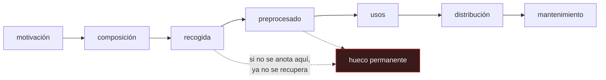

# P115 — Hojas de datos

> Ruta de operación · De diez preguntas sobre un conjunto de datos, cinco no se pueden
> responder mirándolo. Y son justo las que importan.

**Nivel:** L1 · **Motor:** `hojas_de_datos` · **Notebook:** [`P115_hojas_de_datos.ipynb`](../../../notebooks/papers/P115_hojas_de_datos.ipynb)
· **Anexo:** [probabilidad y verosimilitud](../../annexes/A02_PROBABILIDAD_Y_VEROSIMILITUD.md)

## 1. Identificación

| Campo | Valor |
|---|---|
| **Título original** | *Datasheets for Datasets* |
| **Autoría** | Timnit Gebru, Jamie Morgenstern, Briana Vecchione, Jennifer Wortman Vaughan, Hanna Wallach, Hal Daumé III, Kate Crawford |
| **Año** | 2021 |
| **Venue** | Communications of the ACM, 64(12), 86–92 |
| **Fuente primaria** | [doi:10.1145/3458723](https://doi.org/10.1145/3458723) |
| **Acceso** | Abierto |
| **Fecha de consulta** | 2026-08-17 |

## 2. Problema anterior

Cualquier componente electrónico se distribuye con una hoja de características: rango de
temperatura, tolerancias, condiciones de uso, límites absolutos. Nadie diseña un circuito sin
leerla.

Los conjuntos de datos se comparten con un nombre y un enlace. Quien los reutiliza hereda todos los
supuestos de quien los recogió —qué se filtró, a quién se preguntó, en qué periodo, con qué
consentimiento— sin que ninguno esté escrito, y **muchos de ellos ya no se pueden reconstruir**.

## 3. Propuesta

Un cuestionario que sigue el ciclo de vida del conjunto, en siete secciones:

```text
motivación · composición · recogida · preprocesado · usos · distribución · mantenimiento
```

con preguntas concretas del tipo «¿qué representa cada instancia?», «¿hubo consentimiento de las
personas implicadas?», «¿qué filtros se aplicaron y qué dejaron fuera?», «¿para qué tareas **no**
debería usarse?».

Y una tesis que es la mitad de la propuesta: la hoja se responde **mientras se crea el conjunto**,
no después. No es un trámite de publicación: es parte de la construcción.

## 4. Intuición sin fórmulas

Heredar una receta de familia escrita en una tarjeta: «harina, huevos, leche, hornear».

Puedes reproducirla. Lo que no puedes reconstruir es si lleva harina de trigo o de espelta, si
alguien de la familia era celíaco, por qué se quitó la mantequilla en algún momento o si la
temperatura del horno de entonces era la de ahora. Esas decisiones se tomaron y nadie las anotó.

**Dónde deja de funcionar la analogía:** con una receta puedes probar y ajustar. Con un conjunto de
datos usado para entrenar un modelo que decide sobre personas, probar y ajustar tiene coste real.

## 5. Matemática mínima

No hay formalismo. Lo que sí se puede exhibir es la asimetría entre lo reconstruible y lo que no.

La miniatura toma diez preguntas del cuestionario:

| Respondible mirando el conjunto | No respondible a posteriori |
|---|---|
| ¿para qué se creó? | ¿qué **poblaciones** están representadas? |
| ¿qué representa cada instancia? | ¿hubo **consentimiento**? |
| ¿cómo se recogieron? | ¿qué **filtros** se aplicaron y qué dejaron fuera? |
| ¿en qué periodo? | ¿para qué **no** debería usarse? |
| ¿bajo qué licencia? | ¿quién lo **mantiene**? |

**5 de 10.** Y no es una mitad cualquiera: cada hueco tiene una consecuencia operativa concreta.

| Hueco | Consecuencia |
|---|---|
| poblaciones representadas | no se puede desagregar la evaluación por subgrupo |
| consentimiento | riesgo legal y ético que aparece ya en producción |
| filtros aplicados | no se sabe a quién silenció la limpieza del corpus |
| usos desaconsejados | el conjunto acaba usado para lo que no sirve |
| mantenimiento | nadie sabe si sigue siendo válido dentro de dos años |

La primera consecuencia es exactamente lo que impide rellenar la sección clave de una
[tarjeta de modelo](../P114_tarjetas_de_modelo/README.md).

<!-- puente:inicio -->
> [!TIP]
> **Puente matemático.** Esta sección da por sabido lo siguiente. Si algo no te suena,
> léelo primero: está explicado una sola vez, en un solo sitio, y sirve para todas las fichas.

| Dónde | Qué necesitas de ahí |
|---|---|
| [**A02 §1** · De la frecuencia a la probabilidad](../../annexes/A02_PROBABILIDAD_Y_VEROSIMILITUD.md#1-de-la-frecuencia-a-la-probabilidad) | por qué la pregunta «¿de qué población es muestra esto?» es previa a cualquier cosa que se calcule con los datos |
<!-- puente:fin -->

## 6. Arquitectura o flujo



## 7. Qué observar en el paper original

- El **cuestionario completo**, que es lo directamente reutilizable: se puede copiar y usar como
  plantilla el mismo día.
- La insistencia en el **momento**: responder mientras se recoge. Las autoras lo argumentan
  mostrando qué preguntas dejan de tener respuesta con el tiempo.
- La sección de **recogida**, con las preguntas sobre consentimiento, sobre si las personas fueron
  notificadas y sobre si pueden retirar sus datos.
- El paralelismo con la industria electrónica, que no es retórico: la hoja de características existe
  porque integrar un componente sin conocer sus límites produce fallos.

## 8. Evidencia y resultados

Es una propuesta razonada, con ejemplos de hojas rellenadas para conjuntos conocidos —entre ellos
*Labeled Faces in the Wild* y *Pang & Lee*— y con entrevistas a profesionales de la industria sobre
qué documentación echan en falta.

> No hay un experimento que mida el efecto de adoptarlas. La evidencia es cualitativa y de
> ejemplo, que es lo apropiado para una propuesta documental.

La miniatura reduce el cuestionario a diez preguntas y marca a mano cuáles son reconstruibles, para
exhibir la asimetría. Qué preguntas lo son depende del conjunto concreto.

## 9. Impacto

- Es la referencia estándar para documentar conjuntos de datos, y el origen de las *dataset cards*
  de Hugging Face.
- Junto con [P114](../P114_tarjetas_de_modelo/README.md) formó el par documental modelo-datos.
- Cambió lo que se espera de una publicación que introduce un conjunto: hoy se pide la
  documentación de procedencia y de composición.
- Dodge et al. (2021) aplicaron la idea a un corpus web real —C4— y encontraron exactamente lo que
  el artículo predice: los filtros habían eliminado desproporcionadamente contenido de
  determinadas comunidades, y nadie lo sabía.

## 10. Limitaciones

1. **Es voluntaria y costosa.** Responder el cuestionario completo lleva trabajo, y no hay
   incentivo formal para hacerlo.
2. **Muchos conjuntos existentes son indocumentables**: la información ya se perdió, y lo honesto es
   escribir «no se sabe».
3. **No dice qué hacer con un conjunto mal documentado** que ya se usa en producción.
4. **Documentar no mejora los datos**: hace explícitos sus límites. Es transparencia, no
   mitigación.
5. **Los conjuntos derivados** —filtrados, mezclados, deduplicados— rompen la trazabilidad, y hoy
   casi todos los corpus grandes lo son.

## 11. Errores comunes

| Error | Corrección |
|---|---|
| «La hoja de datos se escribe al publicar el conjunto» | La mitad de las preguntas ya no tiene respuesta entonces: consentimiento, filtros aplicados, poblaciones representadas. Se responden mientras se recoge. |
| «Lo importante de un conjunto se ve mirándolo» | Se ve el qué, no el cómo ni el a quién. En la miniatura, 5 de 10 preguntas no son reconstruibles a partir del conjunto. |
| «Documentar el conjunto lo hace mejor» | Lo hace auditable. Un conjunto sesgado bien documentado sigue sesgado; la diferencia es que se sabe. |
| «Si no hubo problemas, el consentimiento da igual» | El riesgo legal y ético aparece cuando el sistema ya está en producción, y entonces no se puede reconstruir quién consintió qué. |
| «Los filtros de limpieza son neutrales» | Dodge et al. documentaron en C4 que los filtros eliminaron desproporcionadamente contenido de determinadas comunidades. Sin registrarlos, eso es invisible. |

## 12. Relación con trabajos anteriores

- **[P111 Deuda técnica](../P111_deuda_tecnica/README.md) (2015)** — las dependencias de datos no
  declaradas son la versión de ingeniería de este mismo problema.
- **[P114 Tarjetas de modelo](../P114_tarjetas_de_modelo/README.md) (2019)** — la pieza equivalente
  para modelos, y la que no se puede rellenar sin esta.
- **[P61 Loros estocásticos](../P61_stochastic_parrots/README.md) (2021)** — qué hay dentro de los
  corpus grandes y qué no se sabe.

## 13. Relación con trabajos posteriores

- **Dodge et al. (2021)** — documentar C4 y encontrar lo que los filtros dejaron fuera.
  [doi:10.18653/v1/2021.emnlp-main.98](https://doi.org/10.18653/v1/2021.emnlp-main.98)
- **Hugging Face** — *dataset cards*, la implementación práctica más extendida.
  [huggingface.co](https://huggingface.co/docs/hub/datasets-cards)
- **[P110 Deriva de concepto](../P110_deriva/README.md) (2014)** — la sección de mantenimiento
  existe porque un conjunto caduca.

## 14. Notebook asociado

[`P115_hojas_de_datos.ipynb`](../../../notebooks/papers/P115_hojas_de_datos.ipynb)

**Qué implementa:** el cuestionario reducido a diez preguntas, con cuáles se pueden responder mirando el conjunto y cuáles no, y la consecuencia operativa concreta de cada hueco.

**Qué NO implementa:** el cuestionario real es mucho más largo y está agrupado en siete secciones. Qué preguntas son respondibles depende del conjunto: aquí están marcadas a mano para ilustrar la asimetría.

```bash
ai-evolution paper-lab P115 --seed 7
```

## 15. Actividades Bloom

| Nivel | Actividad |
|---|---|
| **Recordar** | Enumera las siete secciones del cuestionario. |
| **Explicar** | Explica por qué la hoja se escribe durante la recogida. |
| **Aplicar** | Ejecuta el notebook y separa las preguntas reconstruibles de las que no. |
| **Analizar** | Analiza qué impide, aguas abajo, no saber qué poblaciones están representadas. |
| **Evaluar** | «El conjunto está publicado con licencia abierta, luego se puede usar». Evalúa la afirmación. |
| **Crear** | Escribe la hoja de datos de un conjunto que uses, marcando explícitamente los «no se sabe». |

## 16. Autoevaluación

1. ¿De dónde viene la metáfora de la hoja de datos?
2. ¿Cuándo hay que responder el cuestionario?
3. ¿Qué preguntas no son reconstruibles a posteriori?
4. ¿Qué impide no saber qué poblaciones están representadas?
5. ¿Qué encontró Dodge et al. al documentar C4?
6. ¿Mejora los datos escribir la hoja?
7. ¿Qué hacer con un conjunto ya indocumentable?

## 17. Respuestas esperadas

1. De la electrónica: cualquier componente se distribuye con su rango de operación, tolerancias y límites absolutos, y nadie lo integra sin leerlos.
2. Mientras se crea el conjunto. Media docena de preguntas —consentimiento, filtros, poblaciones— dejan de tener respuesta en cuanto pasa el tiempo.
3. Qué poblaciones están representadas, si hubo consentimiento, qué dejaron fuera los filtros, para qué no debería usarse y quién lo mantiene.
4. Desagregar la evaluación por subgrupo, que es justamente la sección clave de una tarjeta de modelo. Sin esa información, no se puede rellenar.
5. Que los filtros de limpieza habían eliminado desproporcionadamente contenido de determinadas comunidades, sin que nadie lo supiera ni lo hubiera decidido.
6. No. Los hace auditables. Un conjunto sesgado bien documentado sigue sesgado, con la diferencia de que se sabe y se puede decidir.
7. Escribir la hoja con «no se sabe» donde corresponda. Es información: dice de qué no se puede responder al usarlo.

## 18. Fuentes primarias

- Gebru, T. et al. (2021). *Datasheets for Datasets*. **Communications of the ACM**, 64(12),
  86–92. [doi:10.1145/3458723](https://doi.org/10.1145/3458723) · consultado 2026-08-17.
- Dodge, J. et al. (2021). *Documenting Large Webtext Corpora: A Case Study on the Colossal Clean
  Crawled Corpus*. [doi:10.18653/v1/2021.emnlp-main.98](https://doi.org/10.18653/v1/2021.emnlp-main.98)
  · consultado 2026-08-17.
- Mitchell, M. et al. (2019). *Model Cards for Model Reporting*.
  [doi:10.1145/3287560.3287596](https://doi.org/10.1145/3287560.3287596) · consultado 2026-08-17.

---

[⬅️ Anterior: P114 Tarjetas de modelo](../P114_tarjetas_de_modelo/README.md) ·
[📇 Índice](../../catalog/PAPERS_INDEX.md) ·
[📝 Evaluación](../../../assessments/papers/P115_hojas_de_datos.md) ·
[🏫 Clase 148 · Ciclo de vida de datos, modelos y agentes](../../../classes/part-12-ai-engineering-mlops-llmops-and-agentops/148-ciclo-de-vida-de-datos-modelos-y-agentes/README.md) ·
[➡️ Siguiente: P116 Por qué Johnny no sabe hacer prompts](../P116_gestion_de_prompts/README.md)
