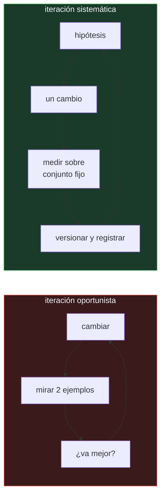

# P116 — Por qué Johnny no sabe hacer prompts

> Ruta de operación · Cuatro versiones de un prompt, tres idénticas en calidad real.
> Eligiendo con veinte ejemplos, se descarta la buena.

**Nivel:** L2 · **Motor:** `gestion_de_prompts` · **Notebook:** [`P116_gestion_de_prompts.ipynb`](../../../notebooks/papers/P116_gestion_de_prompts.ipynb)
· **Anexo:** [probabilidad y verosimilitud](../../annexes/A02_PROBABILIDAD_Y_VEROSIMILITUD.md)

## 1. Identificación

| Campo | Valor |
|---|---|
| **Título original** | *Why Johnny Can't Prompt: How Non-AI Experts Try (and Fail) to Design LLM Prompts* |
| **Autoría** | J.D. Zamfirescu-Pereira, Richmond Y. Wong, Bjoern Hartmann, Qian Yang |
| **Año** | 2023 |
| **Venue** | CHI '23 |
| **Fuente primaria** | [doi:10.1145/3544548.3581388](https://doi.org/10.1145/3544548.3581388) |
| **Acceso** | Restringido |
| **Fecha de consulta** | 2026-08-17 |

## 2. Problema anterior

Escribir un prompt parece accesible a cualquiera: se escribe en lenguaje natural y el resultado se
lee de inmediato. Precisamente por eso se hace sin ninguna disciplina de ingeniería —sin versionar,
sin conjunto de evaluación, mirando dos o tres ejemplos y quedándose con lo que «va mejor»—.

Y ahí está el problema: con muestras pequeñas, **el ruido tiene el mismo tamaño que las mejoras que
se buscan**. La sensación de progreso es real; el progreso no.

## 3. Propuesta

Un estudio con participantes no expertos construyendo un asistente conversacional, observando qué
hacen en realidad.

El patrón dominante que documentan es la **iteración oportunista**: cambiar algo, mirar un par de
ejemplos, quedarse si parece mejor, no versionar, no medir. Y lo acompañan de un hallazgo más
incómodo: los participantes generalizan desde anécdotas y desarrollan explicaciones sobre el
comportamiento del modelo que no se sostienen.

La conclusión no es que haga falta más talento redactando. Es que el prompt necesita las prácticas
del software: **conjunto de evaluación fijo, una hipótesis por cambio, versionado con el código y
registro de qué se probó**.

## 4. Intuición sin fórmulas

Ajustar una receta probando un bocado de cada intento. Le pones más sal, pruebas, «mejor». Menos
cocción, pruebas, «mejor». Al cabo de veinte iteraciones tienes la convicción de haberla mejorado
mucho y ningún dato: cada bocado fue distinto, y tu paladar del intento uno no es el del veinte.

**Dónde deja de funcionar la analogía:** en la cocina hay comensales que acaban dando su opinión.
Con un prompt, si nadie mide, el bucle se puede sostener indefinidamente.

## 5. Matemática mínima

```text
Medir la calidad de un prompt sobre n ejemplos es estimar una proporción:

    desviación ≈ √( p(1−p) / n )

    p = 0,7,  n = 20    →  ±0,102
    p = 0,7,  n = 200   →  ±0,032
```

La miniatura toma cuatro versiones de un prompt, tres con calidad real **idéntica** (0,70) y una
mejor (0,78):

| Versión | Calidad real | Medida con 20 ejemplos | Medida con 200 |
|---|---:|---:|---:|
| v1 | 0,70 | **0,85** | 0,665 |
| v2 | 0,70 | 0,70 | 0,770 |
| **v3** | **0,78** | **0,45** | **0,805** |
| v4 | 0,70 | 0,80 | 0,700 |

Eligiendo con 20 ejemplos se elige **v1** y se descarta **v3**, que es la única que de verdad era
mejor. Y no es mala suerte: la desviación esperada con 20 ejemplos (**0,102**) es mayor que la
diferencia real entre versiones (0,08). El instrumento no tiene resolución para la pregunta.

<!-- puente:inicio -->
> [!TIP]
> **Puente matemático.** Esta sección da por sabido lo siguiente. Si algo no te suena,
> léelo primero: está explicado una sola vez, en un solo sitio, y sirve para todas las fichas.

| Dónde | Qué necesitas de ahí |
|---|---|
| [**A02 §5** · Estimadores, sesgo y varianza](../../annexes/A02_PROBABILIDAD_Y_VEROSIMILITUD.md#5-estimadores-sesgo-y-varianza) | cuántos ejemplos hacen falta para distinguir dos proporciones que difieren en 0,08 |
<!-- puente:fin -->

## 6. Arquitectura o flujo



## 7. Qué observar en el paper original

- Los **fragmentos de sesión** de los participantes. Son lo más útil del artículo: se reconoce en
  ellos el comportamiento propio.
- La distinción entre lo que los participantes **creían** que estaban haciendo y lo que hacían: una
  brecha sistemática y no un fallo individual.
- La discusión sobre **generalizar desde anécdotas** y construir teorías del comportamiento del
  modelo que no se sostienen.
- Las implicaciones de diseño para **herramientas** de prompting: qué debería ofrecer un entorno
  para que la práctica sistemática sea la fácil.

## 8. Evidencia y resultados

Es un estudio cualitativo con participantes reales, con análisis de sus sesiones y de sus
verbalizaciones.

> Su evidencia son observaciones de comportamiento, no una tabla de exactitudes. Y ese es el tipo
> de evidencia adecuado para la pregunta que hace: qué hace la gente cuando escribe prompts.

La miniatura no reproduce el estudio: simula el mecanismo aritmético —cuatro versiones y una
muestra pequeña— para que se vea por qué la iteración oportunista falla incluso con buena
intención. La «calidad» de cada prompt es una moneda sesgada; no hay ningún modelo detrás.

## 9. Impacto

- Es el argumento canónico de que **LLMOps es ingeniería y no redacción**, y se cita
  constantemente para justificar la inversión en evaluación.
- Impulsó la aparición de herramientas de evaluación de prompts —promptfoo, LangSmith y similares—
  cuya función principal es exactamente lo que el artículo echa en falta.
- La práctica de versionar el prompt junto al código, con su conjunto de evaluación, viene de aquí.
- Y aporta al programa la razón de que los proyectos con modelos de lenguaje exijan un conjunto de
  evaluación antes de la primera iteración, no después.

## 10. Limitaciones

1. **Es un estudio pequeño y cualitativo**, con participantes no expertos y una tarea concreta. No
   se puede extrapolar cuantitativamente.
2. **Los modelos de 2023 no son los de hoy**, y parte de las dificultades observadas se deben a
   modelos que seguían peor las instrucciones.
3. **No propone un método**: diagnostica y sugiere implicaciones de diseño.
4. **Un conjunto de evaluación fijo tiene su propio riesgo**: optimizar contra él acaba
   sobreajustándolo. Hace falta rotarlo y guardar un conjunto ciego.
5. **Evaluar salidas abiertas es caro y difícil**, y el artículo no resuelve cómo construir el
   conjunto que recomienda.

## 11. Errores comunes

| Error | Corrección |
|---|---|
| «Si el prompt va mejor en unos ejemplos, va mejor» | Con 20 ejemplos la desviación de la medida es 0,102, mayor que la diferencia real entre versiones. En la miniatura se elige la peor de cuatro. |
| «Escribir prompts es cuestión de talento redactando» | El artículo muestra que el problema es de método, no de redacción: sin conjunto de evaluación fijo, la intuición no tiene con qué corregirse. |
| «Basta con tener un conjunto de evaluación» | Optimizar contra un conjunto fijo acaba sobreajustándolo. Hay que rotarlo y guardar un conjunto ciego que no se mira durante la iteración. |
| «Con modelos actuales esto ya no pasa» | Los modelos siguen mejor las instrucciones, y el problema del muestreo es aritmético: no depende del modelo sino del tamaño de la muestra. |
| «El prompt no es código, no hace falta versionarlo» | Es la parte del sistema que más cambia y la que menos se registra. Sin versión, no se puede revertir ni saber qué cambió cuando la calidad cae. |

## 12. Relación con trabajos anteriores

- **[P62 El benchmark del todo](../P62_benchmark_validez/README.md) (2021)** — qué mide de verdad un
  conjunto de evaluación, que es la pieza que aquí falta.
- **[P63 Reproducibilidad](../P63_reproducibilidad/README.md) (2021)** — la misma exigencia aplicada
  a experimentos.
- **[P113 Aprendizaje por refuerzo que importa](../P113_trazabilidad/README.md) (2018)** — el mismo
  error de muestreo, en otro dominio y con más varianza.

## 13. Relación con trabajos posteriores

- **Liu et al. (2023)** — revisión sistemática de métodos de prompting.
  [doi:10.1145/3560815](https://doi.org/10.1145/3560815)
- **promptfoo** — la familia de herramientas de evaluación que materializa la recomendación.
  [promptfoo.dev](https://www.promptfoo.dev/docs/intro/)
- **[P117 AgentBench](../P117_agentops/README.md) (2023)** — el mismo problema cuando lo que hay que
  evaluar es una trayectoria y no una salida.

## 14. Notebook asociado

[`P116_gestion_de_prompts.ipynb`](../../../notebooks/papers/P116_gestion_de_prompts.ipynb)

**Qué implementa:** cuatro versiones de un prompt con calidad real conocida, medidas sobre 20 y sobre 200 ejemplos, con la versión que se elegiría en cada caso y el ruido esperado de la medida.

**Qué NO implementa:** la «calidad» de cada prompt es una moneda sesgada: no hay ningún modelo detrás y los números no representan a ningún sistema real. Solo exhibe la aritmética del muestreo.

```bash
ai-evolution paper-lab P116 --seed 7
```

## 15. Actividades Bloom

| Nivel | Actividad |
|---|---|
| **Recordar** | Escribe la desviación esperada al estimar una proporción con n ejemplos. |
| **Explicar** | Explica qué es la iteración oportunista. |
| **Aplicar** | Ejecuta el notebook y compara la versión elegida con 20 y con 200 ejemplos. |
| **Analizar** | Analiza por qué el problema no se arregla escribiendo mejores prompts. |
| **Evaluar** | «Probé el cambio en cinco casos y funciona mejor». Evalúa la afirmación. |
| **Crear** | Construye un conjunto de evaluación fijo para un prompt tuyo y mide la versión actual antes de tocarla. |

## 16. Autoevaluación

1. ¿Qué es la iteración oportunista?
2. ¿Por qué falla con muestras pequeñas?
3. ¿Cuántos ejemplos hacen falta para distinguir dos versiones que difieren en 0,08?
4. ¿Qué cuatro prácticas propone el enfoque sistemático?
5. ¿Es un problema de talento redactando?
6. ¿Qué riesgo tiene un conjunto de evaluación fijo?
7. ¿Qué tipo de evidencia aporta el artículo?

## 17. Respuestas esperadas

1. Cambiar algo, mirar dos o tres ejemplos, quedarse si parece mejor, no versionar y no medir. Es el patrón dominante que el estudio documenta.
2. Porque el ruido de la medida es del mismo tamaño que la mejora buscada. Con 20 ejemplos la desviación es 0,102 y la diferencia real entre versiones, 0,08.
3. Bastantes más de veinte. Con 200 la desviación baja a 0,032 y la diferencia empieza a ser distinguible; con 20 el instrumento no tiene resolución.
4. Conjunto de evaluación fijo, una hipótesis por cambio, versionar el prompt con el código y registrar qué se probó y qué salió.
5. No. Es de método: sin conjunto de evaluación, la intuición no tiene con qué corregirse, y los participantes generalizaban desde anécdotas.
6. Que optimizar contra él acaba sobreajustándolo. Hay que rotarlo y mantener un conjunto ciego que no se mira durante la iteración.
7. Observaciones cualitativas del comportamiento de participantes reales. Es el tipo de evidencia adecuado para la pregunta que hace, y no se puede extrapolar cuantitativamente.

## 18. Fuentes primarias

- Zamfirescu-Pereira, J.D. et al. (2023). *Why Johnny Can't Prompt: How Non-AI Experts Try (and
  Fail) to Design LLM Prompts*. **CHI '23**.
  [doi:10.1145/3544548.3581388](https://doi.org/10.1145/3544548.3581388) · consultado 2026-08-17.
- Liu, P. et al. (2023). *Pre-train, Prompt, and Predict: A Systematic Survey of Prompting Methods*.
  [doi:10.1145/3560815](https://doi.org/10.1145/3560815) · consultado 2026-08-17.
- promptfoo. *Introduction*. [promptfoo.dev](https://www.promptfoo.dev/docs/intro/) ·
  consultado 2026-08-17.

---

[⬅️ Anterior: P115 Hojas de datos](../P115_hojas_de_datos/README.md) ·
[📇 Índice](../../catalog/PAPERS_INDEX.md) ·
[📝 Evaluación](../../../assessments/papers/P116_gestion_de_prompts.md) ·
[🏫 Clase 155 · LLMOps y gestión de prompts](../../../classes/part-12-ai-engineering-mlops-llmops-and-agentops/155-llmops-y-gestion-de-prompts/README.md) ·
[➡️ Siguiente: P117 AgentBench](../P117_agentops/README.md)
