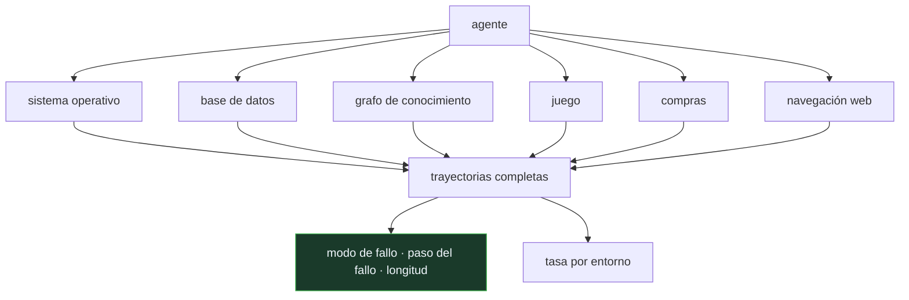

# P117 — AgentBench

> Ruta de operación · «El agente acierta el 35 %». Desagregado va del 16 % al 56 %, y
> uno de cada cuatro fallos es un formato de llamada inválido.

**Nivel:** L3 · **Motor:** `agentops` · **Notebook:** [`P117_agentops.ipynb`](../../../notebooks/papers/P117_agentops.ipynb)
· **Anexo:** [complejidad y coste](../../annexes/A05_COMPLEJIDAD_Y_COSTE.md)

Las cifras concretas de modelos envejecen con cada versión. Lo que permanece es la taxonomía de entornos y el análisis por trayectoria.

## 1. Identificación

| Campo | Valor |
|---|---|
| **Título original** | *AgentBench: Evaluating LLMs as Agents* |
| **Autoría** | Xiao Liu, Hao Yu, Hanchen Zhang, Yifan Xu, Xuanyu Lei y otros |
| **Año** | 2023 |
| **Venue** | arXiv:2308.03688 · ICLR 2024 |
| **Fuente primaria** | [arXiv:2308.03688](https://arxiv.org/abs/2308.03688) |
| **Acceso** | Abierto |
| **Fecha de consulta** | 2026-08-17 |

## 2. Problema anterior

Los agentes se anunciaban con una cifra global de éxito. Esa cifra no dice en qué entornos
sirven, en qué paso se pierden, ni por qué modo fallan — que es exactamente lo que hace falta para
operarlos y para decidir qué arreglar.

Y hay un problema previo: no existía un banco de pruebas que cubriera entornos suficientemente
distintos. Medir en uno solo produce conclusiones que no se trasladan.

## 3. Propuesta

Un banco multi-entorno con ocho escenarios de distinta naturaleza —sistema operativo, base de
datos, grafo de conocimiento, juegos de cartas, razonamiento situado, compras en línea, navegación
web, resolución de tareas domésticas—, y dos decisiones metodológicas:

1. evaluar **por trayectoria** y no solo por resultado final;
2. **analizar los modos de fallo**, no solo contarlos.

La diferencia entre «el agente falló» y «el agente emitió una llamada con formato inválido en el
paso 2» es la diferencia entre una métrica y un plan de trabajo.

## 4. Intuición sin fórmulas

Un examen con una nota global de 5,5. No sabes si el alumno domina la mitad de la materia o si va
bien en todo menos en un tema que suspende. Y sobre todo, no sabes **cómo** falla: si no entiende el
enunciado, si se equivoca en el cálculo o si se queda sin tiempo.

Corregir esas tres cosas exige intervenciones completamente distintas.

**Dónde deja de funcionar la analogía:** un examen tiene respuestas correctas definidas. Muchas
tareas de agente admiten varias soluciones válidas, y decidir si una trayectoria fue correcta es
parte del problema.

## 5. Matemática mínima

No hay formalismo: la aportación es un protocolo de medida. Lo que la miniatura hace visible es
cuánto esconde el agregado.

Sobre 120 trayectorias sintéticas, tasa global **0,35**:

| Entorno | n | Tasa |
|---|---:|---:|
| base de datos | 23 | **0,565** |
| conocimiento | 28 | 0,464 |
| juego | 25 | 0,320 |
| sistema operativo | 19 | 0,211 |
| **compras** | 25 | **0,160** |

Publicar solo el agregado esconde que hay entornos donde el agente sencillamente no sirve.

Y los **78 fallos**, clasificados por modo: formato de llamada inválido **19**, no encuentra la
herramienta 18, bucle repetitivo 16, alucina el resultado 14, se rinde antes de tiempo 11. El modo
dominante —uno de cada cuatro fallos— se arregla con un validador de esquema, no con un modelo
mejor.

**19 de 78** fallos ocurren en el primer tercio de la trayectoria: no son agentes que casi lo
consiguen, son agentes que se pierden al principio.

Y la longitud es una señal operativa: los episodios con éxito duran **7,9** pasos de media y los
que entran en bucle repetitivo, **26,1**. Una trayectoria que se alarga es motivo para cortar antes
de saber el resultado.

<!-- puente:inicio -->
> [!TIP]
> **Puente matemático.** Esta sección da por sabido lo siguiente. Si algo no te suena,
> léelo primero: está explicado una sola vez, en un solo sitio, y sirve para todas las fichas.

| Dónde | Qué necesitas de ahí |
|---|---|
| [**A05 §8** · Checklist antes de creerte una cifra de rendimiento](../../annexes/A05_COMPLEJIDAD_Y_COSTE.md#8-checklist-antes-de-creerte-una-cifra-de-rendimiento) | qué preguntar ante una tasa de éxito de agente antes de aceptarla |
<!-- puente:fin -->

## 6. Arquitectura o flujo



## 7. Qué observar en el paper original

- La **diversidad de los ocho entornos**, y por qué es la aportación principal: un agente bueno en
  base de datos puede ser inútil navegando.
- El análisis de **modos de fallo**, que separa problemas de formato, de razonamiento y de
  planificación. Cada uno se arregla de forma distinta.
- La brecha entre modelos **cerrados y abiertos** que el artículo documenta en 2023 —y que conviene
  releer sabiendo que esa cifra concreta ya ha cambiado varias veces—.
- Los **detalles del protocolo**: límite de pasos, formato de las herramientas, criterio de éxito.
  Son lo que hace comparables dos evaluaciones.

## 8. Evidencia y resultados

El artículo evalúa una veintena de modelos sobre los ocho entornos, con protocolo público y
código abierto.

> Es evidencia empírica sólida y reproducible. Y con una fecha de caducidad explícita: las cifras
> por modelo corresponden a 2023 y hoy no describen el estado del arte.

La miniatura no evalúa ningún agente: genera trayectorias sintéticas con modos de fallo asignados
para exhibir **qué se mide** en AgentOps. Los números no caracterizan a ningún sistema real.

## 9. Impacto

- Estableció la evaluación multi-entorno como norma para agentes, frente a la demostración en un
  único escenario.
- El **análisis de trayectorias** —modo de fallo, paso del fallo, longitud— es la base de lo que hoy
  se llama AgentOps.
- Abrió la línea que siguen τ-bench, [OSWorld](../P106_osworld/README.md) y SWE-bench, cada uno
  profundizando en un tipo de entorno.
- Y aporta al programa el criterio operativo: un agente en producción se monitoriza por trayectoria,
  con la longitud como señal temprana y el modo de fallo como insumo para decidir qué arreglar.

## 10. Limitaciones

1. **Las cifras por modelo envejecen deprisa.** Lo que permanece es la taxonomía y el protocolo.
2. **Clasificar el modo de fallo de una trayectoria real es trabajo manual**, o requiere otro modelo
   haciendo de juez con sus propios sesgos.
3. **Los entornos son simulados** y los reales tienen fricciones —latencia, errores transitorios,
   herramientas que cambian— que el banco no reproduce.
4. **Mide capacidad, no coste**: dos agentes con la misma tasa pueden diferir en un orden de
   magnitud en tokens y en tiempo.
5. **Riesgo de contaminación**: los entornos publicados acaban en los datos de entrenamiento de los
   modelos siguientes.

## 11. Errores comunes

| Error | Corrección |
|---|---|
| «La tasa de éxito global caracteriza a un agente» | Desagregada por entorno va de 0,16 a 0,565 en la miniatura. El agregado esconde que hay entornos donde el agente no sirve. |
| «Un fallo es un fallo» | Uno de cada cuatro es formato de llamada inválido, que se arregla con un validador de esquema. Otros exigen cambiar el modelo o el plan. |
| «Los agentes fallan por poco, al final de la tarea» | 19 de 78 fallos ocurren en el primer tercio de la trayectoria: se pierden al principio. |
| «La longitud de la trayectoria no dice nada hasta el final» | Es una señal temprana: los éxitos duran 7,9 pasos de media y los bucles repetitivos, 26,1. Una trayectoria que se alarga es motivo para cortar. |
| «Un buen resultado en un banco se traslada a producción» | Los entornos son simulados. La latencia, los errores transitorios y las herramientas que cambian de versión no están, y son la mitad del problema real. |

## 12. Relación con trabajos anteriores

- **[P104 WebArena](../P104_webarena/README.md) (2023)** — un entorno web realista, uno de los tipos
  que este banco cubre.
- **[P106 OSWorld](../P106_osworld/README.md) (2024)** — la profundización en un solo entorno, el
  escritorio completo.
- **[P16 Sistemas agentic contemporáneos](../P16_agentic_systems/README.md) (2023)** — memoria,
  reflexión y multiagente: los patrones cuyas trayectorias hay que evaluar.

## 13. Relación con trabajos posteriores

- **Yao et al. (2024)** — τ-bench: agentes en conversaciones con herramientas y reglas de negocio.
  [arXiv:2406.12045](https://arxiv.org/abs/2406.12045)
- **[P107 Dapper](../P107_dapper/README.md) (2010)** — trazar la ejecución de un agente es el mismo
  problema de reconstruir una historia distribuida.
- **[P116 Por qué Johnny no sabe hacer prompts](../P116_gestion_de_prompts/README.md) (2023)** — la
  disciplina de evaluación sin la cual las cifras no significan nada.

## 14. Notebook asociado

[`P117_agentops.ipynb`](../../../notebooks/papers/P117_agentops.ipynb)

**Qué implementa:** la tasa de éxito global frente a la desagregada por entorno, la distribución de modos de fallo, en qué punto de la trayectoria ocurren y la longitud media según el desenlace.

**Qué NO implementa:** las trayectorias son sintéticas y los modos de fallo se asignan por muestreo. Sirven para exhibir qué se mide en AgentOps, no para caracterizar a ningún agente real.

```bash
ai-evolution paper-lab P117 --seed 7
```

## 15. Actividades Bloom

| Nivel | Actividad |
|---|---|
| **Recordar** | Enumera los tipos de entorno que cubre el banco. |
| **Explicar** | Explica qué esconde una tasa de éxito agregada. |
| **Aplicar** | Ejecuta el notebook y localiza el modo de fallo dominante. |
| **Analizar** | Analiza qué intervención distinta exige cada modo de fallo. |
| **Evaluar** | «Nuestro agente acierta el 70 %». Evalúa qué falta para poder interpretarlo. |
| **Crear** | Instrumenta un agente tuyo para registrar modo de fallo, paso del fallo y longitud, y clasifica veinte trayectorias. |

## 16. Autoevaluación

1. ¿Qué aporta evaluar en ocho entornos en lugar de uno?
2. ¿Qué esconde la tasa agregada?
3. ¿Por qué importa el modo de fallo?
4. ¿Qué dice que los fallos ocurran al principio?
5. ¿Qué señal operativa da la longitud de la trayectoria?
6. ¿Qué parte del artículo envejece y qué parte permanece?
7. ¿Qué no mide el banco?

## 17. Respuestas esperadas

1. Que las conclusiones se trasladen. Un agente bueno en base de datos puede ser inútil navegando, y con un solo entorno eso no se ve.
2. La variación entre entornos. En la miniatura va de 0,16 a 0,565 con un agregado de 0,35: hay entornos donde el agente sencillamente no sirve.
3. Porque dice qué arreglar. Un formato de llamada inválido se corrige con un validador de esquema; un bucle repetitivo, con un límite y una detección de repetición.
4. Que no son agentes que casi lo consiguen: se pierden al principio. En la miniatura, 19 de 78 fallos están en el primer tercio de la trayectoria.
5. Una trayectoria que se alarga es motivo para cortar antes de conocer el resultado: los éxitos duran 7,9 pasos de media y los bucles repetitivos, 26,1.
6. Envejecen las cifras por modelo, que son de 2023. Permanecen la taxonomía de entornos, el análisis por trayectoria y los modos de fallo.
7. El coste. Dos agentes con la misma tasa pueden diferir en un orden de magnitud en tokens y en tiempo, y eso decide si son desplegables.

## 18. Fuentes primarias

- Liu, X. et al. (2023). *AgentBench: Evaluating LLMs as Agents*. **arXiv:2308.03688 · ICLR
  2024**. [arxiv.org/abs/2308.03688](https://arxiv.org/abs/2308.03688) · consultado 2026-08-17.
- Yao, S. et al. (2024). *τ-bench: A Benchmark for Tool-Agent-User Interaction*.
  [arXiv:2406.12045](https://arxiv.org/abs/2406.12045) · consultado 2026-08-17.
- Xie, T. et al. (2024). *OSWorld*. [arXiv:2404.07972](https://arxiv.org/abs/2404.07972) ·
  consultado 2026-08-17.

---

[⬅️ Anterior: P116 Por qué Johnny no sabe hacer prompts](../P116_gestion_de_prompts/README.md) ·
[📇 Índice](../../catalog/PAPERS_INDEX.md) ·
[📝 Evaluación](../../../assessments/papers/P117_agentops.md) ·
[🏫 Clase 156 · AgentOps y análisis de trayectorias](../../../classes/part-12-ai-engineering-mlops-llmops-and-agentops/156-agentops-y-analisis-de-trayectorias/README.md) ·
[➡️ Siguiente: P118 Unidades de subpalabra](../P118_bpe/README.md)
