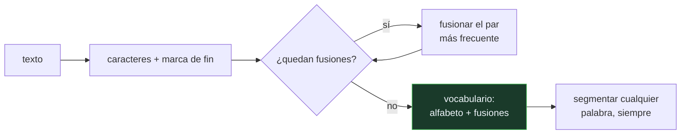

# P118 — Unidades de subpalabra

> Ruta de percepción · Mientras la unidad sea la palabra, siempre llegará una que no
> estaba. Si es más pequeña, el peor caso es deletrear — y deletrear siempre se puede.

**Nivel:** L2 · **Motor:** `bpe` · **Notebook:** [`P118_bpe.ipynb`](../../../notebooks/papers/P118_bpe.ipynb)
· **Anexo:** [complejidad y coste](../../annexes/A05_COMPLEJIDAD_Y_COSTE.md)

## 1. Identificación

| Campo | Valor |
|---|---|
| **Título original** | *Neural Machine Translation of Rare Words with Subword Units* |
| **Autoría** | Rico Sennrich, Barry Haddow, Alexandra Birch |
| **Año** | 2016 |
| **Venue** | ACL 2016, 1715–1725 |
| **Fuente primaria** | [doi:10.18653/v1/P16-1162](https://doi.org/10.18653/v1/P16-1162) |
| **Acceso** | Abierto |
| **Fecha de consulta** | 2026-08-18 |

## 2. Problema anterior

Un modelo con vocabulario de palabras completas tiene una lista fija, y todo lo que no está en
ella se convierte en un único símbolo de «desconocido». Da igual que la palabra sea un nombre
propio, un término técnico o una flexión perfectamente regular: el modelo la ve como el mismo
agujero.

Lo absurdo es que casi siempre **las partes sí estaban**. Si el corpus tiene «caminar» y «cantando»,
el modelo ha visto la raíz `camin` y el sufijo `ando`, y aun así «caminando» le resulta ilegible.
El vocabulario cerrado convierte un problema de composición en uno de cobertura.

## 3. Propuesta

Adaptar la compresión por pares de bytes —un algoritmo de 1994— a la segmentación de texto:

1. Partir cada palabra en caracteres, con una marca de fin de palabra.
2. Contar todos los pares de símbolos adyacentes del corpus.
3. Fusionar el par **más frecuente** en un símbolo nuevo.
4. Repetir un número fijo de veces, `k`.

Ese `k` es la única perilla, y determina el tamaño del vocabulario. Lo importante es lo que queda
al final: el vocabulario contiene el alfabeto completo, así que **cualquier** cadena se puede
segmentar. El peor caso es deletrear, y deletrear siempre se puede.

## 4. Intuición sin fórmulas

Un almacén que solo despacha muebles montados. Si alguien pide una estantería de una medida que no
está en catálogo, la respuesta es «no lo tenemos», aunque el almacén esté lleno de tableros y
tornillos.

Cambiar el catálogo a piezas resuelve el problema entero: cualquier mueble se puede componer, y los
más pedidos siguen estando premontados porque salen más a cuenta.

**Dónde deja de funcionar la analogía:** en el almacén las piezas las diseñó alguien. Aquí las
decide la frecuencia, sin que nadie le diga al algoritmo qué es una raíz o un sufijo.

## 5. Matemática mínima

```text
BPE: partir de caracteres y repetir k veces:
     fusionar el par de símbolos MÁS FRECUENTE del corpus

vocabulario = alfabeto ∪ {símbolos que las k fusiones producen}
              ↑
              el alfabeto está dentro ⇒ cobertura total
```

La miniatura entrena con 220 palabras y prueba con 120:

| | Vocabulario de palabras | BPE con 60 fusiones |
|---|---:|---:|
| tamaño del vocabulario | 100 | **87** |
| palabras/trozos desconocidos | **17** (14,2 %) | **0** |
| piezas por palabra | 1,00 | **2,02** |

Las 17 desconocidas están formadas por raíces y sufijos que el modelo **sí** vio: lo que faltaba era
la combinación. Y el precio de arreglarlo es la longitud: cada palabra ocupa el doble de posiciones
en la secuencia.

Las primeras fusiones son parejas de letras frecuentes —`o</w>`, `or`, `a</w>`—; las últimas ya son
sufijos completos como `ndo</w>`. Nadie programó qué es un sufijo.

<!-- puente:inicio -->
> [!TIP]
> **Puente matemático.** Esta sección da por sabido lo siguiente. Si algo no te suena,
> léelo primero: está explicado una sola vez, en un solo sitio, y sirve para todas las fichas.

| Dónde | Qué necesitas de ahí |
|---|---|
| [**A05 §2** · El cruce: atención frente a recurrencia](../../annexes/A05_COMPLEJIDAD_Y_COSTE.md#2-el-cruce-atención-frente-a-recurrencia) | por qué duplicar la longitud de secuencia no es gratis cuando el coste de atención es cuadrático |
<!-- puente:fin -->

## 6. Arquitectura o flujo



## 7. Qué observar en el paper original

- Que el algoritmo **no es lingüístico**. No hay lista de morfemas ni analizador: hay un contador de
  frecuencias, y eso es lo que lo hace aplicable a idiomas cuya morfología el ingeniero no conoce.
- El experimento sobre **palabras raras**, que es donde el método aporta: la mejora se concentra en
  nombres propios, compuestos y términos que aparecen una o dos veces.
- La discusión sobre **el tamaño del vocabulario** y su relación con la longitud de secuencia. Es el
  único compromiso, y el artículo lo hace explícito.
- Que la idea se toma prestada de la **compresión de datos**, sin ninguna motivación lingüística
  previa. Es un buen ejemplo de resultado que llega de otro campo.

## 8. Evidencia y resultados

El artículo demuestra su tesis con traducción automática: mejoras de BLEU en inglés-alemán e
inglés-ruso, con análisis específico sobre las palabras raras.

> La evidencia es de tarea, no de cobertura: no se limita a mostrar que no hay desconocidos, sino
> que traduce mejor. Eso es lo que convenció al campo.

La miniatura no traduce nada: mide cobertura y longitud sobre un corpus sintético de raíces y
sufijos regulares, para exhibir el mecanismo. En texto real las fusiones frecuentes cruzan fronteras
de morfema y los trozos dejan de ser interpretables.

## 9. Impacto

- Es la tokenización con la que se entrenaron **GPT-2, GPT-3, RoBERTa** y buena parte de los modelos
  posteriores. La variante sobre bytes en vez de caracteres eliminó incluso la necesidad de un
  alfabeto.
- Cerró el problema de la palabra desconocida, que llevaba décadas condicionando el diseño de
  sistemas de lenguaje.
- Llevó directamente a [SentencePiece](../P123_sentencepiece/README.md), que quitó el último
  supuesto que quedaba: que el texto viene partido por espacios.
- Y dejó una consecuencia que hoy se paga en dinero: la factura de un modelo de lenguaje se mide en
  tokens, y cuántos tokens ocupa un texto lo decide este algoritmo.

## 10. Limitaciones

1. **La segmentación no respeta la morfología.** Las fusiones frecuentes cruzan fronteras de
   morfema, y los trozos resultantes no son interpretables ni estables.
2. **Penaliza a los idiomas peor representados** en el corpus de entrenamiento del tokenizador:
   necesitan más piezas por palabra, y por tanto más tokens para decir lo mismo.
3. **Supone texto partido por espacios**, lo que deja fuera al japonés, el chino y el tailandés.
4. **La segmentación voraz por orden de fusión no es óptima**: no da la de mínima longitud.
5. **El tokenizador es parte del modelo.** Cambiarlo invalida los pesos, y eso se olvida con una
   frecuencia notable.

## 11. Errores comunes

| Error | Corrección |
|---|---|
| «Agrandando el vocabulario se acaban las palabras desconocidas» | Se reducen, nunca se eliminan: la cola de palabras raras es infinita. Y cada palabra nueva es una fila más en la matriz de incrustaciones. |
| «Los trozos de BPE son morfemas» | Coinciden a veces y por accidente. El algoritmo solo cuenta frecuencias, y sus fusiones cruzan fronteras de morfema con toda naturalidad. |
| «BPE es preprocesado, no parte del modelo» | Es parte del modelo: cambiar el tokenizador invalida los pesos. Hay que versionarlo con el checkpoint, no con el código de datos. |
| «Un vocabulario más pequeño siempre es mejor» | Se paga en longitud de secuencia. En la miniatura, 87 unidades en vez de 100 palabras cuestan 2,02 piezas por palabra en lugar de 1. |
| «La tokenización trata igual a todos los idiomas» | No: los idiomas peor representados en el corpus del tokenizador necesitan más piezas por palabra, y pagan más tokens por decir lo mismo. |

## 12. Relación con trabajos anteriores

- **[P05 word2vec](../P05_word2vec/README.md) (2013)** — el vocabulario cerrado como supuesto de
  partida, con su matriz de incrustaciones por palabra.
- **[P06 Secuencia a secuencia](../P06_seq2seq/README.md) (2014)** — la arquitectura donde el
  problema de la palabra desconocida era más visible.
- **Gage (1994)** — el algoritmo de compresión del que se toma prestada la idea.

## 13. Relación con trabajos posteriores

- **[P123 SentencePiece](../P123_sentencepiece/README.md) (2018)** — quita el supuesto de los
  espacios y hace la detokenización exacta.
- **Radford et al. (2019)** — BPE sobre bytes en GPT-2: ni siquiera hace falta un alfabeto.
- **Rust et al. (2021)** — cuánto penaliza un tokenizador mal ajustado a un idioma.
  [doi:10.18653/v1/2021.acl-long.243](https://doi.org/10.18653/v1/2021.acl-long.243)

## 14. Notebook asociado

[`P118_bpe.ipynb`](../../../notebooks/papers/P118_bpe.ipynb)

**Qué implementa:** la tasa de palabras desconocidas con vocabulario de palabras frente a la de trozos fuera de vocabulario con BPE, el tamaño de cada vocabulario, las primeras fusiones aprendidas y el coste en piezas por palabra.

**Qué NO implementa:** el corpus es sintético y morfológicamente regular, así que las fusiones caen limpiamente en morfemas. Y no se traduce nada: la tesis del artículo se demuestra con BLEU.

```bash
ai-evolution paper-lab P118 --seed 7
```

## 15. Actividades Bloom

| Nivel | Actividad |
|---|---|
| **Recordar** | Describe los cuatro pasos del algoritmo BPE. |
| **Explicar** | Explica por qué el vocabulario resultante cubre cualquier cadena. |
| **Aplicar** | Ejecuta el notebook y compara las dos tasas de desconocidos. |
| **Analizar** | Analiza el compromiso entre tamaño de vocabulario y longitud de secuencia. |
| **Evaluar** | «Ampliamos el vocabulario y bajó la tasa de desconocidas». Evalúa si eso resuelve el problema. |
| **Crear** | Tokeniza un corpus de tu dominio con dos tamaños de vocabulario y mide piezas por palabra. Comprueba qué pasa con los términos técnicos. |

## 16. Autoevaluación

1. ¿Qué par se fusiona en cada paso?
2. ¿Por qué BPE no puede producir un trozo desconocido?
3. ¿Cuál es la única perilla del método?
4. ¿Qué se paga a cambio de la cobertura total?
5. ¿Son morfemas los trozos que produce?
6. ¿Por qué el tokenizador es parte del modelo?
7. ¿Qué idiomas quedan fuera del supuesto de BPE?

## 17. Respuestas esperadas

1. El par de símbolos adyacentes más frecuente en todo el corpus, contando con la multiplicidad de cada palabra.
2. Porque el alfabeto completo forma parte del vocabulario. En el peor caso, una palabra se segmenta letra a letra, y eso siempre es posible.
3. El número de fusiones, `k`, que determina el tamaño del vocabulario. Todo lo demás lo decide la frecuencia del corpus.
4. Longitud de secuencia. En la miniatura, 2,02 piezas por palabra en vez de 1, y con atención cuadrática eso no es gratis.
5. A veces y por accidente. El algoritmo solo cuenta frecuencias; sus fusiones cruzan fronteras de morfema con naturalidad y los trozos no son estables.
6. Porque los pesos están asociados a un vocabulario concreto. Cambiar el tokenizador invalida las incrustaciones y el modelo deja de significar lo mismo.
7. El japonés, el chino y el tailandés, entre otros: no separan palabras con espacios. Eso lo resuelve SentencePiece.

## 18. Fuentes primarias

- Sennrich, R., Haddow, B. y Birch, A. (2016). *Neural Machine Translation of Rare Words with
  Subword Units*. **ACL 2016**, 1715–1725.
  [doi:10.18653/v1/P16-1162](https://doi.org/10.18653/v1/P16-1162) · consultado 2026-08-18.
- Gage, P. (1994). *A New Algorithm for Data Compression*. **The C Users Journal**.
  [dl.acm.org](https://dl.acm.org/doi/10.5555/177910.177914) · consultado 2026-08-18.
- Kudo, T. y Richardson, J. (2018). *SentencePiece*.
  [doi:10.18653/v1/D18-2012](https://doi.org/10.18653/v1/D18-2012) · consultado 2026-08-18.

---

[⬅️ Anterior: P117 AgentBench](../P117_agentops/README.md) ·
[📇 Índice](../../catalog/PAPERS_INDEX.md) ·
[📝 Evaluación](../../../assessments/papers/P118_bpe.md) ·
[🏫 Clase 073 · Tokenización moderna y vocabularios](../../../classes/part-06-foundation-models-and-llm-engineering/073-tokenizacion-moderna-y-vocabularios/README.md) ·
[➡️ Siguiente: P119 WaveNet](../P119_wavenet/README.md)
