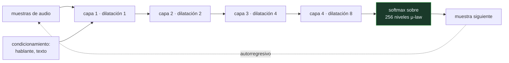

# P119 — WaveNet

> Ruta de percepción · Para ver un segundo de audio harían falta 16 000 capas. Saltando
> huecos que se duplican en cada una, bastan catorce.

**Nivel:** L3 · **Motor:** `wavenet` · **Notebook:** [`P119_wavenet.ipynb`](../../../notebooks/papers/P119_wavenet.ipynb)
· **Anexo:** [complejidad y coste](../../annexes/A05_COMPLEJIDAD_Y_COSTE.md)

## 1. Identificación

| Campo | Valor |
|---|---|
| **Título original** | *WaveNet: A Generative Model for Raw Audio* |
| **Autoría** | Aäron van den Oord, Sander Dieleman, Heiga Zen, Karen Simonyan, Oriol Vinyals, Alex Graves, Nal Kalchbrenner, Andrew Senior, Koray Kavukcuoglu |
| **Año** | 2016 |
| **Venue** | arXiv:1609.03499 |
| **Fuente primaria** | [arXiv:1609.03499](https://arxiv.org/abs/1609.03499) |
| **Acceso** | Abierto |
| **Fecha de consulta** | 2026-08-18 |

## 2. Problema anterior

La síntesis de voz funcionaba pegando trozos de grabaciones reales o generando parámetros que un
vocoder convertía en sonido. Las dos vías tenían techo: la primera sonaba a costura y no se podía
cambiar de voz, la segunda sonaba a robot.

Modelar la forma de onda directamente parecía imposible por una razón de escala. A 16 kHz, un
segundo son 16 000 valores, y una convolución con núcleo de 2 necesita una capa por cada muestra de
contexto. Para ver un segundo harían falta 16 000 capas.

## 3. Propuesta

Dos ideas, ninguna de ellas sobre arquitecturas nuevas:

1. **Convoluciones causales dilatadas.** Cada capa salta huecos que se duplican —1, 2, 4, 8, 16…—,
   de modo que el campo receptivo crece de forma **exponencial** con la profundidad en lugar de
   lineal. La causalidad —la salida en `t` solo depende de entradas hasta `t`— es obligatoria para
   que el modelo sirva para generar.
2. **Cuantización μ-law a 8 bits.** En vez de predecir un valor continuo, se predice una categoría
   entre 256, repartidas logarítmicamente para gastar resolución donde hay señal.

Y una consecuencia de diseño: el modelo se **condiciona**. Con la identidad del hablante genera
voces distintas; con características lingüísticas, habla.

## 4. Intuición sin fórmulas

Buscar en una biblioteca de 16 000 libros. Mirándolos uno a uno, 16 000 pasos. Si en cambio
saltas de 1 en 1, luego de 2 en 2, luego de 4 en 4 —doblando cada vez—, cubres toda la estantería
en catorce saltos.

Y la regla de que solo puedes mirar hacia atrás no es un capricho: si al aprender pudieras mirar el
libro siguiente, al escribir uno nuevo no tendrías dónde mirar.

**Dónde deja de funcionar la analogía:** los saltos dejan huecos. La red los rellena porque cada
capa combina lo que las anteriores ya juntaron, no porque los vea directamente.

## 5. Matemática mínima

```text
Campo receptivo con núcleo 2 y L capas:

    sin dilatar   : 1 + Σᵢ 1     = L + 1          ← LINEAL
    dilatado 2ⁱ   : 1 + Σᵢ 2ⁱ    = 2^L            ← EXPONENCIAL
```

| Capas | Sin dilatar | Dilatado |
|---:|---:|---:|
| 4 | 5 | 16 |
| 8 | 9 | 256 |
| 12 | 13 | **4 096** |

Para cubrir **un segundo a 16 kHz** hacen falta **14 capas** dilatadas frente a **15 999** sin
dilatar: un factor de **1 143×**.

La causalidad se comprueba directamente: un impulso en la muestra 12 solo afecta a las muestras
**12–19**, ninguna anterior.

Y la cuantización μ-law reparte los 256 códigos de forma logarítmica. El 10 % central de la
amplitud —donde vive la voz— se lleva **109 códigos** con μ-law y solo **26** con la lineal:
**4,2× más resolución** donde hace falta, con el mismo presupuesto de 8 bits.

<!-- puente:inicio -->
> [!TIP]
> **Puente matemático.** Esta sección da por sabido lo siguiente. Si algo no te suena,
> léelo primero: está explicado una sola vez, en un solo sitio, y sirve para todas las fichas.

| Dónde | Qué necesitas de ahí |
|---|---|
| [**A05 §1** · Notación O(): qué dice y qué no](../../annexes/A05_COMPLEJIDAD_Y_COSTE.md#1-notación-o-qué-dice-y-qué-no) | la diferencia entre un crecimiento lineal y uno exponencial cuando lo que crece es lo que puedes ver |
<!-- puente:fin -->

## 6. Arquitectura o flujo



## 7. Qué observar en el paper original

- Que la salida es un **softmax sobre 256 categorías**, no una regresión. Tratar la amplitud como
  clase y no como número es una decisión deliberada, y el artículo la justifica.
- El **condicionamiento global y local**: la identidad del hablante frente a las características
  lingüísticas en cada instante. Es lo que convierte el modelo en un sintetizador.
- Las **conexiones residuales y de salto** entre bloques dilatados, que son lo que permite apilar
  decenas de capas sin que el entrenamiento se rompa.
- El reconocimiento explícito de que **generar es lentísimo**: una muestra por paso, 16 000 pasos
  por segundo de audio. El artículo no lo esconde.

## 8. Evidencia y resultados

Evaluación con **opinión media de oyentes humanos** en inglés y mandarín, comparada contra los dos
sistemas dominantes de la época. WaveNet reduce a la mitad la distancia con el habla real.

> Es la métrica correcta para el problema: en síntesis de voz, ninguna pérdida numérica predice
> bien lo que un oyente percibe.

La miniatura no entrena nada. Calcula la geometría de las dilataciones, comprueba la causalidad con
un impulso y mide la aritmética de la cuantización. Lo que no reproduce es lo más caro: generar.

## 9. Impacto

- Cambió la síntesis de voz de golpe, y las asistentes comerciales adoptaron descendientes suyos en
  menos de dos años.
- Las **convoluciones dilatadas** salieron del audio y se usan hoy en series temporales, segmentación
  y modelado de secuencias en general.
- Fue el vocoder de [Tacotron 2](../P122_tacotron/README.md), que es donde el sistema completo
  texto-a-voz alcanzó naturalidad indistinguible de una grabación.
- Y abrió la conversación sobre clonación de voz: cuando sintetizar deja de sonar a máquina, la
  pregunta pasa a ser de quién es esa voz.

## 10. Limitaciones

1. **Generar es secuencial y lentísimo**: una muestra por paso. El artículo original tardaba
   minutos en producir segundos, y eso lo hacía inviable en producción hasta que llegaron las
   variantes paralelas.
2. **El campo receptivo dice qué PUEDE ver el modelo, no qué usa.** Que alcance un segundo no
   significa que el segundo entero influya en la predicción.
3. **Sin condicionamiento produce balbuceo**: sonidos con textura de voz y sin contenido. Lo que lo
   convierte en sintetizador es el condicionamiento, no el modelo generativo.
4. **La cuantización a 8 bits introduce ruido audible**, aceptable pero real, y trabajos posteriores
   volvieron a 16 bits con otras técnicas.
5. **Necesita mucha voz grabada del hablante objetivo**, lo que en su momento limitaba el método a
   quien tuviera un estudio.

## 11. Errores comunes

| Error | Corrección |
|---|---|
| «Dilatar es lo mismo que apilar más capas» | Apilar hace crecer el campo receptivo linealmente; dilatar, exponencialmente. Para un segundo a 16 kHz son 14 capas frente a 15 999. |
| «La causalidad es una restricción menor» | Sin ella el modelo se entrena mirando el futuro y no sirve para generar: al generar no hay futuro que mirar. |
| «Campo receptivo grande significa contexto usado» | Dice qué puede ver, no qué usa. Medir la influencia real exige ablaciones, no aritmética de capas. |
| «μ-law es solo una compresión heredada de la telefonía» | Es una decisión de dónde gastar resolución. En la miniatura da 109 códigos a las amplitudes bajas frente a 26 de la lineal, con los mismos 8 bits. |
| «WaveNet resolvió la síntesis de voz por sí solo» | Genera audio con textura de voz. Para que diga algo hace falta condicionarlo, y el sistema completo llegó con Tacotron 2. |

## 12. Relación con trabajos anteriores

- **[P04 AlexNet](../P04_alexnet/README.md) (2012)** — la convolución como operación central, aquí
  llevada a una dimensión y al tiempo.
- **[P02 Retropropagación](../P02_backpropagation/README.md) (1986)** — el mecanismo que permite
  entrenar decenas de capas apiladas.
- **Yu y Koltun (2016)** — convoluciones dilatadas para contexto multiescala en visión.
  [arXiv:1511.07122](https://arxiv.org/abs/1511.07122)

## 13. Relación con trabajos posteriores

- **[P122 Tacotron 2](../P122_tacotron/README.md) (2018)** — WaveNet como segunda etapa de un
  sistema completo de texto a voz.
- **van den Oord et al. (2018)** — Parallel WaveNet: destilación para generar en paralelo y hacerlo
  desplegable. [arXiv:1711.10433](https://arxiv.org/abs/1711.10433)
- **[P130 VALL-E](../P130_vall_e/README.md) (2023)** — clonar una voz con tres segundos de audio, y
  el problema de identidad que eso plantea.

## 14. Notebook asociado

[`P119_wavenet.ipynb`](../../../notebooks/papers/P119_wavenet.ipynb)

**Qué implementa:** el crecimiento del campo receptivo con y sin dilatación, cuántas capas hacen falta para cubrir un segundo de audio, la comprobación de causalidad con un impulso y el reparto de códigos de la cuantización μ-law frente a la lineal.

**Qué NO implementa:** no se entrena ni se genera nada. El coste real de WaveNet está en producir muestra a muestra, que es justamente lo que la miniatura no hace.

```bash
ai-evolution paper-lab P119 --seed 7
```

## 15. Actividades Bloom

| Nivel | Actividad |
|---|---|
| **Recordar** | Escribe la fórmula del campo receptivo con dilatación exponencial. |
| **Explicar** | Explica por qué la convolución tiene que ser causal. |
| **Aplicar** | Ejecuta el notebook y comprueba la causalidad con el impulso. |
| **Analizar** | Analiza por qué μ-law da más resolución en las amplitudes pequeñas. |
| **Evaluar** | «El modelo tiene un campo receptivo de un segundo, luego usa un segundo de contexto». Evalúa la afirmación. |
| **Crear** | Calcula el campo receptivo de una red convolucional que uses y compáralo con la longitud real de tus entradas. |

## 16. Autoevaluación

1. ¿Cómo crece el campo receptivo con dilatación exponencial?
2. ¿Cuántas capas hacen falta para un segundo a 16 kHz?
3. ¿Qué garantiza la causalidad?
4. ¿Por qué la salida es un softmax y no una regresión?
5. ¿Qué aporta la cuantización μ-law?
6. ¿Qué hace falta para que WaveNet diga algo?
7. ¿Cuál era su gran problema práctico?

## 17. Respuestas esperadas

1. Como 2 elevado al número de capas, frente al crecimiento lineal de una convolución sin dilatar. Con 12 capas, 4 096 muestras frente a 13.
2. Catorce dilatadas, frente a 15 999 sin dilatar: un factor de 1 143×.
3. Que la salida en el instante `t` solo dependa de entradas hasta `t`. Sin eso, el modelo se entrenaría mirando el futuro y al generar no habría futuro que mirar.
4. Porque trata la amplitud como una categoría entre 256 en vez de como un número. Eso permite distribuciones multimodales, que una regresión no captura.
5. Reparte los 256 niveles logarítmicamente. El 10 % central de la amplitud se lleva 109 códigos frente a 26 de la lineal, con el mismo presupuesto de 8 bits.
6. Condicionamiento. Sin él produce balbuceo con textura de voz. Con características lingüísticas y la identidad del hablante, habla.
7. La generación secuencial: una muestra por paso, 16 000 por segundo de audio. Eso lo hacía inviable hasta que llegaron las variantes paralelas.

## 18. Fuentes primarias

- van den Oord, A. et al. (2016). *WaveNet: A Generative Model for Raw Audio*.
  **arXiv:1609.03499**. [arxiv.org/abs/1609.03499](https://arxiv.org/abs/1609.03499) ·
  consultado 2026-08-18.
- Yu, F. y Koltun, V. (2016). *Multi-Scale Context Aggregation by Dilated Convolutions*.
  [arXiv:1511.07122](https://arxiv.org/abs/1511.07122) · consultado 2026-08-18.
- Shen, J. et al. (2018). *Natural TTS Synthesis by Conditioning WaveNet on Mel Spectrogram
  Predictions*. [doi:10.1109/ICASSP.2018.8461368](https://doi.org/10.1109/ICASSP.2018.8461368) ·
  consultado 2026-08-18.

---

[⬅️ Anterior: P118 Unidades de subpalabra](../P118_bpe/README.md) ·
[📇 Índice](../../catalog/PAPERS_INDEX.md) ·
[📝 Evaluación](../../../assessments/papers/P119_wavenet.md) ·
[🏫 Clase 068 · Síntesis de voz y clonación responsable](../../../classes/part-05-language-vision-audio-and-multimodal-ai/068-sintesis-de-voz-y-clonacion-responsable/README.md) ·
[➡️ Siguiente: P120 Redes convolucionales de grafo](../P120_gcn/README.md)
