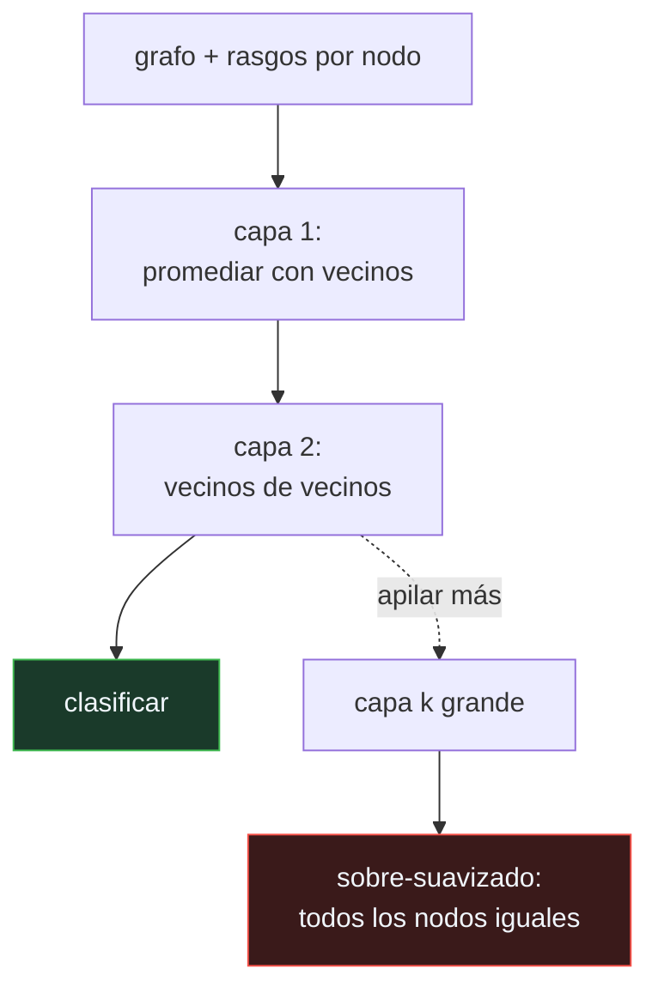

# P120 — Redes convolucionales de grafo

> Ruta de percepción · Seis nodos etiquetados de ciento veinte. Los rasgos no bastan,
> pero cada nodo tiene vecinos, y eso convierte seis etiquetas en información global.

**Nivel:** L2 · **Motor:** `gcn` · **Notebook:** [`P120_gcn.ipynb`](../../../notebooks/papers/P120_gcn.ipynb)
· **Anexo:** [álgebra y geometría](../../annexes/A01_ALGEBRA_Y_GEOMETRIA.md)

## 1. Identificación

| Campo | Valor |
|---|---|
| **Título original** | *Semi-Supervised Classification with Graph Convolutional Networks* |
| **Autoría** | Thomas N. Kipf, Max Welling |
| **Año** | 2017 |
| **Venue** | ICLR 2017 · arXiv:1609.02907 |
| **Fuente primaria** | [arXiv:1609.02907](https://arxiv.org/abs/1609.02907) |
| **Acceso** | Abierto |
| **Fecha de consulta** | 2026-08-18 |

## 2. Problema anterior

Muchos datos importantes son grafos: redes de citas, redes sociales, moléculas, grafos de
dependencias. Y en casi todos, etiquetar es caro: se tienen unas decenas de nodos anotados sobre
miles.

Las soluciones previas se repartían en dos extremos. Los métodos espectrales eran costosos y
dependían de la descomposición del grafo completo, lo que impedía generalizar. Los métodos basados
en rasgos ignoraban la estructura, y con pocas etiquetas eso deja al clasificador sin nada.

Nadie estaba usando la información más obvia: **quién es vecino de quién**.

## 3. Propuesta

Una aproximación de primer orden de la convolución espectral que se reduce a algo que cabe en una
línea: **promediar los rasgos de cada nodo con los de sus vecinos**, normalizado por el grado, y
pasar el resultado por una transformación lineal y una no linealidad.

```text
H' = σ( D^(-1/2) ·  · D^(-1/2) · H · W )      con  = A + I
```

La matriz de adyacencia lleva la identidad sumada para que cada nodo se incluya a sí mismo. Apilar
`k` capas equivale a mirar a `k` saltos de distancia. Y el artículo es explícito en que **dos o tres
capas bastan**.

## 4. Intuición sin fórmulas

Un pueblo donde quieres saber a qué se dedica cada familia y solo tienes seis respuestas. Pero
sabes quién se junta con quién.

Preguntando a los vecinos de cada casa y promediando lo que dicen, las seis respuestas se propagan:
al segundo salto ya cubres el pueblo entero.

**Dónde deja de funcionar la analogía:** si sigues propagando indefinidamente, todo el pueblo acaba
dando la misma respuesta promedio y dejas de distinguir barrios. Ese es el sobre-suavizado, y es
exactamente lo que ocurre al apilar capas.

## 5. Matemática mínima

```text
Una capa:  H' = σ( D^(-1/2) · Â · D^(-1/2) · H · W )

    Â = A + I     ← el nodo se incluye a sí mismo
    D             ← matriz diagonal de grados, para normalizar

k capas = información a k saltos
```

La miniatura usa 120 nodos en 3 comunidades y **solo 6 etiquetados** (5 %):

| Capas de propagación | Exactitud |
|---:|---:|
| 0 (solo rasgos) | 0,447 |
| 1 | 0,886 |
| **3** | **1,000** |
| 10 | 0,921 |
| 20 | **0,377** |

Con 20 capas queda **peor que no propagar** y cerca del azar (0,333). La causa se ve en la
separación entre comunidades, que se hunde de **0,75** a **0,005**: un colapso de **150×**.

Ese colapso solo hace daño porque el motor incluye un **suelo de precisión** de ±0,02, como tendría
cualquier sistema real. Sin él, un clasificador ideal resolvería diferencias arbitrariamente
pequeñas y el sobre-suavizado no se vería.

<!-- puente:inicio -->
> [!TIP]
> **Puente matemático.** Esta sección da por sabido lo siguiente. Si algo no te suena,
> léelo primero: está explicado una sola vez, en un solo sitio, y sirve para todas las fichas.

| Dónde | Qué necesitas de ahí |
|---|---|
| [**A01 §4** · Matrices como transformaciones](../../annexes/A01_ALGEBRA_Y_GEOMETRIA.md#4-matrices-como-transformaciones) | qué le hace a un conjunto de vectores multiplicar repetidamente por la misma matriz, que es lo que ocurre al apilar capas |
<!-- puente:fin -->

## 6. Arquitectura o flujo



## 7. Qué observar en el paper original

- La **derivación** desde la convolución espectral hasta la regla de una línea. El valor del
  artículo está tanto en el resultado como en mostrar que se puede simplificar tanto.
- El truco de la **renormalización** —sumar la identidad a la adyacencia— y por qué sin él los
  valores propios se desbordan al apilar capas.
- Que el modelo se entrena **de extremo a extremo con las pocas etiquetas disponibles**, sin ninguna
  regularización explícita basada en el grafo. La estructura entra por la arquitectura.
- Los resultados en **Cora, Citeseer y Pubmed**, que se convirtieron en el banco de pruebas
  estándar del área durante años — con los problemas que eso acabó teniendo.

## 8. Evidencia y resultados

Experimentos en redes de citas y en un grafo de conocimiento, con márgenes claros sobre los
métodos previos y un coste de entrenamiento mucho menor.

> La evidencia es sólida para la época, pero los conjuntos son pequeños y con una división fija que
> trabajos posteriores demostraron que sobreestimaba las diferencias entre métodos.

La miniatura no entrena pesos: propaga y clasifica por centroide. Sirve para exhibir el mecanismo y
el sobre-suavizado, no para reproducir las cifras del artículo.

## 9. Impacto

- Es el artículo que popularizó las redes neuronales de grafo y las convirtió en un área con
  congresos propios.
- Su regla de propagación es el punto de partida de casi todo lo que vino después: GraphSAGE, GAT,
  paso de mensajes como marco general.
- Se aplica hoy en recomendación, descubrimiento de fármacos, detección de fraude y análisis de
  dependencias de software.
- Y dejó un problema abierto que sigue vivo: **por qué no se pueden apilar capas**, que es la
  pregunta que separa a las redes de grafo de las convolucionales profundas.

## 10. Limitaciones

1. **Supone homofilia**: que los vecinos tienden a compartir clase. En grafos heterófilos,
   propagar **empeora** el resultado.
2. **No se pueden apilar capas.** Más de tres y el sobre-suavizado destruye la señal, como muestra
   la miniatura.
3. **Es transductivo en su formulación original**: necesita el grafo completo al entrenar, y no
   aplica directamente a nodos nuevos.
4. **Escala mal**: la normalización exige conocer los grados de todo el grafo, lo que complica el
   entrenamiento por lotes.
5. **Los bancos de prueba clásicos eran demasiado pequeños** y su división fija exageraba las
   diferencias entre métodos. Buena parte de las mejoras publicadas sobre ellos no se sostuvo.

## 11. Errores comunes

| Error | Corrección |
|---|---|
| «Más capas de grafo capturan más contexto» | Capturan más saltos y borran la señal. En la miniatura, 20 capas dan 0,377: peor que no propagar (0,447) y cerca del azar. |
| «Propagar siempre ayuda» | Solo si los vecinos tienden a compartir clase. En grafos heterófilos, promediar con los vecinos mete ruido en lugar de señal. |
| «El sobre-suavizado es un problema de optimización» | Es geométrico: multiplicar repetidamente por la matriz de propagación colapsa todas las representaciones hacia el mismo punto. |
| «Con pocas etiquetas no se puede hacer nada» | Con 6 etiquetas de 120 nodos —el 5 %— la miniatura llega a exactitud perfecta. La información estaba en la estructura, no en más etiquetas. |
| «Un GCN se aplica a cualquier grafo nuevo» | En su formulación original es transductivo: la normalización necesita el grafo completo. GraphSAGE y GAT resolvieron eso después. |

## 12. Relación con trabajos anteriores

- **[P02 Retropropagación](../P02_backpropagation/README.md) (1986)** — el entrenamiento de extremo
  a extremo que hace viable aprender los pesos de cada capa.
- **[P04 AlexNet](../P04_alexnet/README.md) (2012)** — la convolución sobre rejillas regulares, que
  es el caso particular que aquí se generaliza.
- **[P53 PCA](../P53_pca/README.md) (1901)** — la intuición de que la estructura de los datos vive
  en un espacio de menor dimensión.

## 13. Relación con trabajos posteriores

- **[P124 GAT](../P124_gat/README.md) (2018)** — pesar a cada vecino en vez de promediarlos por
  igual.
- **Gilmer et al. (2017)** — paso de mensajes como marco que unifica el área.
  [arXiv:1704.01212](https://arxiv.org/abs/1704.01212)
- **Li et al. (2018)** — el análisis formal de por qué apilar capas de GCN destruye la señal.
  [arXiv:1801.07606](https://arxiv.org/abs/1801.07606)

## 14. Notebook asociado

[`P120_gcn.ipynb`](../../../notebooks/papers/P120_gcn.ipynb)

**Qué implementa:** la exactitud con solo el 5 % de nodos etiquetados en función del número de capas de propagación, y la distancia entre los centros de las comunidades, que es lo que mide el sobre-suavizado.

**Qué NO implementa:** no hay pesos entrenados: se propaga y se clasifica por centroide. Y el grafo tiene comunidades muy limpias; en grafos reales la homofilia es mucho más débil.

```bash
ai-evolution paper-lab P120 --seed 7
```

## 15. Actividades Bloom

| Nivel | Actividad |
|---|---|
| **Recordar** | Escribe la regla de propagación de una capa de GCN. |
| **Explicar** | Explica por qué se suma la identidad a la matriz de adyacencia. |
| **Aplicar** | Ejecuta el notebook y localiza el número óptimo de capas. |
| **Analizar** | Analiza por qué el sobre-suavizado necesita un suelo de precisión para hacer daño. |
| **Evaluar** | «Nuestro grafo es grande, usaremos diez capas». Evalúa la decisión. |
| **Crear** | Mide la fracción de aristas que unen nodos de la misma clase en un grafo tuyo y decide si propagar tiene sentido. |

## 16. Autoevaluación

1. ¿Qué hace una capa de GCN?
2. ¿Por qué se suma la identidad a la adyacencia?
3. ¿Cuántas capas conviene apilar?
4. ¿Qué es el sobre-suavizado?
5. ¿Qué supuesto sobre el grafo hace falta para que propagar ayude?
6. ¿Por qué el sobre-suavizado no se ve sin un suelo de precisión?
7. ¿Qué significa que el modelo sea transductivo?

## 17. Respuestas esperadas

1. Promediar los rasgos de cada nodo con los de sus vecinos, normalizado por el grado, y aplicar una transformación lineal y una no linealidad.
2. Para que cada nodo se incluya a sí mismo en el promedio. Sin eso, un nodo perdería su propia información en cada capa.
3. Dos o tres. El propio artículo lo dice, y la miniatura lo confirma: el óptimo está en 3 y a partir de ahí empeora.
4. El colapso de todas las representaciones hacia el mismo punto al propagar repetidamente. En la miniatura, la separación entre comunidades cae de 0,75 a 0,005.
5. Homofilia: que los vecinos tiendan a compartir clase. En grafos heterófilos, propagar empeora el resultado.
6. Porque colapsar la escala no cambia el orden relativo de los nodos, y un clasificador ideal resolvería diferencias arbitrariamente pequeñas. Ningún sistema real lo hace.
7. Que necesita el grafo completo al entrenar, porque la normalización depende de los grados. No se aplica directamente a nodos que no se vieron.

## 18. Fuentes primarias

- Kipf, T. N. y Welling, M. (2017). *Semi-Supervised Classification with Graph Convolutional
  Networks*. **ICLR 2017**. [arxiv.org/abs/1609.02907](https://arxiv.org/abs/1609.02907) ·
  consultado 2026-08-18.
- Gilmer, J. et al. (2017). *Neural Message Passing for Quantum Chemistry*.
  [arXiv:1704.01212](https://arxiv.org/abs/1704.01212) · consultado 2026-08-18.
- Li, Q., Han, Z. y Wu, X. (2018). *Deeper Insights into Graph Convolutional Networks for
  Semi-Supervised Learning*. [arXiv:1801.07606](https://arxiv.org/abs/1801.07606) ·
  consultado 2026-08-18.

---

[⬅️ Anterior: P119 WaveNet](../P119_wavenet/README.md) ·
[📇 Índice](../../catalog/PAPERS_INDEX.md) ·
[📝 Evaluación](../../../assessments/papers/P120_gcn.md) ·
[🏫 Clase 056 · Graph Neural Networks](../../../classes/part-04-neural-networks-and-deep-learning/056-graph-neural-networks/README.md) ·
[➡️ Siguiente: P121 MobileNets](../P121_mobilenets/README.md)
