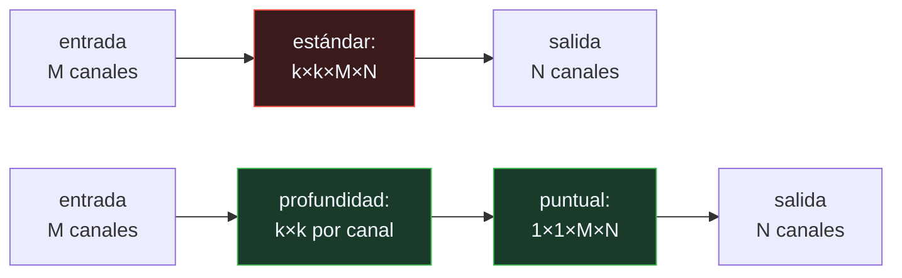

# P121 — MobileNets

> Ruta de percepción · Una convolución filtra el espacio y mezcla canales a la vez.
> Separarlas en dos pasos cuesta ocho veces menos y produce casi lo mismo.

**Nivel:** L2 · **Motor:** `mobilenets` · **Notebook:** [`P121_mobilenets.ipynb`](../../../notebooks/papers/P121_mobilenets.ipynb)
· **Anexo:** [complejidad y coste](../../annexes/A05_COMPLEJIDAD_Y_COSTE.md)

## 1. Identificación

| Campo | Valor |
|---|---|
| **Título original** | *MobileNets: Efficient Convolutional Neural Networks for Mobile Vision Applications* |
| **Autoría** | Andrew G. Howard, Menglong Zhu, Bo Chen, Dmitry Kalenichenko, Weijun Wang, Tobias Weyand, Marco Andreetto, Hartwig Adam |
| **Año** | 2017 |
| **Venue** | arXiv:1704.04861 |
| **Fuente primaria** | [arXiv:1704.04861](https://arxiv.org/abs/1704.04861) |
| **Acceso** | Abierto |
| **Fecha de consulta** | 2026-08-18 |

## 2. Problema anterior

Las redes de visión que funcionaban se habían construido suponiendo un centro de datos detrás. En
un teléfono, una cámara de seguridad o un vehículo, el presupuesto es de milivatios y
milisegundos, y hay que responder sin red.

El problema no era solo que las redes fueran grandes: era que **no había forma sistemática de
elegir dónde recortar**. Cada equipo improvisaba su versión reducida, sin un marco que dijera qué se
pierde por cada unidad de cómputo ahorrada.

## 3. Propuesta

Descomponer la convolución estándar en dos operaciones consecutivas:

1. **Convolución en profundidad**: un filtro espacial por canal, sin mezclarlos.
2. **Convolución puntual** de 1×1: mezcla los canales, sin mirar el espacio.

Juntas hacen lo mismo que una convolución estándar y cuestan una fracción. Y encima de eso, dos
hiperparámetros globales que parametrizan la familia entera:

- **multiplicador de anchura** `α`: reduce los canales de todas las capas;
- **multiplicador de resolución** `ρ`: reduce el tamaño de la entrada.

Lo que se publica no es un modelo: es una **familia con dos perillas** donde el ingeniero elige el
punto que le cabe.

## 4. Intuición sin fórmulas

Un taller donde cada operario corta y pinta cada pieza. Reorganizarlo en dos fases —unos cortan
todas las piezas, otros las pintan— produce lo mismo con mucho menos trabajo repetido, porque cada
especialista hace una sola cosa.

**Dónde deja de funcionar la analogía:** en el taller las dos fases son equivalentes al trabajo
original. Aquí no del todo: la separación pierde algo de capacidad expresiva, y el artículo mide
cuánto.

## 5. Matemática mínima

```text
Convolución estándar   : k² · M · N · S²
Convolución separable  : k² · M · S²   +   M · N · S²
                         └ profundidad ┘   └ puntual ┘

    razón = 1/N + 1/k²        ← con k = 3, el techo es 9×
```

La miniatura mide una red de cinco capas:

| | Millones de multiplicaciones |
|---|---:|
| convolución estándar | **935,7** |
| convolución separable | **111,1** |
| **razón** | **8,42×** |

La fórmula predice **0,1131** para 512 canales y la capa medida da **0,1131**. El término dominante
es `1/k²`, así que el ahorro **se satura cerca de 9×** por mucho que crezcan los canales: es un
factor constante, no un orden de magnitud creciente.

El multiplicador de anchura da la segunda perilla, y el coste cae aproximadamente con `α²`:

| α | Fracción del coste |
|---:|---:|
| 0,75 | 0,574 |
| 0,50 | **0,265** |
| 0,25 | **0,075** |

<!-- puente:inicio -->
> [!TIP]
> **Puente matemático.** Esta sección da por sabido lo siguiente. Si algo no te suena,
> léelo primero: está explicado una sola vez, en un solo sitio, y sirve para todas las fichas.

| Dónde | Qué necesitas de ahí |
|---|---|
| [**A05 §6** · La cuenta que casi nadie hace: inferencia](../../annexes/A05_COMPLEJIDAD_Y_COSTE.md#6-la-cuenta-que-casi-nadie-hace-inferencia) | por qué el coste que importa en el borde es el de inferencia, y por qué contar operaciones no es contar tiempo |
<!-- puente:fin -->

## 6. Arquitectura o flujo



## 7. Qué observar en el paper original

- La **tabla de compromisos**: exactitud frente a operaciones para cada valor de `α` y `ρ`. Es lo
  que convierte el artículo en una herramienta de decisión y no en un modelo más.
- El **reparto del cómputo por tipo de capa**: la mayor parte se va en las convoluciones de 1×1, que
  además son las que mejor aprovecha el hardware.
- Los **casos de aplicación** que el artículo recorre —detección, geolocalización, atributos de
  rostro— para demostrar que la familia es de propósito general.
- La honestidad sobre el **techo del método**: el ahorro se satura, y el artículo lo dice en la
  propia fórmula.

## 8. Evidencia y resultados

Experimentos en ImageNet con la curva completa de exactitud frente a operaciones y frente a
parámetros, más resultados en varias tareas derivadas.

> Es la evidencia adecuada: no afirma ser el mejor modelo, sino ofrecer el mejor compromiso a
> presupuesto dado. Y lo demuestra con la curva, no con un punto.

La miniatura cuenta multiplicaciones-acumulaciones sobre una maqueta de cinco capas. No mide
exactitud ni tiempo, que son la otra mitad del argumento.

## 9. Impacto

- La **convolución separable** es hoy estándar en cualquier arquitectura pensada para dispositivos,
  y aparece también en modelos grandes.
- Inauguró la línea de trabajo sobre arquitecturas eficientes: MobileNetV2 y V3, EfficientNet, y la
  búsqueda automática de arquitecturas bajo restricción de latencia.
- Hizo posible la visión por computador en el teléfono sin conexión, con las consecuencias de
  privacidad que eso tiene: los datos no salen del dispositivo.
- Y estableció la costumbre de **publicar una familia con perillas explícitas** en lugar de un único
  modelo, que es hoy la norma.

## 10. Limitaciones

1. **Contar operaciones no es medir tiempo.** La convolución en profundidad aprovecha peor la
   memoria que la estándar, y un modelo con 9× menos operaciones puede ir solo 3× más rápido.
2. **El ahorro tiene techo**: se satura cerca de `k²`, es decir 9× con núcleos de 3×3. No hay
   ganancia adicional por crecer.
3. **Hay pérdida de exactitud**, pequeña pero real, y crece según se aprieta `α`.
4. **Los multiplicadores son globales**: aplican el mismo recorte a todas las capas, cuando algunas
   toleran mucho más que otras. La búsqueda automática de arquitecturas lo resolvió después.
5. **No cubre la cuantización**, que en el borde suele aportar tanto como la arquitectura y es
   ortogonal a todo esto.

## 11. Errores comunes

| Error | Corrección |
|---|---|
| «Menos operaciones significa proporcionalmente menos tiempo» | La convolución en profundidad aprovecha mucho peor la memoria. El ahorro medido en tiempo es bastante menor que el ahorro en operaciones. |
| «El ahorro crece con el número de canales» | El término dominante es 1/k², no 1/N. Con núcleos de 3×3 el ahorro se satura cerca de 9× por muchos canales que haya. |
| «MobileNet es un modelo» | Es una familia parametrizada por dos multiplicadores. La aportación es la curva de compromisos, no un punto de ella. |
| «La separación es equivalente a la convolución estándar» | No del todo: pierde capacidad expresiva. El artículo mide cuánto, y es poco, pero no es cero. |
| «Para el borde basta con elegir una arquitectura eficiente» | La cuantización suele aportar tanto como la arquitectura, y es ortogonal. Este artículo no la cubre. |

## 12. Relación con trabajos anteriores

- **[P04 AlexNet](../P04_alexnet/README.md) (2012)** — la convolución estándar que aquí se
  descompone.
- **[P45 Destilación](../P45_distillation/README.md) (2015)** — la otra vía para reducir un modelo:
  transferir a uno pequeño en vez de rediseñarlo.
- **[P44 ResNet](../P44_resnet/README.md) (2015)** — la profundidad que hizo falta acotar cuando el
  presupuesto pasó a ser el problema.

## 13. Relación con trabajos posteriores

- **Sandler et al. (2018)** — MobileNetV2, con bloques residuales invertidos.
  [arXiv:1801.04381](https://arxiv.org/abs/1801.04381)
- **Jacob et al. (2018)** — cuantización entera para inferencia, la pieza que falta aquí.
  [arXiv:1712.05877](https://arxiv.org/abs/1712.05877)
- **Tan y Le (2019)** — EfficientNet: escalar anchura, profundidad y resolución de forma
  coordinada. [arXiv:1905.11946](https://arxiv.org/abs/1905.11946)

## 14. Notebook asociado

[`P121_mobilenets.ipynb`](../../../notebooks/papers/P121_mobilenets.ipynb)

**Qué implementa:** el coste en multiplicaciones de la convolución estándar frente a la separable capa por capa, la comprobación de la fórmula 1/N + 1/k², y cómo escala el coste con el multiplicador de anchura.

**Qué NO implementa:** se cuentan operaciones, no milisegundos, y no se mide exactitud. Las dos cosas son la otra mitad del argumento del artículo.

```bash
ai-evolution paper-lab P121 --seed 7
```

## 15. Actividades Bloom

| Nivel | Actividad |
|---|---|
| **Recordar** | Escribe el coste de la convolución estándar y el de la separable. |
| **Explicar** | Explica por qué el ahorro tiene un techo. |
| **Aplicar** | Ejecuta el notebook y comprueba la fórmula contra la medición. |
| **Analizar** | Analiza por qué el ahorro en operaciones no se traduce en el mismo ahorro en tiempo. |
| **Evaluar** | «Bajamos las operaciones 9×, luego irá 9× más rápido». Evalúa la afirmación. |
| **Crear** | Calcula las multiplicaciones de un modelo que despliegues y estima el ahorro de separar sus convoluciones. Contrástalo con una medición real de latencia. |

## 16. Autoevaluación

1. ¿En qué dos operaciones se descompone la convolución?
2. ¿Cuál es la fórmula del ahorro?
3. ¿Por qué se satura cerca de 9×?
4. ¿Qué hace el multiplicador de anchura?
5. ¿Por qué el ahorro en tiempo es menor que el ahorro en operaciones?
6. ¿Qué se publica exactamente en este artículo?
7. ¿Qué técnica complementaria no cubre?

## 17. Respuestas esperadas

1. Una convolución en profundidad —un filtro espacial por canal, sin mezclar— y una convolución puntual de 1×1 que mezcla los canales sin mirar el espacio.
2. `1/N + 1/k²`, donde N son los canales de salida y k el tamaño del núcleo.
3. Porque el término dominante es `1/k²` y no depende de los canales. Con k = 3, el límite es 9× por mucho que N crezca.
4. Reduce los canales de todas las capas por un factor α. El coste cae aproximadamente con α²: con α = 0,5, al 0,265 del total.
5. Porque la convolución en profundidad aprovecha mucho peor la localidad de memoria que la estándar, y el hardware está optimizado para la segunda.
6. Una familia de modelos parametrizada por dos multiplicadores, con la curva completa de exactitud frente a coste. No un modelo concreto.
7. La cuantización, que en el borde suele aportar tanto como la arquitectura y es ortogonal a la separación de convoluciones.

## 18. Fuentes primarias

- Howard, A. G. et al. (2017). *MobileNets: Efficient Convolutional Neural Networks for Mobile
  Vision Applications*. **arXiv:1704.04861**.
  [arxiv.org/abs/1704.04861](https://arxiv.org/abs/1704.04861) · consultado 2026-08-18.
- Sandler, M. et al. (2018). *MobileNetV2: Inverted Residuals and Linear Bottlenecks*.
  [arXiv:1801.04381](https://arxiv.org/abs/1801.04381) · consultado 2026-08-18.
- Jacob, B. et al. (2018). *Quantization and Training of Neural Networks for Efficient
  Integer-Arithmetic-Only Inference*. [arXiv:1712.05877](https://arxiv.org/abs/1712.05877) ·
  consultado 2026-08-18.

---

[⬅️ Anterior: P120 Redes convolucionales de grafo](../P120_gcn/README.md) ·
[📇 Índice](../../catalog/PAPERS_INDEX.md) ·
[📝 Evaluación](../../../assessments/papers/P121_mobilenets.md) ·
[🏫 Clase 071 · Sensores, series y percepción en el borde](../../../classes/part-05-language-vision-audio-and-multimodal-ai/071-sensores-series-y-percepcion-en-el-borde/README.md) ·
[➡️ Siguiente: P122 Tacotron 2](../P122_tacotron/README.md)
