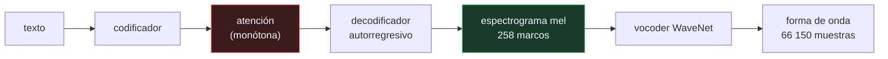

# P122 — Tacotron 2

> Ruta de percepción · Nadie predice 66 150 muestras una a una desde el texto. Pero 258
> marcos de espectrograma sí, y de ahí a la onda ya hay quien sabe.

**Nivel:** L2 · **Motor:** `tacotron` · **Notebook:** [`P122_tacotron.ipynb`](../../../notebooks/papers/P122_tacotron.ipynb)
· **Anexo:** [complejidad y coste](../../annexes/A05_COMPLEJIDAD_Y_COSTE.md)

## 1. Identificación

| Campo | Valor |
|---|---|
| **Título original** | *Natural TTS Synthesis by Conditioning WaveNet on Mel Spectrogram Predictions* |
| **Autoría** | Jonathan Shen, Ruoming Pang, Ron J. Weiss, Mike Schuster, Navdeep Jaitly y otros |
| **Año** | 2018 |
| **Venue** | ICASSP 2018, 4779–4783 |
| **Fuente primaria** | [doi:10.1109/ICASSP.2018.8461368](https://doi.org/10.1109/ICASSP.2018.8461368) |
| **Acceso** | Restringido |
| **Fecha de consulta** | 2026-08-18 |

## 2. Problema anterior

[WaveNet](../P119_wavenet/README.md) demostró que se puede generar audio con calidad de voz real,
pero para que diga algo hay que condicionarlo. Y el condicionamiento que usaba venía de un sistema
de síntesis tradicional: duraciones, fonemas y frecuencia fundamental calculados a mano por un
componente lingüístico complejo.

Ir directamente del texto a la forma de onda tampoco funciona: tres segundos de audio son decenas
de miles de pasos autorregresivos, y ningún modelo con atención puede alinear una frase de doce
caracteres contra una secuencia de esa longitud.

## 3. Propuesta

Partir el problema en dos etapas con una **interfaz explícita**:

```text
texto ──[atención]──▶ espectrograma mel ──[vocoder]──▶ forma de onda
        etapa 1                interfaz               etapa 2
```

La primera etapa es una red con atención que predice el espectrograma mel, marco a marco. La segunda
es un WaveNet condicionado con ese espectrograma, que produce la forma de onda.

La elección del espectrograma mel como interfaz es la decisión de diseño. No es una representación
cualquiera: comprime la **longitud de secuencia** en dos órdenes de magnitud, que es lo que hace
tratable la atención. Y como es una interfaz explícita, cada etapa se entrena y se sustituye por
separado.

## 4. Intuición sin fórmulas

Dictar un texto por teléfono a alguien que escribe a mano. No dictas trazo a trazo: dictas
palabras, y la persona que escribe ya sabe cómo se dibuja cada letra.

El espectrograma es esa capa intermedia: lo bastante detallada para determinar el sonido, lo
bastante compacta para que alguien pueda producirla sin perderse.

**Dónde deja de funcionar la analogía:** quien escribe sabe dibujar letras porque aprendió aparte.
Aquí el vocoder también se entrena, y sobre espectrogramas reales — no sobre los que la primera
etapa predice, que es una de las fuentes de problemas.

## 5. Matemática mínima

```text
3 s a 22 050 Hz = 66 150 muestras

Espectrograma mel: salto 256, 80 bandas
    → 258 marcos × 80 bandas = 20 640 valores
```

| Qué se comprime | Factor |
|---|---:|
| número de **valores** | 3,2× |
| número de **pasos de tiempo** | **256×** |

La compresión de datos es modesta. La que importa es la de **pasos**: el modelo es autorregresivo,
y predecir 258 marcos es tratable mientras que predecir 66 150 muestras una a una no lo es. El mel
no ahorra memoria — ahorra longitud de secuencia.

Y la atención tiene que ser **monótona**. La miniatura lo comprueba con dos alineaciones:

| Alineación | Dice |
|---|---|
| avanza carácter a carácter | «hola que tal» ✓ |
| se atasca en un carácter | «hola que » — **3 caracteres perdidos** |

<!-- puente:inicio -->
> [!TIP]
> **Puente matemático.** Esta sección da por sabido lo siguiente. Si algo no te suena,
> léelo primero: está explicado una sola vez, en un solo sitio, y sirve para todas las fichas.

| Dónde | Qué necesitas de ahí |
|---|---|
| [**A05 §2** · El cruce: atención frente a recurrencia](../../annexes/A05_COMPLEJIDAD_Y_COSTE.md#2-el-cruce-atención-frente-a-recurrencia) | por qué la longitud de secuencia, y no el volumen de datos, es lo que decide si la atención es viable |
<!-- puente:fin -->

## 6. Arquitectura o flujo



## 7. Qué observar en el paper original

- La **simplificación frente a Tacotron 1**: se elimina buena parte de los componentes y se
  sustituye el vocoder por WaveNet. El artículo es en gran medida un ejercicio de quitar piezas.
- El **mecanismo de atención sensible a la posición**, que existe precisamente para forzar la
  monotonía que la miniatura muestra que hace falta.
- Los **experimentos de ablación** sobre qué representación intermedia usar. La elección del mel no
  es arbitraria y está medida.
- La discusión sobre entrenar el vocoder con espectrogramas **predichos** en vez de reales, que es
  donde aparece el desajuste entre las dos etapas.

## 8. Evidencia y resultados

Evaluación con opinión media de oyentes: **4,53** frente a **4,58** de una grabación real de la
misma hablante. La diferencia no es estadísticamente significativa.

> Es un resultado excepcional y correctamente medido. Y conviene leer la letra pequeña: una sola
> hablante, en inglés, con muchas horas de estudio.

La miniatura no entrena nada. Calcula la aritmética del espectrograma y simula dos alineaciones a
mano para exhibir el modo de fallo. La dificultad real está en que la alineación se aprende sin
supervisión.

## 9. Impacto

- Es la arquitectura que llevó la síntesis de voz a calidad indistinguible de una grabación, y la
  base de la mayoría de sistemas comerciales durante años.
- La **arquitectura en dos etapas con el espectrograma como interfaz** se convirtió en el patrón
  estándar, y permitió que el vocoder evolucionara —WaveGlow, HiFi-GAN— sin tocar la primera etapa.
- Su modo de fallo característico —repetir o saltarse trozos— motivó toda una línea de trabajo con
  alineación explícita, como FastSpeech.
- Y planteó el problema que hoy domina el área: cuando una voz sintética es indistinguible de una
  real, **de quién es esa voz**.

## 10. Limitaciones

1. **La atención puede romperse**: repetir palabras o saltárselas, sobre todo en textos largos o
   con construcciones raras. Es el modo de fallo característico.
2. **Es lento**: la primera etapa es autorregresiva marco a marco y la segunda, muestra a muestra.
3. **Necesita muchas horas de una sola voz** grabada en estudio. Adaptar a otra voz con poco audio
   es otro problema, que resolvieron trabajos posteriores.
4. **Desajuste entre etapas**: el vocoder se entrena con espectrogramas reales y en inferencia
   recibe predichos, que no tienen las mismas estadísticas.
5. **La evaluación es de un solo hablante en inglés.** El resultado no dice nada sobre idiomas con
   prosodia distinta ni sobre voces poco representadas.

## 11. Errores comunes

| Error | Corrección |
|---|---|
| «El espectrograma se elige porque ocupa menos» | Ocupa solo 3,2× menos en datos. Lo que comprime es la longitud de secuencia: 256×, y eso es lo que hace tratable la atención. |
| «Una pérdida baja significa buena síntesis» | Un modelo con pérdida baja puede saltarse una palabra entera. La métrica del artículo es la opinión de oyentes humanos, no una pérdida. |
| «La atención aprende sola a ser monótona» | A veces no, y ahí aparece el fallo. Por eso el artículo usa atención sensible a la posición y los sistemas posteriores fuerzan la monotonía en la arquitectura. |
| «Un sistema de dos etapas es peor que uno de extremo a extremo» | La interfaz explícita permite sustituir el vocoder sin reentrenar la primera etapa. Es una ventaja de ingeniería, no una concesión. |
| «Alcanza calidad humana, luego el problema está resuelto» | Con una hablante, en inglés y con muchas horas de estudio. Fuera de esas condiciones el resultado no está demostrado. |

## 12. Relación con trabajos anteriores

- **[P119 WaveNet](../P119_wavenet/README.md) (2016)** — la segunda etapa, y el modelo que hizo
  posible que la forma de onda sonara real.
- **[P07 Atención de Bahdanau](../P07_attention_bahdanau/README.md) (2014)** — el mecanismo de
  alineación que aquí tiene que ser monótono.
- **Wang et al. (2017)** — Tacotron original, del que este artículo es la simplificación.
  [arXiv:1703.10135](https://arxiv.org/abs/1703.10135)

## 13. Relación con trabajos posteriores

- **Ren et al. (2021)** — FastSpeech 2: predicción explícita de duraciones en vez de atención.
  [arXiv:2006.04558](https://arxiv.org/abs/2006.04558)
- **[P130 VALL-E](../P130_vall_e/README.md) (2023)** — clonar una voz con tres segundos, y el
  problema de derechos que abre.
- **Kong et al. (2020)** — HiFi-GAN: un vocoder rápido que sustituye a WaveNet sin tocar la primera
  etapa. [arXiv:2010.05646](https://arxiv.org/abs/2010.05646)

## 14. Notebook asociado

[`P122_tacotron.ipynb`](../../../notebooks/papers/P122_tacotron.ipynb)

**Qué implementa:** la aritmética de las dos etapas —cuánto comprime el espectrograma en valores y en pasos— y el efecto de una alineación monótona frente a una que se atasca.

**Qué NO implementa:** no hay ningún modelo entrenado y las alineaciones se simulan a mano. La dificultad real es que la alineación se aprende sin supervisión, y ahí es donde se rompe.

```bash
ai-evolution paper-lab P122 --seed 7
```

## 15. Actividades Bloom

| Nivel | Actividad |
|---|---|
| **Recordar** | Describe las dos etapas y su interfaz. |
| **Explicar** | Explica por qué la compresión que importa es la de pasos y no la de valores. |
| **Aplicar** | Ejecuta el notebook y observa el efecto de la alineación atascada. |
| **Analizar** | Analiza qué ventajas de ingeniería da una interfaz explícita entre etapas. |
| **Evaluar** | «La pérdida bajó, el sintetizador mejoró». Evalúa la afirmación. |
| **Crear** | Escucha dos sintetizadores con un texto largo y busca repeticiones u omisiones. Anota en qué construcciones aparecen. |

## 16. Autoevaluación

1. ¿Cuáles son las dos etapas?
2. ¿Qué representación hace de interfaz?
3. ¿Cuánto comprime en valores y cuánto en pasos?
4. ¿Por qué la atención tiene que ser monótona?
5. ¿Cuál es el modo de fallo característico?
6. ¿Qué ventaja da tener una interfaz explícita?
7. ¿En qué condiciones se midió la calidad humana?

## 17. Respuestas esperadas

1. Un modelo con atención que va de texto a espectrograma mel, y un vocoder neuronal que va del espectrograma a la forma de onda.
2. El espectrograma mel: 80 bandas, con un salto de 256 muestras entre marcos.
3. En valores, 3,2×. En pasos de tiempo, 256×: de 66 150 muestras a 258 marcos. La segunda es la que importa, porque el modelo es autorregresivo.
4. Porque el texto se lee de principio a fin. Si la atención retrocede o se atasca, el sistema repite trozos o se salta palabras.
5. Repetir o saltarse fragmentos. En la miniatura, una alineación atascada pierde los 3 últimos caracteres de la frase.
6. Que cada etapa se entrena y se sustituye por separado. El vocoder ha evolucionado varias veces sin tocar la primera etapa.
7. Con una sola hablante, en inglés, con muchas horas de grabación en estudio. Fuera de eso el resultado no está demostrado.

## 18. Fuentes primarias

- Shen, J. et al. (2018). *Natural TTS Synthesis by Conditioning WaveNet on Mel Spectrogram
  Predictions*. **ICASSP 2018**, 4779–4783.
  [doi:10.1109/ICASSP.2018.8461368](https://doi.org/10.1109/ICASSP.2018.8461368) ·
  consultado 2026-08-18.
- Wang, Y. et al. (2017). *Tacotron: Towards End-to-End Speech Synthesis*.
  [arXiv:1703.10135](https://arxiv.org/abs/1703.10135) · consultado 2026-08-18.
- Ren, Y. et al. (2021). *FastSpeech 2: Fast and High-Quality End-to-End Text to Speech*.
  [arXiv:2006.04558](https://arxiv.org/abs/2006.04558) · consultado 2026-08-18.

---

[⬅️ Anterior: P121 MobileNets](../P121_mobilenets/README.md) ·
[📇 Índice](../../catalog/PAPERS_INDEX.md) ·
[📝 Evaluación](../../../assessments/papers/P122_tacotron.md) ·
[🏫 Clase 068 · Síntesis de voz y clonación responsable](../../../classes/part-05-language-vision-audio-and-multimodal-ai/068-sintesis-de-voz-y-clonacion-responsable/README.md) ·
[➡️ Siguiente: P123 SentencePiece](../P123_sentencepiece/README.md)
