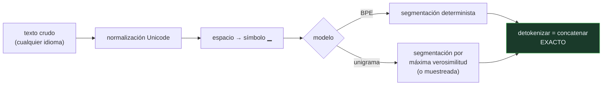

# P123 — SentencePiece

> Ruta de percepción · BPE suponía que el texto viene partido por espacios. El japonés
> no los usa. La solución es no suponer nada y tratar la entrada como un flujo.

**Nivel:** L2 · **Motor:** `sentencepiece` · **Notebook:** [`P123_sentencepiece.ipynb`](../../../notebooks/papers/P123_sentencepiece.ipynb)
· **Anexo:** [probabilidad y verosimilitud](../../annexes/A02_PROBABILIDAD_Y_VEROSIMILITUD.md)

## 1. Identificación

| Campo | Valor |
|---|---|
| **Título original** | *SentencePiece: A simple and language independent subword tokenizer and detokenizer for Neural Text Processing* |
| **Autoría** | Taku Kudo, John Richardson |
| **Año** | 2018 |
| **Venue** | EMNLP 2018 (demostraciones), 66–71 |
| **Fuente primaria** | [doi:10.18653/v1/D18-2012](https://doi.org/10.18653/v1/D18-2012) |
| **Acceso** | Abierto |
| **Fecha de consulta** | 2026-08-18 |

## 2. Problema anterior

[BPE](../P118_bpe/README.md) resolvió la palabra desconocida, pero heredó un supuesto que nadie
había cuestionado: que antes de tokenizar hay que partir el texto por espacios.

Ese supuesto falla de dos maneras. La primera es geográfica: el japonés, el chino y el tailandés no
separan palabras con espacios, y aplicar la receta ahí exige un segmentador específico por idioma
—con sus propios errores y su propio mantenimiento—.

La segunda es más insidiosa. Partir por espacios y volver a unir con un espacio **no reconstruye el
original**: un espacio doble desaparece, y con él la posibilidad de auditar qué entró exactamente al
modelo.

## 3. Propuesta

Tres decisiones que quitan supuestos en lugar de añadir maquinaria:

1. **Tratar la entrada como un flujo de caracteres crudo**, sin pretokenizar. El espacio se codifica
   como un símbolo más del vocabulario (`▁`), así que la detokenización es concatenar: **exacta,
   por construcción**.
2. Ofrecer, además de BPE, un **modelo unigrama** donde cada pieza tiene una probabilidad y la
   segmentación es un problema de inferencia, no la aplicación de una regla.
3. Empaquetarlo todo en una biblioteca con el modelo serializado, para que el tokenizador sea un
   artefacto versionable y reproducible en vez de un guion de preprocesado.

La tercera es la que más cambió la práctica.

## 4. Intuición sin fórmulas

Un sistema de transcripción que quita los espacios «porque no aportan». Funciona hasta que alguien
pide reconstruir el original y resulta que la sangría, el doble espacio y el salto de línea eran
información.

Codificar el espacio como un carácter más parece un detalle. Es lo que convierte la operación en
reversible, y una operación reversible se puede auditar.

**Dónde deja de funcionar la analogía:** el espacio no solo se conserva, ocupa un token. En textos
con mucho formato eso infla la secuencia y cuesta dinero.

## 5. Matemática mínima

```text
Por espacios : "el  gato" → ["el", "gato"] → "el gato"      ✗ se perdió un espacio
Flujo crudo  : "el  gato" → [e,l,▁,▁,g,a,t,o] → "el  gato"  ✓ exacto
```

La miniatura compara tres textos:

| | Reconstruye el original |
|---|---|
| partir por espacios | **2 de 3** |
| flujo crudo | **3 de 3** |

El caso japonés lo hace evidente: partir por espacios da **1 pieza** para la frase entera —inútil
como unidad— mientras que el flujo crudo da **6**, sin que el método necesite saber en qué idioma
está.

Y con el **modelo unigrama**, la segmentación deja de ser única. «internacional» admite **5
segmentaciones**:

| Segmentación | log P |
|---|---:|
| `[internacional]` | **−2,4** |
| `[in, ter, nacional]` | −8,0 |
| `[i, n, ter, na, cional]` | **−18,9** |

Que haya varias válidas no es un defecto: muestrear entre ellas al entrenar es **regularización de
subpalabra**, y mejora la robustez ante erratas.

<!-- puente:inicio -->
> [!TIP]
> **Puente matemático.** Esta sección da por sabido lo siguiente. Si algo no te suena,
> léelo primero: está explicado una sola vez, en un solo sitio, y sirve para todas las fichas.

| Dónde | Qué necesitas de ahí |
|---|---|
| [**A02 §3** · Verosimilitud y entropía cruzada](../../annexes/A02_PROBABILIDAD_Y_VEROSIMILITUD.md#3-verosimilitud-y-entropía-cruzada) | qué significa elegir la segmentación de máxima verosimilitud, y por qué muestrear entre las alternativas regulariza |
<!-- puente:fin -->

## 6. Arquitectura o flujo



## 7. Qué observar en el paper original

- Que el artículo es una **demostración de herramienta**, no un resultado teórico. Su aportación es
  de ingeniería y de reproducibilidad, y eso lo hace atípico entre los papers fundacionales.
- La **normalización Unicode** incluida en el modelo serializado, para que dos ejecuciones en
  máquinas distintas den lo mismo.
- El **modelo unigrama** y su entrenamiento con EM, que es lo que permite tratar la segmentación
  como inferencia.
- La insistencia en el **entrenamiento sobre texto crudo**: sin pretokenizar, sin normalizar a mano,
  sin reglas por idioma.

## 8. Evidencia y resultados

El artículo presenta mediciones de velocidad de segmentación y experimentos de traducción
inglés-japonés comparando tokenizar con y sin pretokenización.

> La evidencia es de herramienta: rendimiento, reversibilidad y equivalencia de resultados. No
> pretende demostrar que se traduce mejor, sino que no hace falta el andamiaje por idioma.

La miniatura compara tres cadenas y enumera segmentaciones con probabilidades escritas a mano. Las
ventajas reales aparecen en corpus multilingües grandes, con puntuación, emojis y escrituras
mezcladas.

## 9. Impacto

- Es el tokenizador de **T5, ALBERT, XLNet, Llama** y buena parte de los modelos multilingües.
- Convirtió el tokenizador en un **artefacto versionable** que se distribuye con el modelo, y eso
  cerró una fuente clásica de irreproducibilidad.
- La **regularización de subpalabra** que introduce es hoy una técnica estándar para robustez ante
  erratas y variantes ortográficas.
- Y dejó visible un problema que sigue abierto: los idiomas peor representados en el corpus del
  tokenizador pagan más tokens por decir lo mismo, y eso se traduce en factura y en ventana de
  contexto.

## 10. Limitaciones

1. **El espacio ocupa un token.** La reversibilidad exacta se paga en longitud, y en textos con
   mucho formato eso infla la secuencia.
2. **Sigue habiendo desigualdad entre idiomas**: quien no esté bien representado en el corpus del
   tokenizador necesita más piezas por palabra.
3. **El modelo unigrama es más lento de entrenar** que BPE, porque exige EM sobre el corpus.
4. **No resuelve la interpretabilidad de los trozos**: siguen sin corresponderse con morfemas.
5. **Muestrear segmentaciones complica la inferencia**: hay que decidir si se usa la más probable o
   se muestrea, y eso cambia los resultados.

## 11. Errores comunes

| Error | Corrección |
|---|---|
| «Tokenizar es preprocesado y da igual cómo se haga» | Es parte del modelo y determina la factura en tokens. Y si no es reversible, no se puede auditar qué entró exactamente. |
| «Partir por espacios funciona en todos los idiomas» | El japonés y el chino no los usan. En la miniatura, partir por espacios da 1 pieza para una frase japonesa entera. |
| «Si el texto vuelve a leerse igual, la tokenización es reversible» | Un espacio doble desaparece al unir con un espacio. En la miniatura, partir por espacios reconstruye 2 de 3 textos; el flujo crudo, 3 de 3. |
| «Cada palabra tiene una segmentación correcta» | Con modelo unigrama hay varias, con probabilidades distintas. «internacional» admite 5, y muestrear entre ellas es regularización. |
| «SentencePiece hace la tokenización justa entre idiomas» | La hace independiente del idioma, que es distinto. Los idiomas poco representados en el corpus del tokenizador siguen pagando más tokens. |

## 12. Relación con trabajos anteriores

- **[P118 Unidades de subpalabra](../P118_bpe/README.md) (2016)** — el algoritmo del que parte, y el
  supuesto de los espacios que aquí se elimina.
- **[P25 T5](../P25_t5/README.md) (2019)** — uno de los primeros modelos grandes que lo adoptó.
- **[P63 Reproducibilidad](../P63_reproducibilidad/README.md) (2021)** — el problema general que
  serializar el tokenizador resuelve en su parcela.

## 13. Relación con trabajos posteriores

- **Kudo (2018)** — regularización de subpalabra con el modelo unigrama.
  [doi:10.18653/v1/P18-1007](https://doi.org/10.18653/v1/P18-1007)
- **Rust et al. (2021)** — cuánto penaliza un tokenizador mal ajustado a un idioma.
  [doi:10.18653/v1/2021.acl-long.243](https://doi.org/10.18653/v1/2021.acl-long.243)
- **[P61 Loros estocásticos](../P61_stochastic_parrots/README.md) (2021)** — la desigualdad entre
  idiomas en los corpus, de la que esto es una manifestación concreta.

## 14. Notebook asociado

[`P123_sentencepiece.ipynb`](../../../notebooks/papers/P123_sentencepiece.ipynb)

**Qué implementa:** la reversibilidad de partir por espacios frente a tratar la entrada como flujo crudo, en tres textos incluido uno sin espacios, y las segmentaciones que un modelo unigrama asigna a una misma palabra con sus probabilidades.

**Qué NO implementa:** el vocabulario de piezas y sus probabilidades están escritos a mano; en SentencePiece se estiman con EM sobre el corpus, que es donde está el trabajo. Y solo se comparan tres cadenas.

```bash
ai-evolution paper-lab P123 --seed 7
```

## 15. Actividades Bloom

| Nivel | Actividad |
|---|---|
| **Recordar** | Explica cómo se codifica el espacio y por qué eso hace exacta la detokenización. |
| **Explicar** | Describe la diferencia entre el modelo BPE y el unigrama. |
| **Aplicar** | Ejecuta el notebook y comprueba qué texto no reconstruye el método por espacios. |
| **Analizar** | Analiza por qué la regularización de subpalabra mejora la robustez. |
| **Evaluar** | «Nuestro tokenizador funciona bien, lo probamos en español». Evalúa la afirmación. |
| **Crear** | Tokeniza el mismo contenido en español, en un idioma sin espacios y con emojis. Compara piezas por carácter en los tres casos. |

## 16. Autoevaluación

1. ¿Qué supuesto de BPE elimina SentencePiece?
2. ¿Cómo consigue que la detokenización sea exacta?
3. ¿Qué aporta el modelo unigrama?
4. ¿Qué es la regularización de subpalabra?
5. ¿Por qué importa serializar el tokenizador?
6. ¿Qué se paga por la reversibilidad exacta?
7. ¿Resuelve la desigualdad entre idiomas?

## 17. Respuestas esperadas

1. Que el texto viene partido por espacios. Trata la entrada como un flujo de caracteres crudo, sin pretokenizar y sin reglas por idioma.
2. Codificando el espacio como un símbolo más del vocabulario. Detokenizar es concatenar y sustituir ese símbolo, así que el original se recupera siempre.
3. Que la segmentación sea inferencia probabilística y no la aplicación de una regla: cada pieza tiene probabilidad y una palabra admite varias segmentaciones puntuadas.
4. Muestrear entre las segmentaciones válidas durante el entrenamiento, en vez de usar siempre la más probable. Mejora la robustez ante erratas y variantes.
5. Porque el tokenizador es parte del modelo. Serializarlo con su normalización hace que dos ejecuciones en máquinas distintas den exactamente lo mismo.
6. Longitud: el espacio ocupa un token. En textos con mucho formato eso infla la secuencia y cuesta dinero.
7. No. La hace independiente del idioma, que es otra cosa. Los idiomas poco representados en el corpus del tokenizador siguen necesitando más piezas por palabra.

## 18. Fuentes primarias

- Kudo, T. y Richardson, J. (2018). *SentencePiece: A simple and language independent subword
  tokenizer and detokenizer for Neural Text Processing*. **EMNLP 2018 (demos)**, 66–71.
  [doi:10.18653/v1/D18-2012](https://doi.org/10.18653/v1/D18-2012) · consultado 2026-08-18.
- Kudo, T. (2018). *Subword Regularization*.
  [doi:10.18653/v1/P18-1007](https://doi.org/10.18653/v1/P18-1007) · consultado 2026-08-18.
- Rust, P. et al. (2021). *How Good is Your Tokenizer?*
  [doi:10.18653/v1/2021.acl-long.243](https://doi.org/10.18653/v1/2021.acl-long.243) ·
  consultado 2026-08-18.

---

[⬅️ Anterior: P122 Tacotron 2](../P122_tacotron/README.md) ·
[📇 Índice](../../catalog/PAPERS_INDEX.md) ·
[📝 Evaluación](../../../assessments/papers/P123_sentencepiece.md) ·
[🏫 Clase 073 · Tokenización moderna y vocabularios](../../../classes/part-06-foundation-models-and-llm-engineering/073-tokenizacion-moderna-y-vocabularios/README.md) ·
[➡️ Siguiente: P124 Redes de atención sobre grafos](../P124_gat/README.md)
