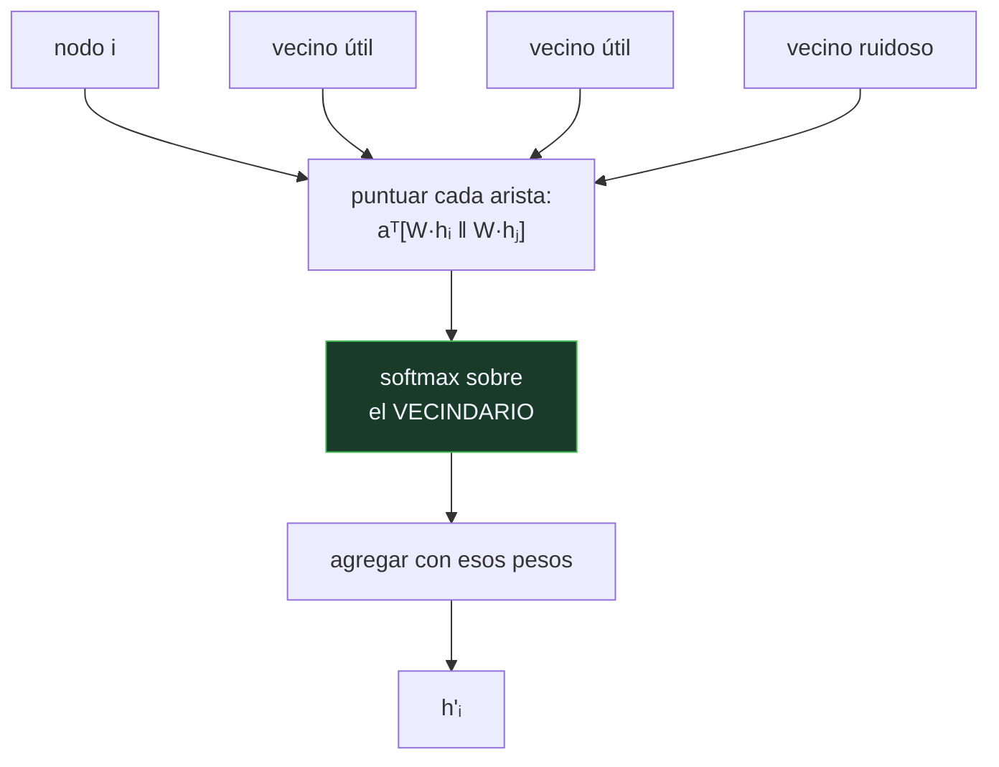

# P124 — Redes de atención sobre grafos

> Ruta de percepción · La convolución de grafo promedia a todos los vecinos por igual.
> Si la mitad son ruido, el promedio también lo es.

**Nivel:** L3 · **Motor:** `gat` · **Notebook:** [`P124_gat.ipynb`](../../../notebooks/papers/P124_gat.ipynb)
· **Anexo:** [atención paso a paso](../../annexes/A04_ATENCION_PASO_A_PASO.md)

## 1. Identificación

| Campo | Valor |
|---|---|
| **Título original** | *Graph Attention Networks* |
| **Autoría** | Petar Veličković, Guillem Cucurull, Arantxa Casanova, Adriana Romero, Pietro Liò, Yoshua Bengio |
| **Año** | 2018 |
| **Venue** | ICLR 2018 · arXiv:1710.10903 |
| **Fuente primaria** | [arXiv:1710.10903](https://arxiv.org/abs/1710.10903) |
| **Acceso** | Abierto |
| **Fecha de consulta** | 2026-08-18 |

## 2. Problema anterior

La [red convolucional de grafo](../P120_gcn/README.md) promedia los rasgos de los vecinos
normalizando por el grado. Eso lleva dentro dos supuestos que no siempre se cumplen.

El primero: **todos los vecinos importan lo mismo**. En una red de citas, un artículo cita tanto a
la obra que lo funda como a una referencia de cortesía; en una red social, una persona sigue a
quien le interesa y a quien conoció una vez.

El segundo es estructural: la normalización por grado exige conocer el grafo completo, así que el
modelo entrenado **no se puede aplicar a nodos nuevos**.

## 3. Propuesta

Sustituir el peso fijo por un **coeficiente de atención aprendido para cada pareja de nodos
vecinos**:

```text
GCN : h'ᵢ = σ( Σⱼ (1/√(dᵢdⱼ)) · W·hⱼ )      peso FIJO, depende del grado
GAT : h'ᵢ = σ( Σⱼ αᵢⱼ · W·hⱼ )              peso APRENDIDO, depende de la pareja

    αᵢⱼ = softmax_j( LeakyReLU( aᵀ[W·hᵢ ‖ W·hⱼ] ) )
```

El softmax se toma **sobre el vecindario**, no sobre el grafo, así que el cálculo es local. De ahí
sale la propiedad que más importa en la práctica: como los pesos solo dependen de los rasgos de las
dos puntas de la arista, el modelo se aplica a nodos que no existían al entrenar.

Y como en el Transformer, varias **cabezas** en paralelo.

## 4. Intuición sin fórmulas

Pedir opinión a los vecinos antes de decidir. Hacer la media de todos trata igual a quien conoce
el tema y a quien pasaba por ahí.

Ponderar por lo mucho o poco que cada respuesta encaja con lo que ya sabes filtra el ruido sin
tener que decidir de antemano a quién preguntar.

**Dónde deja de funcionar la analogía:** ponderar por parecido tiende a confirmar lo que ya creías.
La atención aprendida no usa el parecido sino un criterio entrenado, y ese criterio puede ser
cualquier cosa — incluida una que refuerce el sesgo.

## 5. Matemática mínima

```text
αᵢⱼ = softmax_j( LeakyReLU( aᵀ[W·hᵢ ‖ W·hⱼ] ) )     ← normalizado sobre el VECINDARIO
```

La miniatura fija 3 vecinos útiles y varía cuántos ruidosos hay:

| Vecinos ruidosos | Media uniforme | Con atención |
|---:|---:|---:|
| 0 | **1,000** | 0,963 |
| 2 | 0,863 | 0,938 |
| 4 | 0,787 | 0,919 |
| 6 | **0,744** | **0,869** |

El primer renglón es el más instructivo: **con el grafo limpio, la media uniforme es mejor**.
Ponderar solo puede desequilibrar un promedio que ya era el correcto. La atención no es gratis ni
universalmente superior: gana exactamente donde el grafo es sucio, que es el caso real.

En un ejemplo concreto con vecinos `[1,1 · 0,9 · 1,05 · −3,4 · 2,9]` y valor propio 1,0, el peso
uniforme sería **0,167** para cada uno. La atención le da **0,003** al más discrepante: no lo
elimina, lo atenúa 56 veces.

<!-- puente:inicio -->
> [!TIP]
> **Puente matemático.** Esta sección da por sabido lo siguiente. Si algo no te suena,
> léelo primero: está explicado una sola vez, en un solo sitio, y sirve para todas las fichas.

| Dónde | Qué necesitas de ahí |
|---|---|
| [**A04** · Paso 3 — Normalizar: `softmax`](../../annexes/A04_ATENCION_PASO_A_PASO.md#paso-3--normalizar-softmax) | el mismo softmax del Transformer, aquí tomado sobre el vecindario en vez de sobre la secuencia |
<!-- puente:fin -->

## 6. Arquitectura o flujo



## 7. Qué observar en el paper original

- La propiedad **inductiva**: el cálculo es local, así que el modelo entrenado se aplica a grafos
  que no vio. El artículo lo demuestra en un conjunto de proteínas con grafos completamente nuevos.
- Que la operación es **paralelizable por aristas**, sin descomposiciones costosas ni conocimiento
  de la estructura global.
- Las **cabezas múltiples** y por qué estabilizan el entrenamiento, igual que en el Transformer.
- Que el mecanismo **no usa los pesos de las aristas** si el grafo los tiene: los recalcula. Es una
  decisión discutible que trabajos posteriores revisaron.

## 8. Evidencia y resultados

Resultados en los conjuntos de citas habituales y, sobre todo, en un conjunto **inductivo** de
interacción de proteínas donde los grafos de prueba no se ven al entrenar. Ahí la mejora es
sustancial.

> Ese segundo experimento es el que sostiene la tesis: no es que atender clasifique mejor, es que
> permite generalizar a grafos nuevos.

La miniatura usa una función fija del parecido en lugar de una capa aprendida, y un solo salto con
un rasgo escalar. Sirve para exhibir cuándo la ponderación aporta y cuándo no.

## 9. Impacto

- Es una de las arquitecturas de grafo más usadas, y llevó la atención del Transformer al dominio
  de los grafos antes de que eso fuera evidente.
- La propiedad inductiva abrió el uso en producción: sistemas de recomendación y detección de fraude
  donde los nodos aparecen continuamente.
- Junto con [GCN](../P120_gcn/README.md) y GraphSAGE, forma la base sobre la que se construyó el
  marco de paso de mensajes.
- Y motivó una línea de trabajo crítica sobre **qué expresa realmente su atención**, que acabó
  produciendo GATv2 al encontrar una limitación estructural en la formulación original.

## 10. Limitaciones

1. **No siempre gana.** Con el grafo limpio, la media uniforme es mejor: en la miniatura, 1,000
   frente a 0,963.
2. **Su atención es más limitada de lo que parece.** Brody et al. (2022) demostraron que la
   formulación original solo puede expresar atención «estática», y propusieron GATv2.
3. **Los pesos de atención no son una explicación.** Un peso alto dice que ese vecino influyó, no
   por qué, y hay trabajos que muestran que acaban siendo casi uniformes.
4. **Sigue sufriendo sobre-suavizado** al apilar capas, igual que GCN.
5. **Cuesta más memoria y cómputo** que promediar, y esa diferencia hay que justificarla midiendo.

## 11. Errores comunes

| Error | Corrección |
|---|---|
| «La atención siempre mejora sobre el promedio» | Con vecinos todos informativos, la media uniforme gana: 1,000 frente a 0,963. Atender tiene un coste cuando no hay nada que filtrar. |
| «Los pesos de atención explican la decisión» | Dicen qué vecino influyó, no por qué. Sirven como diagnóstico, no como justificación ante nadie. |
| «La atención elimina los vecinos ruidosos» | Los atenúa. En el ejemplo, el más discrepante recibe 0,003 frente al 0,167 uniforme: sigue contando, sesenta veces menos. |
| «GAT resuelve el sobre-suavizado» | No lo resuelve: sigue apareciendo al apilar capas. Lo que resuelve es la ponderación uniforme y la dependencia del grafo completo. |
| «Su atención es tan expresiva como la del Transformer» | Brody et al. demostraron que la formulación original solo expresa atención estática. Esa es la razón de que exista GATv2. |

## 12. Relación con trabajos anteriores

- **[P120 Redes convolucionales de grafo](../P120_gcn/README.md) (2017)** — la agregación uniforme
  que este artículo sustituye.
- **[P08 Transformer](../P08_transformer/README.md) (2017)** — el mecanismo de atención con cabezas
  múltiples, aquí trasladado al vecindario.
- **Hamilton et al. (2017)** — GraphSAGE y el aprendizaje inductivo sobre grafos.
  [arXiv:1706.02216](https://arxiv.org/abs/1706.02216)

## 13. Relación con trabajos posteriores

- **Brody et al. (2022)** — GATv2: por qué la atención original es más limitada de lo que parece.
  [arXiv:2105.14491](https://arxiv.org/abs/2105.14491)
- **[P52 Superposición](../P52_superposition/README.md) (2023)** — la advertencia general sobre leer
  pesos internos como explicaciones.
- **Dwivedi y Bresson (2021)** — Transformers sobre grafos, la continuación natural.
  [arXiv:2012.09699](https://arxiv.org/abs/2012.09699)

## 14. Notebook asociado

[`P124_gat.ipynb`](../../../notebooks/papers/P124_gat.ipynb)

**Qué implementa:** la exactitud de la media uniforme frente a la ponderada según crece la proporción de vecinos ruidosos, y los pesos concretos que la atención asigna en un caso con un vecino muy discrepante.

**Qué NO implementa:** la «atención» es una función fija del parecido, no una capa aprendida. Y es de un solo salto con un rasgo escalar: los efectos interesantes aparecen con varias cabezas y varias capas.

```bash
ai-evolution paper-lab P124 --seed 7
```

## 15. Actividades Bloom

| Nivel | Actividad |
|---|---|
| **Recordar** | Escribe cómo se calcula el coeficiente de atención entre dos nodos. |
| **Explicar** | Explica por qué el modelo es inductivo y GCN no. |
| **Aplicar** | Ejecuta el notebook y localiza dónde la atención empieza a ganar. |
| **Analizar** | Analiza por qué la media uniforme es mejor con el grafo limpio. |
| **Evaluar** | «Usamos atención sobre el grafo, así que el modelo es mejor». Evalúa la afirmación. |
| **Crear** | Mide la proporción de aristas que unen clases distintas en un grafo tuyo y decide si la atención te compensaría. |

## 16. Autoevaluación

1. ¿Sobre qué se normaliza el softmax?
2. ¿Por qué el modelo es inductivo?
3. ¿Cuándo NO conviene la atención?
4. ¿Elimina los vecinos ruidosos?
5. ¿Explican los pesos de atención la decisión?
6. ¿Qué limitación encontró GATv2?
7. ¿Resuelve el sobre-suavizado?

## 17. Respuestas esperadas

1. Sobre el vecindario de cada nodo, no sobre el grafo entero. Por eso el cálculo es local y paralelizable por aristas.
2. Porque los coeficientes solo dependen de los rasgos de las dos puntas de la arista, no de la estructura global. Se aplica a nodos y grafos que no se vieron al entrenar.
3. Cuando todos los vecinos son informativos. En la miniatura, con cero vecinos ruidosos la media uniforme da 1,000 y la atención 0,963.
4. No: los atenúa. Al más discrepante le da 0,003 donde el peso uniforme sería 0,167.
5. No. Dicen qué vecino influyó, no por qué. Y hay trabajos que muestran que las atenciones aprendidas acaban siendo casi uniformes.
6. Que la formulación original solo puede expresar atención estática: el ranking de vecinos es el mismo para todos los nodos consultantes.
7. No. Sigue apareciendo al apilar capas, igual que en GCN.

## 18. Fuentes primarias

- Veličković, P. et al. (2018). *Graph Attention Networks*. **ICLR 2018**.
  [arxiv.org/abs/1710.10903](https://arxiv.org/abs/1710.10903) · consultado 2026-08-18.
- Brody, S., Alon, U. y Yahav, E. (2022). *How Attentive are Graph Attention Networks?*
  [arXiv:2105.14491](https://arxiv.org/abs/2105.14491) · consultado 2026-08-18.
- Hamilton, W., Ying, Z. y Leskovec, J. (2017). *Inductive Representation Learning on Large Graphs*.
  [arXiv:1706.02216](https://arxiv.org/abs/1706.02216) · consultado 2026-08-18.

---

[⬅️ Anterior: P123 SentencePiece](../P123_sentencepiece/README.md) ·
[📇 Índice](../../catalog/PAPERS_INDEX.md) ·
[📝 Evaluación](../../../assessments/papers/P124_gat.md) ·
[🏫 Clase 056 · Graph Neural Networks](../../../classes/part-04-neural-networks-and-deep-learning/056-graph-neural-networks/README.md) ·
[➡️ Siguiente: P125 LayoutLM](../P125_layoutlm/README.md)
