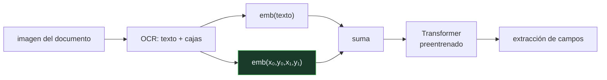

# P125 — LayoutLM

> Ruta de percepción · El OCR lee la factura perfectamente y aun así empareja «Factura
> n.º» con «Fecha». El problema no es leer: es saber qué va con qué.

**Nivel:** L2 · **Motor:** `layoutlm` · **Notebook:** [`P125_layoutlm.ipynb`](../../../notebooks/papers/P125_layoutlm.ipynb)
· **Anexo:** [álgebra y geometría](../../annexes/A01_ALGEBRA_Y_GEOMETRIA.md)

## 1. Identificación

| Campo | Valor |
|---|---|
| **Título original** | *LayoutLM: Pre-training of Text and Layout for Document Image Understanding* |
| **Autoría** | Yiheng Xu, Minghao Li, Lei Cui, Shaohan Huang, Furu Wei, Ming Zhou |
| **Año** | 2020 |
| **Venue** | KDD 2020, 1192–1200 |
| **Fuente primaria** | [doi:10.1145/3394486.3403172](https://doi.org/10.1145/3394486.3403172) |
| **Acceso** | Abierto |
| **Fecha de consulta** | 2026-08-18 |

## 2. Problema anterior

Un documento no es una secuencia de texto: es **texto colocado**. Una factura, un formulario o un
albarán organizan la información en columnas, tablas y bloques, y esa disposición es parte del
significado.

El OCR resuelve la lectura y entrega una cadena, normalmente ordenada por filas. En un diseño de dos
columnas eso intercala campos que no tienen ninguna relación entre sí. Un modelo de lenguaje que
solo ve la cadena hereda el problema, y no puede emparejar cada etiqueta con su valor por mucho que
crezca.

Y la información que falta **ya estaba calculada**: el OCR devuelve la caja delimitadora de cada
palabra, y las tuberías la tiraban a la basura.

## 3. Propuesta

Añadir la posición 2D como una **incrustación más**, junto a la del token y la de la posición en
la secuencia:

```text
Secuencia plana : token → emb(texto) + emb(posición en la SECUENCIA)
LayoutLM        : token → emb(texto) + emb(x₀, y₀, x₁, y₁ en la PÁGINA)
```

Y preentrenar sobre millones de documentos escaneados con dos objetivos que obligan a usar las dos
señales: enmascarar tokens dejando visible su posición, y clasificar el tipo de documento.

La versión completa añade además los rasgos de la imagen de cada caja —tipografía, negrita,
líneas—, pero la aportación principal es la posición.

## 4. Intuición sin fórmulas

Leer un periódico transcrito en una sola columna, con las noticias de la página entera puestas una
detrás de otra por orden de altura. El texto está completo y es ilegible: no sabes dónde acaba un
titular y empieza otro.

Devolverle a cada línea su coordenada en la página reconstruye el periódico sin añadir una sola
palabra.

**Dónde deja de funcionar la analogía:** un periódico tiene columnas claras. Un formulario real
tiene tablas anidadas, casillas, sellos y texto rotado, y ahí la posición ayuda pero no basta.

## 5. Matemática mínima

No hay formalismo nuevo: es la arquitectura de [BERT](../P09_bert/README.md) con incrustaciones
adicionales. Lo que sí se puede medir es cuánta información aporta la posición.

La miniatura usa una factura de dos columnas y ocho campos. El OCR entrega:

```text
Factura n.º  A-2291  Fecha  2026-03-14  Cliente  Cooperativa Sur  Vencimiento  2026-04-14
```

Emparejando cada clave con su valor:

| Criterio | Aciertos |
|---|---:|
| textual: «el siguiente token» | **2 de 4** |
| posicional: misma banda vertical, el más cercano a la derecha | **4 de 4** |

Los fallos **no son de lectura**. El texto está perfectamente reconocido y aun así el emparejado es
incorrecto, porque la linealización por filas cruza las dos columnas. La información que faltaba
eran las coordenadas, no más texto ni un modelo mayor.

<!-- puente:inicio -->
> [!TIP]
> **Puente matemático.** Esta sección da por sabido lo siguiente. Si algo no te suena,
> léelo primero: está explicado una sola vez, en un solo sitio, y sirve para todas las fichas.

| Dónde | Qué necesitas de ahí |
|---|---|
| [**A01 §1** · Producto escalar](../../annexes/A01_ALGEBRA_Y_GEOMETRIA.md#1-producto-escalar) | cómo una coordenada se convierte en un vector que el modelo puede comparar con los demás |
<!-- puente:fin -->

## 6. Arquitectura o flujo



## 7. Qué observar en el paper original

- Lo **barata** que es la idea: la caja delimitadora ya la calcula el OCR. No hace falta ninguna
  anotación nueva, solo dejar de tirarla.
- El **corpus de preentrenamiento**: once millones de documentos escaneados, sin etiquetas. Es lo
  que hace que el modelo aprenda la regla de posición en vez de que alguien la programe.
- Los **objetivos de preentrenamiento**, diseñados para que el modelo no pueda resolver la tarea
  ignorando una de las dos señales.
- La **ablación** que separa la contribución del texto, de la posición y de la imagen. Es lo que
  permite atribuir la mejora.

## 8. Evidencia y resultados

Resultados en extracción de campos de formularios (FUNSD), comprensión de recibos (SROIE) y
clasificación de documentos (RVL-CDIP), con mejoras claras sobre modelos que solo usan texto.

> La evidencia es sólida y la ablación permite atribuir la mejora a la posición. El corpus de
> preentrenamiento, en cambio, es propietario y eso complica la reproducción exacta.

La miniatura codifica la regla de posición **a mano** sobre un documento de ocho campos. LayoutLM no
programa esa regla: la aprende. La maqueta sirve para exhibir qué información falta, no cómo se
adquiere.

## 9. Impacto

- Abrió el área del **procesamiento inteligente de documentos** como línea propia, con versiones
  posteriores y una familia de modelos abiertos detrás.
- Es la base de buena parte de los productos comerciales de extracción de facturas, contratos y
  formularios.
- La idea de **incrustar la posición 2D** se trasladó a tablas, interfaces de usuario y capturas de
  pantalla, y es lo que hay detrás de los agentes que operan una interfaz gráfica.
- Y planteó la pregunta que responde [Donut](../P126_donut/README.md): si la posición basta, ¿hace
  falta el OCR?

## 10. Limitaciones

1. **Depende del OCR.** Sus errores llegan intactos, y esa dependencia es justamente lo que el
   trabajo posterior intenta eliminar.
2. **La primera versión no usa la imagen** en el preentrenamiento, solo en el ajuste. LayoutLMv2 y
   v3 corrigen eso, y la diferencia es notable.
3. **El corpus de preentrenamiento es propietario**, lo que complica reproducir los resultados.
4. **Los documentos con estructura compleja** —tablas anidadas, celdas combinadas, texto rotado— se
   le siguen resistiendo.
5. **Está sesgado hacia documentos en inglés y de negocio**, que es lo que había en el corpus.

## 11. Errores comunes

| Error | Corrección |
|---|---|
| «El problema de la extracción de campos es de calidad de OCR» | Con OCR perfecto, el emparejado por orden de lectura sigue fallando: 2 de 4 en la miniatura. Mejorar el OCR no mueve esa cifra. |
| «Un modelo de lenguaje más grande resolvería el documento» | No, porque la información que falta no está en la cadena. Son las coordenadas, y ningún tamaño de modelo las inventa. |
| «La posición en la secuencia ya codifica la disposición» | Codifica el orden de lectura del OCR, que en dos columnas intercala campos sin relación. La posición en la página es otra cosa. |
| «Hay que anotar las posiciones a mano» | El OCR ya devuelve la caja delimitadora de cada palabra. La aportación es dejar de tirarla, no calcularla. |
| «LayoutLM aprende la regla «el valor está a la derecha de la clave»» | No se le programa ninguna regla: la deduce de once millones de documentos sin etiquetar. La regla escrita a mano es solo la maqueta del notebook. |

## 12. Relación con trabajos anteriores

- **[P09 BERT](../P09_bert/README.md) (2018)** — la arquitectura y el esquema de preentrenamiento a
  los que se añade la posición.
- **[P08 Transformer](../P08_transformer/README.md) (2017)** — las incrustaciones de posición, aquí
  extendidas a dos dimensiones.
- **Jaume et al. (2019)** — FUNSD, el banco de formularios escaneados sobre el que se evalúa.
  [arXiv:1905.13538](https://arxiv.org/abs/1905.13538)

## 13. Relación con trabajos posteriores

- **[P126 Donut](../P126_donut/README.md) (2022)** — prescindir del OCR por completo.
- **Xu et al. (2022)** — LayoutLMv3, con parches de imagen y preentrenamiento unificado.
  [doi:10.1145/3503161.3548112](https://doi.org/10.1145/3503161.3548112)
- **[P105 SeeClick](../P105_seeclick/README.md) (2024)** — la misma idea sobre interfaces de
  usuario: dónde está un elemento es parte de qué es.

## 14. Notebook asociado

[`P125_layoutlm.ipynb`](../../../notebooks/papers/P125_layoutlm.ipynb)

**Qué implementa:** el orden de lectura que produce el OCR sobre un documento de dos columnas, y cuántos pares clave-valor empareja bien una regla textual frente a una regla de posición.

**Qué NO implementa:** la regla de posición está escrita a mano; LayoutLM la aprende preentrenando sobre once millones de documentos. Y el documento tiene ocho campos y dos columnas limpias.

```bash
ai-evolution paper-lab P125 --seed 7
```

## 15. Actividades Bloom

| Nivel | Actividad |
|---|---|
| **Recordar** | Enumera las incrustaciones que recibe un token en LayoutLM. |
| **Explicar** | Explica por qué la linealización del OCR rompe los documentos de dos columnas. |
| **Aplicar** | Ejecuta el notebook y compara los dos criterios de emparejado. |
| **Analizar** | Analiza por qué mejorar el OCR no arregla el problema. |
| **Evaluar** | «Vamos a usar un modelo de lenguaje mayor para leer las facturas». Evalúa la propuesta. |
| **Crear** | Pasa un formulario real por un OCR que devuelva cajas y comprueba cuántos pares resuelve cada criterio. |

## 16. Autoevaluación

1. ¿Qué información añade LayoutLM a un modelo de lenguaje?
2. ¿De dónde sale esa información?
3. ¿Por qué falla el emparejado por orden de lectura?
4. ¿Arregla el problema mejorar el OCR?
5. ¿Cómo aprende el modelo a usar la posición?
6. ¿Qué añaden LayoutLMv2 y v3?
7. ¿Cuál es su dependencia más incómoda?

## 17. Respuestas esperadas

1. La posición 2D de cada token en la página —las coordenadas de su caja delimitadora— como una incrustación que se suma a la del texto.
2. Del propio OCR, que ya calcula la caja de cada palabra. La aportación es dejar de tirarla, no calcularla.
3. Porque el OCR linealiza por filas y en un diseño de dos columnas eso intercala campos sin relación. En la miniatura acierta 2 de 4.
4. No. Con texto perfectamente reconocido el emparejado sigue fallando: el problema no es leer, es saber qué va con qué.
5. Preentrenando sobre once millones de documentos escaneados con objetivos que no se pueden resolver ignorando ninguna de las dos señales.
6. Los rasgos de la imagen —tipografía, líneas, color— en el preentrenamiento y no solo en el ajuste. La diferencia es notable.
7. El OCR: sus errores llegan intactos al modelo. Eliminarlo es justamente lo que propone Donut.

## 18. Fuentes primarias

- Xu, Y. et al. (2020). *LayoutLM: Pre-training of Text and Layout for Document Image
  Understanding*. **KDD 2020**, 1192–1200.
  [doi:10.1145/3394486.3403172](https://doi.org/10.1145/3394486.3403172) · consultado 2026-08-18.
- Xu, Y. et al. (2022). *LayoutLMv3*.
  [doi:10.1145/3503161.3548112](https://doi.org/10.1145/3503161.3548112) · consultado 2026-08-18.
- Jaume, G., Kemal Ekenel, H. y Thiran, J.-P. (2019). *FUNSD*.
  [arXiv:1905.13538](https://arxiv.org/abs/1905.13538) · consultado 2026-08-18.

---

[⬅️ Anterior: P124 Redes de atención sobre grafos](../P124_gat/README.md) ·
[📇 Índice](../../catalog/PAPERS_INDEX.md) ·
[📝 Evaluación](../../../assessments/papers/P125_layoutlm.md) ·
[🏫 Clase 063 · OCR y comprensión de documentos](../../../classes/part-05-language-vision-audio-and-multimodal-ai/063-ocr-y-comprension-de-documentos/README.md) ·
[➡️ Siguiente: P126 Donut](../P126_donut/README.md)
