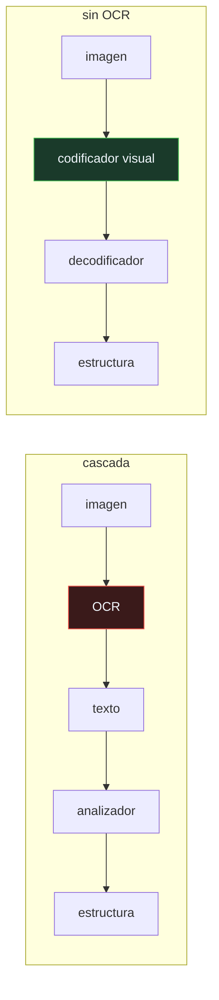

# P126 — Donut

> Ruta de percepción · Un OCR con 1 % de error por carácter suena excelente. Deja la
> mitad de los documentos con algún fallo, y el analizador no puede corregir ninguno.

**Nivel:** L3 · **Motor:** `donut` · **Notebook:** [`P126_donut.ipynb`](../../../notebooks/papers/P126_donut.ipynb)
· **Anexo:** [complejidad y coste](../../annexes/A05_COMPLEJIDAD_Y_COSTE.md)

## 1. Identificación

| Campo | Valor |
|---|---|
| **Título original** | *OCR-free Document Understanding Transformer* |
| **Autoría** | Geewook Kim, Teakgyu Hong, Moonbin Yim, JeongYeon Nam, Jinyoung Park y otros |
| **Año** | 2022 |
| **Venue** | ECCV 2022, 498–517 |
| **Fuente primaria** | [doi:10.1007/978-3-031-19815-1_29](https://doi.org/10.1007/978-3-031-19815-1_29) |
| **Acceso** | Restringido |
| **Fecha de consulta** | 2026-08-18 |

## 2. Problema anterior

La tubería habitual para leer documentos tiene dos etapas: un OCR extrae el texto y un modelo lo
interpreta. Esa arquitectura arrastra tres costes que se suelen contabilizar mal.

El primero es el que importa: **los errores del OCR llegan intactos al final y no hay quien los
corrija**. Y no se suman, se **componen**: un error por carácter pequeño se convierte en una tasa de
documentos correctos mucho peor, porque basta un fallo para estropear el documento entero.

Los otros dos son de operación: el OCR hay que licenciarlo y mantenerlo por idioma, y añade su
propia latencia.

## 3. Propuesta

Eliminar la etapa: un modelo que va de **imagen a salida estructurada** directamente.

Un codificador visual procesa la imagen del documento y un decodificador emite la estructura —JSON,
pares clave-valor, la respuesta a una pregunta— token a token. Nunca produce «el texto del
documento» como paso intermedio.

Y una idea que resuelve el problema de datos: preentrenar con la tarea de **leer el documento
completo** sobre imágenes sintéticas generadas con un motor tipográfico, que se pueden producir en
cualquier idioma y en cualquier cantidad sin anotar nada a mano.

## 4. Intuición sin fórmulas

Una cadena de traducción donde el primer traductor pasa del japonés al inglés y el segundo del
inglés al español. Si el primero se equivoca, el segundo traduce fielmente el error: no tiene el
original delante para notarlo.

Un traductor que sepa japonés y español directamente comete sus propios errores, pero no hereda los
de nadie.

**Dónde deja de funcionar la analogía:** el traductor directo hay que formarlo, y formarlo es más
caro. Aquí igual: el modelo sin OCR necesita muchos más datos de entrenamiento que un analizador de
texto.

## 5. Matemática mínima

```text
Cascada:  imagen ──[OCR]──▶ texto ──[analizador]──▶ estructura

    P(documento correcto) = (1 − p)^(caracteres)      ← se COMPONE

Sin OCR:  imagen ─────────[modelo]─────────▶ estructura
```

La miniatura simula 300 documentos de 6 campos y 9 caracteres cada uno —54 caracteres por
documento—:

| Error por carácter | Campos correctos | **Documentos enteros** |
|---:|---:|---:|
| 0,5 % | 0,958 | 0,773 |
| **1 %** | 0,905 | **0,550** |
| 2 % | 0,819 | 0,277 |
| **5 %** | 0,619 | **0,053** |

Un OCR del 99 % por carácter suena a objetivo cumplido y deja **la mitad** de los documentos con
algún fallo. Y la medición sigue a la predicción: para el 1 %, la fórmula da **0,581** y se mide
**0,550**. No es mala suerte, es aritmética de cascada.

<!-- puente:inicio -->
> [!TIP]
> **Puente matemático.** Esta sección da por sabido lo siguiente. Si algo no te suena,
> léelo primero: está explicado una sola vez, en un solo sitio, y sirve para todas las fichas.

| Dónde | Qué necesitas de ahí |
|---|---|
| [**A05 §8** · Checklist antes de creerte una cifra de rendimiento](../../annexes/A05_COMPLEJIDAD_Y_COSTE.md#8-checklist-antes-de-creerte-una-cifra-de-rendimiento) | por qué la unidad en la que se mide una tasa de error cambia por completo lo que la cifra significa |
<!-- puente:fin -->

## 6. Arquitectura o flujo



## 7. Qué observar en el paper original

- El **generador de documentos sintéticos**, que es lo que hace viable el preentrenamiento sin
  anotación y en cualquier idioma. Es la mitad práctica del artículo.
- La comparación de **latencia y coste** frente a las tuberías con OCR, que en muchos casos pesa
  tanto como la exactitud.
- Que la salida es **estructura directamente**, no texto que luego alguien analiza. El decodificador
  emite JSON.
- Los experimentos en **varios idiomas**, incluido el coreano, que es donde la dependencia de un OCR
  comercial se nota más.

## 8. Evidencia y resultados

Comparación contra tuberías con OCR en extracción de información de recibos, clasificación y
preguntas sobre documentos, con exactitud, latencia y coste.

> La evidencia es completa porque incluye las tres dimensiones. Y conviene leerla con cuidado: el
> modelo sin OCR gana en unas tareas y no en todas, y necesita mucho más preentrenamiento.

La miniatura **no compara con Donut**: modela la aritmética de la cascada. Que quitar la etapa evite
estos errores no demuestra que el modelo de extremo a extremo sea mejor — introduce los suyos, que
sí son entrenables.

## 9. Impacto

- Abrió la línea de comprensión de documentos **sin OCR**, que hoy es la dirección dominante y la
  que siguen los modelos multimodales generales.
- Su generador de documentos sintéticos se reutilizó ampliamente para entrenar en idiomas sin
  recursos anotados.
- Nougat aplicó la misma idea a artículos científicos con fórmulas, donde el OCR clásico es
  especialmente malo.
- Y dejó una lección de medición que va más allá del área: **la unidad en la que declaras el error
  decide si tu sistema parece bueno o malo**, y hay que elegirla por lo que le importa al negocio.

## 10. Limitaciones

1. **Necesita mucho más preentrenamiento** que un analizador de texto: hay que aprender a leer
   desde cero en vez de reutilizar un OCR maduro.
2. **Sus errores no son diagnosticables.** En la cascada se puede señalar qué carácter leyó mal el
   OCR; aquí el fallo es del modelo entero.
3. **No gana en todas las tareas**, y el artículo lo muestra. Donde el OCR es muy bueno y el
   documento simple, la cascada sigue siendo competitiva.
4. **Los documentos muy largos o de alta resolución** son costosos para el codificador visual.
5. **El modelo sintético de errores de la miniatura es optimista**: supone errores independientes
   por carácter, y en la práctica van en ráfagas.

## 11. Errores comunes

| Error | Corrección |
|---|---|
| «Un OCR con 99 % de exactitud por carácter es suficiente» | Sobre documentos de 54 caracteres deja el 55 % de documentos sin ningún fallo. La unidad que importa es el documento, no el carácter. |
| «Los errores del OCR se suman» | Se componen: (1−p) elevado al número de caracteres. Por eso una tasa pequeña por carácter da una tasa grande por documento. |
| «El analizador puede corregir los errores del OCR» | Con contexto y validaciones recupera algunos, no todos, y no tiene el original delante para saber qué se leyó mal. |
| «Prescindir del OCR significa leer mejor» | Significa no heredar errores de una etapa incorregible. El modelo introduce los suyos, con la diferencia de que son entrenables. |
| «Sin OCR siempre es mejor» | El propio artículo muestra que no gana en todas las tareas. Con documentos simples y OCR bueno, la cascada sigue siendo competitiva. |

## 12. Relación con trabajos anteriores

- **[P125 LayoutLM](../P125_layoutlm/README.md) (2020)** — la alternativa que sí usa OCR y añade la
  posición.
- **[P46 Vision Transformer](../P46_vit/README.md) (2020)** — el codificador visual que hace viable
  procesar la imagen del documento.
- **[P06 Secuencia a secuencia](../P06_seq2seq/README.md) (2014)** — el patrón codificador-
  decodificador que aquí va de imagen a estructura.

## 13. Relación con trabajos posteriores

- **Blecher et al. (2023)** — Nougat: la misma idea sobre artículos científicos con fórmulas.
  [arXiv:2308.13418](https://arxiv.org/abs/2308.13418)
- **[P18 CLIP](../P18_clip/README.md) (2021)** — la línea general de modelos que unen imagen y texto
  sin etapas intermedias.
- **[P105 SeeClick](../P105_seeclick/README.md) (2024)** — leer una pantalla sin árbol de
  accesibilidad, que es el mismo argumento en otro dominio.

## 14. Notebook asociado

[`P126_donut.ipynb`](../../../notebooks/papers/P126_donut.ipynb)

**Qué implementa:** cómo se compone el error de un OCR a lo largo de un documento, medido en campos correctos y en documentos enteros correctos, y la comparación entre la predicción teórica y la medición.

**Qué NO implementa:** no se compara con Donut ni con ningún modelo: se modela la aritmética de la cascada. Y los errores se suponen independientes por carácter, cuando en la práctica van en ráfagas.

```bash
ai-evolution paper-lab P126 --seed 7
```

## 15. Actividades Bloom

| Nivel | Actividad |
|---|---|
| **Recordar** | Escribe la fórmula de la probabilidad de que un documento salga sin errores. |
| **Explicar** | Explica la diferencia entre medir en campos y medir en documentos. |
| **Aplicar** | Ejecuta el notebook y compara la predicción con la medición. |
| **Analizar** | Analiza qué gana y qué pierde un modelo sin etapa de OCR. |
| **Evaluar** | «Nuestro OCR tiene un 99 % de exactitud». Evalúa qué garantiza esa cifra. |
| **Crear** | Estima la tasa de error por carácter de tu OCR y calcula qué fracción de tus documentos sale limpia. Compárala con la que asume tu proceso. |

## 16. Autoevaluación

1. ¿Por qué el error del OCR se compone?
2. ¿Qué fracción de documentos sobrevive a un 1 % de error por carácter?
3. ¿Qué gana un modelo sin OCR?
4. ¿Qué pierde?
5. ¿Cómo se preentrena sin datos anotados?
6. ¿Gana siempre la arquitectura sin OCR?
7. ¿En qué unidad conviene declarar el error?

## 17. Respuestas esperadas

1. Porque basta un carácter mal para estropear el documento entero: la probabilidad de acierto es (1−p) elevado al número de caracteres, no una suma.
2. El 55 % en la miniatura, sobre documentos de 54 caracteres. Los campos correctos, en cambio, son el 90,5 %: la misma medición cuenta dos historias distintas.
3. Que no hereda errores de una etapa que no puede corregir, porque esa etapa no existe. También quita una licencia y una latencia.
4. Diagnosticabilidad: en la cascada se puede señalar qué leyó mal el OCR. Y necesita mucho más preentrenamiento, porque aprende a leer desde cero.
5. Generando documentos sintéticos con un motor tipográfico y entrenando con la tarea de leer el documento completo. Se producen en cualquier idioma y cantidad.
6. No. El propio artículo muestra que no gana en todas las tareas; con documentos simples y un OCR bueno, la cascada sigue siendo competitiva.
7. En la unidad que le importa a quien usa el sistema. Si el entregable es un documento procesado, declarar el error por carácter es engañoso.

## 18. Fuentes primarias

- Kim, G. et al. (2022). *OCR-free Document Understanding Transformer*. **ECCV 2022**, 498–517.
  [doi:10.1007/978-3-031-19815-1_29](https://doi.org/10.1007/978-3-031-19815-1_29) ·
  consultado 2026-08-18.
- Blecher, L. et al. (2023). *Nougat: Neural Optical Understanding for Academic Documents*.
  [arXiv:2308.13418](https://arxiv.org/abs/2308.13418) · consultado 2026-08-18.
- Xu, Y. et al. (2020). *LayoutLM*.
  [doi:10.1145/3394486.3403172](https://doi.org/10.1145/3394486.3403172) · consultado 2026-08-18.

---

[⬅️ Anterior: P125 LayoutLM](../P125_layoutlm/README.md) ·
[📇 Índice](../../catalog/PAPERS_INDEX.md) ·
[📝 Evaluación](../../../assessments/papers/P126_donut.md) ·
[🏫 Clase 063 · OCR y comprensión de documentos](../../../classes/part-05-language-vision-audio-and-multimodal-ai/063-ocr-y-comprension-de-documentos/README.md) ·
[➡️ Siguiente: P127 Jukebox](../P127_jukebox/README.md)
