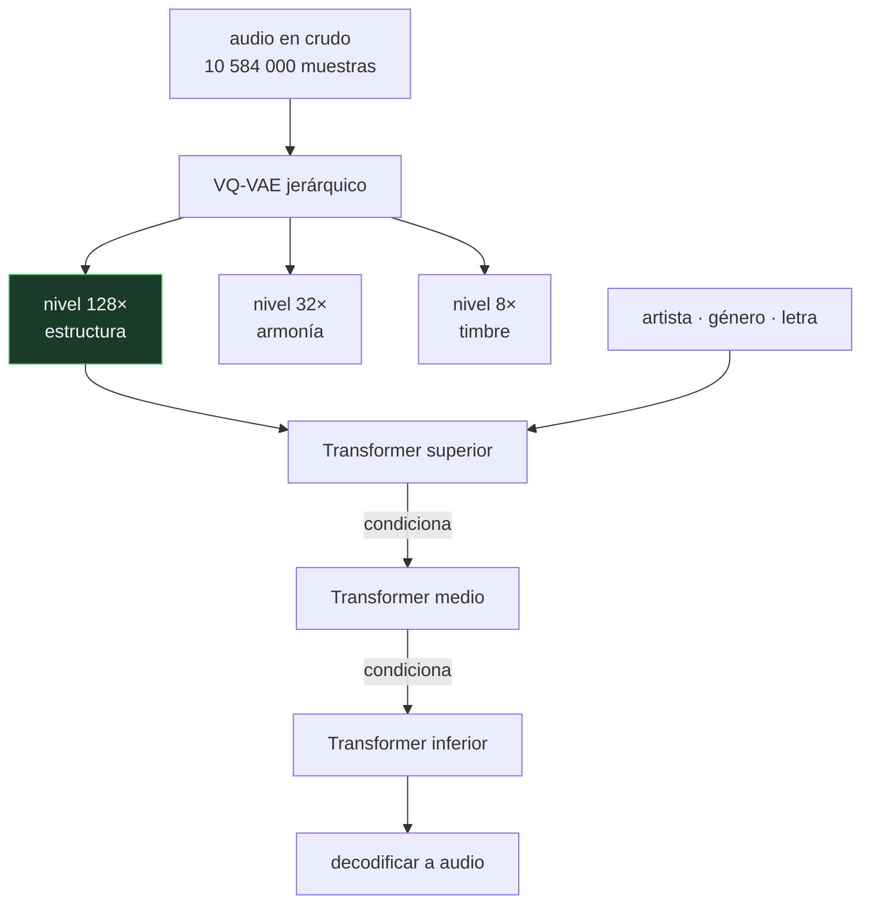

# P127 — Jukebox

> Ruta de medios · Cuatro minutos de canción son diez millones y medio de muestras.
> Antes de modelar hay que comprimir, y cuánto se comprime decide qué se puede aprender.

**Nivel:** L3 · **Motor:** `jukebox` · **Notebook:** [`P127_jukebox.ipynb`](../../../notebooks/papers/P127_jukebox.ipynb)
· **Anexo:** [complejidad y coste](../../annexes/A05_COMPLEJIDAD_Y_COSTE.md)

## 1. Identificación

| Campo | Valor |
|---|---|
| **Título original** | *Jukebox: A Generative Model for Music* |
| **Autoría** | Prafulla Dhariwal, Heewoo Jun, Christine Payne, Jong Wook Kim, Alec Radford, Ilya Sutskever |
| **Año** | 2020 |
| **Venue** | arXiv:2005.00341 |
| **Fuente primaria** | [arXiv:2005.00341](https://arxiv.org/abs/2005.00341) |
| **Acceso** | Abierto |
| **Fecha de consulta** | 2026-08-18 |

## 2. Problema anterior

[WaveNet](../P119_wavenet/README.md) demostró que se puede modelar la forma de onda, pero a
escala de segundos. Una canción son cuatro minutos: **más de diez millones de muestras** a 44,1 kHz,
en estéreo.

Y no basta con comprimir. La música ocurre a escalas radicalmente distintas a la vez: el timbre se
juega en milisegundos, el ritmo en décimas de segundo, la armonía en compases y la forma —estrofa,
estribillo, puente— en minutos. Comprimir a una sola escala obliga a elegir cuál de esas cosas se
conserva, y ninguna elección es buena.

## 3. Propuesta

Separar el problema en dos mitades y resolver cada una con lo suyo:

1. **Comprimir con un cuantizador vectorial jerárquico** (VQ-VAE) que codifica el audio en **tres
   niveles** de compresión distintos: 8×, 32× y 128×. Cada nivel produce una secuencia de códigos
   discretos, y cuanto más comprime, menos detalle guarda y más tiempo abarca.
2. **Modelar cada nivel con un Transformer autorregresivo**, empezando por el más grueso. Los
   niveles finos se generan **condicionados** por el grueso, así que no tienen que decidir la
   estructura: solo rellenar el detalle.

Y un condicionamiento adicional que es lo que hace el resultado memorable: artista, género y letra
alineada, de modo que el modelo canta un texto dado con un estilo dado.

## 4. Intuición sin fórmulas

Dibujar un cuadro grande. Primero el boceto a carboncillo —la composición, dónde va cada cosa—,
luego los volúmenes, y al final el detalle de la textura.

Si empiezas por el detalle, acabas con una esquina exquisita y un cuadro sin composición. La
jerarquía impone el orden: lo que decide la forma se decide primero.

**Dónde deja de funcionar la analogía:** el pintor ve el lienzo entero mientras trabaja. Aquí ni el
nivel más grueso abarca la canción completa, y esa es exactamente la limitación que le queda a
Jukebox.

## 5. Matemática mínima

```text
Cuantización vectorial: audio → secuencia de códigos de un diccionario finito
Jerarquía: tres niveles con factores de compresión 8×, 32× y 128×
```

Para cuatro minutos a 44,1 kHz —**10 584 000** muestras—:

| Nivel | Compresión | Códigos | Ventana de 8 192 abarca |
|---|---:|---:|---:|
| superior | 128× | 82 687 | **23,8 s** |
| medio | 32× | 330 750 | 5,9 s |
| inferior | 8× | 1 323 000 | **1,5 s** |

Dos lecturas. La primera: comprimir 128× cuesta fidelidad — el error de reconstrucción es **3,9×**
peor que a 8×. La segunda es el límite real del sistema: **ningún nivel cubre la canción**. El más
grueso llega a 23,8 s de 240.

Hay que generar por ventanas solapadas, y por eso a Jukebox se le nota la falta de estructura a
escala de pieza.

<!-- puente:inicio -->
> [!TIP]
> **Puente matemático.** Esta sección da por sabido lo siguiente. Si algo no te suena,
> léelo primero: está explicado una sola vez, en un solo sitio, y sirve para todas las fichas.

| Dónde | Qué necesitas de ahí |
|---|---|
| [**A05 §2** · El cruce: atención frente a recurrencia](../../annexes/A05_COMPLEJIDAD_Y_COSTE.md#2-el-cruce-atención-frente-a-recurrencia) | por qué la longitud de la secuencia es lo que decide qué se puede modelar, y por qué comprimir es la única palanca |
<!-- puente:fin -->

## 6. Arquitectura o flujo



## 7. Qué observar en el paper original

- El **alineamiento de la letra** con el audio, que es lo que permite que cante un texto concreto.
  Es un problema de atención sobre secuencias de longitudes muy distintas.
- Las **decisiones de entrenamiento del VQ-VAE**: colapso del diccionario, pérdida de compromiso, y
  todos los trucos que hacen falta para que la cuantización no degenere.
- La honestidad del artículo sobre la **falta de estructura a escala de canción**, que reconoce
  explícitamente como su limitación principal.
- La **sección sobre memorización**: los autores comprueban cuánto del entrenamiento reproduce el
  modelo, que es una pregunta que en música tiene consecuencias legales inmediatas.

## 8. Evidencia y resultados

El artículo aporta muestras generadas —muchas, y públicas—, mediciones de reconstrucción del
VQ-VAE y un análisis de memorización.

> La evidencia principal es perceptual y no cuantitativa: hay que escuchar. Eso es apropiado para el
> problema y a la vez difícil de comparar entre trabajos, que es una debilidad del área.

La miniatura no genera música: calcula la aritmética de la jerarquía y mide el compromiso entre
compresión y fidelidad reconstruyendo una señal de juguete con la media de cada bloque. El error de
un cuantizador entrenado es mucho menor.

## 9. Impacto

- Fue la primera demostración de que un modelo puede generar **canciones con voz cantada
  reconocible**, no solo texturas o melodías.
- Estableció la **jerarquía temporal** como la forma de abordar audio largo, idea que heredan
  AudioLM, [MusicLM](../P129_musiclm/README.md) y MusicGen.
- Su cuantizador fue sustituido por códecs neuronales mejores —EnCodec, SoundStream— pero el patrón
  «comprimir a tokens discretos y modelar los tokens» es hoy universal en audio.
- Y puso sobre la mesa el problema de derechos: un modelo que imita a un artista concreto plantea
  preguntas que el artículo aborda pero no resuelve.

## 10. Limitaciones

1. **No hay estructura a escala de canción.** Ni el nivel grueso abarca la pieza, y generar por
   ventanas solapadas produce fragmentos coherentes que no forman un todo.
2. **Generar es lentísimo**: horas de cómputo por minuto de audio, lo que lo dejaba fuera de
   cualquier uso interactivo.
3. **La calidad de audio es limitada** por el cuantizador: se oyen artefactos característicos.
4. **La letra se entiende a medias.** El alineamiento funciona, pero la dicción es irregular.
5. **Imita artistas concretos**, lo que plantea un problema de derechos que el artículo reconoce sin
   resolver.

## 11. Errores comunes

| Error | Corrección |
|---|---|
| «Con más capas o más datos se resolvería la estructura larga» | El límite es la ventana: ni el nivel grueso abarca la canción. Es un problema de representación, no de tamaño. |
| «Comprimir más es siempre mejor porque acorta la secuencia» | Cuesta fidelidad: en la miniatura, comprimir 128× da un error 3,9× peor que a 8×. Por eso hay tres niveles condicionados y no uno. |
| «Los tres niveles son tres calidades» | Son tres horizontes temporales. El grueso abarca 23,8 s y el fino 1,5 s con la misma ventana: sirven para cosas distintas. |
| «Jukebox genera música en tiempo real» | Tardaba horas por minuto de audio. La generación autorregresiva sobre secuencias largas era, y sigue siendo, cara. |
| «Que el modelo imite a un artista es un detalle técnico» | Es un problema de derechos que el propio artículo aborda, incluyendo un análisis de cuánto memoriza del entrenamiento. |

## 12. Relación con trabajos anteriores

- **[P119 WaveNet](../P119_wavenet/README.md) (2016)** — modelar audio en crudo, a escala de
  segundos.
- **[P38 Autocodificador variacional](../P38_vae/README.md) (2013)** — la familia de la que desciende
  el cuantizador vectorial.
- **[P08 Transformer](../P08_transformer/README.md) (2017)** — el modelo que se aplica a cada nivel
  de códigos.

## 13. Relación con trabajos posteriores

- **[P129 MusicLM](../P129_musiclm/README.md) (2023)** — la misma jerarquía, con texto como
  condicionamiento y tokens semánticos.
- **Défossez et al. (2022)** — EnCodec: el códec neuronal que sustituyó a este cuantizador.
  [arXiv:2210.13438](https://arxiv.org/abs/2210.13438)
- **van den Oord et al. (2017)** — VQ-VAE, la cuantización vectorial original.
  [arXiv:1711.00937](https://arxiv.org/abs/1711.00937)

## 14. Notebook asociado

[`P127_jukebox.ipynb`](../../../notebooks/papers/P127_jukebox.ipynb)

**Qué implementa:** la aritmética de la jerarquía —cuántos códigos y cuánto tiempo abarca cada nivel con una ventana fija— y el compromiso medido entre factor de compresión y error de reconstrucción.

**Qué NO implementa:** no se genera música ni se entrena ningún cuantizador: la reconstrucción se hace promediando bloques, que es mucho peor que un VQ-VAE real.

```bash
ai-evolution paper-lab P127 --seed 7
```

## 15. Actividades Bloom

| Nivel | Actividad |
|---|---|
| **Recordar** | Describe los tres niveles de la jerarquía y para qué sirve cada uno. |
| **Explicar** | Explica por qué comprimir es obligatorio antes de modelar. |
| **Aplicar** | Ejecuta el notebook y comprueba cuánto tiempo abarca cada nivel. |
| **Analizar** | Analiza por qué ningún nivel cubre la canción y qué consecuencia tiene. |
| **Evaluar** | «Con una ventana mayor se arreglaría la estructura». Evalúa la afirmación. |
| **Crear** | Toma una pieza que conozcas y anota a qué escala temporal ocurre cada cosa que la hace reconocible. Compáralo con los tres niveles. |

## 16. Autoevaluación

1. ¿Cuántas muestras son cuatro minutos a 44,1 kHz?
2. ¿Por qué tres niveles y no uno?
3. ¿Qué cuesta comprimir más?
4. ¿Cubre algún nivel la canción entera?
5. ¿Cómo se genera entonces una canción completa?
6. ¿Qué condicionamiento recibe el nivel superior?
7. ¿Cuál es la limitación que el artículo reconoce?

## 17. Respuestas esperadas

1. **10 584 000**. Ningún modelo autorregresivo opera sobre esa longitud, y por eso hay que comprimir antes de modelar.
2. Porque la música ocurre a escalas muy distintas: el timbre en milisegundos y la forma en minutos. Cada nivel es un horizonte temporal distinto, no una calidad distinta.
3. Fidelidad. En la miniatura, comprimir 128× da un error de reconstrucción 3,9× peor que comprimir 8×.
4. No. El más grueso abarca 23,8 s con una ventana de 8 192 códigos, y la canción dura 240.
5. Por ventanas solapadas. Eso produce fragmentos coherentes entre sí que no llegan a formar una estructura de pieza, y es la limitación principal.
6. Artista, género y la letra alineada con el audio. Eso es lo que permite que cante un texto concreto con un estilo dado.
7. La falta de estructura a escala de canción. Los autores lo dicen explícitamente en vez de dejarlo a que el lector lo note.

## 18. Fuentes primarias

- Dhariwal, P. et al. (2020). *Jukebox: A Generative Model for Music*. **arXiv:2005.00341**.
  [arxiv.org/abs/2005.00341](https://arxiv.org/abs/2005.00341) · consultado 2026-08-18.
- van den Oord, A., Vinyals, O. y Kavukcuoglu, K. (2017). *Neural Discrete Representation Learning*.
  [arXiv:1711.00937](https://arxiv.org/abs/1711.00937) · consultado 2026-08-18.
- Défossez, A. et al. (2022). *High Fidelity Neural Audio Compression*.
  [arXiv:2210.13438](https://arxiv.org/abs/2210.13438) · consultado 2026-08-18.

---

[⬅️ Anterior: P126 Donut](../P126_donut/README.md) ·
[📇 Índice](../../catalog/PAPERS_INDEX.md) ·
[📝 Evaluación](../../../assessments/papers/P127_jukebox.md) ·
[🏫 Clase 093 · Generación musical y de audio](../../../classes/part-07-generative-ai-across-media/093-generacion-musical-y-de-audio/README.md) ·
[➡️ Siguiente: P128 NeRF](../P128_nerf/README.md)
