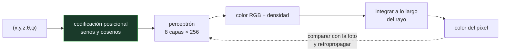

# P128 — NeRF

> Ruta de medios · Guardar una escena como rejilla cuesta al cubo de la resolución.
> Guardarla como una función cuesta lo que ocupe el perceptrón, y no depende de ella.

**Nivel:** L3 · **Motor:** `nerf` · **Notebook:** [`P128_nerf.ipynb`](../../../notebooks/papers/P128_nerf.ipynb)
· **Anexo:** [cálculo y gradientes](../../annexes/A03_CALCULO_Y_GRADIENTES.md)

## 1. Identificación

| Campo | Valor |
|---|---|
| **Título original** | *NeRF: Representing Scenes as Neural Radiance Fields for View Synthesis* |
| **Autoría** | Ben Mildenhall, Pratul P. Srinivasan, Matthew Tancik, Jonathan T. Barron, Ravi Ramamoorthi, Ren Ng |
| **Año** | 2020 |
| **Venue** | ECCV 2020, 405–421 |
| **Fuente primaria** | [doi:10.1007/978-3-030-58452-8_24](https://doi.org/10.1007/978-3-030-58452-8_24) |
| **Acceso** | Restringido |
| **Fecha de consulta** | 2026-08-18 |

## 2. Problema anterior

Sintetizar una vista nueva de una escena a partir de fotografías exige representarla de alguna
manera, y las dos opciones clásicas fallan por motivos distintos.

Una **rejilla de vóxeles** cuesta O(n³): duplicar la resolución multiplica la memoria por ocho, y las
rejillas capaces de resolver detalle fino no caben. Una **malla** exige reconstruir geometría
explícita, y eso se rompe con todo lo que no tiene superficie clara: pelo, humo, vidrio, follaje.

Y ninguna de las dos representa bien los efectos que dependen del ángulo de vista, como un reflejo
especular que se mueve al girar la cabeza.

## 3. Propuesta

Dejar de guardar la escena y **guardar una función que la describa**:

```text
F(x, y, z, θ, φ)  →  (color RGB, densidad σ)
```

Esa función la representa un perceptrón multicapa entrenado con las fotografías disponibles. Para
renderizar un píxel se lanza un rayo, se muestrea la función a lo largo de él y se integra con la
ecuación de renderizado volumétrico.

Dos detalles hacen que funcione. La **codificación posicional**: alimentar el perceptrón con senos y
cosenos de la posición a varias frecuencias, sin lo cual solo aprende variaciones suaves. Y el
**muestreo jerárquico**: una pasada gruesa localiza dónde hay materia y una fina concentra ahí las
muestras.

## 4. Intuición sin fórmulas

Guardar un mapa. Una opción es una rejilla de casillas con lo que hay en cada una: cuanto más fina
la rejilla, más pesa el fichero, y siempre hay un límite de detalle.

La otra es guardar una **fórmula** que, dada una coordenada, te diga qué hay ahí. Ocupa lo mismo
para cualquier detalle, y se puede consultar en cualquier punto, incluso entre casillas.

**Dónde deja de funcionar la analogía:** la fórmula hay que evaluarla cada vez que consultas. Ahí
está el coste de NeRF, y es la razón de que renderizar sea lentísimo.

## 5. Matemática mínima

```text
Renderizado volumétrico a lo largo de un rayo:

    C = Σᵢ Tᵢ · (1 − e^(−σᵢ·δᵢ)) · cᵢ        con  Tᵢ = Πⱼ<ᵢ (1 − αⱼ)
                                                   ↑ transmitancia acumulada
```

**Memoria.** Una rejilla explícita con color y densidad:

| Lado | Megabytes |
|---:|---:|
| 64 | 4,2 |
| 256 | 268,4 |
| **1024** | **17 180** |

El perceptrón equivalente son **477 188 parámetros** = **1,91 MB**, y **no depende de la
resolución**.

**Oclusión.** Sale sola de la integral: en la miniatura, la superficie a t=3 aporta **0,918** al
color y lo que hay justo detrás, a t=4, aporta **0,075** — **12×** menos. Nadie programó «lo de
delante tapa lo de atrás».

**Codificación posicional.** Dos puntos separados 0,005 están a **0,005** sin codificar y a
**3,124** codificados: **625× más separados**. Sin ella el perceptrón no puede representar bordes.

<!-- puente:inicio -->
> [!TIP]
> **Puente matemático.** Esta sección da por sabido lo siguiente. Si algo no te suena,
> léelo primero: está explicado una sola vez, en un solo sitio, y sirve para todas las fichas.

| Dónde | Qué necesitas de ahí |
|---|---|
| [**A03 §1** · Derivada: la pregunta que resuelve](../../annexes/A03_CALCULO_Y_GRADIENTES.md#1-derivada-la-pregunta-que-resuelve) | por qué el renderizado tiene que ser diferenciable para que las fotografías puedan entrenar la función |
<!-- puente:fin -->

## 6. Arquitectura o flujo



## 7. Qué observar en el paper original

- La **ablación de la codificación posicional**. Es la figura más didáctica del artículo: sin ella,
  el resultado es una mancha borrosa.
- El **muestreo jerárquico** en dos pasadas, que es lo que evita gastar todas las muestras en el
  vacío — parcialmente, porque sigue gastando muchas.
- Que la dirección de vista entra **al final** de la red, solo para el color y no para la densidad.
  Esa asimetría es deliberada: la geometría no debe depender de desde dónde se mire.
- El **procedimiento de entrenamiento**: una red por escena, entrenada desde cero con las fotos.
  Esto no es un modelo preentrenado que generaliza.

## 8. Evidencia y resultados

Comparación cuantitativa con los métodos previos de síntesis de vistas en varios conjuntos, con
métricas de calidad de imagen, más una ablación completa de cada componente.

> La evidencia es sólida y la ablación permite atribuir la mejora a cada pieza. El coste
> computacional, en cambio, se reporta con honestidad y es demoledor: días de entrenamiento por
> escena.

La miniatura no entrena nada. Calcula memoria, la integral de un rayo con cinco muestras y el efecto
de la codificación. Lo que no muestra es el coste de renderizar, que es lo que motivó todo el
trabajo posterior.

## 9. Impacto

- Abrió el campo de las **representaciones neuronales implícitas**, con centenares de trabajos
  derivados en dos años.
- Cambió la reconstrucción 3D en efectos visuales, cartografía, patrimonio y robótica.
- Motivó una carrera por acelerarlo: Instant-NGP con tablas hash, y finalmente
  [Gaussian Splatting](../P132_gaussian_splatting/README.md), que abandona la representación
  implícita para recuperar velocidad.
- Y dejó una idea general que va más allá del 3D: **una red puede ser la representación de un
  objeto**, no solo un clasificador de objetos.

## 10. Limitaciones

1. **Renderizar es lentísimo.** Cada píxel exige decenas de consultas al perceptrón a lo largo de
   su rayo, y la mayoría caen en el vacío.
2. **Entrenar también**: días por escena en el artículo original.
3. **Una red por escena.** No hay generalización: el modelo entrenado sirve para esa escena y para
   ninguna otra.
4. **Necesita poses de cámara conocidas** y con precisión, lo que en la práctica exige un paso
   previo de reconstrucción.
5. **Supone escena estática y iluminación fija.** El movimiento y los cambios de luz rompen el
   supuesto.

## 11. Errores comunes

| Error | Corrección |
|---|---|
| «Cabe en 2 MB, luego es barato» | La memoria es mínima y el coste está en renderizar: decenas de consultas al perceptrón por píxel. Por eso tardaba segundos por fotograma. |
| «Hay que programar qué superficie es visible» | Sale de la integral. En la miniatura, lo que está detrás aporta 12× menos al color sin que nadie escriba esa regla. |
| «La codificación posicional es un detalle de implementación» | Sin ella el perceptrón solo representa variaciones suaves y el resultado es una mancha. Separa dos puntos vecinos 625× más. |
| «NeRF es un modelo preentrenado que reconstruye cualquier escena» | Es una red por escena, entrenada desde cero con sus fotografías. No generaliza a escenas nuevas. |
| «Una rejilla de alta resolución sería equivalente» | Cuesta O(n³): con lado 1024 son 17 180 MB frente a 1,91 MB del perceptrón, y sigue sin poder consultarse entre celdas. |

## 12. Relación con trabajos anteriores

- **[P02 Retropropagación](../P02_backpropagation/README.md) (1986)** — el entrenamiento que hace
  posible ajustar la función a las fotografías.
- **[P44 ResNet](../P44_resnet/README.md) (2015)** — la profundidad que el perceptrón aprovecha.
- **Tancik et al. (2020)** — el análisis de por qué hace falta la codificación posicional.
  [arXiv:2006.10739](https://arxiv.org/abs/2006.10739)

## 13. Relación con trabajos posteriores

- **[P132 Splatting de gaussianas](../P132_gaussian_splatting/README.md) (2023)** — abandonar lo
  implícito para recuperar tiempo real.
- **Müller et al. (2022)** — Instant-NGP: la misma representación, entrenada en segundos.
  [doi:10.1145/3528223.3530127](https://doi.org/10.1145/3528223.3530127)
- **[P17 Difusión](../P17_diffusion/README.md) (2020)** — la otra vía para generar contenido visual,
  con supuestos completamente distintos.

## 14. Notebook asociado

[`P128_nerf.ipynb`](../../../notebooks/papers/P128_nerf.ipynb)

**Qué implementa:** el coste en memoria de una rejilla explícita frente al perceptrón, la composición de un rayo con transmitancia y el efecto de la codificación posicional sobre la distancia entre dos puntos vecinos.

**Qué NO implementa:** no se entrena ni se renderiza nada. El coste que motivó todo el trabajo posterior —las decenas de consultas por píxel— no aparece aquí.

```bash
ai-evolution paper-lab P128 --seed 7
```

## 15. Actividades Bloom

| Nivel | Actividad |
|---|---|
| **Recordar** | Escribe la ecuación del renderizado volumétrico. |
| **Explicar** | Explica por qué una rejilla explícita no escala. |
| **Aplicar** | Ejecuta el notebook y comprueba cómo la transmitancia resuelve la oclusión. |
| **Analizar** | Analiza por qué sin codificación posicional el resultado es borroso. |
| **Evaluar** | «Ocupa 2 MB, es una representación muy eficiente». Evalúa la afirmación. |
| **Crear** | Calcula la memoria de una rejilla que resolviera 1 mm en una habitación de 5 m y compárala con el perceptrón. |

## 16. Autoevaluación

1. ¿Qué representa exactamente la función que aprende NeRF?
2. ¿Por qué la memoria no depende de la resolución?
3. ¿Quién decide que lo de delante tapa lo de atrás?
4. ¿Para qué sirve la codificación posicional?
5. ¿Por qué la dirección de vista entra al final de la red?
6. ¿Generaliza el modelo a escenas nuevas?
7. ¿Dónde está su coste real?

## 17. Respuestas esperadas

1. Una función que va de una posición en el espacio y una dirección de vista a un color y una densidad. La escena no se guarda: se guarda quien sabe describirla.
2. Porque lo que se almacena son los pesos del perceptrón, no un muestreo del espacio. La función se puede consultar en cualquier punto con la precisión que se pida.
3. La integral de renderizado, a través de la transmitancia acumulada. En la miniatura, lo que hay detrás de una superficie densa aporta 12× menos al color.
4. Para que el perceptrón pueda representar variaciones bruscas. Separa dos puntos vecinos 625× más en el espacio de entrada; sin ella solo aprende funciones suaves.
5. Porque la geometría no debe depender de desde dónde se mire. La densidad sale antes de introducir la dirección; solo el color la usa.
6. No. Es una red por escena, entrenada desde cero con sus fotografías.
7. En renderizar: decenas de consultas al perceptrón por píxel, la mayoría en el vacío. De ahí salen Instant-NGP y el splatting de gaussianas.

## 18. Fuentes primarias

- Mildenhall, B. et al. (2020). *NeRF: Representing Scenes as Neural Radiance Fields for View
  Synthesis*. **ECCV 2020**, 405–421.
  [doi:10.1007/978-3-030-58452-8_24](https://doi.org/10.1007/978-3-030-58452-8_24) ·
  consultado 2026-08-18.
- Tancik, M. et al. (2020). *Fourier Features Let Networks Learn High Frequency Functions*.
  [arXiv:2006.10739](https://arxiv.org/abs/2006.10739) · consultado 2026-08-18.
- Müller, T. et al. (2022). *Instant Neural Graphics Primitives*.
  [doi:10.1145/3528223.3530127](https://doi.org/10.1145/3528223.3530127) · consultado 2026-08-18.

---

[⬅️ Anterior: P127 Jukebox](../P127_jukebox/README.md) ·
[📇 Índice](../../catalog/PAPERS_INDEX.md) ·
[📝 Evaluación](../../../assessments/papers/P128_nerf.md) ·
[🏫 Clase 096 · Generación 3D y mundos sintéticos](../../../classes/part-07-generative-ai-across-media/096-generacion-3d-y-mundos-sinteticos/README.md) ·
[➡️ Siguiente: P129 MusicLM](../P129_musiclm/README.md)
