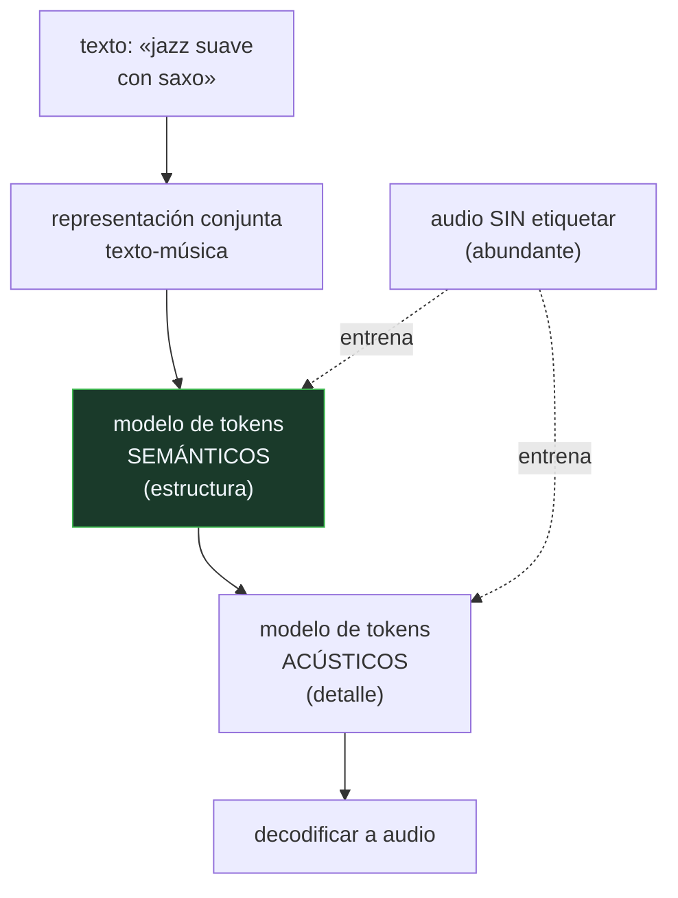

# P129 — MusicLM

> Ruta de medios · Una pieza vuelve a su motivo en el compás 64 y la ventana acústica
> llega a 20. Cuando toca reexponer, no queda rastro de qué había que reexponer.

**Nivel:** L3 · **Motor:** `musiclm` · **Notebook:** [`P129_musiclm.ipynb`](../../../notebooks/papers/P129_musiclm.ipynb)
· **Anexo:** [complejidad y coste](../../annexes/A05_COMPLEJIDAD_Y_COSTE.md)

## 1. Identificación

| Campo | Valor |
|---|---|
| **Título original** | *MusicLM: Generating Music From Text* |
| **Autoría** | Andrea Agostinelli, Timo I. Denk, Zalán Borsos, Jesse Engel, Mauro Verzetti, Antoine Caillon y otros |
| **Año** | 2023 |
| **Venue** | arXiv:2301.11325 |
| **Fuente primaria** | [arXiv:2301.11325](https://arxiv.org/abs/2301.11325) |
| **Acceso** | Abierto |
| **Fecha de consulta** | 2026-08-18 |

## 2. Problema anterior

Generar música desde una descripción en texto choca con dos escaseces distintas.

La primera es de **datos**: los pares texto-música son rarísimos. Casi nadie escribe al lado de una
canción qué instrumentos suenan, en qué tempo y con qué ambiente. Frente a los miles de millones de
pares texto-imagen que hay en la web, aquí se cuentan por decenas de miles.

La segunda es de **horizonte**. Con tokens acústicos —los que llevan el timbre— una ventana de
contexto normal abarca unos veinte compases. Una pieza con forma vuelve a su motivo mucho después de
eso, y el modelo no tiene forma de recordar que hubo un motivo.

## 3. Propuesta

Dos ideas, una por problema.

**Contra la escasez de datos**: usar una representación conjunta de texto y música —entrenada
aparte con pares ruidosos— para condicionar el modelo. Eso permite entrenar el grueso del sistema
con **audio sin etiquetar**, que sí abunda.

**Contra el horizonte**: una jerarquía de dos tipos de token. Los **semánticos** salen a baja
frecuencia y llevan la estructura; los **acústicos**, a alta frecuencia, llevan el detalle. El
modelo predice primero los semánticos —donde una ventana normal abarca la pieza entera— y luego los
acústicos condicionados por ellos.

Y una tercera aportación que no es un modelo: **MusicCaps**, 5 500 clips descritos por músicos
profesionales, para que la tarea se pueda evaluar.

## 4. Intuición sin fórmulas

Contar una historia larga. Si solo recuerdas las últimas frases, puedes escribir párrafos
correctos que no forman un relato: no sabes que había un personaje al que volver.

Un guion de una página —«presentación, conflicto, resolución»— cabe en la memoria y basta para que
todo lo demás encaje.

**Dónde deja de funcionar la analogía:** el guion lo escribe alguien. Aquí los tokens semánticos se
aprenden sin supervisión, y lo que capturan no coincide necesariamente con lo que un músico llamaría
estructura.

## 5. Matemática mínima

No hay formalismo nuevo: la aportación es de arquitectura y de datos. Lo medible es el horizonte.

```text
acústico  : 50 tokens/compás  →  ventana 1024 abarca   20,5 compases
semántico :  2 tokens/compás  →  ventana 1024 abarca  512   compases
```

La miniatura usa una pieza de 96 compases con forma A-B-A, donde el motivo vuelve en el compás 64.
Midiendo, durante toda la reexposición, si la exposición original queda dentro de la ventana:

| Escala | Compases con la exposición a la vista |
|---|---:|
| acústica | **0 de 32** |
| semántica | **32 de 32** |

No son dos calidades: son dos **horizontes**. Y agrandar la ventana no lo arregla — doblarla lleva
la escala acústica de 20 a 41 compases, y sigue sin llegar a 64.

Sobre los datos: incluso con 4 descripciones por clip, el conjunto anotado son **22 000** pares.

<!-- puente:inicio -->
> [!TIP]
> **Puente matemático.** Esta sección da por sabido lo siguiente. Si algo no te suena,
> léelo primero: está explicado una sola vez, en un solo sitio, y sirve para todas las fichas.

| Dónde | Qué necesitas de ahí |
|---|---|
| [**A05 §2** · El cruce: atención frente a recurrencia](../../annexes/A05_COMPLEJIDAD_Y_COSTE.md#2-el-cruce-atención-frente-a-recurrencia) | por qué agrandar la ventana no es una solución escalable, y por qué cambiar la representación sí lo es |
<!-- puente:fin -->

## 6. Arquitectura o flujo



## 7. Qué observar en el paper original

- **MusicCaps**: 5 500 clips descritos por músicos profesionales. Publicar el conjunto de
  evaluación junto al modelo es lo que permite que el área avance de forma comparable.
- Cómo la representación conjunta permite entrenar con **audio sin etiquetar**, que es lo que
  esquiva la escasez de pares.
- El **estudio de memorización**: los autores comprueban qué fracción de las generaciones reproduce
  fragmentos del entrenamiento. En música eso tiene consecuencias legales directas.
- La decisión de **no publicar los pesos**, que el artículo justifica por riesgo de apropiación
  cultural y de derechos. Es una decisión discutible y está argumentada.

## 8. Evidencia y resultados

Evaluación con métricas automáticas de fidelidad y adherencia al texto, más un estudio con
oyentes humanos comparando contra los sistemas previos.

> La evaluación de música generada es un problema abierto: las métricas automáticas correlacionan
> mal con el juicio humano, y el propio artículo publica MusicCaps precisamente porque no había con
> qué comparar.

La miniatura no genera nada: simula la forma de una pieza con etiquetas de sección y mide qué
alcanza cada ventana. La predicción por sección es un sustituto burdo de un modelo autorregresivo.

## 9. Impacto

- Estableció la generación texto-a-música de calidad como problema resuelto en lo esencial, y
  abrió la vía comercial que siguieron Suno y Udio.
- **MusicCaps** se convirtió en el banco de referencia del área.
- La jerarquía semántico-acústica —heredada de AudioLM— es hoy el patrón estándar en generación de
  audio largo.
- Y su decisión de no publicar pesos, junto con el estudio de memorización, marcó el tono de la
  discusión sobre derechos en música generada, que sigue sin resolverse.

## 10. Limitaciones

1. **No se publicaron los pesos**, lo que impide reproducir y auditar el sistema de forma
   independiente.
2. **La evaluación de música es un problema abierto.** Las métricas automáticas correlacionan mal
   con el juicio humano.
3. **El texto describe música muy mal.** Muchos atributos que importan —articulación, dinámica,
   sensación rítmica— no tienen vocabulario común.
4. **La memorización existe.** El artículo la mide y no es cero, con las consecuencias legales que
   eso arrastra.
5. **La estructura mejora pero no se resuelve.** Los tokens semánticos capturan algo, no
   necesariamente lo que un músico llamaría forma.

## 11. Errores comunes

| Error | Corrección |
|---|---|
| «Basta con agrandar la ventana de contexto» | Doblarla lleva la escala acústica de 20 a 41 compases y el motivo vuelve en el 64. Es un problema de representación, no de tamaño. |
| «Los tokens semánticos son una versión de menor calidad de los acústicos» | Son otro horizonte. Con la misma ventana, los semánticos abarcan 512 compases y los acústicos 20,5: sirven para cosas distintas. |
| «El cuello de botella es el modelo» | La mitad del problema son los datos: incluso con 4 descripciones por clip, el conjunto anotado son 22 000 pares frente a miles de millones en imagen. |
| «Si suena bien, la evaluación está resuelta» | Las métricas automáticas correlacionan mal con el juicio humano. Por eso el artículo publica MusicCaps además del modelo. |
| «Un modelo generativo no memoriza» | El artículo lo mide y no es cero. En música, reproducir fragmentos del entrenamiento tiene consecuencias legales inmediatas. |

## 12. Relación con trabajos anteriores

- **[P127 Jukebox](../P127_jukebox/README.md) (2020)** — la jerarquía temporal de la que parte, sin
  condicionamiento por texto.
- **[P18 CLIP](../P18_clip/README.md) (2021)** — la representación conjunta de dos modalidades, aquí
  aplicada a texto y música.
- **Borsos et al. (2023)** — AudioLM, la jerarquía semántico-acústica original.
  [arXiv:2209.03143](https://arxiv.org/abs/2209.03143)

## 13. Relación con trabajos posteriores

- **Copet et al. (2023)** — MusicGen: la alternativa de un solo modelo, con pesos publicados.
  [arXiv:2306.05284](https://arxiv.org/abs/2306.05284)
- **[P133 Colapso de modelo](../P133_colapso_de_modelo/README.md) (2024)** — qué le pasa a un corpus
  cuando se llena de lo que estos modelos generan.
- **[P130 VALL-E](../P130_vall_e/README.md) (2023)** — la misma idea de tokens de códec, aplicada a
  la voz.

## 14. Notebook asociado

[`P129_musiclm.ipynb`](../../../notebooks/papers/P129_musiclm.ipynb)

**Qué implementa:** cuántos compases abarca cada escala de token con la misma ventana, y si la exposición original queda a la vista durante la reexposición en cada caso.

**Qué NO implementa:** no hay audio ni modelo: se simula la forma de una pieza con etiquetas de sección. La coherencia real de MusicLM se evalúa con oyentes, no con este cálculo.

```bash
ai-evolution paper-lab P129 --seed 7
```

## 15. Actividades Bloom

| Nivel | Actividad |
|---|---|
| **Recordar** | Explica la diferencia entre tokens semánticos y acústicos. |
| **Explicar** | Describe las dos escaseces que aborda el artículo. |
| **Aplicar** | Ejecuta el notebook y compara el alcance de cada escala. |
| **Analizar** | Analiza por qué agrandar la ventana no resuelve el problema. |
| **Evaluar** | «Con más datos de música el modelo tendría mejor estructura». Evalúa la afirmación. |
| **Crear** | Elige una pieza con forma clara y mide en segundos la distancia entre exposición y reexposición. Compárala con la ventana de un modelo que uses. |

## 16. Autoevaluación

1. ¿Qué dos escaseces aborda MusicLM?
2. ¿Qué llevan los tokens semánticos?
3. ¿Cuántos compases abarca cada escala?
4. ¿Por qué no basta agrandar la ventana?
5. ¿Qué es MusicCaps y por qué importa?
6. ¿Cómo se esquiva la falta de pares texto-música?
7. ¿Por qué no se publicaron los pesos?

## 17. Respuestas esperadas

1. La de datos —los pares texto-música son rarísimos— y la de horizonte: el detalle acústico gasta tantos tokens que la ventana no alcanza la estructura de la pieza.
2. La estructura: qué sección es esta, qué había antes, a qué hay que volver. Salen a baja frecuencia, así que caben muchos compases en la misma ventana.
3. Con 1 024 tokens, la acústica abarca 20,5 compases y la semántica 512. En la miniatura, la acústica ve la exposición en 0 de 32 compases y la semántica en 32 de 32.
4. Porque el crecimiento es lineal en la ventana y el problema es de densidad de tokens. Doblarla lleva la escala acústica de 20 a 41 compases, y el motivo vuelve en el 64.
5. Un conjunto de 5 500 clips descritos por músicos profesionales. Importa porque sin banco de evaluación común los sistemas no se pueden comparar.
6. Con una representación conjunta de texto y música entrenada aparte, que permite condicionar un modelo entrenado en su mayor parte con audio sin etiquetar.
7. Los autores lo justifican por riesgo de apropiación cultural y de derechos, apoyándose en su propio estudio de memorización. Es discutible y está argumentado.

## 18. Fuentes primarias

- Agostinelli, A. et al. (2023). *MusicLM: Generating Music From Text*. **arXiv:2301.11325**.
  [arxiv.org/abs/2301.11325](https://arxiv.org/abs/2301.11325) · consultado 2026-08-18.
- Borsos, Z. et al. (2023). *AudioLM: a Language Modeling Approach to Audio Generation*.
  [arXiv:2209.03143](https://arxiv.org/abs/2209.03143) · consultado 2026-08-18.
- Copet, J. et al. (2023). *Simple and Controllable Music Generation*.
  [arXiv:2306.05284](https://arxiv.org/abs/2306.05284) · consultado 2026-08-18.

---

[⬅️ Anterior: P128 NeRF](../P128_nerf/README.md) ·
[📇 Índice](../../catalog/PAPERS_INDEX.md) ·
[📝 Evaluación](../../../assessments/papers/P129_musiclm.md) ·
[🏫 Clase 093 · Generación musical y de audio](../../../classes/part-07-generative-ai-across-media/093-generacion-musical-y-de-audio/README.md) ·
[➡️ Siguiente: P130 VALL-E](../P130_vall_e/README.md)
