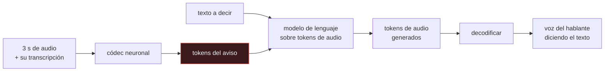

# P130 — VALL-E

> Ruta de medios · Antes hacían falta treinta minutos de grabación y un entrenamiento.
> Ahora bastan tres segundos y ninguno. El resultado técnico y el problema son lo mismo.

**Nivel:** L3 · **Motor:** `vall_e` · **Notebook:** [`P130_vall_e.ipynb`](../../../notebooks/papers/P130_vall_e.ipynb)
· **Anexo:** [probabilidad y verosimilitud](../../annexes/A02_PROBABILIDAD_Y_VEROSIMILITUD.md)

## 1. Identificación

| Campo | Valor |
|---|---|
| **Título original** | *Neural Codec Language Models are Zero-Shot Text to Speech Synthesizers* |
| **Autoría** | Chengyi Wang, Sanyuan Chen, Yu Wu, Ziqiang Zhang, Long Zhou, Shujie Liu y otros |
| **Año** | 2023 |
| **Venue** | arXiv:2301.02111 |
| **Fuente primaria** | [arXiv:2301.02111](https://arxiv.org/abs/2301.02111) |
| **Acceso** | Abierto |
| **Fecha de consulta** | 2026-08-18 |

## 2. Problema anterior

[Tacotron 2](../P122_tacotron/README.md) alcanzó calidad indistinguible de una grabación, pero
para **una** voz, con muchas horas de estudio. Adaptar el sistema a una voz nueva exigía media hora o
más de grabaciones limpias y un ajuste fino del modelo.

Ese requisito funcionaba como barrera de dos tipos. Técnica: personalizar la voz era caro y estaba
al alcance de pocos. Y práctica: para clonar la voz de alguien había que conseguir mucho material
suyo, lo cual no era trivial.

La pregunta abierta era si esa barrera era esencial o solo un artefacto del método.

## 3. Propuesta

Replantear la síntesis como **modelado de lenguaje**.

Un códec neuronal convierte el audio en secuencias de códigos discretos. Si esos códigos son un
vocabulario, sintetizar voz es predecir el siguiente token — exactamente el problema que los modelos
de lenguaje ya resuelven, con todo lo que eso trae: entrenamiento a gran escala, aprendizaje en
contexto y ninguna necesidad de adaptar el modelo por hablante.

La voz objetivo entra como **aviso en contexto**: tres segundos de audio del hablante, más su
transcripción, y el modelo continúa con la voz de esa persona diciendo lo que se le pida. Entrenado
con 60 000 horas de habla, frente a las decenas de horas típicas de los sistemas anteriores.

## 4. Intuición sin fórmulas

Imitar a alguien. La forma antigua era estudiar sus grabaciones durante semanas hasta interiorizar
su manera de hablar.

La nueva es haber estudiado a miles de personas y necesitar solo oír a esta unos segundos para
situarla: no aprendes su voz, reconoces de qué tipo es y la reproduces.

**Dónde deja de funcionar la analogía:** un imitador humano no engaña al teléfono de nadie. El
umbral que importa aquí no es «indistinguible» sino «suficiente para engañar veinte segundos», y ese
se cruzó antes.

## 5. Matemática mínima

```text
Antes  : 30 min de audio del hablante + ajuste fino del modelo
Ahora  :  3 s de audio como AVISO EN CONTEXTO, sin entrenar nada
```

La miniatura mide cuánta información de identidad contiene cada duración, identificando al hablante
entre 40 posibles:

| Duración | Identificación correcta |
|---:|---:|
| 0,5 s | 35,4 % |
| 1 s | 55,8 % |
| **3 s** | **92,1 %** |
| 10 s | 99,2 % |
| 30 s | **100 %** |

Pasar de 3 a 30 segundos —diez veces más audio— aporta **7,9 puntos**. La información de identidad
**se satura muy pronto**, y esa saturación es lo que convierte el resultado técnico en un problema
que no tiene arreglo técnico.

<!-- puente:inicio -->
> [!TIP]
> **Puente matemático.** Esta sección da por sabido lo siguiente. Si algo no te suena,
> léelo primero: está explicado una sola vez, en un solo sitio, y sirve para todas las fichas.

| Dónde | Qué necesitas de ahí |
|---|---|
| [**A02 §5** · Estimadores, sesgo y varianza](../../annexes/A02_PROBABILIDAD_Y_VEROSIMILITUD.md#5-estimadores-sesgo-y-varianza) | por qué el error de una estimación cae con la raíz del tamaño de muestra, y qué significa que una curva se sature |
<!-- puente:fin -->

## 6. Arquitectura o flujo



## 7. Qué observar en el paper original

- La reformulación completa: **la síntesis pasa a ser un problema de modelado de lenguaje**, con
  todo lo que eso arrastra en escala de datos y de cómputo.
- Que preserva no solo el timbre sino el **entorno acústico y el estado emocional** del aviso. Eso
  es lo que hace las muestras convincentes, y también lo más inquietante.
- La escala de datos: **60 000 horas**, dos órdenes de magnitud más que los sistemas previos. Buena
  parte del resultado viene de ahí.
- La **declaración de impacto ético** del artículo, que reconoce el riesgo y propone detección — sin
  aportar el detector.

## 8. Evidencia y resultados

Evaluación en hablantes no vistos con métricas de similitud de hablante y de inteligibilidad, más
comparación con sistemas de adaptación previos.

> Los resultados son sólidos y las muestras públicas son convincentes. Lo que el artículo no aporta
> es la contramedida: reconoce el riesgo y remite a trabajo futuro.

La miniatura mide **reconocimiento**, no generación: modela la identidad como un vector con ruido y
mide cuándo se puede recuperar. Que la identidad sea recuperable con 3 s no demuestra que se pueda
sintetizar con 3 s, aunque el artículo sí lo demuestra.

## 9. Impacto

- Cambió la síntesis de voz personalizada de un problema de datos a uno de disponibilidad: **tres
  segundos de cualquiera están en cualquier vídeo público**.
- El patrón «tokens de códec + modelo de lenguaje» se extendió a toda la generación de audio.
- Aceleró la regulación sobre voz sintética, y las plataformas comerciales empezaron a exigir prueba
  de consentimiento para clonar una voz.
- Y dio a la detección de audio sintético una urgencia que no tenía, en un problema donde el
  detector siempre va por detrás del generador.

## 10. Limitaciones

1. **La detección de voz sintética no está resuelta**, y los detectores envejecen con cada
   generación de sintetizadores.
2. **El consentimiento no es verificable técnicamente.** Un audio de tres segundos no lleva prueba
   de que su dueño autorizara nada.
3. **Hereda los sesgos del corpus**: funciona peor con acentos y voces poco representadas en las
   60 000 horas.
4. **No controla la prosodia explícitamente**: se hereda del aviso, lo que da poca capacidad de
   dirección.
5. **Los pesos no se publicaron**, decisión defendible por riesgo, que a la vez impide auditarlo de
   forma independiente.

## 11. Errores comunes

| Error | Corrección |
|---|---|
| «Con más audio de muestra el clon es mucho mejor» | La identidad se satura: de 3 a 30 segundos —diez veces más audio— la identificación sube 7,9 puntos. Lo esencial ya está en tres segundos. |
| «Es un problema de calidad: mientras el clon sea imperfecto no hay riesgo» | Un clon imperfecto ya sirve para un fraude telefónico. El umbral relevante no es «indistinguible» sino «suficiente durante veinte segundos». |
| «Basta con exigir consentimiento» | El consentimiento no es verificable a partir del audio. Tres segundos de la voz de cualquiera están en cualquier vídeo público. |
| «La detección resolverá el problema» | Los detectores envejecen con cada generación de sintetizadores, y el artículo remite a trabajo futuro sin aportar ninguno. |
| «Es una mejora incremental sobre Tacotron» | Es un cambio de planteamiento: la síntesis pasa a ser modelado de lenguaje sobre tokens de códec, con 60 000 horas de entrenamiento y sin adaptación por hablante. |

## 12. Relación con trabajos anteriores

- **[P122 Tacotron 2](../P122_tacotron/README.md) (2018)** — la calidad alcanzada para una voz con
  muchas horas de estudio.
- **[P10 GPT-3](../P10_gpt3/README.md) (2020)** — el aprendizaje en contexto que aquí se aplica a
  tokens de audio.
- **Défossez et al. (2022)** — EnCodec, el códec cuyos tokens modela.
  [arXiv:2210.13438](https://arxiv.org/abs/2210.13438)

## 13. Relación con trabajos posteriores

- **[P131 Marcas de agua](../P131_marcas_de_agua/README.md) (2023)** — la vía de procedencia: marcar
  al generar en vez de detectar después.
- **ASVspoof** — la línea de trabajo en detección de voz sintética.
  [asvspoof.org](https://www.asvspoof.org/)
- **[P114 Tarjetas de modelo](../P114_tarjetas_de_modelo/README.md) (2019)** — qué habría que
  declarar antes de desplegar algo así.

## 14. Notebook asociado

[`P130_vall_e.ipynb`](../../../notebooks/papers/P130_vall_e.ipynb)

**Qué implementa:** cuánta información de identidad del hablante contiene cada duración de muestra, medida como acierto al identificarlo entre cuarenta, y dónde se satura la curva.

**Qué NO implementa:** se mide reconocimiento, no síntesis, y la identidad se modela como un vector de doce dimensiones con ruido gaussiano. Tampoco se modela la detección de voz sintética.

```bash
ai-evolution paper-lab P130 --seed 7
```

## 15. Actividades Bloom

| Nivel | Actividad |
|---|---|
| **Recordar** | Explica cómo se convierte la síntesis en un problema de modelado de lenguaje. |
| **Explicar** | Describe qué entra como aviso en contexto. |
| **Aplicar** | Ejecuta el notebook y localiza dónde se satura la curva. |
| **Analizar** | Analiza por qué la saturación convierte esto en un problema de política. |
| **Evaluar** | «Mientras el clon sea imperfecto no hay riesgo». Evalúa la afirmación. |
| **Crear** | Define qué política de consentimiento aplicarías para desplegar clonación de voz, con el mecanismo concreto de verificación. |

## 16. Autoevaluación

1. ¿Qué reformulación propone el artículo?
2. ¿Qué entra como aviso en contexto?
3. ¿Cuánta identidad hay en tres segundos?
4. ¿Cuánto se gana con treinta?
5. ¿Qué preserva además del timbre?
6. ¿Por qué el consentimiento no es verificable?
7. ¿Aporta el artículo una contramedida?

## 17. Respuestas esperadas

1. Que la síntesis de voz es modelado de lenguaje: los códigos de un códec neuronal son el vocabulario y sintetizar es predecir el siguiente token.
2. Tres segundos de audio del hablante objetivo más su transcripción. El modelo continúa con esa voz diciendo el texto que se le pida, sin entrenar nada.
3. Casi toda: en la miniatura, el 92,1 % de identificación correcta entre cuarenta hablantes.
4. 7,9 puntos: llega al 100 %. Diez veces más audio para menos de ocho puntos — la curva está saturada.
5. El entorno acústico y el estado emocional del aviso. Eso es lo que hace las muestras convincentes y también lo más inquietante.
6. Porque un audio de tres segundos no lleva prueba de que su dueño autorizara nada, y ese audio está en cualquier vídeo público.
7. No. Reconoce el riesgo en su declaración de impacto y remite la detección a trabajo futuro.

## 18. Fuentes primarias

- Wang, C. et al. (2023). *Neural Codec Language Models are Zero-Shot Text to Speech
  Synthesizers*. **arXiv:2301.02111**. [arxiv.org/abs/2301.02111](https://arxiv.org/abs/2301.02111)
  · consultado 2026-08-18.
- Défossez, A. et al. (2022). *High Fidelity Neural Audio Compression*.
  [arXiv:2210.13438](https://arxiv.org/abs/2210.13438) · consultado 2026-08-18.
- ASVspoof. *Automatic Speaker Verification Spoofing and Countermeasures Challenge*.
  [asvspoof.org](https://www.asvspoof.org/) · consultado 2026-08-18.

---

[⬅️ Anterior: P129 MusicLM](../P129_musiclm/README.md) ·
[📇 Índice](../../catalog/PAPERS_INDEX.md) ·
[📝 Evaluación](../../../assessments/papers/P130_vall_e.md) ·
[🏫 Clase 094 · Síntesis de voz y derechos de identidad](../../../classes/part-07-generative-ai-across-media/094-sintesis-de-voz-y-derechos-de-identidad/README.md) ·
[➡️ Siguiente: P131 Una marca de agua](../P131_marcas_de_agua/README.md)
