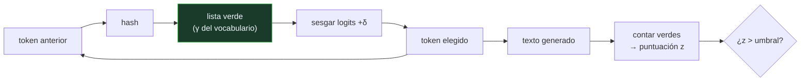

# P131 — Una marca de agua

> Ruta de medios · En vez de reconocer texto generado a posteriori —que falla—, dejar
> la marca al generar: sesgar qué tokens se eligen deja una firma estadística.

**Nivel:** L2 · **Motor:** `marcas_de_agua` · **Notebook:** [`P131_marcas_de_agua.ipynb`](../../../notebooks/papers/P131_marcas_de_agua.ipynb)
· **Anexo:** [probabilidad y verosimilitud](../../annexes/A02_PROBABILIDAD_Y_VEROSIMILITUD.md)

## 1. Identificación

| Campo | Valor |
|---|---|
| **Título original** | *A Watermark for Large Language Models* |
| **Autoría** | John Kirchenbauer, Jonas Geiping, Yuxin Wen, Jonathan Katz, Ian Miers, Tom Goldstein |
| **Año** | 2023 |
| **Venue** | ICML 2023 · arXiv:2301.10226 |
| **Fuente primaria** | [arXiv:2301.10226](https://arxiv.org/abs/2301.10226) |
| **Acceso** | Abierto |
| **Fecha de consulta** | 2026-08-18 |

## 2. Problema anterior

Distinguir texto generado de texto humano se venía intentando con **clasificadores entrenados a
posteriori**, y ese enfoque tiene tres defectos que no se arreglan.

Envejecen: cada modelo nuevo los deja obsoletos. Producen **falsos positivos** con consecuencias
reales — estudiantes acusados de copiar por un detector que se equivocó, y hablantes no nativos
señalados desproporcionadamente. Y no dan ninguna garantía: son una conjetura estadística sobre un
texto del que no se sabe nada.

El problema de fondo es que se intenta recuperar información que nunca se puso ahí.

## 3. Propuesta

Poner la información **al generar**, en lugar de intentar recuperarla después.

En cada paso de generación, un hash del token anterior parte el vocabulario en una lista **verde**
—una fracción γ— y otra roja. Se añade un sesgo δ a los logits de la lista verde, de modo que el
modelo tiende a elegir de ahí sin que el texto se degrade apreciablemente.

Detectar es entonces una prueba de hipótesis. Un texto no marcado tendrá alrededor de una fracción γ
de tokens verdes; uno marcado, muchos más:

```text
z = (verdes − γn) / √(n·γ(1−γ))
```

Y lo importante: **detectar no necesita el modelo, ni sus pesos, ni una clave privada**. Basta la
función que define la lista verde.

## 4. Intuición sin fórmulas

Marcar billetes con un patrón acordado en vez de intentar adivinar por su aspecto si son falsos.

Adivinar por el aspecto se equivoca con billetes viejos y con falsificaciones buenas. La marca no se
equivoca — con dos condiciones: que quien emite coopere, y que el billete no esté tan deteriorado
que la marca ya no se lea.

**Dónde deja de funcionar la analogía:** la marca de un billete está en un sitio concreto. Aquí está
repartida por todo el texto, así que un texto corto simplemente no tiene sitio donde llevarla.

## 5. Matemática mínima

```text
En cada paso:  hash(token anterior) → lista VERDE (fracción γ del vocabulario)
               sesgar los logits verdes con δ

Detección:     z = (verdes − γn) / √(n·γ(1−γ))
```

La miniatura usa γ = 0,25 y umbral z = 4,0:

| | z media | Detectados |
|---|---:|---:|
| texto marcado (200 tokens) | **4,83** | 25 de 30 |
| texto no marcado | **−0,13** | 0 de 30 |

Cero falsos positivos. Pero hay dos límites duros:

**Longitud.** Con 25 tokens la z media es **1,68** y se detecta **1 de 30**. Un tuit no se puede
marcar: no hay suficiente texto para que la estadística diga nada.

**Robustez.** Reescribiendo el 30 % de los tokens, la detección cae a **2 de 30**; con el 50 %, a
**0**. Parafrasear es un ataque barato.

<!-- puente:inicio -->
> [!TIP]
> **Puente matemático.** Esta sección da por sabido lo siguiente. Si algo no te suena,
> léelo primero: está explicado una sola vez, en un solo sitio, y sirve para todas las fichas.

| Dónde | Qué necesitas de ahí |
|---|---|
| [**A02 §5** · Estimadores, sesgo y varianza](../../annexes/A02_PROBABILIDAD_Y_VEROSIMILITUD.md#5-estimadores-sesgo-y-varianza) | de dónde sale la puntuación z y por qué necesita n grande para separar dos hipótesis |
<!-- puente:fin -->

## 6. Arquitectura o flujo



## 7. Qué observar en el paper original

- Que la detección **no necesita el modelo**. Esa es la propiedad que la hace desplegable: un
  tercero puede verificar sin acceso a nadie.
- El compromiso del parámetro **δ**: sesgar más hace la marca más detectable y degrada más el texto.
  El artículo lo mide con perplejidad.
- El análisis de **qué pasa con texto de baja entropía**: si solo hay una continuación razonable, el
  modelo no puede permitirse sesgar, y ahí la marca no entra. Es un límite estructural.
- Las **variantes robustas** que el artículo propone para resistir edición, y sus límites.

## 8. Evidencia y resultados

Experimentos con modelos reales midiendo detectabilidad, tasa de falsos positivos y degradación de
calidad por perplejidad, más un análisis de ataques por parafraseo.

> La evidencia es completa y honesta con los límites: el propio artículo cuantifica cuánto texto
> hace falta y cuánto resiste la edición.

La miniatura usa un generador aleatorio en lugar de un modelo de lenguaje, así que **no mide la
degradación de calidad**, que es la mitad del compromiso. Y el ataque simulado sustituye tokens al
azar; un parafraseo con otro modelo es más eficaz.

## 9. Impacto

- Es el trabajo de referencia en marcado de texto generado, y el punto de partida de las
  implementaciones posteriores.
- **SynthID-Text** (Google, 2024) llevó la idea a producción a escala, con una variante que preserva
  mejor la calidad.
- Reorientó la discusión sobre procedencia: de **detectar** —que falla— a **marcar**, que es un
  problema tratable con condiciones claras.
- Y encaja con [C2PA](https://c2pa.org/) en imagen y vídeo, formando el enfoque general de
  procedencia declarada en el origen en lugar de inferida en el destino.

## 10. Limitaciones

1. **No funciona con texto corto.** Con 25 tokens se detecta 1 de 30. Un titular, un tuit o una
   respuesta breve no llevan marca útil.
2. **Parafrasear la borra.** Reescribir el 30 % de los tokens baja la detección a 2 de 30.
3. **Solo funciona si el generador coopera.** Un modelo de pesos abiertos se ejecuta sin marca, y
   basta con desactivarla.
4. **Degrada la calidad**, poco pero medible, y en texto de baja entropía la marca no puede entrar.
5. **Identifica al generador, no al autor ni la intención.** No dice si el texto es cierto, ni si
   quien lo publicó sabía que era generado.

## 11. Errores comunes

| Error | Corrección |
|---|---|
| «La marca de agua resuelve la desinformación» | Identifica al generador, no la veracidad ni la intención. Un texto marcado puede ser cierto y uno sin marcar, falso. |
| «Sirve para cualquier texto» | Con 25 tokens se detecta 1 de 30. Hace falta longitud: un tuit no tiene sitio donde llevar la marca. |
| «Es robusta porque está repartida por todo el texto» | Reescribir el 30 % de los tokens baja la detección a 2 de 30. Parafrasear es un ataque barato y accesible. |
| «Detectar requiere acceso al modelo» | No: basta la función que define la lista verde. Esa es justamente la propiedad que la hace desplegable por terceros. |
| «Si todos los modelos la implementaran, el problema estaría resuelto» | Un modelo de pesos abiertos se ejecuta sin ella. La marca depende de que el generador coopere, y no todos cooperan. |

## 12. Relación con trabajos anteriores

- **[P10 GPT-3](../P10_gpt3/README.md) (2020)** — el modelo cuya salida hay que poder identificar.
- **[P130 VALL-E](../P130_vall_e/README.md) (2023)** — el mismo problema en voz, donde la urgencia es
  mayor.
- **[P55 Teoría de la información](../P55_shannon/README.md) (1948)** — la entropía que decide cuánta
  marca cabe en un texto.

## 13. Relación con trabajos posteriores

- **Dathathri et al. (2024)** — SynthID-Text, la variante desplegada en producción.
  [doi:10.1038/s41586-024-08025-4](https://doi.org/10.1038/s41586-024-08025-4)
- **C2PA** — procedencia por metadatos firmados, el enfoque complementario en imagen y vídeo.
  [c2pa.org](https://c2pa.org/specifications/specifications/1.3/index.html)
- **[P133 Colapso de modelo](../P133_colapso_de_modelo/README.md) (2024)** — por qué saber qué se
  generó importa para el corpus del modelo siguiente.

## 14. Notebook asociado

[`P131_marcas_de_agua.ipynb`](../../../notebooks/papers/P131_marcas_de_agua.ipynb)

**Qué implementa:** la puntuación z de texto marcado frente a no marcado con su tasa de falsos positivos, cuánto texto hace falta para detectar, y cómo se degrada la detección al reescribir una fracción de los tokens.

**Qué NO implementa:** el «modelo» es un generador aleatorio, así que no se mide la degradación de calidad —la mitad del compromiso—. Y el ataque sustituye tokens al azar; parafrasear con otro modelo es más eficaz.

```bash
ai-evolution paper-lab P131 --seed 7
```

## 15. Actividades Bloom

| Nivel | Actividad |
|---|---|
| **Recordar** | Escribe la fórmula de la puntuación z de detección. |
| **Explicar** | Explica por qué la detección no necesita el modelo. |
| **Aplicar** | Ejecuta el notebook y localiza a partir de cuántos tokens se detecta. |
| **Analizar** | Analiza por qué el parafraseo es un ataque eficaz. |
| **Evaluar** | «El texto lleva marca de agua, luego es falso». Evalúa la afirmación. |
| **Crear** | Define el umbral de detección que usarías en un caso tuyo y calcula la tasa de falsos positivos que aceptas. Razona qué le pasa a alguien acusado por uno. |

## 16. Autoevaluación

1. ¿Qué determina la lista verde en cada paso?
2. ¿Qué necesita la detección?
3. ¿Cuánto texto hace falta?
4. ¿Qué le hace el parafraseo?
5. ¿Por qué falla con texto de baja entropía?
6. ¿Qué garantiza exactamente una marca detectada?
7. ¿Qué pasa con los modelos de pesos abiertos?

## 17. Respuestas esperadas

1. Un hash del token anterior. Eso hace la partición reproducible sin guardar nada, y distinta en cada posición.
2. Solo la función que define la lista verde. No hace falta el modelo, ni sus pesos, ni una clave privada, y por eso un tercero puede verificar.
3. Bastante. Con 25 tokens se detecta 1 de 30 y con 200, 25 de 30. Un texto corto no tiene sitio donde llevar la marca.
4. La borra. Reescribiendo el 30 % de los tokens la detección cae a 2 de 30; con el 50 %, a cero.
5. Porque si solo hay una continuación razonable, el modelo no puede permitirse sesgar sin estropear el texto. La marca necesita libertad de elección para entrar.
6. Que ese texto lo produjo un generador que coopera con el esquema. No dice si es cierto, ni cuál fue la intención, ni si quien lo publicó lo sabía.
7. Se ejecutan sin marca: basta desactivarla. El esquema depende de que el generador coopere.

## 18. Fuentes primarias

- Kirchenbauer, J. et al. (2023). *A Watermark for Large Language Models*. **ICML 2023**.
  [arxiv.org/abs/2301.10226](https://arxiv.org/abs/2301.10226) · consultado 2026-08-18.
- Dathathri, S. et al. (2024). *Scalable watermarking for identifying large language model outputs*.
  [doi:10.1038/s41586-024-08025-4](https://doi.org/10.1038/s41586-024-08025-4) ·
  consultado 2026-08-18.
- C2PA. *Content Credentials Specification 1.3*.
  [c2pa.org](https://c2pa.org/specifications/specifications/1.3/index.html) · consultado 2026-08-18.

---

[⬅️ Anterior: P130 VALL-E](../P130_vall_e/README.md) ·
[📇 Índice](../../catalog/PAPERS_INDEX.md) ·
[📝 Evaluación](../../../assessments/papers/P131_marcas_de_agua.md) ·
[🏫 Clase 098 · Procedencia, marcas y autenticidad](../../../classes/part-07-generative-ai-across-media/098-procedencia-marcas-y-autenticidad/README.md) ·
[➡️ Siguiente: P132 Splatting de gaussianas](../P132_gaussian_splatting/README.md)
