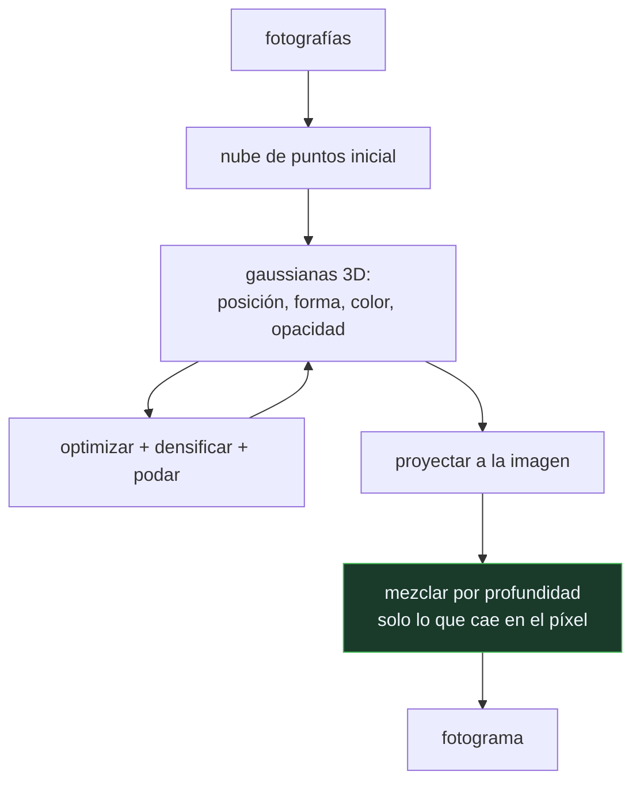

# P132 — Splatting de gaussianas

> Ruta de medios · NeRF gasta casi todo su cómputo muestreando el vacío: con la escena
> ocupada al 1 %, 190 de las 192 muestras de cada rayo caen donde no hay nada.

**Nivel:** L3 · **Motor:** `gaussian_splatting` · **Notebook:** [`P132_gaussian_splatting.ipynb`](../../../notebooks/papers/P132_gaussian_splatting.ipynb)
· **Anexo:** [complejidad y coste](../../annexes/A05_COMPLEJIDAD_Y_COSTE.md)

## 1. Identificación

| Campo | Valor |
|---|---|
| **Título original** | *3D Gaussian Splatting for Real-Time Radiance Field Rendering* |
| **Autoría** | Bernhard Kerbl, Georgios Kopanas, Thomas Leimkühler, George Drettakis |
| **Año** | 2023 |
| **Venue** | ACM Transactions on Graphics, 42(4) |
| **Fuente primaria** | [doi:10.1145/3592433](https://doi.org/10.1145/3592433) |
| **Acceso** | Abierto |
| **Fecha de consulta** | 2026-08-18 |

## 2. Problema anterior

[NeRF](../P128_nerf/README.md) produce vistas excelentes y renderiza lentísimo. La causa es
estructural, no de implementación: para saber el color de un píxel hay que consultar la función a lo
largo de todo su rayo, y **no se sabe de antemano dónde hay materia**.

El resultado es que la mayoría de las muestras caen en el vacío. El muestreo jerárquico ayuda —una
pasada gruesa localiza la superficie— pero sigue gastando una fracción enorme del cómputo en
averiguar dónde no hay nada.

Y la representación implícita tiene un segundo coste que se menciona menos: **no se puede editar**.
Una función aprendida no admite recortar un objeto o mover una silla.

## 3. Propuesta

Volver a una representación **explícita**, pero elegida bien: millones de **gaussianas 3D
anisótropas**, cada una con posición, forma, orientación, opacidad y color dependiente de la
dirección.

Con eso, renderizar deja de ser marchar rayos y pasa a ser **rasterizar**: proyectar cada gaussiana
sobre la imagen y mezclar en cada píxel solo las que le caen encima, por orden de profundidad. Se
mira exactamente donde hay materia, porque las primitivas **son** la materia.

Y las gaussianas se optimizan desde las fotografías con un procedimiento que las **densifica y las
poda** según haga falta: se clonan donde falta detalle y se eliminan donde sobran.

## 4. Intuición sin fórmulas

Buscar a alguien en un edificio. Marchar rayos es recorrer cada planta metro a metro sin saber
dónde está: la mayor parte del recorrido es pasillo vacío.

Tener la lista de en qué despachos hay gente es ir directamente a ellos. No es que mires más rápido:
es que dejas de mirar donde no hay nadie.

**Dónde deja de funcionar la analogía:** la lista de despachos hay que mantenerla, y ocupa sitio.
Ese es el precio del splatting — mucha más memoria.

## 5. Matemática mínima

```text
NeRF      : por píxel, N muestras × una pasada del perceptrón por muestra
Splatting : proyectar gaussianas y mezclar solo las que caen en el píxel
```

**Dónde se va el cómputo de NeRF.** Con la escena ocupada al 1 %:

| Ocupación | Muestras útiles | Desperdiciadas |
|---:|---:|---:|
| 1 % | 1,9 | **190,1** |
| 5 % | 9,6 | 182,4 |
| 20 % | 38,4 | 153,6 |

**El coste.** El conteo bruto da 2,09e+14 operaciones frente a 1,2e+09. Esa razón —cinco órdenes de
magnitud— **no es la aceleración real**: el artículo mide del orden de **mil veces**, porque el
conteo ignora el muestreo jerárquico de NeRF y cómo aprovecha cada método la GPU.

**El precio.** Memoria: **2,1 MB** el perceptrón contra **236 MB** el millón de gaussianas — 112×
más. Se cambia cómputo por almacenamiento.

<!-- puente:inicio -->
> [!TIP]
> **Puente matemático.** Esta sección da por sabido lo siguiente. Si algo no te suena,
> léelo primero: está explicado una sola vez, en un solo sitio, y sirve para todas las fichas.

| Dónde | Qué necesitas de ahí |
|---|---|
| [**A05 §8** · Checklist antes de creerte una cifra de rendimiento](../../annexes/A05_COMPLEJIDAD_Y_COSTE.md#8-checklist-antes-de-creerte-una-cifra-de-rendimiento) | por qué un conteo de operaciones puede exagerar cinco órdenes de magnitud frente a una medición |
<!-- puente:fin -->

## 6. Arquitectura o flujo



## 7. Qué observar en el paper original

- El **rasterizador diseñado a medida**, con ordenación por mosaicos. Buena parte del resultado es
  ingeniería de GPU, no una idea matemática.
- El procedimiento de **densificación adaptativa**: clonar gaussianas donde el gradiente es alto y
  podarlas donde la opacidad cae. Es lo que evita fijar el número de primitivas a mano.
- Que las gaussianas son **anisótropas**: pueden alargarse en una dirección, y eso es lo que permite
  representar superficies finas sin gastar millones de primitivas esféricas.
- La comparación con **Instant-NGP**, que acelera NeRF por otra vía —tablas hash— y con la que
  conviene contrastar los compromisos.

## 8. Evidencia y resultados

Comparación con NeRF, Mip-NeRF y Instant-NGP en calidad de imagen, tiempo de entrenamiento y
velocidad de renderizado, en varios conjuntos estándar.

> La evidencia está **medida**, que es exactamente lo que distingue este resultado de un conteo de
> operaciones. Y reporta las tres dimensiones, incluida la memoria, que es donde pierde.

La miniatura cuenta operaciones bajo supuestos razonables. Ese conteo exagera cinco órdenes de
magnitud frente a la medición del artículo, y esa discrepancia es parte de lo que la miniatura debe
enseñar.

## 9. Impacto

- Devolvió los campos de radiancia al **tiempo real**, y con ello los llevó a videojuegos, realidad
  virtual y visualización interactiva.
- Desplazó buena parte de la investigación de NeRF hacia representaciones explícitas en cuestión de
  meses.
- Su carácter **editable** abrió flujos de trabajo de producción que la representación implícita no
  permitía: recortar, componer, animar.
- Y dejó una lección metodológica: **un cambio de representación puede valer más que optimizar la
  existente**, aunque parezca un paso atrás conceptual.

## 10. Limitaciones

1. **Consume mucha memoria**: cientos de megabytes por escena frente a unos pocos del perceptrón.
2. **Escala mal con escenas grandes** o con mucha transparencia: crecen tanto el número de
   primitivas como los solapes por píxel.
3. **Produce artefactos** característicos —gaussianas alargadas visibles— en zonas poco observadas.
4. **Necesita una nube de puntos inicial**, típicamente de reconstrucción fotogramétrica, así que
   arrastra ese paso previo.
5. **La comparación por conteo de operaciones es engañosa.** La aceleración real es de tres órdenes
   de magnitud, no de cinco.

## 11. Errores comunes

| Error | Corrección |
|---|---|
| «NeRF es lento porque el perceptrón es grande» | Es lento porque muestrea el vacío: con la escena ocupada al 1 %, 190 de 192 muestras por rayo caen donde no hay nada. |
| «El splatting es 175 000 veces más rápido» | Ese es el conteo bruto de operaciones. La medición del artículo da del orden de mil veces, y esa es la cifra que vale. |
| «Una representación explícita es un paso atrás» | Gana en velocidad y en editabilidad. Que sea conceptualmente menos elegante no la hace peor para el problema. |
| «Es gratis: solo cambia cómo se renderiza» | Cuesta memoria: 236 MB frente a 2,1 MB del perceptrón, 112× más. Se cambia cómputo por almacenamiento. |
| «Sustituye a NeRF en todos los casos» | Escala mal con escenas grandes y con transparencias, y necesita una nube de puntos inicial. Instant-NGP acelera por otra vía con otros compromisos. |

## 12. Relación con trabajos anteriores

- **[P128 NeRF](../P128_nerf/README.md) (2020)** — la calidad que hay que igualar, y el coste que hay
  que evitar.
- **Zwicker et al. (2001)** — el splatting de superficies del que hereda la idea.
  [doi:10.1145/383259.383300](https://doi.org/10.1145/383259.383300)
- **[P04 AlexNet](../P04_alexnet/README.md) (2012)** — el momento en que el aprovechamiento de la GPU
  pasó a decidir qué es viable.

## 13. Relación con trabajos posteriores

- **Müller et al. (2022)** — Instant-NGP: acelerar NeRF sin abandonar lo implícito.
  [doi:10.1145/3528223.3530127](https://doi.org/10.1145/3528223.3530127)
- **[P121 MobileNets](../P121_mobilenets/README.md) (2017)** — el mismo hábito de contar el coste
  antes de elegir arquitectura.
- **[P133 Colapso de modelo](../P133_colapso_de_modelo/README.md) (2024)** — qué ocurre cuando lo
  generado con estas técnicas vuelve al corpus.

## 14. Notebook asociado

[`P132_gaussian_splatting.ipynb`](../../../notebooks/papers/P132_gaussian_splatting.ipynb)

**Qué implementa:** dónde se va el cómputo de cada método —incluido cuántas muestras por rayo caen en el vacío—, el conteo de operaciones por fotograma y el coste en memoria de cada representación.

**Qué NO implementa:** son conteos bajo supuestos, no mediciones: exageran cinco órdenes de magnitud frente al ~1000× que mide el artículo. Y no se implementa ni el ajuste ni la rasterización.

```bash
ai-evolution paper-lab P132 --seed 7
```

## 15. Actividades Bloom

| Nivel | Actividad |
|---|---|
| **Recordar** | Explica por qué marchar rayos desperdicia muestras. |
| **Explicar** | Describe qué es una gaussiana 3D anisótropa. |
| **Aplicar** | Ejecuta el notebook y compara el coste y la memoria de cada método. |
| **Analizar** | Analiza por qué el conteo de operaciones exagera frente a la medición. |
| **Evaluar** | «Los conteos dan 175 000×, es 175 000 veces más rápido». Evalúa la afirmación. |
| **Crear** | Estima cuánta memoria ocuparía una escena tuya como gaussianas y decide si cabe donde tendría que renderizarse. |

## 16. Autoevaluación

1. ¿Por qué es lento NeRF?
2. ¿Qué hace el splatting en su lugar?
3. ¿Cuál es la aceleración real?
4. ¿Qué se paga a cambio?
5. ¿Qué aporta la densificación adaptativa?
6. ¿Qué ventaja tiene una representación explícita más allá de la velocidad?
7. ¿Cuándo escala mal?

## 17. Respuestas esperadas

1. Porque muestrea el vacío: no sabe de antemano dónde hay materia. Con la escena ocupada al 1 %, 190 de las 192 muestras por rayo caen donde no hay nada.
2. Proyecta las gaussianas sobre la imagen y mezcla en cada píxel solo las que le caen encima, por orden de profundidad. Las primitivas son la materia.
3. Del orden de mil veces, medida en el artículo. El conteo bruto de operaciones da cinco órdenes de magnitud y es engañoso.
4. Memoria: 236 MB el millón de gaussianas frente a 2,1 MB del perceptrón, 112× más. Se cambia cómputo por almacenamiento.
5. Que el número de primitivas no se fija a mano: se clonan donde falta detalle y se podan donde la opacidad cae.
6. Que se puede editar: recortar un objeto, componer escenas, animar. Una función continua aprendida no admite eso.
7. Con escenas grandes y con mucha transparencia: crecen tanto el número de primitivas como los solapes por píxel.

## 18. Fuentes primarias

- Kerbl, B. et al. (2023). *3D Gaussian Splatting for Real-Time Radiance Field Rendering*.
  **ACM Transactions on Graphics**, 42(4). [doi:10.1145/3592433](https://doi.org/10.1145/3592433) ·
  consultado 2026-08-18.
- Zwicker, M. et al. (2001). *Surface Splatting*.
  [doi:10.1145/383259.383300](https://doi.org/10.1145/383259.383300) · consultado 2026-08-18.
- Müller, T. et al. (2022). *Instant Neural Graphics Primitives*.
  [doi:10.1145/3528223.3530127](https://doi.org/10.1145/3528223.3530127) · consultado 2026-08-18.

---

[⬅️ Anterior: P131 Una marca de agua](../P131_marcas_de_agua/README.md) ·
[📇 Índice](../../catalog/PAPERS_INDEX.md) ·
[📝 Evaluación](../../../assessments/papers/P132_gaussian_splatting.md) ·
[🏫 Clase 096 · Generación 3D y mundos sintéticos](../../../classes/part-07-generative-ai-across-media/096-generacion-3d-y-mundos-sinteticos/README.md) ·
[➡️ Siguiente: P133 Colapso de modelo](../P133_colapso_de_modelo/README.md)
