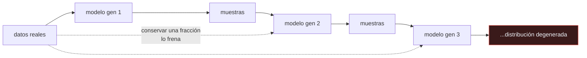

# P133 — Colapso de modelo

> Ruta de medios · Treinta generaciones y ningún modelo comete un error: todos ajustan
> bien lo que reciben. Y aun así se pierden dos tercios de la variedad.

**Nivel:** L2 · **Motor:** `colapso_de_modelo` · **Notebook:** [`P133_colapso_de_modelo.ipynb`](../../../notebooks/papers/P133_colapso_de_modelo.ipynb)
· **Anexo:** [probabilidad y verosimilitud](../../annexes/A02_PROBABILIDAD_Y_VEROSIMILITUD.md)

## 1. Identificación

| Campo | Valor |
|---|---|
| **Título original** | *AI models collapse when trained on recursively generated data* |
| **Autoría** | Ilia Shumailov, Zakhar Shumaylov, Yiren Zhao, Nicolas Papernot, Ross Anderson, Yarin Gal |
| **Año** | 2024 |
| **Venue** | Nature, 631, 755–759 |
| **Fuente primaria** | [doi:10.1038/s41586-024-07566-y](https://doi.org/10.1038/s41586-024-07566-y) |
| **Acceso** | Abierto |
| **Fecha de consulta** | 2026-08-18 |

## 2. Problema anterior

Los corpus de entrenamiento se recogen de la web. La web se está llenando de texto e imágenes
generadas por modelos. Los corpus futuros contendrán, sin que nadie lo decida, una fracción creciente
de salidas de la generación anterior de modelos.

Nadie había caracterizado qué le ocurre a un modelo entrenado sobre lo que generó su antecesor, y la
intuición común —«mientras la calidad sea buena, no pasa nada»— resultó estar equivocada por una
razón que no tiene que ver con la calidad.

## 3. Propuesta

Formalizar y medir el fenómeno, al que llaman **colapso de modelo**, en tres familias distintas:
modelos de lenguaje, autocodificadores variacionales y mezclas de gaussianas.

La tesis es que el colapso **no exige ningún fallo**. Basta el **error de muestreo**: cada generación
ve un número finito de muestras de la anterior, y ese muestreo finito pierde sistemáticamente lo
menos probable. Repetido, el efecto se acumula y la distribución converge a algo degenerado.

Distinguen dos fases: un **colapso temprano**, donde se pierden las colas, y uno **tardío**, donde
la distribución se estrecha hasta perder casi toda su varianza.

## 4. Intuición sin fórmulas

Fotocopiar una fotocopia. Cada copia es fiel a la anterior —ninguna máquina falla— y a la
vigésima el documento es ilegible.

Lo que se pierde primero es el detalle fino, lo que estaba al límite de la resolución. Y no hay
ninguna copia concreta donde el fallo ocurriera.

**Dónde deja de funcionar la analogía:** la fotocopia degrada por ruido físico. Aquí el mecanismo es
puramente estadístico: cada generación estima **bien** los parámetros de la anterior. Es más
inquietante, porque no hay nada que arreglar en el proceso.

## 5. Matemática mínima

```text
Generación g:  ajustar un modelo a n muestras de la generación g−1, y muestrear de él

El estimador de la varianza con n muestras encoge por un factor √(1 − 1/n) cada vez.
Repetido g veces:  σ_g ≈ σ_0 · (1 − 1/n)^(g/2)
```

La miniatura usa 25 muestras por generación y 30 generaciones:

| | Inicial | Tras 30 generaciones |
|---|---:|---:|
| desviación | 0,793 | **0,252** (31,8 %) |
| rango | 2,856 | **0,880** (3,2× menor) |
| media | −0,087 | **−1,447** |

Hay **dos** efectos, no uno. La distribución **se estrecha** —lo esperado— y además **deriva**: la
media hace un paseo aleatorio del que ninguna generación puede darse cuenta, porque cada una ajusta
perfectamente los datos que recibe.

Y el remedio se mide: conservar un **25 %** de datos reales en cada generación deja la desviación
final en **0,806** frente a 0,252 sin ninguno.

<!-- puente:inicio -->
> [!TIP]
> **Puente matemático.** Esta sección da por sabido lo siguiente. Si algo no te suena,
> léelo primero: está explicado una sola vez, en un solo sitio, y sirve para todas las fichas.

| Dónde | Qué necesitas de ahí |
|---|---|
| [**A02 §6** · Gaussianas y el proceso de difusión](../../annexes/A02_PROBABILIDAD_Y_VEROSIMILITUD.md#6-gaussianas-y-el-proceso-de-difusión) | qué estima la desviación de una muestra finita, y qué le pasa al aplicar esa estimación treinta veces seguidas |
<!-- puente:fin -->

## 6. Arquitectura o flujo



## 7. Qué observar en el paper original

- Que el resultado se demuestra en **tres familias de modelos** distintas. Eso es lo que convierte
  una observación en un fenómeno general.
- La distinción entre **colapso temprano** —se pierden las colas— y **tardío** —se pierde casi toda
  la varianza—. Son fases con síntomas distintos.
- El **análisis teórico** para el caso gaussiano, que da la tasa de encogimiento y permite predecir
  cuántas generaciones aguanta un proceso.
- La discusión sobre la **procedencia de los datos** como bien común: si nadie registra qué es
  generado, nadie puede protegerse.

## 8. Evidencia y resultados

Experimentos en modelos de lenguaje —con ejemplos de degeneración textual muy elocuentes—,
autocodificadores variacionales y mezclas de gaussianas, más análisis teórico del caso tratable.

> Publicado en *Nature*, con revisión y datos disponibles. La combinación de teoría en el caso
> simple y medición en los complejos es la forma correcta de sostener una tesis así.

La miniatura usa una gaussiana ajustada por momentos. Reproduce el mecanismo —error de muestreo
acumulado— pero no la riqueza del fenómeno en modelos reales, donde además interactúa con la
arquitectura.

## 9. Impacto

- Puso nombre a un riesgo sistémico del que se hablaba de forma vaga, y lo convirtió en algo
  medible.
- Dio valor económico y estratégico a los **corpus anteriores a la IA generativa**, y a los datos
  con procedencia verificada.
- Refuerza el argumento de [las marcas de agua](../P131_marcas_de_agua/README.md): sin saber qué es
  generado, no se puede controlar la proporción.
- Y matizó el entusiasmo por los datos sintéticos, que hasta entonces se presentaban como solución
  general a la escasez de datos.

## 10. Limitaciones

1. **El escenario es el peor caso**: cada generación entrena **solo** con lo generado. En la
   práctica los corpus se contaminan parcialmente.
2. **Trabajos posteriores matizan el resultado.** Si los datos se **acumulan** en lugar de
   reemplazarse, el colapso se atenúa mucho.
3. **No modela el filtrado por calidad.** Si alguien selecciona las mejores salidas para reentrenar,
   el efecto cambia — y puede estrechar aún más la distribución.
4. **La escala de los experimentos** es modesta comparada con los modelos de frontera.
5. **No dice qué proporción de datos sintéticos es segura**, que es la pregunta que un equipo
   necesita responder.

## 11. Errores comunes

| Error | Corrección |
|---|---|
| «El colapso ocurre porque los modelos cometen errores» | No: cada generación estima bien los parámetros de la anterior. Basta el error de muestreo acumulado, sin ningún fallo. |
| «Si la calidad de las salidas es buena, no hay problema» | La calidad media puede mantenerse mientras la variedad desaparece. En la miniatura queda el 31,8 % de la desviación original. |
| «Es lo mismo que un sobreajuste» | El sobreajuste es memorizar el conjunto de entrenamiento. Aquí cada generación generaliza bien; lo que se pierde es la distribución de la que se muestreó. |
| «Solo se estrecha la distribución» | También deriva: en la miniatura la media pasa de −0,087 a −1,447. Ese paseo aleatorio es indetectable desde dentro de cualquier generación. |
| «Basta con dejar de usar datos sintéticos» | El problema es no SABER que los estás usando. Sin procedencia registrada no puedes medir tu proporción ni conservar datos reales a propósito. |

## 12. Relación con trabajos anteriores

- **[P131 Una marca de agua](../P131_marcas_de_agua/README.md) (2023)** — el mismo problema visto
  desde el otro lado: saber qué se generó.
- **[P61 Loros estocásticos](../P61_stochastic_parrots/README.md) (2021)** — qué hay dentro de los
  corpus y qué no se sabe de ellos.
- **[P115 Hojas de datos](../P115_hojas_de_datos/README.md) (2021)** — la documentación de
  procedencia que aquí se vuelve imprescindible.

## 13. Relación con trabajos posteriores

- **Gerstgrasser et al. (2024)** — qué cambia si los datos se acumulan en lugar de reemplazarse.
  [arXiv:2404.01413](https://arxiv.org/abs/2404.01413)
- **Alemohammad et al. (2023)** — el mismo fenómeno en modelos de imagen.
  [arXiv:2307.01850](https://arxiv.org/abs/2307.01850)
- **[P19 Leyes de escalado](../P19_scaling_laws/README.md) (2022)** — el presupuesto de datos que
  este fenómeno pone en cuestión.

## 14. Notebook asociado

[`P133_colapso_de_modelo.ipynb`](../../../notebooks/papers/P133_colapso_de_modelo.ipynb)

**Qué implementa:** la evolución de la desviación, el rango y la media a lo largo de treinta generaciones entrenando solo con lo generado, y el efecto de conservar una fracción de datos reales.

**Qué NO implementa:** el modelo es una gaussiana ajustada por momentos, no una red, y cada generación entrena SOLO con lo generado. En la práctica la contaminación es parcial y el ritmo depende de esa proporción.

```bash
ai-evolution paper-lab P133 --seed 7
```

## 15. Actividades Bloom

| Nivel | Actividad |
|---|---|
| **Recordar** | Explica qué es el colapso de modelo. |
| **Explicar** | Describe por qué no exige ningún fallo del modelo. |
| **Aplicar** | Ejecuta el notebook y observa las dos magnitudes que cambian. |
| **Analizar** | Analiza por qué la deriva de la media es indetectable desde dentro. |
| **Evaluar** | «Las salidas siguen siendo de buena calidad, luego no hay colapso». Evalúa la afirmación. |
| **Crear** | Estima qué fracción de tus datos de entrenamiento podría ser generada. Si no puedes estimarla, escribe qué registro te haría falta. |

## 16. Autoevaluación

1. ¿Qué mecanismo produce el colapso?
2. ¿Qué se pierde primero?
3. ¿Cuántos efectos hay, y cuáles?
4. ¿Se puede detectar desde dentro de una generación?
5. ¿Qué lo frena?
6. ¿En qué se diferencia del sobreajuste?
7. ¿Qué matizan los trabajos posteriores?

## 17. Respuestas esperadas

1. El error de muestreo acumulado. Cada generación ve un número finito de muestras de la anterior, y ese muestreo pierde sistemáticamente lo menos probable.
2. Las colas: lo raro es lo que menos se muestrea. En la miniatura el rango se estrecha 3,2× a lo largo de treinta generaciones.
3. Dos. La distribución se **estrecha** —la desviación cae al 31,8 %— y además **deriva**: la media pasa de −0,087 a −1,447.
4. No. Cada generación ajusta perfectamente los datos que recibe y no tiene con qué comparar. Solo la distribución original, que ya nadie tiene, revelaría el desplazamiento.
5. Conservar datos reales. Con un 25 % de muestras reales por generación, la desviación final es 0,806 frente a 0,252 sin ninguna.
6. El sobreajuste es memorizar el conjunto de entrenamiento. Aquí cada generación generaliza bien; lo que se degrada es la distribución de la que se muestrea.
7. Que si los datos se acumulan en vez de reemplazarse, el colapso se atenúa mucho. El escenario del artículo es el peor caso.

## 18. Fuentes primarias

- Shumailov, I. et al. (2024). *AI models collapse when trained on recursively generated data*.
  **Nature**, 631, 755–759. [doi:10.1038/s41586-024-07566-y](https://doi.org/10.1038/s41586-024-07566-y)
  · consultado 2026-08-18.
- Gerstgrasser, M. et al. (2024). *Is Model Collapse Inevitable?*
  [arXiv:2404.01413](https://arxiv.org/abs/2404.01413) · consultado 2026-08-18.
- Alemohammad, S. et al. (2023). *Self-Consuming Generative Models Go MAD*.
  [arXiv:2307.01850](https://arxiv.org/abs/2307.01850) · consultado 2026-08-18.

---

[⬅️ Anterior: P132 Splatting de gaussianas](../P132_gaussian_splatting/README.md) ·
[📇 Índice](../../catalog/PAPERS_INDEX.md) ·
[📝 Evaluación](../../../assessments/papers/P133_colapso_de_modelo.md) ·
[🏫 Clase 097 · Datos sintéticos: utilidad y contaminación](../../../classes/part-07-generative-ai-across-media/097-datos-sinteticos-utilidad-y-contaminacion/README.md) ·
[➡️ Siguiente: P134 La protección de la información](../P134_minimo_privilegio/README.md)
