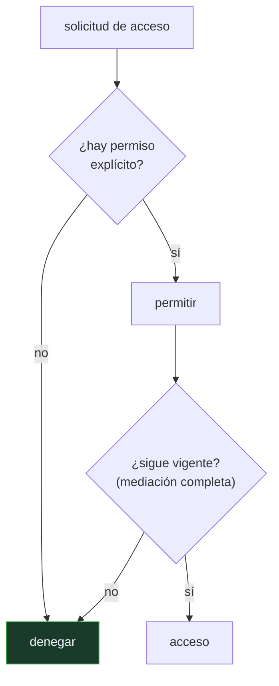

# P134 — La protección de la información

> Ruta de agentes operativos · La misma política escrita, dos valores por defecto:
> 11 recursos accesibles o 35. Lo que cambia es qué pasa con lo que nadie listó.

**Nivel:** L1 · **Motor:** `minimo_privilegio` · **Notebook:** [`P134_minimo_privilegio.ipynb`](../../../notebooks/papers/P134_minimo_privilegio.ipynb)
· **Anexo:** [complejidad y coste](../../annexes/A05_COMPLEJIDAD_Y_COSTE.md)

## 1. Identificación

| Campo | Valor |
|---|---|
| **Título original** | *The Protection of Information in Computer Systems* |
| **Autoría** | Jerome H. Saltzer, Michael D. Schroeder |
| **Año** | 1975 |
| **Venue** | Proceedings of the IEEE, 63(9), 1278–1308 |
| **Fuente primaria** | [doi:10.1109/PROC.1975.9939](https://doi.org/10.1109/PROC.1975.9939) |
| **Acceso** | Restringido |
| **Fecha de consulta** | 2026-08-18 |

## 2. Problema anterior

A mediados de los setenta, los sistemas compartidos daban acceso amplio por comodidad y cada
mecanismo de protección se diseñaba a medida, sin criterios explícitos.

El resultado era que **no había forma de juzgar si un diseño era defendible**. Dos ingenieros podían
discrepar sobre unos permisos sin ningún lenguaje común para argumentar, y las decisiones se tomaban
por costumbre o por lo que resultara cómodo de implementar.

Y hay una asimetría que nadie había nombrado: el error de omisión —olvidarse de listar algo— tiene
consecuencias opuestas según cómo esté configurado el sistema.

## 3. Propuesta

Ocho principios de diseño, enunciados para poder discutirlos:

1. **Economía de mecanismo** — el diseño más simple que funcione.
2. **Valores por defecto a prueba de fallos** — denegar salvo permiso explícito.
3. **Mediación completa** — comprobar **cada** acceso, no solo el primero.
4. **Diseño abierto** — la seguridad no depende de que el diseño sea secreto.
5. **Separación de privilegio** — dos condiciones mejor que una.
6. **Mínimo privilegio** — lo justo para la tarea, ni un permiso más.
7. **Mecanismo mínimo compartido** — cuanto menos se comparta, menos se filtra.
8. **Aceptabilidad psicológica** — si estorba, la gente lo rodea.

Los dos primeros gobiernan al resto, y el octavo es el que más despliegues hunde.

## 4. Intuición sin fórmulas

Las llaves de un edificio. Puedes dar a cada persona una llave maestra —cómodo— o la llave de las
puertas que necesita. Con la maestra, cualquier llave perdida abre el edificio entero.

Y hay una decisión previa: si aparece una puerta nueva que nadie asignó, ¿queda abierta o cerrada?
Esa decisión no está en ninguna lista de permisos y determina qué pasa con todo lo que se olvidó.

**Dónde deja de funcionar la analogía:** una llave física se pierde y se sabe. Una credencial
copiada sigue funcionando sin que nadie note nada, y por eso el octavo principio y la mediación
completa importan más aquí que en un edificio.

## 5. Matemática mínima

No hay formalismo: son principios de diseño. Lo que sí se puede medir es su efecto.

La miniatura usa 40 recursos, de los que la tarea necesita **6**, con una política escrita a mano:

| Valor por defecto | Accesibles | Exceso sobre lo necesario |
|---|---:|---:|
| **denegar** salvo permiso | 11 | 5 |
| **permitir** salvo denegación | 35 | **29** |

**5,8× más superficie** por una sola decisión, con exactamente la misma política escrita.

**Mínimo privilegio.** Un token de sesión para 12 tareas expone **23** recursos todo el rato; uno
por tarea, **3,0** de media y solo mientras dura la tarea.

**Mediación completa.** Si el permiso se revoca en el paso 4 de 10, comprobar solo al principio
sirve **10** accesos y comprobar cada uno sirve **4**.

<!-- puente:inicio -->
> [!TIP]
> **Puente matemático.** Esta sección da por sabido lo siguiente. Si algo no te suena,
> léelo primero: está explicado una sola vez, en un solo sitio, y sirve para todas las fichas.

| Dónde | Qué necesitas de ahí |
|---|---|
| [**A05 §8** · Checklist antes de creerte una cifra de rendimiento](../../annexes/A05_COMPLEJIDAD_Y_COSTE.md#8-checklist-antes-de-creerte-una-cifra-de-rendimiento) | el mismo hábito aplicado a permisos: qué hay que comprobar antes de aceptar que una configuración es segura |
<!-- puente:fin -->

## 6. Arquitectura o flujo



## 7. Qué observar en el paper original

- Que los principios se enuncian **para poder discutirlos**, no como reglas mecánicas. El artículo
  reconoce que a veces entran en conflicto entre sí.
- El octavo, **aceptabilidad psicológica**, que es el más olvidado y el que más sistemas hunde: una
  política que estorba se rodea, y entonces protege menos que una laxa que se respeta.
- La distinción entre **listas de control de acceso** y **capacidades**, con sus compromisos. Sigue
  siendo la discusión de fondo en el diseño de permisos.
- La sección de **canales encubiertos**, que anticipa problemas que tardarían décadas en volverse
  urgentes.

## 8. Evidencia y resultados

Es un artículo de revisión y sistematización: recoge la práctica de la época, la ordena y extrae
principios. No hay experimentos.

> Su autoridad viene de haber resistido cincuenta años. Los principios se siguen citando literalmente
> en normativa y en arquitecturas contemporáneas, lo cual es una forma de validación difícil de
> igualar.

La miniatura mide el efecto de tres de ellos con recursos y políticas sintéticos. Lo que no modela
es el problema difícil de verdad: **saber qué necesita realmente una tarea**.

## 9. Impacto

- Es el artículo fundacional de la seguridad de sistemas, y sus principios están incorporados en
  normativa —desde criterios de evaluación hasta el RGPD— y en cualquier guía de diseño seria.
- La **confianza cero** (NIST SP 800-207) es esencialmente el principio de mediación completa llevado
  a la arquitectura de red.
- El **mínimo privilegio** es el criterio con el que se diseñan los permisos de una aplicación móvil,
  de un contenedor y de un token de API.
- Y en sistemas de agentes vuelve a ser urgente: un agente con acceso a herramientas es exactamente
  el caso que estos principios describen — un proceso que actúa en tu nombre con permisos que alguien
  le concedió sin pensar demasiado.

## 10. Limitaciones

1. **No dice cómo determinar el mínimo privilegio.** Saber qué necesita una tarea es el trabajo
   difícil, y el artículo no lo aborda.
2. **Los principios pueden entrar en conflicto**: economía de mecanismo contra separación de
   privilegio, o mínimo privilegio contra aceptabilidad psicológica.
3. **Es de 1975**: no cubre sistemas distribuidos, nube, ni delegación entre servicios.
4. **La aceptabilidad psicológica se enuncia pero no se opera.** Cómo hacer usable una política
   estricta sigue siendo un problema abierto.
5. **No hay métricas.** Los principios se aplican con criterio, y eso deja mucho margen para
   justificar casi cualquier cosa.

## 11. Errores comunes

| Error | Corrección |
|---|---|
| «Lo importante es la lista de permisos» | Lo importante es el valor por defecto: decide qué pasa con todo lo que la lista no menciona. En la miniatura, 11 recursos accesibles frente a 35 con la misma lista. |
| «Si el agente tiene los permisos justos, está bien diseñado» | También importa cuánto duran. Un token de sesión expone 23 recursos todo el rato; uno por tarea, 3,0 de media. |
| «Basta con comprobar la autorización al empezar» | Eso es lo contrario de mediación completa. Si el permiso se revoca a mitad, comprobar solo al principio sirve los 10 accesos igualmente. |
| «Una política más estricta siempre protege más» | El octavo principio dice lo contrario: si estorba, se rodea. Una política laxa que se respeta puede proteger más que una estricta que todos evitan. |
| «Es un artículo histórico sin aplicación actual» | La confianza cero es mediación completa, y los permisos de un agente con herramientas son exactamente el caso que describe. |

## 12. Relación con trabajos anteriores

- **Lampson (1974)** — matrices de control de acceso, el modelo formal subyacente.
  [doi:10.1145/775265.775268](https://doi.org/10.1145/775265.775268)
- **[P58 Símbolos y búsqueda](../P58_simbolos_y_busqueda/README.md) (1976)** — el mismo momento del
  campo, con la informática buscando sus principios.

## 13. Relación con trabajos posteriores

- **[P139 Niveles de automatización](../P139_niveles_de_automatizacion/README.md) (2000)** — la otra
  mitad: no qué puede hacer el sistema, sino cuánto le dejamos decidir.
- **NIST SP 800-207 (2020)** — arquitectura de confianza cero: mediación completa a escala de red.
  [doi:10.6028/NIST.SP.800-207](https://doi.org/10.6028/NIST.SP.800-207)
- **[P143 Privacidad diferencial](../P143_privacidad_diferencial/README.md) (2006)** — proteger los
  datos cuando el acceso ya está concedido.

## 14. Notebook asociado

[`P134_minimo_privilegio.ipynb`](../../../notebooks/papers/P134_minimo_privilegio.ipynb)

**Qué implementa:** el alcance de una misma política bajo los dos valores por defecto, la exposición de un token de sesión frente a uno por tarea, y qué ocurre al revocar un permiso según se medie cada acceso o solo el primero.

**Qué NO implementa:** los recursos y la política son sintéticos. Lo difícil en un sistema real es descubrir qué necesita de verdad una tarea, y eso no se modela.

```bash
ai-evolution paper-lab P134 --seed 7
```

## 15. Actividades Bloom

| Nivel | Actividad |
|---|---|
| **Recordar** | Enumera los ocho principios. |
| **Explicar** | Explica la diferencia entre denegar y permitir por defecto. |
| **Aplicar** | Ejecuta el notebook y compara el alcance de cada configuración. |
| **Analizar** | Analiza por qué la mediación completa importa con permisos revocables. |
| **Evaluar** | «Nuestro agente solo tiene los permisos que necesita». Evalúa qué falta comprobar. |
| **Crear** | Enumera los permisos que tiene un agente tuyo y los que usa en una jornada. La diferencia es su radio de daño evitable. |

## 16. Autoevaluación

1. ¿Cuál es el principio de valores por defecto a prueba de fallos?
2. ¿Qué decide realmente el valor por defecto?
3. ¿Qué es el mínimo privilegio?
4. ¿Qué añade la mediación completa?
5. ¿Por qué importa la aceptabilidad psicológica?
6. ¿Qué no resuelve el artículo?
7. ¿Qué relación tiene con la confianza cero?

## 17. Respuestas esperadas

1. Denegar salvo que exista un permiso explícito. La ausencia de decisión se resuelve del lado seguro.
2. Qué pasa con todo lo que la política no menciona. En la miniatura, 11 recursos accesibles frente a 35 con exactamente la misma lista escrita.
3. Conceder lo justo para la tarea y ni un permiso más, durante el menor tiempo posible. Lo que se mide es el radio de daño de una credencial filtrada.
4. Comprobar cada acceso en lugar de solo el primero. Sin eso, una autorización revocada sigue sirviendo hasta que la sesión termine.
5. Porque una política que estorba se rodea. Un mecanismo estricto que todos evitan protege menos que uno laxo que se respeta.
6. Cómo determinar qué necesita realmente una tarea. Enuncia el principio y deja el descubrimiento, que es el trabajo difícil, sin abordar.
7. La confianza cero es, en esencia, mediación completa llevada a la arquitectura de red: no hay perímetro de confianza, se verifica cada petición.

## 18. Fuentes primarias

- Saltzer, J. H. y Schroeder, M. D. (1975). *The Protection of Information in Computer Systems*.
  **Proceedings of the IEEE**, 63(9), 1278–1308.
  [doi:10.1109/PROC.1975.9939](https://doi.org/10.1109/PROC.1975.9939) · consultado 2026-08-18.
- Lampson, B. W. (1974). *Protection*.
  [doi:10.1145/775265.775268](https://doi.org/10.1145/775265.775268) · consultado 2026-08-18.
- NIST (2020). *SP 800-207: Zero Trust Architecture*.
  [doi:10.6028/NIST.SP.800-207](https://doi.org/10.6028/NIST.SP.800-207) · consultado 2026-08-18.

---

[⬅️ Anterior: P133 Colapso de modelo](../P133_colapso_de_modelo/README.md) ·
[📇 Índice](../../catalog/PAPERS_INDEX.md) ·
[📝 Evaluación](../../../assessments/papers/P134_minimo_privilegio.md) ·
[🏫 Clase 119 · Permisos, sandbox y mínimo privilegio](../../../classes/part-09-ai-agent-engineering/119-permisos-sandbox-y-minimo-privilegio/README.md) ·
[➡️ Siguiente: P135 Hearsay-II](../P135_pizarra/README.md)
