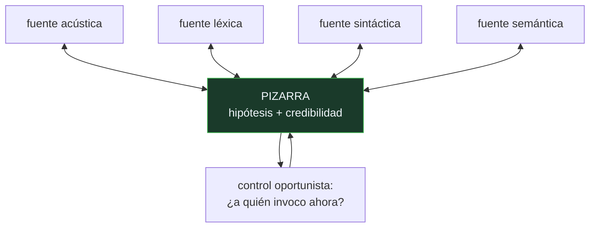

# P135 — Hearsay-II

> Ruta de agentes operativos · Cuatro fuentes de conocimiento y ninguna resuelve sola.
> Publicando todas sus hipótesis donde las demás leen, la respuesta aparece.

**Nivel:** L2 · **Motor:** `pizarra` · **Notebook:** [`P135_pizarra.ipynb`](../../../notebooks/papers/P135_pizarra.ipynb)
· **Anexo:** [probabilidad y verosimilitud](../../annexes/A02_PROBABILIDAD_Y_VEROSIMILITUD.md)

## 1. Identificación

| Campo | Valor |
|---|---|
| **Título original** | *The Hearsay-II Speech-Understanding System: Integrating Knowledge to Resolve Uncertainty* |
| **Autoría** | Lee D. Erman, Frederick Hayes-Roth, Victor R. Lesser, D. Raj Reddy |
| **Año** | 1980 |
| **Venue** | ACM Computing Surveys, 12(2), 213–253 |
| **Fuente primaria** | [doi:10.1145/356810.356816](https://doi.org/10.1145/356810.356816) |
| **Acceso** | Restringido |
| **Fecha de consulta** | 2026-08-18 |

## 2. Problema anterior

Entender habla exige combinar conocimiento de naturalezas incompatibles: señales acústicas,
vocabulario, gramática, significado y contexto de la conversación. Ninguna de esas fuentes decide
sola, y todas manejan incertidumbre.

La solución obvia —encadenarlas en una tubería— tiene un defecto que la condena. Cada etapa debe
**comprometerse** con una respuesta antes de pasar a la siguiente, y si se equivoca, ninguna etapa
posterior puede corregirla aunque tenga exactamente la información que haría falta.

Y hay un problema previo: nadie sabe en qué **orden** conviene aplicar las fuentes, porque el orden
correcto depende de lo que se haya averiguado hasta el momento.

## 3. Propuesta

Una **pizarra**: una estructura de datos compartida y jerárquica donde todas las fuentes leen y
escriben hipótesis parciales, cada una con su nivel de credibilidad.

Las fuentes de conocimiento son **independientes**: no se llaman entre sí, no saben quién más existe
y no conocen el orden en que actuarán. Cada una mira la pizarra, y si hay algo sobre lo que puede
opinar, escribe.

Y encima, un **control oportunista** que decide en cada momento a qué fuente conviene invocar, según
lo que ya hay escrito. No hay flujo fijo: el sistema va donde la evidencia sugiere.

La consecuencia práctica es que **nada se decide hasta que hay evidencia suficiente**.

## 4. Intuición sin fórmulas

Un grupo de peritos ante un caso. En vez de que cada uno entregue su informe al siguiente —donde el
segundo hereda las conclusiones del primero sin poder cuestionarlas— todos escriben en la misma
pizarra lo que saben, con su grado de confianza.

Quien tiene una certeza la escribe; quien tiene tres candidatos escribe los tres. La respuesta sale
de cruzarlo todo, y no está completa en la cabeza de ninguno.

**Dónde deja de funcionar la analogía:** los peritos discuten. Aquí las fuentes no se hablan: solo
leen y escriben. Esa desconexión es deliberada, y es lo que permite añadir una fuente nueva sin
tocar ninguna existente.

## 5. Matemática mínima

No hay formalismo: es una arquitectura. Lo medible es qué se puede resolver con ella y sin ella.

La miniatura reconstruye «el gato come pescado» con cuatro fuentes, ninguna de las cuales lo
resuelve sola —la mejor decide **1 de 4** posiciones—.

| Arquitectura | Reconstruye | Correctas |
|---|---|---:|
| **pizarra** | «el gato come **pescado**» | **4 de 4** |
| tubería de orden fijo | «el gato come **pesado**» | 3 de 4 |

Ese error es el argumento entero. La etapa acústica no distingue «pesado» de «pescado» y tiene que
elegir; elige mal. La fuente semántica sabría corregirlo —sabe que un gato come pescado y no
«pesado»— pero en una tubería ya no puede: la decisión está tomada.

En la pizarra nadie decide hasta que todas han escrito, y la evidencia débil de cuatro fuentes vale
más que la decisión firme de una.

<!-- puente:inicio -->
> [!TIP]
> **Puente matemático.** Esta sección da por sabido lo siguiente. Si algo no te suena,
> léelo primero: está explicado una sola vez, en un solo sitio, y sirve para todas las fichas.

| Dónde | Qué necesitas de ahí |
|---|---|
| [**A02 §1** · Softmax](../../annexes/A02_PROBABILIDAD_Y_VEROSIMILITUD.md#1-softmax) | cómo un conjunto de puntuaciones se convierte en una distribución de credibilidad en vez de en una única respuesta |
<!-- puente:fin -->

## 6. Arquitectura o flujo



## 7. Qué observar en el paper original

- Que las fuentes son **mutuamente ignorantes**. Ninguna sabe que las otras existen, y esa
  desconexión es lo que hace el sistema extensible.
- El **control oportunista**, que es la parte más difícil y la que el artículo desarrolla con más
  cuidado: elegir a quién invocar es en sí un problema de decisión.
- La **jerarquía de niveles** de la pizarra —segmento, sílaba, palabra, frase— y cómo las hipótesis
  suben y bajan entre ellos.
- La honestidad sobre el **coste**: el sistema era lentísimo y el artículo lo reporta, junto con qué
  fracción del tiempo se iba en cada componente.

## 8. Evidencia y resultados

El artículo reporta el rendimiento del sistema completo en una tarea de recuperación de
documentos por voz, con desglose por componente y análisis de dónde se van el tiempo y los errores.

> Es un informe de sistema, extenso y honesto. Su valor duradero no son las cifras —que envejecieron
> mal— sino la arquitectura y el análisis de por qué funciona.

La miniatura combina fuentes por intersección de conjuntos. En Hearsay-II las hipótesis llevan
puntuación de credibilidad y el control decide con ellas, que es bastante más rico. Y no hay control
oportunista: aquí se aplican todas las fuentes.

## 9. Impacto

- Es el origen de la **arquitectura de pizarra**, que se usó durante décadas en sistemas expertos,
  interpretación de señales y control de procesos.
- La idea de **memoria compartida entre agentes independientes** es hoy el patrón dominante en
  sistemas multiagente con modelos de lenguaje: un espacio de trabajo común en vez de llamadas
  directas.
- El **control oportunista** anticipa lo que hoy se llama orquestación dinámica: decidir el siguiente
  paso según el estado, no según un flujo escrito de antemano.
- Y aporta al programa el argumento contra encadenar agentes especializados en tubería, que es el
  error de diseño más común en sistemas multiagente.

## 10. Limitaciones

1. **El control oportunista es difícil de diseñar** y puede acabar siendo tan complejo como el
   problema original.
2. **La pizarra es un cuello de botella** y un punto único de fallo: todo pasa por ella.
3. **Escala mal** cuando hay muchas fuentes y muchas hipótesis: el coste de revisar la pizarra crece
   con lo que hay escrito.
4. **Las credibilidades son difíciles de calibrar** entre fuentes de naturaleza distinta. Comparar
   la confianza acústica con la semántica no es evidente.
5. **El sistema era lentísimo**, y el artículo no lo esconde.

## 11. Errores comunes

| Error | Corrección |
|---|---|
| «Encadenar agentes especializados es la arquitectura natural» | Cada eslabón se compromete y el siguiente hereda el error. En la miniatura, la tubería escribe «pesado» y la semántica ya no puede corregirlo. |
| «La pizarra es solo una base de datos compartida» | La aportación es el control oportunista: decidir a quién invocar según lo que hay escrito. Sin eso es un almacén, no una arquitectura. |
| «Cada fuente debe entregar su mejor respuesta» | Debe entregar sus hipótesis con credibilidad. Comprometerse pronto es exactamente lo que la pizarra evita. |
| «Añadir una fuente exige tocar las demás» | No: las fuentes son mutuamente ignorantes. Se añade un lector y escritor más de la misma estructura, sin grafo de llamadas que actualizar. |
| «Es una arquitectura obsoleta de los ochenta» | Es el patrón que usan hoy los sistemas multiagente con modelos de lenguaje: espacio de trabajo compartido en vez de llamadas directas. |

## 12. Relación con trabajos anteriores

- **[P58 Símbolos y búsqueda](../P58_simbolos_y_busqueda/README.md) (1976)** — el marco simbólico en
  el que este sistema se construye.
- **[P64 GPS](../P64_gps/README.md) (1959)** — la resolución de problemas con un flujo de control
  fijo, que es lo que la pizarra rompe.

## 13. Relación con trabajos posteriores

- **[P138 KQML](../P138_kqml/README.md) (1994)** — cuando los agentes sí se hablan, hace falta un
  idioma.
- **Nii (1986)** — la historia y anatomía de los sistemas de pizarra.
  [doi:10.1609/aimag.v7i2.537](https://doi.org/10.1609/aimag.v7i2.537)
- **[P33 AutoGen](../P33_autogen/README.md) (2023)** — memoria compartida entre agentes con modelos
  de lenguaje: la misma idea, cuarenta años después.

## 14. Notebook asociado

[`P135_pizarra.ipynb`](../../../notebooks/papers/P135_pizarra.ipynb)

**Qué implementa:** cuántas posiciones resuelve cada fuente por separado, cuántas resuelven todas juntas sobre la estructura compartida, y qué reconstruye una tubería donde cada etapa se compromete y las siguientes no pueden revisar.

**Qué NO implementa:** las fuentes se combinan por intersección de conjuntos, sin credibilidades, y se aplican todas: no hay control oportunista, que es la parte difícil y la aportación principal.

```bash
ai-evolution paper-lab P135 --seed 7
```

## 15. Actividades Bloom

| Nivel | Actividad |
|---|---|
| **Recordar** | Describe qué es una pizarra y qué es una fuente de conocimiento. |
| **Explicar** | Explica por qué una tubería fija obliga a comprometerse pronto. |
| **Aplicar** | Ejecuta el notebook y compara las dos reconstrucciones. |
| **Analizar** | Analiza por qué el control oportunista es un problema de decisión en sí mismo. |
| **Evaluar** | «Encadenamos un agente por especialidad, cada uno hace su parte». Evalúa el diseño. |
| **Crear** | Dibuja el flujo de un sistema multiagente tuyo y marca dónde alguien se compromete con una respuesta que otro podría corregir después y no puede. |

## 16. Autoevaluación

1. ¿Qué es la pizarra?
2. ¿Se conocen entre sí las fuentes?
3. ¿Qué hace el control oportunista?
4. ¿Por qué falla una tubería de orden fijo?
5. ¿Qué escribe cada fuente?
6. ¿Qué cuesta añadir una fuente nueva?
7. ¿Cuál es la limitación principal de la arquitectura?

## 17. Respuestas esperadas

1. Una estructura de datos compartida y jerárquica donde todas las fuentes leen y escriben hipótesis parciales con su credibilidad.
2. No. Son mutuamente ignorantes: ninguna sabe que las otras existen ni en qué orden actuarán. Esa desconexión es deliberada.
3. Decide en cada momento a qué fuente conviene invocar según lo que ya hay escrito. No hay flujo fijo: el sistema va donde la evidencia sugiere.
4. Porque cada etapa debe comprometerse antes de pasar a la siguiente. En la miniatura, la acústica elige «pesado» y la semántica, que sabría corregirlo, ya no puede.
5. Sus hipótesis parciales, todas, con el grado de confianza de cada una. No su mejor respuesta.
6. Casi nada: es un lector y escritor más de la misma estructura. No hay grafo de llamadas que actualizar.
7. El control oportunista, que es difícil de diseñar y puede volverse tan complejo como el problema. Y la pizarra es un cuello de botella y punto único de fallo.

## 18. Fuentes primarias

- Erman, L. D., Hayes-Roth, F., Lesser, V. R. y Reddy, D. R. (1980). *The Hearsay-II
  Speech-Understanding System*. **ACM Computing Surveys**, 12(2), 213–253.
  [doi:10.1145/356810.356816](https://doi.org/10.1145/356810.356816) · consultado 2026-08-18.
- Nii, H. P. (1986). *Blackboard Systems*. **AI Magazine**, 7(2).
  [doi:10.1609/aimag.v7i2.537](https://doi.org/10.1609/aimag.v7i2.537) · consultado 2026-08-18.
- Corkill, D. D. (1991). *Blackboard Systems*. **AI Expert**, 6(9), 40–47. · consultado 2026-08-18.

---

[⬅️ Anterior: P134 La protección de la información](../P134_minimo_privilegio/README.md) ·
[📇 Índice](../../catalog/PAPERS_INDEX.md) ·
[📝 Evaluación](../../../assessments/papers/P135_pizarra.md) ·
[🏫 Clase 130 · Blackboard y memoria compartida](../../../classes/part-10-multi-agent-systems-and-interoperability/130-blackboard-y-memoria-compartida/README.md) ·
[➡️ Siguiente: P136 El protocolo de red de contratos](../P136_red_de_contratos/README.md)
