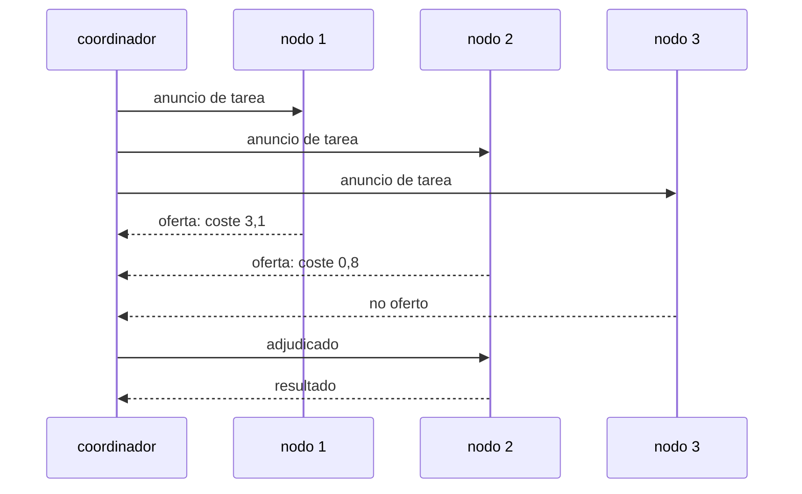

# P136 — El protocolo de red de contratos

> Ruta de agentes operativos · El coordinador no sabe quién es bueno en qué. En vez de
> mantener un registro que caduca, anuncia y deja que cada nodo declare su coste.

**Nivel:** L2 · **Motor:** `red_de_contratos` · **Notebook:** [`P136_red_de_contratos.ipynb`](../../../notebooks/papers/P136_red_de_contratos.ipynb)
· **Anexo:** [complejidad y coste](../../annexes/A05_COMPLEJIDAD_Y_COSTE.md)

## 1. Identificación

| Campo | Valor |
|---|---|
| **Título original** | *The Contract Net Protocol: High-Level Communication and Control in a Distributed Problem Solver* |
| **Autoría** | Reid G. Smith |
| **Año** | 1980 |
| **Venue** | IEEE Transactions on Computers, C-29(12), 1104–1113 |
| **Fuente primaria** | [doi:10.1109/TC.1980.1675516](https://doi.org/10.1109/TC.1980.1675516) |
| **Acceso** | Restringido |
| **Fecha de consulta** | 2026-08-18 |

## 2. Problema anterior

Repartir tareas entre nodos exige saber dos cosas: qué puede hacer cada uno y cuánto tiene encima.

Mantener ese registro de forma centralizada falla por tres vías. Se **desactualiza** —las
capacidades cambian y la carga cambia más deprisa—. **No escala** —el coordinador se convierte en
cuello de botella—. Y **se rompe cuando los nodos entran y salen**, que es precisamente el caso en
un sistema abierto.

El problema de fondo es que se está intentando centralizar información que vive distribuida: **quien
mejor conoce la capacidad de un nodo es el propio nodo**.

## 3. Propuesta

Invertir el flujo de información con un protocolo de tres pasos:

```text
1. ANUNCIO    coordinador → todos:      «hay esta tarea, con estas características»
2. OFERTAS    cada nodo → coordinador:  «puedo, y me cuesta X»
3. ADJUDICA   coordinador → ganador:    «es tuya»
```

Nadie mantiene una lista de capacidades. Cada nodo evalúa el anuncio contra lo que sabe de sí mismo
—incluida su carga actual— y decide si oferta y con qué coste. El coordinador solo compara ofertas.

Y los papeles son **dinámicos**: quien gana un contrato puede a su vez descomponer la tarea y
anunciar subtareas, actuando como coordinador. La jerarquía se forma sola.

## 4. Intuición sin fórmulas

Un concurso de obras. El ayuntamiento no mantiene un registro de qué sabe hacer cada constructora
ni de cuánto trabajo tiene ahora: publica el pliego y recibe ofertas.

Quien está desbordado oferta caro o no oferta. Quien tiene la maquinaria adecuada oferta barato. La
información llega en el momento de usarla y de quien la tiene.

**Dónde deja de funcionar la analogía:** en un concurso público hay contratos, avales y
consecuencias por incumplir. En el protocolo original no hay nada de eso, y un nodo puede ofertar
barato y no cumplir.

## 5. Matemática mínima

No hay formalismo: es un protocolo. Lo medible es qué compra y qué cuesta.

La miniatura reparte 18 tareas entre 6 nodos con habilidades distintas que **el coordinador
desconoce**:

| | Termina en | Desequilibrio | Mensajes |
|---|---:|---:|---:|
| reparto por turno riguroso | 8,23 | 5,57 | **18** |
| red de contratos | **5,05** | **3,15** | 234 |

**1,63× mejor** en tiempo de finalización, y el desequilibrio de carga baja porque cada nodo
incorpora a su oferta lo que ya tiene encima. La coordinación **emerge** de las ofertas, sin
planificador.

El precio son **13× más mensajes**. Esa razón es la que decide si el protocolo compensa: con nodos
homogéneos y capacidades conocidas, un planificador central lo hace mejor y más barato.

<!-- puente:inicio -->
> [!TIP]
> **Puente matemático.** Esta sección da por sabido lo siguiente. Si algo no te suena,
> léelo primero: está explicado una sola vez, en un solo sitio, y sirve para todas las fichas.

| Dónde | Qué necesitas de ahí |
|---|---|
| [**A05 §1** · Notación O(): qué dice y qué no](../../annexes/A05_COMPLEJIDAD_Y_COSTE.md#1-notación-o-qué-dice-y-qué-no) | por qué el coste en mensajes crece con el número de nodos y cuándo eso deja de compensar |
<!-- puente:fin -->

## 6. Arquitectura o flujo



## 7. Qué observar en el paper original

- Que los **papeles son dinámicos**: quien recibe un contrato puede anunciar subtareas y actuar como
  coordinador. No hay jerarquía fija.
- El **filtrado por elegibilidad**: el anuncio incluye qué hace falta para poder ofertar, así que los
  nodos incapaces ni responden. Es lo que evita que el protocolo se ahogue.
- La discusión sobre **cuándo NO usar el protocolo**: si las capacidades son homogéneas o conocidas,
  negociar es puro coste.
- Que el artículo es de 1980 y describe un sistema de **sensores distribuidos**, un caso donde los
  nodos aparecen y desaparecen de verdad.

## 8. Evidencia y resultados

El artículo presenta el protocolo con un caso de estudio en interpretación de datos de sensores
distribuidos, con análisis del comportamiento y del tráfico de mensajes.

> Es evidencia de diseño, con un caso de uso. No hay comparación cuantitativa sistemática contra
> alternativas, que es lo que hoy se pediría.

La miniatura compara contra un reparto por turno riguroso, que es un punto de comparación
deliberadamente débil: un planificador central que **sí** conociera las habilidades lo haría mejor
que la red de contratos. El supuesto del artículo es que no las conoce.

## 9. Impacto

- Es el protocolo de asignación de tareas más citado en sistemas multiagente, y se estandarizó en
  **FIPA**.
- La idea de **negociación en vez de registro central** está detrás de los mercados de cómputo, de
  los planificadores de tareas distribuidos y de los sistemas de subasta.
- En sistemas de agentes con modelos de lenguaje reaparece con otro nombre: un orquestador que
  describe la tarea y deja que los agentes especializados declaren si pueden.
- Y aporta un criterio operativo: **negociar solo tiene sentido cuando las capacidades difieren y
  nadie las conoce**. Si son intercambiables, ofertar es teatro caro.

## 10. Limitaciones

1. **Los nodos pueden mentir.** El protocolo original supone ofertas honestas y no tiene defensa
   contra quien oferta barato para ganar contratos.
2. **Cuesta mensajes**: 13× más en la miniatura, y la ronda de ofertas añade latencia por tarea.
3. **No hay compromiso vinculante.** Sandholm (1993) añadió compromisos rompibles con penalización,
   precisamente porque faltaba.
4. **La asignación es voraz**, tarea a tarea. Una asignación global óptima requeriría considerarlas
   todas a la vez.
5. **No aporta comparación cuantitativa** contra alternativas, que es lo que hoy se exigiría.

## 11. Errores comunes

| Error | Corrección |
|---|---|
| «La negociación siempre reparte mejor que un planificador» | Un planificador que conozca las capacidades lo hace mejor y con 13× menos mensajes. La red de contratos gana cuando nadie tiene ese conocimiento. |
| «Sirve para repartir trabajo entre agentes iguales» | Si son intercambiables, la mejor oferta es cualquiera y ofertar no compra nada. Solo compensa cuando las capacidades difieren. |
| «El coordinador necesita saber quién puede hacer qué» | Justamente no: esa es la aportación. Cada nodo evalúa el anuncio contra lo que sabe de sí mismo, y el coordinador solo compara ofertas. |
| «Los papeles de coordinador y contratista son fijos» | Son dinámicos: quien gana un contrato puede descomponer la tarea y anunciar subtareas. La jerarquía se forma sola. |
| «Un nodo que oferta barato es el mejor para la tarea» | Es el que dice que lo es. El protocolo original no tiene defensa contra ofertas estratégicas, y esa es su crítica más citada. |

## 12. Relación con trabajos anteriores

- **[P59 Agentes inteligentes](../P59_agente_racional/README.md) (1995)** — el marco conceptual del
  agente autónomo que este protocolo coordina.
- **[P135 Hearsay-II](../P135_pizarra/README.md) (1980)** — la alternativa sin negociación: coordinar
  por estructura compartida en vez de por mensajes.

## 13. Relación con trabajos posteriores

- **Sandholm (1993)** — la red de contratos con compromisos rompibles y penalización.
  [cdn.aaai.org](https://cdn.aaai.org/AAAI/1993/AAAI93-038.pdf)
- **[P138 KQML](../P138_kqml/README.md) (1994)** — el idioma en el que anunciar, ofertar y adjudicar.
- **FIPA** — la especificación estándar del protocolo.
  [fipa.org](http://www.fipa.org/specs/fipa00029/SC00029H.html)

## 14. Notebook asociado

[`P136_red_de_contratos.ipynb`](../../../notebooks/papers/P136_red_de_contratos.ipynb)

**Qué implementa:** el tiempo de finalización y el desequilibrio de carga de un reparto ciego frente a uno por anuncio, ofertas y adjudicación, con el coste en mensajes de cada uno.

**Qué NO implementa:** los nodos ofertan su coste verdadero, y en un sistema abierto pueden mentir. Y se cuentan mensajes, no latencia: la ronda de ofertas añade un retardo por tarea que aquí no aparece.

```bash
ai-evolution paper-lab P136 --seed 7
```

## 15. Actividades Bloom

| Nivel | Actividad |
|---|---|
| **Recordar** | Describe los tres pasos del protocolo. |
| **Explicar** | Explica por qué el coordinador no necesita conocer las capacidades. |
| **Aplicar** | Ejecuta el notebook y compara tiempo y mensajes de los dos repartos. |
| **Analizar** | Analiza en qué condiciones un planificador central sería mejor. |
| **Evaluar** | «Vamos a hacer que nuestros agentes negocien las tareas». Evalúa cuándo eso compensa. |
| **Crear** | Identifica un reparto de trabajo en un sistema tuyo y decide si las capacidades difieren lo bastante para que negociar compense los mensajes extra. |

## 16. Autoevaluación

1. ¿Cuáles son los tres pasos?
2. ¿Quién conoce la capacidad de un nodo?
3. ¿Qué mejora el protocolo y cuánto?
4. ¿Qué cuesta?
5. ¿Cuándo NO compensa?
6. ¿Son fijos los papeles?
7. ¿Cuál es su debilidad más citada?

## 17. Respuestas esperadas

1. Anuncio de la tarea a todos, ofertas de los nodos capaces con su coste estimado, y adjudicación a la mejor oferta.
2. El propio nodo. Esa es la inversión: en vez de centralizar información que vive distribuida, se pide en el momento de usarla a quien la tiene.
3. El tiempo de finalización: 5,05 frente a 8,23 en la miniatura, 1,63× mejor. Y el desequilibrio de carga baja de 5,57 a 3,15.
4. Mensajes: 234 frente a 18, trece veces más. Cambia cómputo central por conversación distribuida.
5. Cuando los nodos son intercambiables o cuando alguien conoce las capacidades. Ahí un planificador central lo hace mejor y mucho más barato.
6. No: quien gana un contrato puede descomponer la tarea y anunciar subtareas, actuando de coordinador. La jerarquía se forma sola.
7. Que supone ofertas honestas. Un nodo puede ofertar barato para ganar contratos, y el protocolo original no tiene defensa.

## 18. Fuentes primarias

- Smith, R. G. (1980). *The Contract Net Protocol*. **IEEE Transactions on Computers**, C-29(12),
  1104–1113. [doi:10.1109/TC.1980.1675516](https://doi.org/10.1109/TC.1980.1675516) ·
  consultado 2026-08-18.
- Sandholm, T. (1993). *An Implementation of the Contract Net Protocol Based on Marginal Cost
  Calculations*. [cdn.aaai.org](https://cdn.aaai.org/AAAI/1993/AAAI93-038.pdf) ·
  consultado 2026-08-18.
- FIPA. *Contract Net Interaction Protocol Specification*.
  [fipa.org](http://www.fipa.org/specs/fipa00029/SC00029H.html) · consultado 2026-08-18.

---

[⬅️ Anterior: P135 Hearsay-II](../P135_pizarra/README.md) ·
[📇 Índice](../../catalog/PAPERS_INDEX.md) ·
[📝 Evaluación](../../../assessments/papers/P136_red_de_contratos.md) ·
[🏫 Clase 126 · Handoffs y transferencia de contexto](../../../classes/part-10-multi-agent-systems-and-interoperability/126-handoffs-y-transferencia-de-contexto/README.md) ·
[➡️ Siguiente: P137 Principios del metarrazonamiento](../P137_metarrazonamiento/README.md)
