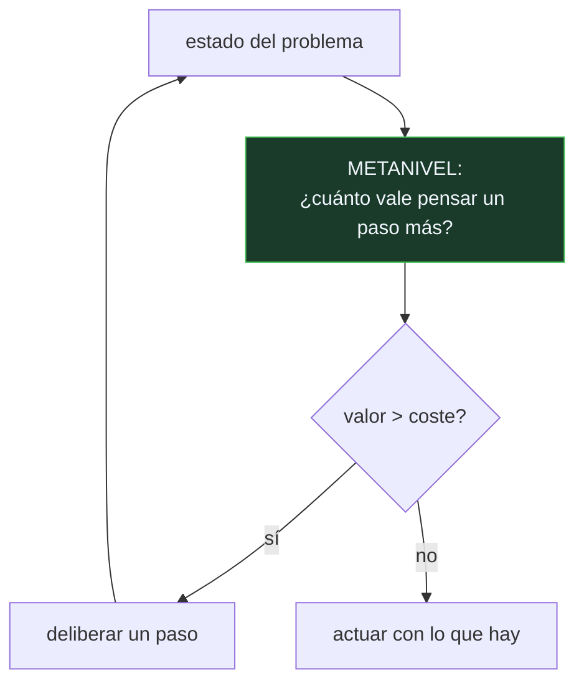

# P137 — Principios del metarrazonamiento

> Ruta de agentes operativos · Pensar mejora la respuesta con rendimientos decrecientes
> y cuesta por paso. En algún momento el siguiente paso cuesta más de lo que aporta.

**Nivel:** L3 · **Motor:** `metarrazonamiento` · **Notebook:** [`P137_metarrazonamiento.ipynb`](../../../notebooks/papers/P137_metarrazonamiento.ipynb)
· **Anexo:** [probabilidad y verosimilitud](../../annexes/A02_PROBABILIDAD_Y_VEROSIMILITUD.md)

## 1. Identificación

| Campo | Valor |
|---|---|
| **Título original** | *Principles of Metareasoning* |
| **Autoría** | Stuart Russell, Eric Wefald |
| **Año** | 1991 |
| **Venue** | Artificial Intelligence, 49(1–3), 361–395 |
| **Fuente primaria** | [doi:10.1016/0004-3702(91)90015-C](https://doi.org/10.1016/0004-3702%2891%2990015-C) |
| **Acceso** | Restringido |
| **Fecha de consulta** | 2026-08-18 |

## 2. Problema anterior

Un agente con recursos limitados no puede deliberar indefinidamente: mientras piensa, el mundo
sigue y la oportunidad se escapa. Pero los sistemas fijaban el presupuesto de cómputo **a mano** —
tantos nodos de búsqueda, tanta profundidad, tantos segundos—.

Un número fijo tiene un defecto que no se puede parchear: piensa **de más** en las instancias
fáciles y **de menos** en las difíciles, y siempre en la proporción equivocada, porque está
calibrado para una instancia que no es la que tienes delante.

Y hay algo peor: la decisión de cuánto pensar se toma igualmente aunque nadie la tome. Por omisión y
mal.

## 3. Propuesta

Tratar cada paso de deliberación como una **acción más**, con su coste y su beneficio esperado.

El **valor de la computación** de un paso es cuánto se espera que mejore la decisión final por
haberlo dado. La regla es entonces inmediata:

```text
seguir deliberando  ⟺  valor esperado del paso siguiente  >  coste del paso
```

La parada no se elige: se **deduce**. Y el criterio se adapta solo a cada instancia, porque la curva
de mejora es distinta en cada una.

Los autores desarrollan esto para búsqueda en juegos —dónde expandir el árbol— pero el marco es
general: es teoría de la decisión aplicada al propio proceso de decidir, lo que llaman el
**metanivel**.

## 4. Intuición sin fórmulas

Comparar precios antes de comprar. Mirar una tienda más puede ahorrarte dinero, y también te
cuesta tiempo.

Al principio compensa: la primera comparación puede ahorrarte mucho. A la décima, la mejora esperada
es de céntimos y la tarde se ha ido. El punto de parada no es un número de tiendas: es cuando lo que
esperas ahorrar deja de compensar el rato que te cuesta.

**Dónde deja de funcionar la analogía:** para saber cuánto ahorrarás mirando otra tienda tendrías
que mirarla. Estimar el valor de la computación **sin hacerla** es el problema difícil, y el
artículo lo reconoce.

## 5. Matemática mínima

```text
V(deliberar un paso más) = E[utilidad con el paso] − E[utilidad sin él]

    seguir  ⟺  V(paso) > coste(paso)
```

La miniatura usa una curva de mejora con rendimientos decrecientes y coste 0,9 por paso:

| Presupuesto fijo | Calidad | Coste | **Utilidad neta** |
|---:|---:|---:|---:|
| 3 | 13,72 | 2,70 | 11,02 |
| 6 | 20,20 | 5,40 | 14,80 |
| **10** | 23,87 | 9,00 | **14,87** |
| 20 | 25,82 | 18,00 | **7,82** |

Pensar de más es una forma de equivocarse: con 20 pasos la utilidad cae casi a la mitad del óptimo.

La regla de valor de la computación para en el paso **8** con utilidad **15,28** — mejor que el
mejor presupuesto fijo, y sin haber elegido ninguno.

Y sobre **300 instancias de dificultad variable**, el presupuesto fijo de 10 pasos piensa de más en
**177** casos y de menos en **1**, acertando en 122. Ningún número fijo puede ser correcto para
instancias que no se parecen.

<!-- puente:inicio -->
> [!TIP]
> **Puente matemático.** Esta sección da por sabido lo siguiente. Si algo no te suena,
> léelo primero: está explicado una sola vez, en un solo sitio, y sirve para todas las fichas.

| Dónde | Qué necesitas de ahí |
|---|---|
| [**A02 §2** · Entropía](../../annexes/A02_PROBABILIDAD_Y_VEROSIMILITUD.md#2-entropía) | la esperanza como promedio ponderado por probabilidad, que es la forma que tiene el valor de una computación |
<!-- puente:fin -->

## 6. Arquitectura o flujo



## 7. Qué observar en el paper original

- La distinción entre **nivel objeto** —razonar sobre el problema— y **metanivel** —razonar sobre
  cuánto razonar—. Es la aportación conceptual y organiza todo lo demás.
- El desarrollo para **búsqueda en juegos**: qué nodo expandir es una decisión con valor esperado
  calculable, y eso da un algoritmo concreto.
- El reconocimiento explícito de la **regresión**: metarrazonar también cuesta. El artículo discute
  el problema y no lo cierra.
- Su relación con la **racionalidad acotada** de Simon: no es una aproximación a la racionalidad
  perfecta, es un criterio de racionalidad distinto y más apropiado para agentes reales.

## 8. Evidencia y resultados

Desarrollo teórico con aplicación a búsqueda en juegos, con experimentos comparando la estrategia
de metanivel contra profundidades fijas.

> La evidencia empírica es modesta y de la época. El valor duradero es el marco conceptual, que
> reencuadra un problema práctico como un problema de decisión.

La miniatura usa una curva de calidad **conocida** —una exponencial—, y ahí está la trampa: en un
problema real no se sabe cuánto mejorará el siguiente paso. Estimarlo es el problema difícil que el
artículo llama metanivel.

## 9. Impacto

- Fundó la línea de **cómputo con recursos acotados**, y está detrás de los algoritmos *anytime*,
  del control de búsqueda y de la planificación con plazos.
- Es la base teórica de cualquier criterio de parada adaptativo: cuándo dejar de buscar, de simular,
  de muestrear.
- En sistemas de agentes con modelos de lenguaje es directamente aplicable y poco aplicado: los
  límites de pasos y de tokens se siguen fijando a mano, con el defecto que el artículo describe.
- Y aporta al programa el argumento de que **el presupuesto es una decisión**, no una constante de
  configuración.

## 10. Limitaciones

1. **Estimar el valor de la computación es el problema difícil**, y el artículo no lo resuelve en
   general: solo en casos donde la estructura lo permite.
2. **Metarrazonar cuesta.** Si estimar el valor es caro, se entra en una regresión que el artículo
   discute sin cerrar.
3. **Supone que el coste de deliberar es conocido y estable.** Con llamadas a modelos, varía por paso
   y depende del contexto acumulado.
4. **Los experimentos son modestos** y de un dominio concreto.
5. **Requiere una noción de utilidad bien definida**, que en muchas tareas reales no existe o no es
   comparable con el coste.

## 11. Errores comunes

| Error | Corrección |
|---|---|
| «Pensar más siempre mejora la respuesta» | Mejora la calidad y empeora la utilidad neta. Con 20 pasos, la utilidad cae de 14,87 a 7,82: pensar de más es una forma de equivocarse. |
| «Basta con calibrar bien el límite de pasos» | Ningún número fijo sirve para instancias distintas: en la miniatura piensa de más en 177 casos de 300 y de menos en 1. |
| «El criterio de parada es un detalle de implementación» | Es una decisión con la misma estructura que las demás: valor esperado contra coste. Un agente que no la toma la toma igual, por omisión. |
| «La regla exige conocer la curva de mejora» | Exige estimarla, que es distinto y es el problema difícil. El artículo lo reconoce y lo resuelve solo donde la estructura lo permite. |
| «Es racionalidad aproximada» | Es un criterio de racionalidad distinto: la racionalidad acotada de Simon. Un agente con recursos finitos que deliberara sin límite no sería más racional, sería peor. |

## 12. Relación con trabajos anteriores

- **[P59 Agentes inteligentes](../P59_agente_racional/README.md) (1995)** — el agente racional cuya
  racionalidad este artículo acota.
- **[P58 Símbolos y búsqueda](../P58_simbolos_y_busqueda/README.md) (1976)** — la búsqueda cuyo coste
  hay que administrar.
- **Simon (1955)** — el modelo original de comportamiento racional acotado.
  [doi:10.2307/1884852](https://doi.org/10.2307/1884852)

## 13. Relación con trabajos posteriores

- **Zilberstein (1996)** — algoritmos *anytime* en sistemas inteligentes.
  [ojs.aaai.org](https://ojs.aaai.org/aimagazine/index.php/aimagazine/article/view/1232)
- **[P29 Árbol de pensamientos](../P29_tree_of_thoughts/README.md) (2023)** — deliberación explícita
  en modelos de lenguaje, con el mismo problema de cuándo parar.
- **[P140 MapReduce](../P140_mapreduce/README.md) (2004)** — el otro presupuesto que hay que
  administrar: el de máquinas.

## 14. Notebook asociado

[`P137_metarrazonamiento.ipynb`](../../../notebooks/papers/P137_metarrazonamiento.ipynb)

**Qué implementa:** la utilidad neta de varios presupuestos fijos, dónde para la regla de valor de la computación, y cuántas veces un presupuesto fijo piensa de más o de menos sobre instancias de dificultad variable.

**Qué NO implementa:** la curva de calidad es una exponencial conocida. En un problema real no se sabe cuánto mejorará el siguiente paso, y estimarlo es justamente el problema difícil.

```bash
ai-evolution paper-lab P137 --seed 7
```

## 15. Actividades Bloom

| Nivel | Actividad |
|---|---|
| **Recordar** | Define el valor de la computación. |
| **Explicar** | Explica la regla de parada que se deduce de él. |
| **Aplicar** | Ejecuta el notebook y compara la regla con el mejor presupuesto fijo. |
| **Analizar** | Analiza por qué un presupuesto fijo se equivoca en las dos direcciones. |
| **Evaluar** | «Ponemos un límite de 20 pasos por si acaso». Evalúa la decisión. |
| **Crear** | Define para un agente tuyo un criterio de parada que dependa del progreso observado, y mide qué habría pasado en veinte ejecuciones pasadas. |

## 16. Autoevaluación

1. ¿Qué es el nivel objeto y qué el metanivel?
2. ¿Cuál es la regla de parada?
3. ¿Por qué falla un presupuesto fijo?
4. ¿Qué le pasa a la utilidad al pensar de más?
5. ¿Cuál es el problema difícil que queda abierto?
6. ¿Qué regresión plantea el metarrazonamiento?
7. ¿En qué se diferencia de la racionalidad perfecta?

## 17. Respuestas esperadas

1. El nivel objeto razona sobre el problema; el metanivel razona sobre cuánto conviene razonar. Separarlos es la aportación conceptual.
2. Seguir deliberando mientras el valor esperado del siguiente paso supere su coste. La parada se deduce en vez de elegirse.
3. Porque está calibrado para una instancia concreta. En la miniatura piensa de más en 177 casos de 300 y de menos en 1.
4. Cae. Con 10 pasos la utilidad neta es 14,87 y con 20, 7,82: la calidad sigue subiendo pero el coste la supera.
5. Estimar el valor de la computación **sin** hacerla. El artículo lo resuelve solo donde la estructura del problema lo permite.
6. Que estimar el valor también cuesta, así que habría que decidir cuánto invertir en decidir. El artículo lo discute y no lo cierra.
7. No es una aproximación peor a la racionalidad perfecta: es otro criterio. Un agente con recursos finitos que deliberara sin límite sería peor, no más racional.

## 18. Fuentes primarias

- Russell, S. y Wefald, E. (1991). *Principles of Metareasoning*. **Artificial Intelligence**,
  49(1–3), 361–395.
  [doi:10.1016/0004-3702(91)90015-C](https://doi.org/10.1016/0004-3702%2891%2990015-C) ·
  consultado 2026-08-18.
- Simon, H. A. (1955). *A Behavioral Model of Rational Choice*.
  [doi:10.2307/1884852](https://doi.org/10.2307/1884852) · consultado 2026-08-18.
- Zilberstein, S. (1996). *Using Anytime Algorithms in Intelligent Systems*. **AI Magazine**, 17(3).
  [ojs.aaai.org](https://ojs.aaai.org/aimagazine/index.php/aimagazine/article/view/1232) ·
  consultado 2026-08-18.

---

[⬅️ Anterior: P136 El protocolo de red de contratos](../P136_red_de_contratos/README.md) ·
[📇 Índice](../../catalog/PAPERS_INDEX.md) ·
[📝 Evaluación](../../../assessments/papers/P137_metarrazonamiento.md) ·
[🏫 Clase 121 · Presupuestos de pasos, tokens, costo y tiempo](../../../classes/part-09-ai-agent-engineering/121-presupuestos-de-pasos-tokens-costo-y-tiempo/README.md) ·
[➡️ Siguiente: P138 KQML](../P138_kqml/README.md)
