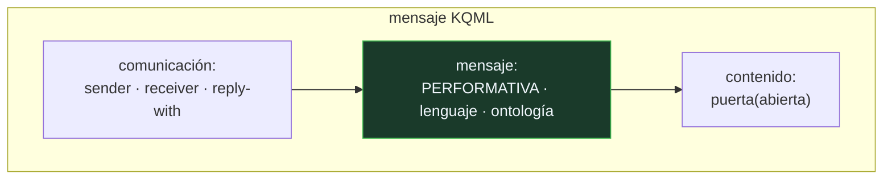

# P138 — KQML

> Ruta de agentes operativos · «puerta(abierta)» puede ser una afirmación, una
> pregunta, una orden o una negación. El contenido no basta: falta la intención.

**Nivel:** L2 · **Motor:** `kqml` · **Notebook:** [`P138_kqml.ipynb`](../../../notebooks/papers/P138_kqml.ipynb)
· **Anexo:** [complejidad y coste](../../annexes/A05_COMPLEJIDAD_Y_COSTE.md)

## 1. Identificación

| Campo | Valor |
|---|---|
| **Título original** | *KQML as an agent communication language* |
| **Autoría** | Tim Finin, Richard Fritzson, Don McKay, Robin McEntire |
| **Año** | 1994 |
| **Venue** | CIKM '94, 456–463 |
| **Fuente primaria** | [doi:10.1145/191246.191322](https://doi.org/10.1145/191246.191322) |
| **Acceso** | Restringido |
| **Fecha de consulta** | 2026-08-18 |

## 2. Problema anterior

Dos agentes que se intercambian la cadena `puerta(abierta)` no pueden saber qué hacer con ella.
¿Es una afirmación que hay que creer? ¿Una pregunta que hay que responder? ¿Una orden que hay que
ejecutar? ¿Una negación de algo dicho antes?

El contenido es idéntico en los cuatro casos y la respuesta correcta es distinta en cada uno. En la
práctica el receptor lo infiere del canal por el que llegó —este puerto es para consultas, ese otro
para órdenes— y esa inferencia implícita es deuda que se paga después.

Y hay un segundo problema, de escala: sin una capa común, conectar N agentes que usan M lenguajes de
contenido exige un adaptador por cada pareja y cada lenguaje.

## 3. Propuesta

Un lenguaje de mensajes en **tres capas**, donde cada una responde a una pregunta distinta:

```text
comunicación : de quién a quién, con qué identificador de respuesta
mensaje      : PERFORMATIVA + en qué lenguaje va el contenido
contenido    : lo que se dice, en el lenguaje que sea
```

La **performativa** es la aportación: una etiqueta que declara el acto de habla —`tell`, `ask-if`,
`achieve`, `deny`, `subscribe`—, tomada de la filosofía del lenguaje de Austin y Searle. Con ella el
receptor sabe qué se espera de él sin inferirlo.

La separación en capas permite cambiar el lenguaje del contenido sin tocar el transporte, y el
transporte sin tocar la semántica. Y añade **facilitadores**: agentes que ayudan a otros a
encontrarse.

## 4. Intuición sin fórmulas

Un sobre. Dentro puede ir cualquier cosa y en cualquier idioma, pero fuera pone si es una factura,
una consulta, una notificación o un requerimiento.

Quien lo recibe sabe qué hacer antes de abrirlo, y quien lo envía no tiene que negociar un formato
distinto con cada destinatario: el sobre es el mismo para todos.

**Dónde deja de funcionar la analogía:** en el correo, «factura» significa lo mismo para todos. KQML
nunca fijó una semántica formal de sus performativas, y esa es exactamente su crítica más citada:
dos implementaciones podían entender `tell` de forma distinta.

## 5. Matemática mínima

No hay formalismo —y esa ausencia es la crítica principal—. Lo medible es la ambigüedad y el coste
de integración.

**Ambigüedad.** La misma cadena `puerta(abierta)` admite **5** lecturas incompatibles:

| Performativa | Significado | Respuesta esperada |
|---|---|---|
| `tell` | te informo de que está abierta | ninguna, o un acuse |
| `ask-if` | ¿está abierta? | sí o no |
| `achieve` | haz que esté abierta | actuar y confirmar |
| `deny` | no es cierto que esté abierta | revisar creencias |
| `subscribe` | avísame cuando cambie | flujo de notificaciones |

**Coste de integración.** Con N agentes y M lenguajes de contenido:

| Agentes | Lenguajes | Sin capa común | Con capa común | Razón |
|---:|---:|---:|---:|---:|
| 6 | 4 | 120 | 10 | 12,0× |
| **30** | **10** | **8 700** | **40** | **217,5×** |

De N×(N−1)×M adaptadores a N+M.

<!-- puente:inicio -->
> [!TIP]
> **Puente matemático.** Esta sección da por sabido lo siguiente. Si algo no te suena,
> léelo primero: está explicado una sola vez, en un solo sitio, y sirve para todas las fichas.

| Dónde | Qué necesitas de ahí |
|---|---|
| [**A05 §1** · Notación O(): qué dice y qué no](../../annexes/A05_COMPLEJIDAD_Y_COSTE.md#1-notación-o-qué-dice-y-qué-no) | la diferencia entre un coste cuadrático y uno lineal cuando lo que crece es el número de integraciones |
<!-- puente:fin -->

## 6. Arquitectura o flujo



## 7. Qué observar en el paper original

- El **catálogo de performativas** y su agrupación: informativas, de consulta, de capacidad, de
  red. Es lo que se puede reutilizar directamente hoy.
- Los **facilitadores**, agentes cuya función es el descubrimiento: quién sabe hacer qué, quién está
  disponible. Es la otra mitad del problema de interoperabilidad.
- Que la separación en capas permite que el **contenido siga siendo opaco** para la infraestructura,
  lo que es justamente lo que la hace neutral.
- La ausencia deliberada de una semántica formal, que el artículo justifica por pragmatismo y que
  acabó siendo su punto débil.

## 8. Evidencia y resultados

Es un artículo de propuesta y de descripción de implementación, con ejemplos de uso en sistemas
reales del programa de compartición de conocimiento en el que se enmarcaba.

> No hay evaluación cuantitativa. Su influencia se mide por adopción: FIPA ACL lo sucedió y
> formalizó lo que aquí faltaba.

La miniatura cuenta adaptadores bajo el supuesto de que cada pareja necesita uno por lenguaje —el
peor caso—. En la práctica se comparten bibliotecas y la diferencia real es menor, aunque el orden
de crecimiento es el mismo.

## 9. Impacto

- Es el origen de los **lenguajes de comunicación entre agentes**, y su sucesor **FIPA ACL** fue
  estándar de la industria durante años.
- El concepto de **performativa** entró en el vocabulario del área y sigue usándose para razonar
  sobre protocolos.
- El problema que planteó no se ha ido: el **Model Context Protocol** de 2024 resuelve lo mismo con
  la misma forma —una capa común que separa transporte, intención y contenido—.
- Y su fracaso enseña tanto como su éxito: sin **semántica formal**, dos implementaciones conformes
  pueden no entenderse, y eso es lo que impidió la interoperabilidad real que prometía.

## 10. Limitaciones

1. **No hay semántica formal de las performativas.** Es la crítica más citada: `tell` podía
   significar cosas distintas en dos implementaciones conformes.
2. **El conjunto de performativas es abierto y ambiguo**, con solapamientos entre varias.
3. **Supone agentes cooperativos** que dicen la verdad y responden. No hay modelo de adversario.
4. **El descubrimiento queda a medias**: los facilitadores se describen sin especificarse del todo.
5. **La adopción real fue limitada**, y el ecosistema de agentes interoperables que prometía no
   llegó a existir.

## 11. Errores comunes

| Error | Corrección |
|---|---|
| «Con un esquema de datos compartido basta para integrar agentes» | El esquema dice qué se dice, no qué se pretende. La misma cadena admite cinco lecturas incompatibles con respuestas distintas. |
| «La intención se infiere del endpoint» | Se infiere, y esa inferencia implícita es la deuda: acopla el significado al transporte y se rompe al cambiar cualquiera de los dos. |
| «Una capa común es sobrecarga innecesaria» | Con 30 agentes y 10 lenguajes, son 8 700 adaptadores punto a punto frente a 40. El crecimiento es cuadrático frente a lineal. |
| «KQML resolvió la interoperabilidad entre agentes» | No: sin semántica formal, dos implementaciones conformes podían no entenderse. El ecosistema que prometía no llegó a existir. |
| «Es un estándar histórico sin relevancia hoy» | El Model Context Protocol resuelve el mismo problema con la misma estructura de capas, treinta años después. |

## 12. Relación con trabajos anteriores

- **[P135 Hearsay-II](../P135_pizarra/README.md) (1980)** — coordinar sin hablarse; aquí los agentes
  sí se hablan y hace falta idioma.
- **[P136 El protocolo de red de contratos](../P136_red_de_contratos/README.md) (1980)** — el
  protocolo que necesita un lenguaje en el que anunciar y ofertar.
- **[P59 Agentes inteligentes](../P59_agente_racional/README.md) (1995)** — el marco conceptual del
  agente que se comunica.

## 13. Relación con trabajos posteriores

- **FIPA ACL** — el estándar que sucedió a KQML y formalizó su semántica.
  [fipa.org](http://www.fipa.org/specs/fipa00061/SC00061G.html)
- **Model Context Protocol (2024)** — el mismo problema y la misma forma de resolverlo.
  [modelcontextprotocol.io](https://modelcontextprotocol.io/docs/concepts/architecture)
- **[P14 Toolformer](../P14_toolformer/README.md) (2023)** — el otro extremo: que el modelo aprenda
  a invocar herramientas en vez de acordar un protocolo.

## 14. Notebook asociado

[`P138_kqml.ipynb`](../../../notebooks/papers/P138_kqml.ipynb)

**Qué implementa:** cuántas lecturas incompatibles admite un mismo contenido sin declarar la intención, y cuántos adaptadores hacen falta para integrar N agentes con M lenguajes de contenido con y sin una capa común.

**Qué NO implementa:** el conteo de adaptadores supone un adaptador por pareja y lenguaje, que es el peor caso. Y no se modela el descubrimiento, que es la otra mitad del problema.

```bash
ai-evolution paper-lab P138 --seed 7
```

## 15. Actividades Bloom

| Nivel | Actividad |
|---|---|
| **Recordar** | Enumera las tres capas de un mensaje KQML. |
| **Explicar** | Explica qué es una performativa y de dónde viene el concepto. |
| **Aplicar** | Ejecuta el notebook y compara el coste de integración con y sin capa común. |
| **Analizar** | Analiza por qué la falta de semántica formal impidió la interoperabilidad real. |
| **Evaluar** | «Nuestros agentes se pasan JSON, ya está integrado». Evalúa la afirmación. |
| **Crear** | Revisa el protocolo entre dos componentes tuyos y comprueba si la intención de cada mensaje está declarada o se infiere del contexto. |

## 16. Autoevaluación

1. ¿Qué problema resuelve la performativa?
2. ¿Cuáles son las tres capas?
3. ¿Cuánto ahorra una capa común?
4. ¿De dónde viene el concepto de acto de habla?
5. ¿Qué son los facilitadores?
6. ¿Cuál fue la crítica más citada?
7. ¿Qué protocolo actual resuelve lo mismo?

## 17. Respuestas esperadas

1. La ambigüedad de la intención. La misma cadena puede ser afirmación, pregunta, orden, negación o suscripción, con respuestas correctas distintas.
2. Comunicación —de quién a quién—, mensaje —performativa y lenguaje del contenido— y contenido. Cada una se puede cambiar sin tocar las otras.
3. Convierte N×(N−1)×M adaptadores en N+M. Con 30 agentes y 10 lenguajes, 8 700 frente a 40.
4. De la filosofía del lenguaje de Austin y Searle: decir algo es hacer algo, y qué se hace no está en el contenido.
5. Agentes cuya función es el descubrimiento: saber quién sabe hacer qué y quién está disponible. Es la otra mitad de la interoperabilidad.
6. La ausencia de semántica formal de las performativas: dos implementaciones conformes podían entender `tell` de forma distinta.
7. El Model Context Protocol, con la misma separación entre transporte, intención y contenido.

## 18. Fuentes primarias

- Finin, T., Fritzson, R., McKay, D. y McEntire, R. (1994). *KQML as an agent communication
  language*. **CIKM '94**, 456–463.
  [doi:10.1145/191246.191322](https://doi.org/10.1145/191246.191322) · consultado 2026-08-18.
- FIPA. *ACL Message Structure Specification*.
  [fipa.org](http://www.fipa.org/specs/fipa00061/SC00061G.html) · consultado 2026-08-18.
- Anthropic. *Model Context Protocol — Architecture*.
  [modelcontextprotocol.io](https://modelcontextprotocol.io/docs/concepts/architecture) ·
  consultado 2026-08-18.

---

[⬅️ Anterior: P137 Principios del metarrazonamiento](../P137_metarrazonamiento/README.md) ·
[📇 Índice](../../catalog/PAPERS_INDEX.md) ·
[📝 Evaluación](../../../assessments/papers/P138_kqml.md) ·
[🏫 Clase 134 · A2A, descubrimiento e interoperabilidad](../../../classes/part-10-multi-agent-systems-and-interoperability/134-a2a-descubrimiento-e-interoperabilidad/README.md) ·
[➡️ Siguiente: P139 Niveles de automatización](../P139_niveles_de_automatizacion/README.md)
