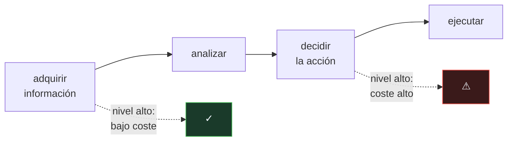

# P139 — Niveles de automatización

> Ruta de agentes operativos · Automatizar la aprobación no elimina los errores del
> sistema: elimina a quien los veía. Y quien revisa menos, además revisa peor.

**Nivel:** L2 · **Motor:** `niveles_de_automatizacion` · **Notebook:** [`P139_niveles_de_automatizacion.ipynb`](../../../notebooks/papers/P139_niveles_de_automatizacion.ipynb)
· **Anexo:** [probabilidad y verosimilitud](../../annexes/A02_PROBABILIDAD_Y_VEROSIMILITUD.md)

## 1. Identificación

| Campo | Valor |
|---|---|
| **Título original** | *A model for types and levels of human interaction with automation* |
| **Autoría** | Raja Parasuraman, Thomas B. Sheridan, Christopher D. Wickens |
| **Año** | 2000 |
| **Venue** | IEEE Transactions on Systems, Man, and Cybernetics, 30(3), 286–297 |
| **Fuente primaria** | [doi:10.1109/3468.844354](https://doi.org/10.1109/3468.844354) |
| **Acceso** | Restringido |
| **Fecha de consulta** | 2026-08-18 |

## 2. Problema anterior

«Automatizar» se trataba como una decisión de todo o nada sobre un sistema entero, y como algo
cuyo único efecto era ahorrar trabajo humano.

Los estudios de factores humanos llevaban décadas documentando lo contrario. Subir el nivel de
automatización tiene un coste que casi nadie contabilizaba: quien deja de decidir **pierde la
práctica** que le permitía detectar el fallo cuando ocurre, y pierde la conciencia de la situación
que le permitiría retomar el control.

Bainbridge lo había llamado la *ironía de la automatización*: al operador se le deja precisamente la
tarea de vigilar aquello para lo que la automatización le ha quitado el entrenamiento.

## 3. Propuesta

Dos ejes en lugar de una decisión binaria.

**Cuatro etapas** que se automatizan por separado:

```text
adquirir información → analizarla → decidir la acción → ejecutarla
```

**Diez niveles** en cada una, del 1 —el humano lo hace todo— al 10 —el sistema actúa e ignora al
humano—, con escalones intermedios como «el sistema propone varias y el humano elige», «el sistema
sugiere una y el humano aprueba» o «el sistema actúa y avisa después».

Y un método para elegir: evaluar cada combinación por su efecto sobre la **carga mental**, la
**conciencia de la situación**, la **confianza** del operador y la **complacencia**, además del
rendimiento.

La consecuencia práctica es que automatizar la adquisición de información casi nunca tiene coste, y
automatizar la decisión casi siempre lo tiene.

## 4. Intuición sin fórmulas

Un copiloto. Puede leerte los instrumentos, puede además interpretarlos, puede además decirte qué
hacer, y puede además hacerlo él.

Cada escalón te quita trabajo y te quita también algo de criterio. Cuando lleva un año haciéndolo
todo y un día pregunta «¿esto está bien?», ya no sabes responder: hace un año que no miras.

**Dónde deja de funcionar la analogía:** un copiloto humano te avisa cuando duda. Un sistema
automático falla con la misma confianza con la que acierta, y esa es justamente la razón de que la
detección importe tanto.

## 5. Matemática mínima

No hay formalismo: es un marco de diseño. Lo medible es el compromiso entre carga y detección.

La miniatura pasa **la misma tanda de 150 errores** por los seis niveles —si cada uno sorteara la
suya, las detecciones no serían comparables—:

| Nivel | Revisa | Detecta | Pasan | Carga |
|---:|---:|---:|---:|---:|
| 1 · el humano decide todo | 100 % | **141** | 9 | 2 000 |
| 3 · propone y el humano elige | 85 % | 108 | 42 | 1 691 |
| 5 · sugiere y el humano aprueba | 55 % | 62 | 88 | 1 139 |
| 7 · actúa y avisa después | 20 % | 18 | 132 | 382 |
| 9 · actúa y avisa si se lo piden | 5 % | 4 | 146 | 102 |
| 10 · actúa e ignora al humano | 0 % | **0** | 150 | **0** |

La caída es **superlineal**: del nivel 5 al 7 se revisa 2,75× menos y se detecta **3,4× menos**. No
es solo que se mire menos — es que quien mira menos, mira peor.

Lo que sí cae limpiamente es la carga. Ese es el beneficio real, y hay que ponerlo **al lado** del
coste, no en su lugar.

<!-- puente:inicio -->
> [!TIP]
> **Puente matemático.** Esta sección da por sabido lo siguiente. Si algo no te suena,
> léelo primero: está explicado una sola vez, en un solo sitio, y sirve para todas las fichas.

| Dónde | Qué necesitas de ahí |
|---|---|
| [**A02 §3** · Verosimilitud y entropía cruzada](../../annexes/A02_PROBABILIDAD_Y_VEROSIMILITUD.md#3-verosimilitud-y-entropía-cruzada) | cómo se compone la probabilidad de dos sucesos encadenados —revisar y, dado que se revisa, detectar— y por qué su producto cae más deprisa que cualquiera de los dos |
<!-- puente:fin -->

## 6. Arquitectura o flujo



## 7. Qué observar en el paper original

- Que el nivel se elige **por etapa** y no para el sistema entero. Es la aportación práctica y la
  que más se ignora.
- Los **criterios de evaluación primarios y secundarios**: rendimiento humano, carga mental,
  conciencia de la situación, complacencia y pérdida de habilidad. Es una lista de comprobación
  aplicable.
- El concepto de **complacencia**: la confianza excesiva en un sistema que suele acertar, que hace
  que el operador deje de comprobar aunque tenga tiempo.
- Los ejemplos de **aviación**, donde estos compromisos se estudiaron con accidentes reales y donde
  la literatura es más madura que en cualquier otro dominio.

## 8. Evidencia y resultados

Es una síntesis de décadas de investigación en factores humanos, con un marco propuesto y ejemplos
de aplicación en aviación y control de procesos.

> La evidencia es acumulativa y cualitativa: recoge estudios previos y los organiza. No hay
> experimento nuevo, y el marco se propone como herramienta de diseño, no como resultado medido.

La miniatura modela la degradación de la detección con una fórmula **inventada**. El artículo la
documenta cualitativamente a partir de estudios de factores humanos, no con esta curva.

## 9. Impacto

- Es el marco de referencia para diseñar sistemas con humano en el bucle, y se usa en aviación,
  medicina, conducción autónoma y control industrial.
- La **taxonomía de niveles** es vocabulario común: decir «nivel 4 en decisión, nivel 7 en ejecución»
  es una especificación.
- En sistemas de agentes es directamente aplicable y poco aplicado: la diferencia entre un agente que
  propone una acción y uno que la ejecuta y avisa es exactamente el salto del nivel 5 al 7.
- Y aporta el argumento contra medir el éxito de un despliegue por cuántas aprobaciones humanas se
  eliminaron: eso reporta la mitad del efecto.

## 10. Limitaciones

1. **No dice qué nivel elegir.** Da un marco para razonar, y la decisión sigue siendo de criterio.
2. **No modela el coste de un error que pasa**, que es lo que de verdad decide el nivel adecuado.
   Un falso negativo en diagnóstico y en un filtro de correo no cuestan lo mismo.
3. **Los diez niveles son una escala ordinal**, no una métrica: la distancia entre el 4 y el 5 no es
   comparable con la del 8 al 9.
4. **Está pensado para operadores entrenados** en dominios críticos. Trasladarlo a usuarios
   ocasionales de una herramienta exige adaptación.
5. **Es anterior a los sistemas que aprenden.** Un sistema cuyo comportamiento cambia con el tiempo
   complica la calibración de la confianza del operador.

## 11. Errores comunes

| Error | Corrección |
|---|---|
| «Automatizar la aprobación reduce los errores» | Reduce quien los ve. Con la misma tanda de 150 errores, el nivel 1 detecta 141 y el nivel 10, ninguno. |
| «Si el humano revisa la mitad, detecta la mitad de los errores» | Detecta menos: la caída es superlineal. Del nivel 5 al 7 se revisa 2,75× menos y se detecta 3,4× menos. |
| «El nivel de automatización es una propiedad del sistema» | Se elige por etapa. Automatizar la adquisición de información casi nunca tiene coste; automatizar la decisión, casi siempre. |
| «Un despliegue exitoso es el que elimina más aprobaciones» | Eso reporta la carga ahorrada y omite los errores que empiezan a pasar. Es la mitad del efecto. |
| «Con un buen operador el problema no existe» | El problema es que el buen operador deja de serlo: sin práctica no hay criterio, y la complacencia hace que deje de comprobar aunque tenga tiempo. |

## 12. Relación con trabajos anteriores

- **[P134 La protección de la información](../P134_minimo_privilegio/README.md) (1975)** — qué puede
  hacer el sistema; aquí, cuánto le dejamos decidir.
- **Bainbridge (1983)** — las ironías de la automatización, el antecedente directo.
  [doi:10.1016/0005-1098(83)90046-8](https://doi.org/10.1016/0005-1098%2883%2990046-8)
- **Parasuraman y Riley (1997)** — uso, mal uso y abuso de la automatización.
  [doi:10.1518/001872097778543886](https://doi.org/10.1518/001872097778543886)

## 13. Relación con trabajos posteriores

- **[P112 ML Test Score](../P112_ml_test_score/README.md) (2017)** — la monitorización que hace
  falta cuando el humano ya no está mirando.
- **[P148 Cerrar la brecha de responsabilidad](../P148_auditoria_interna/README.md) (2020)** — quién
  responde cuando el sistema decide solo.
- **Reglamento de IA de la UE (2024)** — la supervisión humana como requisito legal para sistemas de
  alto riesgo.

## 14. Notebook asociado

[`P139_niveles_de_automatizacion.ipynb`](../../../notebooks/papers/P139_niveles_de_automatizacion.ipynb)

**Qué implementa:** cuántos errores detecta un humano y cuánta carga de revisión soporta en cada nivel de automatización, con la misma tanda de errores para todos los niveles.

**Qué NO implementa:** la degradación de la capacidad de detección se modela con una fórmula inventada; el artículo la documenta cualitativamente. Y no se modela el coste de un error que pasa, que es lo que decide el nivel adecuado.

```bash
ai-evolution paper-lab P139 --seed 7
```

## 15. Actividades Bloom

| Nivel | Actividad |
|---|---|
| **Recordar** | Enumera las cuatro etapas automatizables. |
| **Explicar** | Explica qué es la ironía de la automatización. |
| **Aplicar** | Ejecuta el notebook y compara detección y carga por nivel. |
| **Analizar** | Analiza por qué la detección cae más deprisa que la revisión. |
| **Evaluar** | «Automatizamos las aprobaciones y ahorramos 1 600 revisiones». Evalúa qué falta reportar. |
| **Crear** | Sitúa una decisión que tu sistema automatice en los diez niveles y estima qué fracción de errores detectaría un humano en el nivel actual. |

## 16. Autoevaluación

1. ¿Cuáles son las cuatro etapas?
2. ¿Qué se automatiza más barato?
3. ¿Cae la detección en proporción a la revisión?
4. ¿Qué es la complacencia?
5. ¿Qué sí cae limpiamente al subir de nivel?
6. ¿Qué decide realmente el nivel adecuado?
7. ¿Cómo se aplica a un agente con herramientas?

## 17. Respuestas esperadas

1. Adquirir información, analizarla, decidir la acción y ejecutarla. Cada una se automatiza a un nivel distinto.
2. La adquisición de información: automatizarla casi nunca tiene coste. Automatizar la decisión casi siempre lo tiene.
3. No: cae más deprisa. Del nivel 5 al 7 se revisa 2,75× menos y se detecta 3,4× menos, porque quien revisa menos también revisa peor.
4. La confianza excesiva en un sistema que suele acertar, que lleva al operador a dejar de comprobar aunque tenga tiempo para hacerlo.
5. La carga humana: de 2 000 revisiones al nivel 1 a 0 al nivel 10. Ese es el beneficio real, y hay que reportarlo junto al coste.
6. El coste de un error que pasa. El marco no lo modela, y sin esa cifra la elección de nivel no se puede justificar.
7. Directamente: un agente que propone una acción está en el nivel 5 y uno que la ejecuta y avisa después, en el 7. El salto es exactamente el que el artículo mide.

## 18. Fuentes primarias

- Parasuraman, R., Sheridan, T. B. y Wickens, C. D. (2000). *A model for types and levels of human
  interaction with automation*. **IEEE Transactions on Systems, Man, and Cybernetics**, 30(3),
  286–297. [doi:10.1109/3468.844354](https://doi.org/10.1109/3468.844354) · consultado 2026-08-18.
- Bainbridge, L. (1983). *Ironies of Automation*.
  [doi:10.1016/0005-1098(83)90046-8](https://doi.org/10.1016/0005-1098%2883%2990046-8) ·
  consultado 2026-08-18.
- Parasuraman, R. y Riley, V. (1997). *Humans and Automation: Use, Misuse, Disuse, Abuse*.
  [doi:10.1518/001872097778543886](https://doi.org/10.1518/001872097778543886) ·
  consultado 2026-08-18.

---

[⬅️ Anterior: P138 KQML](../P138_kqml/README.md) ·
[📇 Índice](../../catalog/PAPERS_INDEX.md) ·
[📝 Evaluación](../../../assessments/papers/P139_niveles_de_automatizacion.md) ·
[🏫 Clase 120 · Human-in-the-loop y aprobaciones](../../../classes/part-09-ai-agent-engineering/120-human-in-the-loop-y-aprobaciones/README.md) ·
[➡️ Siguiente: P140 MapReduce](../P140_mapreduce/README.md)
