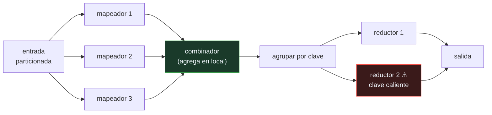

# P140 — MapReduce

> Ruta de agentes operativos · Dos funciones puras y el sistema se encarga del resto.
> El modelo es simple; el sesgo de los datos, no.

**Nivel:** L1 · **Motor:** `mapreduce` · **Notebook:** [`P140_mapreduce.ipynb`](../../../notebooks/papers/P140_mapreduce.ipynb)
· **Anexo:** [complejidad y coste](../../annexes/A05_COMPLEJIDAD_Y_COSTE.md)

## 1. Identificación

| Campo | Valor |
|---|---|
| **Título original** | *MapReduce: simplified data processing on large clusters* |
| **Autoría** | Jeffrey Dean, Sanjay Ghemawat |
| **Año** | 2004 |
| **Venue** | OSDI 2004 · Communications of the ACM, 51(1), 107–113 |
| **Fuente primaria** | [doi:10.1145/1327452.1327492](https://doi.org/10.1145/1327452.1327492) |
| **Acceso** | Abierto |
| **Fecha de consulta** | 2026-08-18 |

## 2. Problema anterior

Procesar terabytes sobre miles de máquinas baratas exigía escribir a mano el particionado de los
datos, la comunicación entre nodos, la recuperación de los que fallan y la agregación de resultados.

Cada trabajo reimplementaba lo mismo, con sus propios errores, y **la lógica del problema quedaba
enterrada bajo la fontanería**. Un cálculo que en una máquina son diez líneas se convertía en
centenares en cuanto había que distribuirlo.

Y a esa escala, los fallos no son excepcionales: con miles de máquinas, que alguna falle durante un
trabajo largo no es un caso raro, es lo normal.

## 3. Propuesta

Reducir el problema a **dos funciones puras** que el programador escribe:

```text
map    : registro           → (clave, valor)
reduce : (clave, [valores]) → resultado
```

Todo lo demás lo hace el sistema: repartir la entrada, ejecutar los mapeadores en paralelo, agrupar
por clave, mover los datos a los reductores, reejecutar lo que falle y recoger la salida.

Y dos optimizaciones que resultaron esenciales. El **combinador**, que agrega en el mapeador antes
de mover datos por la red. Y las **tareas de respaldo**: cuando el trabajo está casi terminado, se
relanzan las tareas pendientes en otra máquina, y gana la primera que acabe — porque el trabajo
termina cuando termina la última.

## 4. Intuición sin fórmulas

Contar votos de una elección. Cada mesa cuenta lo suyo (map) y luego se suman los recuentos por
candidato (reduce). Nadie centraliza las papeletas.

Funciona bien si las mesas son parecidas. Pero si el 40 % del censo vota en una sola mesa, esa mesa
termina cuando termina, y el resultado nacional no se puede anunciar antes — por mucho que abras
mesas nuevas en los barrios vacíos.

**Dónde deja de funcionar la analogía:** en una elección puedes redistribuir el censo. Una clave
caliente no se puede partir sin cambiar la semántica de la agregación, y ahí está el problema.

## 5. Matemática mínima

```text
tiempo total = máx sobre reductores (carga del reductor)

    reparto por hash:  reductor(clave) = h(clave) mod R
```

La miniatura reparte 5 000 registros entre 8 reductores:

| Reparto | Más cargado | Menos cargado | Ideal | Sobre el ideal |
|---|---:|---:|---:|---:|
| claves uniformes | 685 | 578 | 625 | **1,10×** |
| **una clave se lleva el 40 %** | **2 367** | 357 | 625 | **3,79×** |

El reparto por hash funciona bien cuando los datos son planos y falla cuando no lo son. Y como el
trabajo termina con el último, ese reductor **es** el tiempo total.

**Añadir reductores no arregla nada**: la clave caliente sigue cayendo en uno solo. El sesgo no es un
problema de escala sino de partición.

Lo que sí ayuda, en otra dimensión, es el combinador: agregar en el mapeador baja el tráfico de
5 000 parejas a **1 954**, **2,56× menos** por la red.

<!-- puente:inicio -->
> [!TIP]
> **Puente matemático.** Esta sección da por sabido lo siguiente. Si algo no te suena,
> léelo primero: está explicado una sola vez, en un solo sitio, y sirve para todas las fichas.

| Dónde | Qué necesitas de ahí |
|---|---|
| [**A05 §1** · Notación O(): qué dice y qué no](../../annexes/A05_COMPLEJIDAD_Y_COSTE.md#1-notación-o-qué-dice-y-qué-no) | por qué el tiempo de un trabajo distribuido es un máximo y no una media, y qué implica eso para el reparto |
<!-- puente:fin -->

## 6. Arquitectura o flujo



## 7. Qué observar en el paper original

- Las **tareas de respaldo** para los rezagados. Es una idea de dos párrafos con un efecto enorme, y
  el antecedente directo de las peticiones de cobertura de
  [La cola a escala](../P109_cola_larga/README.md).
- La **tolerancia a fallos por reejecución**, que solo funciona porque las funciones son puras: se
  puede repetir una tarea sin consecuencias.
- La **localidad**: llevar el cómputo a donde están los datos en lugar de mover los datos, que a esa
  escala es la diferencia entre viable e inviable.
- La sección de **experiencia**: qué tipos de trabajo se ejecutaban realmente en Google con este
  modelo, y cuántos.

## 8. Evidencia y resultados

El artículo presenta mediciones de trabajos reales a escala —ordenación de un terabyte, búsqueda
distribuida— con desglose de tiempos, efecto de las tareas de respaldo y comportamiento ante fallos
inducidos.

> Es evidencia operativa de primer orden: un sistema en producción, con cifras de uso y de
> rendimiento reales.

La miniatura cuenta **registros por reductor**, no tiempo. Un reductor puede ser lento por otras
razones —disco, vecinos ruidosos— y ese es el problema de los rezagados, que el artículo resuelve
con las tareas de respaldo y que aquí no se modela.

## 9. Impacto

- Es el artículo fundacional del procesamiento de datos a gran escala, y dio lugar a **Hadoop**, que
  definió una década de infraestructura de datos.
- **Spark** lo sucedió generalizando el modelo, y las ideas de reejecución y localidad siguen
  intactas.
- El patrón **fan-out / fan-in** que formaliza es el mismo que usa hoy un orquestador de agentes que
  reparte subtareas y recoge resultados.
- Y su lección sobre el **sesgo de partición** es transferible: cualquier sistema que reparta trabajo
  por hash de una clave hereda este problema, incluidos los que reparten conversaciones o documentos
  entre agentes.

## 10. Limitaciones

1. **El sesgo de datos rompe el reparto**, y el modelo no lo resuelve: hace falta un particionador
   a medida, que ya es trabajo manual.
2. **El modelo es rígido.** Muchos algoritmos —sobre todo los iterativos— se expresan mal como map y
   reduce, y esa es la crítica que motivó Spark.
3. **Escribe a disco entre etapas**, lo que lo hace lento para trabajos encadenados.
4. **El combinador solo aplica** si la reducción es asociativa y conmutativa. Contar sí; calcular una
   mediana, no.
5. **No es para baja latencia**: es un modelo de lotes, y usarlo para consultas interactivas fue un
   error común durante años.

## 11. Errores comunes

| Error | Corrección |
|---|---|
| «Si el trabajo va lento, se añaden máquinas» | Con una clave que se lleva el 40 % del tráfico, duplicar reductores no la parte: el reductor caliente tarda lo mismo y sigue siendo el tiempo total. |
| «El reparto por hash equilibra la carga» | Solo con claves uniformes: 1,10× sobre el ideal. Con una clave caliente, 3,79×. |
| «El tiempo del trabajo es la media de los reductores» | Es el máximo. El trabajo termina cuando termina el último, así que la media no dice nada útil. |
| «El combinador siempre se puede usar» | Solo si la operación es asociativa y conmutativa. Sumar sí, calcular una mediana no. |
| «MapReduce sirve para consultas interactivas» | Es un modelo de lotes que escribe a disco entre etapas. Usarlo para baja latencia fue un error común durante años. |

## 12. Relación con trabajos anteriores

- **[P109 La cola a escala](../P109_cola_larga/README.md) (2013)** — posterior en fecha, pero
  formaliza el fenómeno de los rezagados que aquí se resuelve con tareas de respaldo.
- **[P136 El protocolo de red de contratos](../P136_red_de_contratos/README.md) (1980)** — la otra
  forma de repartir trabajo: negociada en vez de por hash.

## 13. Relación con trabajos posteriores

- **Zaharia et al. (2012)** — Spark y los conjuntos distribuidos resilientes.
  [dl.acm.org](https://dl.acm.org/doi/10.5555/2228298.2228301)
- **Kwon et al. (2012)** — mitigación del sesgo en MapReduce.
  [doi:10.1145/2213836.2213840](https://doi.org/10.1145/2213836.2213840)
- **[P107 Dapper](../P107_dapper/README.md) (2010)** — cómo se observa lo que pasa dentro de un
  trabajo distribuido.

## 14. Notebook asociado

[`P140_mapreduce.ipynb`](../../../notebooks/papers/P140_mapreduce.ipynb)

**Qué implementa:** la carga de cada reductor con claves uniformes y con una clave caliente, cuánto se aleja del ideal en cada caso, y cuánto tráfico de red ahorra el combinador.

**Qué NO implementa:** se cuentan registros, no tiempo. Un reductor puede ser lento por otras razones, y ese es el problema de los rezagados que el artículo resuelve con tareas de respaldo. Tampoco se modela la tolerancia a fallos.

```bash
ai-evolution paper-lab P140 --seed 7
```

## 15. Actividades Bloom

| Nivel | Actividad |
|---|---|
| **Recordar** | Escribe la firma de map y de reduce. |
| **Explicar** | Explica por qué el tiempo total es un máximo y no una media. |
| **Aplicar** | Ejecuta el notebook y compara el reparto uniforme con el sesgado. |
| **Analizar** | Analiza por qué añadir reductores no arregla el sesgo. |
| **Evaluar** | «El trabajo va lento, pedimos más máquinas». Evalúa la decisión. |
| **Crear** | Mira la distribución de una clave de particionado real de tu sistema y calcula qué fracción del tráfico se lleva la más frecuente. |

## 16. Autoevaluación

1. ¿Qué hace map y qué hace reduce?
2. ¿De qué se encarga el sistema?
3. ¿Por qué el tiempo total es un máximo?
4. ¿Arregla el sesgo añadir reductores?
5. ¿Qué hace el combinador?
6. ¿Qué son las tareas de respaldo?
7. ¿Por qué la reejecución es posible?

## 17. Respuestas esperadas

1. Map transforma cada registro en parejas clave-valor; reduce agrega todos los valores que comparten clave.
2. De repartir la entrada, ejecutar en paralelo, agrupar por clave, mover los datos, reejecutar lo que falle y recoger la salida.
3. Porque el trabajo termina cuando termina el último reductor. En la miniatura, el más cargado recibe 2 367 registros y ese número **es** el tiempo.
4. No. La clave caliente sigue cayendo en un solo reductor. El sesgo es un problema de partición, no de escala.
5. Agrega en el mapeador antes de mover datos por la red. En la miniatura baja el tráfico de 5 000 parejas a 1 954, 2,56× menos.
6. Relanzar las tareas pendientes en otra máquina cuando el trabajo está casi terminado, y quedarse con la primera que acabe. Es el remedio contra los rezagados.
7. Porque map y reduce son funciones puras: repetir una tarea no tiene efectos secundarios y produce el mismo resultado.

## 18. Fuentes primarias

- Dean, J. y Ghemawat, S. (2004/2008). *MapReduce: simplified data processing on large clusters*.
  **OSDI 2004 · Communications of the ACM**, 51(1), 107–113.
  [doi:10.1145/1327452.1327492](https://doi.org/10.1145/1327452.1327492) · consultado 2026-08-18.
- Zaharia, M. et al. (2012). *Resilient Distributed Datasets*.
  [dl.acm.org](https://dl.acm.org/doi/10.5555/2228298.2228301) · consultado 2026-08-18.
- Kwon, Y. et al. (2012). *SkewTune: Mitigating Skew in MapReduce Applications*.
  [doi:10.1145/2213836.2213840](https://doi.org/10.1145/2213836.2213840) · consultado 2026-08-18.

---

[⬅️ Anterior: P139 Niveles de automatización](../P139_niveles_de_automatizacion/README.md) ·
[📇 Índice](../../catalog/PAPERS_INDEX.md) ·
[📝 Evaluación](../../../assessments/papers/P140_mapreduce.md) ·
[🏫 Clase 128 · Paralelismo, fan-out y map-reduce](../../../classes/part-10-multi-agent-systems-and-interoperability/128-paralelismo-fan-out-y-map-reduce/README.md) ·
[➡️ Siguiente: P141 El problema de las dos sigmas](../P141_dos_sigma/README.md)
