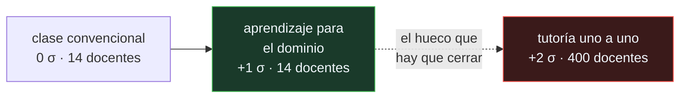

# P141 — El problema de las dos sigmas

> Ruta de gobernanza · La tutoría uno a uno mueve al alumno medio dos desviaciones.
> Y exige un docente por alumno: el hallazgo no es la tutoría, es el problema.

**Nivel:** L1 · **Motor:** `dos_sigma` · **Notebook:** [`P141_dos_sigma.ipynb`](../../../notebooks/papers/P141_dos_sigma.ipynb)
· **Anexo:** [probabilidad y verosimilitud](../../annexes/A02_PROBABILIDAD_Y_VEROSIMILITUD.md)

## 1. Identificación

| Campo | Valor |
|---|---|
| **Título original** | *The 2 Sigma Problem: The Search for Methods of Group Instruction as Effective as One-to-One Tutoring* |
| **Autoría** | Benjamin S. Bloom |
| **Año** | 1984 |
| **Venue** | Educational Researcher, 13(6), 4–16 |
| **Fuente primaria** | [JSTOR 1175554](https://www.jstor.org/stable/1175554) |
| **Acceso** | Restringido |
| **Fecha de consulta** | 2026-08-18 |

## 2. Problema anterior

Que la tutoría individual funciona mejor que una clase de treinta lo sabía cualquiera. Lo que no
había era una **medida comparable**: los estudios reportaban diferencias en puntos de exámenes
distintos, en asignaturas distintas, y no se podían sumar ni contrastar.

Sin esa medida no se podía formular la pregunta interesante, que no es si la tutoría funciona sino
**cuánto se pierde por no poder pagarla** —y si hay alguna forma de recuperarlo sin un docente por
alumno—.

## 3. Propuesta

Medir el efecto en **desviaciones típicas** de la distribución de la clase convencional. Eso hace
comparables estudios de asignaturas y exámenes distintos, y es lo que hoy se llama *tamaño del
efecto*.

Con esa medida, los resultados que Bloom sintetiza son:

- **tutoría uno a uno**: +2 σ
- **aprendizaje para el dominio** —corregir antes de avanzar, en grupo—: +1 σ

Y con eso formula el problema que da título al artículo: encontrar métodos de instrucción **grupal**
tan eficaces como la tutoría. No es un resultado, es una **agenda de investigación**.

## 4. Intuición sin fórmulas

Una carrera donde el corredor medio del grupo entrenado individualmente llega antes que el 97 % del
grupo con entrenador compartido.

Nadie duda de que el entrenamiento individual es mejor. La pregunta útil es qué parte de esa ventaja
viene de cosas que sí se pueden dar en grupo —corregir antes de seguir, no avanzar hasta dominar— y
qué parte exige irreductiblemente una persona por alumno.

**Dónde deja de funcionar la analogía:** en la carrera el resultado es objetivo. En educación, qué
se mide en el examen determina qué método parece mejor, y eso es parte del problema.

## 5. Matemática mínima

```text
tamaño del efecto = (media del grupo tratado − media del control) / desviación del control
```

La miniatura simula las tres condiciones con 400 alumnos cada una:

| Condición | Desplazamiento | Supera al alumno medio convencional |
|---|---:|---:|
| clase convencional | 0 σ | 52,2 % |
| **aprendizaje para el dominio** | +1 σ | **85,0 %** |
| **tutoría uno a uno** | +2 σ | **97,5 %** |

Y el coste, que es la otra mitad del argumento:

| Condición | Docentes para 400 alumnos |
|---|---:|
| clase convencional | 14 |
| aprendizaje para el dominio | 14 |
| **tutoría uno a uno** | **400** |

El aprendizaje para el dominio consigue **la mitad del efecto con el coste de la clase
convencional**. Esa es la parte aplicable, y la que Bloom recomienda.

<!-- puente:inicio -->
> [!TIP]
> **Puente matemático.** Esta sección da por sabido lo siguiente. Si algo no te suena,
> léelo primero: está explicado una sola vez, en un solo sitio, y sirve para todas las fichas.

| Dónde | Qué necesitas de ahí |
|---|---|
| [**A02 §6** · Gaussianas y el proceso de difusión](../../annexes/A02_PROBABILIDAD_Y_VEROSIMILITUD.md#6-gaussianas-y-el-proceso-de-difusión) | qué significa medir un efecto en desviaciones típicas, y por qué eso permite comparar estudios que miden cosas distintas |
<!-- puente:fin -->

## 6. Arquitectura o flujo



## 7. Qué observar en el paper original

- Que el artículo es una **agenda**, no un resultado: pide encontrar métodos grupales, y enumera
  variables candidatas ordenadas por su tamaño de efecto.
- La tabla de **variables alterables**: refuerzo, corrección, participación del alumno, tiempo
  dedicado. Es lo que se puede manipular, frente a lo que no.
- La advertencia del propio Bloom sobre la **duración corta** de los estudios y su restricción a
  asignaturas concretas. La cifra se cita con más confianza de la que él pide.
- El **aprendizaje para el dominio** como la propuesta concreta: no avanzar hasta dominar, con
  evaluación formativa y corrección. Es lo aplicable hoy.

## 8. Evidencia y resultados

Es una síntesis de estudios propios y de sus doctorandos, con tamaños de efecto medidos en
condiciones controladas.

> La cifra de 2 σ procede de un número reducido de estudios, cortos y en asignaturas concretas.
> Réplicas y síntesis posteriores encuentran efectos bastante menores: VanLehn (2011) sitúa los
> tutores inteligentes cerca de 0,76 σ.

La miniatura no reproduce ningún estudio: simula tres distribuciones con los desplazamientos que el
artículo reporta, para exhibir qué significa «dos sigmas» expresado en fracción de alumnos.

## 9. Impacto

- Popularizó el **tamaño del efecto** en investigación educativa, lo que hizo comparables décadas de
  estudios dispersos.
- El **aprendizaje para el dominio** influyó en el diseño curricular y sigue siendo la base de los
  sistemas de progresión por competencia.
- Es la referencia obligada de cualquier propuesta de **tutoría automatizada**, incluidas las
  actuales con modelos de lenguaje: la promesa que se hace es literalmente cerrar el hueco que Bloom
  describió.
- Y aporta al programa el hábito de exigir el tamaño del efecto y la línea base antes de aceptar que
  una herramienta educativa funciona.

## 10. Limitaciones

1. **La cifra de 2 σ está sobrecitada.** Procede de pocos estudios, cortos, y las réplicas
   encuentran efectos menores.
2. **Los estudios miden exámenes de contenido**, no capacidades a largo plazo ni transferencia.
3. **No dice qué hace un tutor** que produzca el efecto: adaptar el ritmo, detectar el malentendido,
   motivar. Sin eso, no está claro qué habría que automatizar.
4. **El contexto es de 1984**, con una organización escolar concreta.
5. **Un tamaño de efecto no distingue** entre aprender más y aprender a aprobar el examen que se
   usó para medirlo.

## 11. Errores comunes

| Error | Corrección |
|---|---|
| «Dos sigmas es una constante bien establecida» | Procede de pocos estudios cortos, y el propio Bloom lo advierte. VanLehn mide los tutores inteligentes cerca de 0,76 σ. |
| «El artículo demuestra que hay que dar tutoría individual» | Demuestra que no se puede: 400 docentes para 400 alumnos. El artículo formula el problema de conseguir su efecto en grupo. |
| «Si una herramienta educativa mejora las notas, funciona» | Depende del tamaño del efecto y de la línea base. Sin las dos cifras, «mejora las notas» no es comparable con nada. |
| «El aprendizaje para el dominio es una versión pobre de la tutoría» | Consigue la mitad del efecto con el coste de una clase normal. Es la parte desplegable, y es lo que Bloom recomienda. |
| «Automatizar la tutoría es replicar lo que hace un tutor» | El artículo no dice qué hace un tutor para producir el efecto. Sin ese análisis, no está claro qué se está replicando. |

## 12. Relación con trabajos anteriores

- **[P60 Por qué la mayoría de los hallazgos publicados son falsos](../P60_valor_predictivo/README.md)
  (2005)** — posterior, pero el criterio con el que hay que leer una síntesis de estudios cortos.
- **[P56 Computing Machinery and Intelligence](../P56_turing/README.md) (1950)** — la otra pregunta
  sobre qué significa que una máquina enseñe o entienda.

## 13. Relación con trabajos posteriores

- **VanLehn (2011)** — cuánto consiguen realmente los sistemas de tutoría inteligente.
  [doi:10.1080/00461520.2011.611369](https://doi.org/10.1080/00461520.2011.611369)
- **Hattie (2008)** — síntesis de tamaños de efecto en educación.
  [doi:10.4324/9780203887332](https://doi.org/10.4324/9780203887332)
- **[P148 Cerrar la brecha de responsabilidad](../P148_auditoria_interna/README.md) (2020)** — qué
  hay que documentar antes de desplegar un sistema que decide sobre personas.

## 14. Notebook asociado

[`P141_dos_sigma.ipynb`](../../../notebooks/papers/P141_dos_sigma.ipynb)

**Qué implementa:** qué fracción de alumnos supera al alumno medio convencional en cada condición, y cuántos docentes exige cada una para el mismo número de alumnos.

**Qué NO implementa:** las distribuciones son gaussianas simuladas con los desplazamientos que reporta el artículo. No se reproduce ningún estudio ni se modela nada de lo que hace un tutor.

```bash
ai-evolution paper-lab P141 --seed 7
```

## 15. Actividades Bloom

| Nivel | Actividad |
|---|---|
| **Recordar** | Define tamaño del efecto. |
| **Explicar** | Explica por qué se mide en desviaciones típicas. |
| **Aplicar** | Ejecuta el notebook y compara las tres condiciones. |
| **Analizar** | Analiza por qué el aprendizaje para el dominio es la parte aplicable. |
| **Evaluar** | «Nuestra herramienta consigue 2 sigmas». Evalúa qué habría que comprobar. |
| **Crear** | Busca el tamaño del efecto de una herramienta educativa que conozcas y comprueba contra qué línea base lo declara. |

## 16. Autoevaluación

1. ¿Qué es el problema de las dos sigmas?
2. ¿Por qué se mide en desviaciones típicas?
3. ¿Qué consigue el aprendizaje para el dominio?
4. ¿Cuál es el coste de la tutoría?
5. ¿Qué advertencia hace el propio Bloom?
6. ¿Qué NO dice el artículo?
7. ¿Cómo se relaciona con la IA educativa?

## 17. Respuestas esperadas

1. Encontrar métodos de instrucción **grupal** tan eficaces como la tutoría uno a uno. No es un resultado: es la agenda que el artículo propone.
2. Para poder comparar estudios de asignaturas y exámenes distintos. Es lo que hoy se llama tamaño del efecto.
3. Aproximadamente una desviación —la mitad del efecto de la tutoría— con el coste de una clase convencional. Es la parte desplegable.
4. Un docente por alumno: 400 para 400 alumnos frente a 14. Por eso el problema es de ingeniería educativa y no de convicción.
5. Que los estudios eran cortos y en asignaturas concretas. La cifra se cita con más confianza de la que él pide.
6. Qué hace exactamente un tutor para producir el efecto. Sin ese análisis no está claro qué habría que automatizar.
7. Es la promesa que se le hace: cerrar el hueco entre la clase y la tutoría. Conviene exigir tamaño de efecto y línea base antes de creerla.

## 18. Fuentes primarias

- Bloom, B. S. (1984). *The 2 Sigma Problem*. **Educational Researcher**, 13(6), 4–16.
  [JSTOR 1175554](https://www.jstor.org/stable/1175554) · consultado 2026-08-18.
- VanLehn, K. (2011). *The Relative Effectiveness of Human Tutoring, Intelligent Tutoring Systems,
  and Other Tutoring Systems*.
  [doi:10.1080/00461520.2011.611369](https://doi.org/10.1080/00461520.2011.611369) ·
  consultado 2026-08-18.
- Hattie, J. (2008). *Visible Learning*.
  [doi:10.4324/9780203887332](https://doi.org/10.4324/9780203887332) · consultado 2026-08-18.

---

[⬅️ Anterior: P140 MapReduce](../P140_mapreduce/README.md) ·
[📇 Índice](../../catalog/PAPERS_INDEX.md) ·
[📝 Evaluación](../../../assessments/papers/P141_dos_sigma.md) ·
[🏫 Clase 180 · IA para educación y aprendizaje adaptativo](../../../classes/part-14-frontier-research-and-capstones/180-ia-para-educacion-y-aprendizaje-adaptativo/README.md) ·
[➡️ Siguiente: P142 Interferencia catastrófica](../P142_olvido_catastrofico/README.md)
