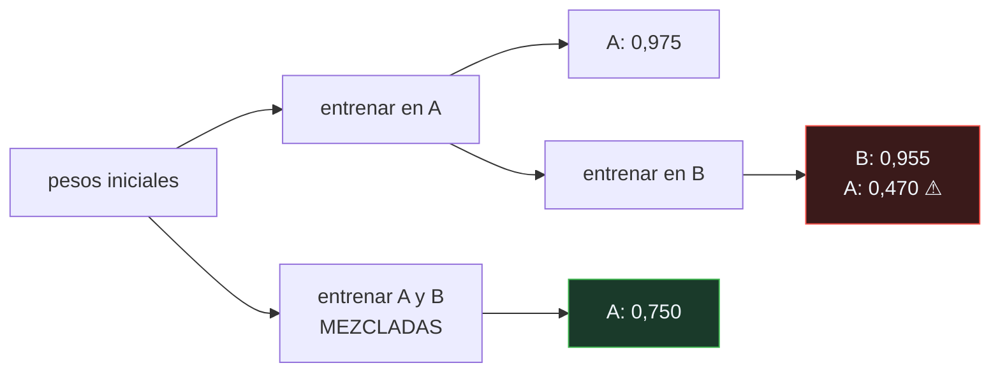

# P142 — Interferencia catastrófica

> Ruta de gobernanza · La red aprende A con 0,975. Se le enseña B. La exactitud en A
> cae a 0,47 — el azar. Nadie tocó A ni sus datos.

**Nivel:** L2 · **Motor:** `olvido_catastrofico` · **Notebook:** [`P142_olvido_catastrofico.ipynb`](../../../notebooks/papers/P142_olvido_catastrofico.ipynb)
· **Anexo:** [cálculo y gradientes](../../annexes/A03_CALCULO_Y_GRADIENTES.md)

## 1. Identificación

| Campo | Valor |
|---|---|
| **Título original** | *Catastrophic Interference in Connectionist Networks: The Sequential Learning Problem* |
| **Autoría** | Michael McCloskey, Neal J. Cohen |
| **Año** | 1989 |
| **Venue** | Psychology of Learning and Motivation, 24, 109–165 |
| **Fuente primaria** | [doi:10.1016/S0079-7421(08)60536-8](https://doi.org/10.1016/S0079-7421(08)60536-8) |
| **Acceso** | Restringido |
| **Fecha de consulta** | 2026-08-18 |

## 2. Problema anterior

A finales de los ochenta, las redes conexionistas se presentaban como modelos plausibles de la
memoria humana. La analogía era atractiva: representaciones distribuidas, degradación elegante,
generalización.

Nadie había comprobado lo obvio: qué le pasa a una red cuando se le enseña algo **después** de haber
aprendido otra cosa. En las personas hay interferencia, y es gradual: aprender una lista nueva
dificulta recordar la anterior, no la borra.

La pregunta era si las redes reproducían esa gradualidad. La respuesta resultó ser mucho peor de lo
que nadie esperaba.

## 3. Propuesta

Un experimento directo, sin teoría nueva:

1. Entrenar la red en la tarea A hasta que la aprenda.
2. Entrenar la misma red en la tarea B.
3. Volver a evaluar la tarea A.

El resultado es un colapso **casi inmediato**: la red no degrada, olvida. Los autores lo llaman
**interferencia catastrófica** precisamente para distinguirlo de la interferencia gradual que se
observa en humanos.

Y extraen la consecuencia doble: como modelo de la memoria humana, la red falla; y como sistema
práctico, no se puede entrenar por partes.

## 4. Intuición sin fórmulas

Una pizarra donde escribes con la misma tiza y borras con la misma mano. Escribir la lección nueva
no la pone al lado de la anterior: la pone **encima**.

La diferencia con una persona es que la persona, al aprender algo parecido, se lía un poco; la
pizarra queda limpia de lo anterior.

**Dónde deja de funcionar la analogía:** en la pizarra el borrado es físico y visible. Aquí no se
borra nada: los pesos siguen todos ahí, ocupados en representar otra cosa. Es lo que hace el
fenómeno contraintuitivo.

## 5. Matemática mínima

```text
El descenso de gradiente minimiza la pérdida en el lote ACTUAL.
Nada en la regla de actualización preserva lo aprendido antes.
```

La miniatura entrena un clasificador en la tarea A y luego en la tarea B:

| Épocas en B | Exactitud en A |
|---:|---:|
| 0 | **0,975** |
| 1 | 0,605 |
| 2 | 0,485 |
| 8 | **0,470** |

Una caída de **0,505 puntos** hasta el azar, mientras B alcanza **0,955**. Y con **una sola época**
de B ya está en 0,605: por eso se llama catastrófico y no interferencia.

**El control.** Entrenando A y B **mezcladas** desde el principio, A queda en **0,75** — mucho mejor
que el 0,47 secuencial. El orden importa.

Ahora bien, 0,75 tampoco es 0,975: un clasificador lineal **no tiene capacidad** para dos reglas, así
que mezclar solo reparte el error. En una red con capacidad de sobra, mezclar recupera las dos por
completo y la secuencia sigue olvidando. La maqueta muestra el mecanismo y no separa capacidad de
orden.

<!-- puente:inicio -->
> [!TIP]
> **Puente matemático.** Esta sección da por sabido lo siguiente. Si algo no te suena,
> léelo primero: está explicado una sola vez, en un solo sitio, y sirve para todas las fichas.

| Dónde | Qué necesitas de ahí |
|---|---|
| [**A03 §3** · Retropropagación](../../annexes/A03_CALCULO_Y_GRADIENTES.md#3-retropropagación) | por qué la regla de actualización no contiene ningún término que preserve lo aprendido antes |
<!-- puente:fin -->

## 6. Arquitectura o flujo



## 7. Qué observar en el paper original

- Que el experimento es **deliberadamente simple**. No hay arquitectura exótica ni truco: la
  contundencia viene de que el efecto aparece en el caso más básico.
- La discusión sobre **qué implica para la psicología**: si las redes olvidan así y las personas no,
  la red no es un buen modelo de la memoria — o le falta algo esencial.
- El análisis de la causa: las **representaciones distribuidas** son lo que da generalización y
  también lo que hace que todo interfiera con todo.
- Que los autores **no proponen solución**. Documentan el problema y lo dejan planteado, lo cual es
  una decisión intelectualmente honesta.

## 8. Evidencia y resultados

Experimentos controlados sobre tareas de aprendizaje asociativo, con análisis del efecto según el
tamaño de la red, el solapamiento entre tareas y el régimen de entrenamiento.

> Es evidencia empírica directa y reproducible, y su fuerza está en la simplicidad del montaje. El
> efecto se replica trivialmente.

La miniatura usa un clasificador lineal, no una red profunda. El fenómeno es el mismo, pero en redes
grandes interactúa con la sobreparametrización de formas que aquí no aparecen — y el control de
mezclado se queda corto por falta de capacidad.

## 9. Impacto

- Definió el **olvido catastrófico** como problema con nombre propio, y abrió un área que sigue
  activa treinta y cinco años después.
- Es la razón de que el entrenamiento se haga con datos **mezclados y barajados**, un detalle que
  hoy se da por supuesto y que este artículo explica.
- Motivó [EWC](../P145_ewc/README.md) y toda la familia de métodos de aprendizaje continuo:
  repetición, regularización, arquitecturas modulares.
- Y es directamente relevante hoy: el **ajuste fino** de un modelo con datos nuevos es aprendizaje
  secuencial, y degrada capacidades anteriores que nadie vuelve a evaluar.

## 10. Limitaciones

1. **Las redes de 1989 eran diminutas.** En modelos grandes y sobreparametrizados el efecto es real
   pero más matizado.
2. **Las tareas del experimento son independientes.** Cuando comparten estructura, la transferencia
   positiva compite con la interferencia.
3. **No se propone ninguna solución**, ni siquiera parcial.
4. **La comparación con la memoria humana** es discutible: los humanos también olvidan mucho, y el
   experimento no mide lo mismo que un estudio de memoria.
5. **El efecto depende del régimen**: tasa de aprendizaje, número de épocas y solapamiento cambian
   su magnitud, y eso complica comparar resultados.

## 11. Errores comunes

| Error | Corrección |
|---|---|
| «La red olvida porque le falta capacidad» | En la miniatura, entrenar mezclado da 0,75 frente a 0,47 secuencial con el mismo modelo. Parte del problema es el orden, no solo el tamaño. |
| «El olvido es gradual, como en las personas» | Con una sola época de la tarea nueva la exactitud en la antigua ya cae de 0,975 a 0,605. Por eso se llama catastrófico. |
| «Ajustar un modelo con datos nuevos no afecta a lo anterior» | El ajuste fino es aprendizaje secuencial. Si no reevalúas las capacidades anteriores, el olvido no se ve: se sufre. |
| «Basta con volver a entrenar un poco con los datos viejos» | Eso es repetición, y funciona — si conservas los datos viejos. Justamente el caso interesante es cuando no puedes. |
| «Es un problema de las redes pequeñas de los ochenta» | Sigue apareciendo en modelos grandes al ajustarlos por etapas, y es un área de investigación activa treinta y cinco años después. |

## 12. Relación con trabajos anteriores

- **[P02 Retropropagación](../P02_backpropagation/README.md) (1986)** — la regla de actualización
  cuya ausencia de memoria produce el fenómeno.
- **[P01 El perceptrón](../P01_perceptron/README.md) (1958)** — el origen de las representaciones
  distribuidas que dan generalización y también interferencia.

## 13. Relación con trabajos posteriores

- **[P145 EWC](../P145_ewc/README.md) (2017)** — el remedio: frenar selectivamente los pesos que
  importaban.
- **French (1999)** — la revisión del problema diez años después.
  [doi:10.1016/S1364-6613(99)01294-2](https://doi.org/10.1016/S1364-6613(99)01294-2)
- **Parisi et al. (2019)** — revisión moderna del aprendizaje continuo.
  [doi:10.1016/j.neunet.2019.01.012](https://doi.org/10.1016/j.neunet.2019.01.012)

## 14. Notebook asociado

[`P142_olvido_catastrofico.ipynb`](../../../notebooks/papers/P142_olvido_catastrofico.ipynb)

**Qué implementa:** la curva de exactitud en la tarea A según se entrena en la B, la exactitud final en B, y el control de entrenar las dos mezcladas desde el principio.

**Qué NO implementa:** es un clasificador lineal, que no tiene capacidad para dos reglas distintas: por eso el control mezclado da 0,75 y no 0,975. La maqueta muestra el mecanismo y no separa capacidad de orden.

```bash
ai-evolution paper-lab P142 --seed 7
```

## 15. Actividades Bloom

| Nivel | Actividad |
|---|---|
| **Recordar** | Describe el experimento en tres pasos. |
| **Explicar** | Explica por qué el descenso de gradiente no preserva lo aprendido. |
| **Aplicar** | Ejecuta el notebook y observa la curva de olvido. |
| **Analizar** | Analiza por qué el control mezclado no llega a la exactitud original en esta maqueta. |
| **Evaluar** | «Ajustamos el modelo con datos nuevos y mejoró». Evalúa qué falta comprobar. |
| **Crear** | Evalúa un modelo tuyo sobre una tarea que aprendiera hace tres versiones y compara con lo que daba entonces. |

## 16. Autoevaluación

1. ¿Qué es la interferencia catastrófica?
2. ¿Cuánto tarda en aparecer?
3. ¿Por qué ocurre?
4. ¿Ayuda mezclar las tareas?
5. ¿Proponen los autores una solución?
6. ¿Qué implicaba para la psicología?
7. ¿Sigue siendo relevante?

## 17. Respuestas esperadas

1. Que aprender una tarea nueva borra la anterior de golpe. En la miniatura, la exactitud en A cae de 0,975 a 0,47 —el azar— tras aprender B.
2. Casi nada: con una sola época de la tarea nueva ya está en 0,605. No es una degradación suave, y de ahí el nombre.
3. Porque el descenso de gradiente minimiza la pérdida en el lote actual y nada en la regla de actualización preserva lo anterior. Las representaciones distribuidas hacen que todo interfiera con todo.
4. Sí: en la miniatura, 0,75 frente a 0,47. El orden en que llegan los datos importa, y el aprendizaje por gradiente supone que están mezclados.
5. No. Documentan el problema y lo dejan planteado, que es una decisión honesta y por lo que el área tardó décadas en tener remedios.
6. Que la red no era un buen modelo de la memoria humana, o le faltaba algo esencial: las personas interfieren de forma gradual, no catastrófica.
7. Sí. El ajuste fino de un modelo con datos nuevos es aprendizaje secuencial, y degrada capacidades anteriores que casi nadie vuelve a evaluar.

## 18. Fuentes primarias

- McCloskey, M. y Cohen, N. J. (1989). *Catastrophic Interference in Connectionist Networks*.
  **Psychology of Learning and Motivation**, 24, 109–165.
  [doi:10.1016/S0079-7421(08)60536-8](https://doi.org/10.1016/S0079-7421(08)60536-8) ·
  consultado 2026-08-18.
- French, R. M. (1999). *Catastrophic forgetting in connectionist networks*.
  [doi:10.1016/S1364-6613(99)01294-2](https://doi.org/10.1016/S1364-6613(99)01294-2) ·
  consultado 2026-08-18.
- Parisi, G. I. et al. (2019). *Continual lifelong learning with neural networks: A review*.
  [doi:10.1016/j.neunet.2019.01.012](https://doi.org/10.1016/j.neunet.2019.01.012) ·
  consultado 2026-08-18.

---

[⬅️ Anterior: P141 El problema de las dos sigmas](../P141_dos_sigma/README.md) ·
[📇 Índice](../../catalog/PAPERS_INDEX.md) ·
[📝 Evaluación](../../../assessments/papers/P142_olvido_catastrofico.md) ·
[🏫 Clase 176 · Aprendizaje continuo y adaptación](../../../classes/part-14-frontier-research-and-capstones/176-aprendizaje-continuo-y-adaptacion/README.md) ·
[➡️ Siguiente: P143 Calibrar el ruido a la sensibilidad](../P143_privacidad_diferencial/README.md)
