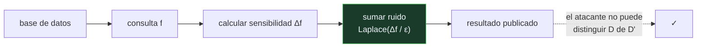

# P143 — Calibrar el ruido a la sensibilidad

> Ruta de gobernanza · Dos consultas que difieren en una persona. La resta revela su
> dato con certeza. Publicar agregados exactos no protege a nadie.

**Nivel:** L3 · **Motor:** `privacidad_diferencial` · **Notebook:** [`P143_privacidad_diferencial.ipynb`](../../../notebooks/papers/P143_privacidad_diferencial.ipynb)
· **Anexo:** [probabilidad y verosimilitud](../../annexes/A02_PROBABILIDAD_Y_VEROSIMILITUD.md)

## 1. Identificación

| Campo | Valor |
|---|---|
| **Título original** | *Calibrating Noise to Sensitivity in Private Data Analysis* |
| **Autoría** | Cynthia Dwork, Frank McSherry, Kobbi Nissim, Adam Smith |
| **Año** | 2006 |
| **Venue** | TCC 2006, 265–284 |
| **Fuente primaria** | [doi:10.1007/11681878_14](https://doi.org/10.1007/11681878_14) |
| **Acceso** | Restringido |
| **Fecha de consulta** | 2026-08-18 |

## 2. Problema anterior

La anonimización fallaba una y otra vez. Quitar el nombre y el documento de identidad no impide
reidentificar a alguien cruzando el conjunto con otra fuente: se demostró con historiales médicos,
con datos de taxis, con valoraciones de películas.

El problema no era que las técnicas fueran malas. Era **la definición**: cualquier noción de
privacidad basada en «quitar los identificadores» depende de qué **más** sepa quien ataca, y eso no
se puede acotar ni conocer.

Hacía falta una definición que no dependiera del conocimiento auxiliar del atacante.

## 3. Propuesta

Cambiar el objeto de la definición: la privacidad deja de ser una propiedad **del dato publicado**
y pasa a ser una propiedad **del mecanismo que lo publica**.

```text
M es ε-diferencialmente privado ⟺ para todo par de bases D, D' que
difieren en UNA persona, y todo conjunto de resultados S:

    P[M(D) ∈ S]  ≤  e^ε · P[M(D') ∈ S]
```

Es decir: que estés o no estés en la base **casi no cambia** lo que sale. Si la salida es
prácticamente la misma contigo y sin ti, no se puede deducir nada sobre ti — con independencia de lo
que el atacante sepa por otro lado.

Y un mecanismo que la cumple: añadir **ruido de Laplace** de escala `sensibilidad / ε`, donde la
sensibilidad es cuánto puede cambiar el resultado por una sola persona.

## 4. Intuición sin fórmulas

Una encuesta sobre algo embarazoso donde, antes de responder, cada persona lanza una moneda en
secreto: si sale cara responde la verdad, si sale cruz responde al azar.

Nadie puede deducir tu respuesta individual, porque siempre puedes decir que te salió cruz. Y con
suficientes respuestas, el porcentaje agregado sigue siendo estimable.

**Dónde deja de funcionar la analogía:** la moneda protege una respuesta. La privacidad diferencial
protege contra **cualquier** consulta y **cualquier** conocimiento previo, y su garantía se degrada
al hacer muchas preguntas — algo que la moneda no captura.

## 5. Matemática mínima

```text
Sensibilidad Δf = máx |f(D) − f(D')|  sobre bases que difieren en una persona
Mecanismo:  M(D) = f(D) + Laplace(Δf / ε)
```

La miniatura ataca un conteo sobre 1 000 personas con dos consultas que solo difieren en una:

| ε | Escala del ruido | Error medio | **Acierto del ataque** |
|---:|---:|---:|---:|
| sin ruido | 0 | 0 | **100 %** |
| 10,0 | 0,1 | 0,10 | **99,3 %** |
| 1,0 | 1,0 | 0,99 | 56,5 % |
| 0,1 | 10,0 | 9,95 | **48,2 %** |

Con ε = 0,1 el ataque es indistinguible de adivinar. Con **ε = 10 sigue acertando el 99,3 %** —
cumpliendo la definición formal.

Ese es el punto que hay que ver: **el parámetro ES la garantía**. «Usamos privacidad diferencial» no
es una afirmación verificable sin el valor de ε, y elegirlo es una decisión de política.

Y lo que se paga es exactitud: un error medio de 9,95 sobre un conteo de 249 es un 4 % relativo.

<!-- puente:inicio -->
> [!TIP]
> **Puente matemático.** Esta sección da por sabido lo siguiente. Si algo no te suena,
> léelo primero: está explicado una sola vez, en un solo sitio, y sirve para todas las fichas.

| Dónde | Qué necesitas de ahí |
|---|---|
| [**A02 §4** · Divergencia KL](../../annexes/A02_PROBABILIDAD_Y_VEROSIMILITUD.md#4-divergencia-kl) | cómo se mide la diferencia entre dos distribuciones: la definición acota exactamente esa razón para las bases con y sin una persona |
<!-- puente:fin -->

## 6. Arquitectura o flujo



## 7. Qué observar en el paper original

- Que la garantía es **sobre el mecanismo**, no sobre el dato. Ese cambio de objeto es la
  aportación conceptual y lo que la hace robusta frente al conocimiento auxiliar.
- La noción de **sensibilidad** y por qué es la cantidad correcta a la que calibrar el ruido: mide
  cuánto puede cambiar la salida por una persona.
- Las propiedades de **composición**: hacer varias consultas gasta presupuesto de privacidad. Es lo
  que hace el marco utilizable y también lo que lo complica en la práctica.
- Que el artículo es de **criptografía**, con demostraciones formales. Su rigor es lo que permitió
  que la definición se convirtiera en estándar.

## 8. Evidencia y resultados

Es un artículo teórico: define, demuestra que el mecanismo cumple la definición y analiza la
composición. No hay experimentos porque no los necesita.

> Es evidencia matemática, y por eso la garantía es incondicional: no depende de supuestos sobre el
> atacante. Es una forma de evidencia distinta —y más fuerte— que un experimento.

La miniatura mide **una sola consulta**. La garantía real se degrada al hacer muchas, y administrar
ese presupuesto es el problema práctico que el artículo formaliza y que la maqueta no toca.

## 9. Impacto

- Es el fundamento de la privacidad moderna en análisis de datos, con premio Gödel y adopción en
  productos reales.
- El **Censo de Estados Unidos de 2020** se publicó con privacidad diferencial, la primera aplicación
  a esa escala y con toda la polémica que generó.
- Apple, Google y Microsoft la usan en telemetría, con valores de ε que buena parte de la comunidad
  considera demasiado laxos — lo cual es exactamente el debate que el marco permite tener.
- Y llevó a **DP-SGD** (Abadi et al., 2016), que aplica la idea al entrenamiento de modelos: cada
  paso de gradiente con ruido calibrado.

## 10. Limitaciones

1. **El presupuesto se compone.** Cada consulta gasta privacidad, y administrar ese presupuesto a
   lo largo del tiempo es el problema práctico.
2. **Acotar la sensibilidad es difícil** fuera de los conteos. Para medias, máximos o consultas
   sobre grafos, es donde se cometen los errores.
3. **Elegir ε es una decisión de política**, no técnica, y el artículo no da criterio. Un ε laxo
   cumple la definición y no protege.
4. **Cuesta exactitud**, y en conjuntos pequeños o en subgrupos minoritarios el ruido puede dominar
   la señal — lo que afecta desproporcionadamente a quien menos representación tiene.
5. **Protege a individuos, no a grupos.** Que un colectivo entero sea identificable no lo impide.

## 11. Errores comunes

| Error | Corrección |
|---|---|
| «Anonimizar es suficiente si se quitan los identificadores» | Se ha reidentificado a personas cruzando datos anónimos con otras fuentes. El problema es que la definición depende de qué más sepa el atacante. |
| «Publicar solo agregados protege la privacidad» | Dos consultas que difieren en una persona la revelan con certeza. En la miniatura, el ataque acierta el 100 % sin ruido. |
| «Decir «usamos privacidad diferencial» es una garantía» | Sin ε no dice nada. Con ε = 10 el ataque sigue acertando el 99,3 % y la definición se cumple igualmente. |
| «La garantía vale para cualquier número de consultas» | Se compone: cada consulta gasta presupuesto. Sin declarar cuántas se permiten, la garantía es incompleta. |
| «Añadir ruido es siempre asumible» | Cuesta exactitud, y en subgrupos pequeños el ruido puede dominar la señal — perjudicando más a quien menos representación tiene. |

## 12. Relación con trabajos anteriores

- **[P134 La protección de la información](../P134_minimo_privilegio/README.md) (1975)** — proteger
  el acceso; aquí, proteger cuando el acceso ya está concedido.
- **[P55 Teoría de la información](../P55_shannon/README.md) (1948)** — la medida de cuánta
  información transporta una señal, que es lo que aquí se acota.

## 13. Relación con trabajos posteriores

- **Abadi et al. (2016)** — DP-SGD: entrenar modelos con privacidad diferencial.
  [doi:10.1145/2976749.2978318](https://doi.org/10.1145/2976749.2978318)
- **[P146 Aprendizaje federado](../P146_federado/README.md) (2017)** — la vía complementaria: no
  recoger los datos en vez de proteger lo publicado.
- **Dwork y Roth (2014)** — los fundamentos algorítmicos, en formato de libro.
  [doi:10.1561/0400000042](https://doi.org/10.1561/0400000042)

## 14. Notebook asociado

[`P143_privacidad_diferencial.ipynb`](../../../notebooks/papers/P143_privacidad_diferencial.ipynb)

**Qué implementa:** el acierto de un ataque de diferenciación sin ruido y con ruido calibrado a varios valores de ε, junto al error que ese ruido introduce en la consulta legítima.

**Qué NO implementa:** se mide una sola consulta. La garantía se degrada al hacer muchas —el presupuesto se compone— y administrarlo es el problema práctico que la maqueta no toca.

```bash
ai-evolution paper-lab P143 --seed 7
```

## 15. Actividades Bloom

| Nivel | Actividad |
|---|---|
| **Recordar** | Escribe la definición de ε-privacidad diferencial. |
| **Explicar** | Explica qué es la sensibilidad de una consulta. |
| **Aplicar** | Ejecuta el notebook y compara el ataque con distintos ε. |
| **Analizar** | Analiza por qué la garantía no depende del conocimiento del atacante. |
| **Evaluar** | «Usamos privacidad diferencial». Evalúa qué falta para que esa frase signifique algo. |
| **Crear** | Busca un producto que la anuncie y comprueba si publica su ε y su presupuesto de consultas. |

## 16. Autoevaluación

1. ¿Sobre qué se define la privacidad diferencial?
2. ¿Qué es la sensibilidad?
3. ¿Qué papel juega ε?
4. ¿Protege un ε grande?
5. ¿Qué se paga?
6. ¿Qué ocurre con varias consultas?
7. ¿Protege a grupos?

## 17. Respuestas esperadas

1. Sobre el **mecanismo**, no sobre el dato. Exige que la salida cambie poco cuando se añade o quita una persona, con independencia de lo que el atacante sepa.
2. Cuánto puede cambiar el resultado de una consulta por una sola persona. Es la cantidad a la que se calibra el ruido.
3. Es la garantía. Acota cuánto puede cambiar la distribución de salida por una persona: más pequeño, más protección y más ruido.
4. No. Con ε = 10 el ataque de la miniatura sigue acertando el 99,3 %, cumpliendo la definición formal. El valor concreto es la garantía.
5. Exactitud. Con ε = 0,1 el error medio es 9,95 sobre un conteo de 249: un 4 % relativo.
6. El presupuesto se compone: cada consulta gasta privacidad. Declarar ε sin declarar cuántas consultas se permiten deja la garantía incompleta.
7. No. Protege a individuos. Que un colectivo entero sea identificable no lo impide, y eso es una limitación conocida de la definición.

## 18. Fuentes primarias

- Dwork, C., McSherry, F., Nissim, K. y Smith, A. (2006). *Calibrating Noise to Sensitivity in
  Private Data Analysis*. **TCC 2006**, 265–284.
  [doi:10.1007/11681878_14](https://doi.org/10.1007/11681878_14) · consultado 2026-08-18.
- Dwork, C. y Roth, A. (2014). *The Algorithmic Foundations of Differential Privacy*.
  [doi:10.1561/0400000042](https://doi.org/10.1561/0400000042) · consultado 2026-08-18.
- Abadi, M. et al. (2016). *Deep Learning with Differential Privacy*.
  [doi:10.1145/2976749.2978318](https://doi.org/10.1145/2976749.2978318) · consultado 2026-08-18.

---

[⬅️ Anterior: P142 Interferencia catastrófica](../P142_olvido_catastrofico/README.md) ·
[📇 Índice](../../catalog/PAPERS_INDEX.md) ·
[📝 Evaluación](../../../assessments/papers/P143_privacidad_diferencial.md) ·
[🏫 Clase 165 · Privacidad, secretos y minimización de datos](../../../classes/part-13-evaluation-safety-security-and-governance/165-privacidad-secretos-y-minimizacion-de-datos/README.md) ·
[➡️ Siguiente: P144 Fuera del mundo cerrado](../P144_ml_en_seguridad/README.md)
