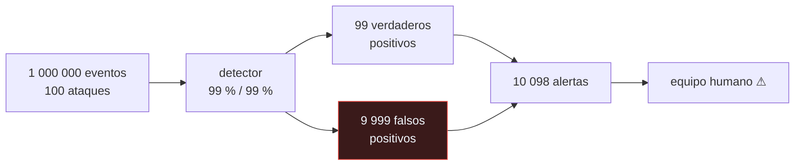

# P144 — Fuera del mundo cerrado

> Ruta de gobernanza · Un detector con 99 % de sensibilidad y 99 % de especificidad
> produce 102 alertas por cada ataque real. Y la culpa no es del modelo.

**Nivel:** L2 · **Motor:** `ml_en_seguridad` · **Notebook:** [`P144_ml_en_seguridad.ipynb`](../../../notebooks/papers/P144_ml_en_seguridad.ipynb)
· **Anexo:** [probabilidad y verosimilitud](../../annexes/A02_PROBABILIDAD_Y_VEROSIMILITUD.md)

## 1. Identificación

| Campo | Valor |
|---|---|
| **Título original** | *Outside the Closed World: On Using Machine Learning for Network Intrusion Detection* |
| **Autoría** | Robin Sommer, Vern Paxson |
| **Año** | 2010 |
| **Venue** | IEEE Symposium on Security and Privacy 2010, 305–316 |
| **Fuente primaria** | [doi:10.1109/SP.2010.25](https://doi.org/10.1109/SP.2010.25) |
| **Acceso** | Restringido |
| **Fecha de consulta** | 2026-08-18 |

## 2. Problema anterior

Durante una década se publicaron cientos de artículos aplicando aprendizaje automático a la
detección de intrusiones, con métricas excelentes. Casi ninguno de esos sistemas llegó a producción.

La brecha entre el resultado publicado y el sistema operable no se estaba explicando, y la
explicación por defecto —«falta madurez»— era claramente insuficiente después de diez años.

La tesis del artículo es que la seguridad tiene **propiedades estructurales** que la hacen
especialmente hostil al aprendizaje automático, y que ignorarlas produce artículos con buenas
métricas y sistemas inservibles.

## 3. Propuesta

Cinco razones, ninguna de las cuales se arregla con más datos o más parámetros:

1. **La clase base es minúscula.** Con un ataque por cada 10 000 eventos, un detector excelente
   produce miles de falsas alarmas por cada hallazgo verdadero.
2. **El coste de los errores es asimétrico** y no está en la función de pérdida: un ataque perdido y
   una falsa alarma no cuestan lo mismo, y la proporción depende del contexto.
3. **No hay datos representativos.** Los ataques que importan son los que no se han visto, y por
   definición no están en el entrenamiento.
4. **El adversario se adapta.** La distribución no cambia por deriva natural: cambia porque alguien
   la está cambiando a propósito para evadir el detector.
5. **La interpretabilidad no es opcional.** Alguien tiene que actuar sobre la alerta, y «el modelo
   dice que sí» no es accionable.

Y una recomendación metodológica: evaluar con **tasa de falsos positivos** y coste operativo, no con
exactitud.

## 4. Intuición sin fórmulas

Una prueba médica con 99 % de fiabilidad para una enfermedad que tiene una persona de cada
100 000. De cada 1 000 positivos, unos 10 son enfermos y el resto, sanos asustados.

La prueba no está mal hecha. El problema es la aritmética de buscar algo rarísimo, y ningún avance
en la prueba cambia el hecho de que casi todos los positivos serán falsos si la enfermedad es rara.

**Dónde deja de funcionar la analogía:** la enfermedad no muta para esquivar la prueba. En seguridad,
el adversario estudia tu detector y se adapta, así que la distribución cambia a propósito.

## 5. Matemática mínima

```text
precisión = VP / (VP + FP)

Con clase base p pequeña:
    VP ≈ N·p·sensibilidad          ← proporcional a p
    FP ≈ N·(1 − especificidad)     ← NO depende de p

    → cuando p → 0, FP domina y la precisión colapsa
```

La miniatura analiza un millón de eventos:

| Proporción de ataques | Especificidad | Alertas | Reales | **Precisión** |
|---:|---:|---:|---:|---:|
| 50 % | 99 % | 500 000 | 495 000 | **0,990** |
| **0,01 %** | **99 %** | **10 098** | **99** | **0,0098** |
| 0,01 % | 99,99 % | 189 | 90 | 0,476 |

Con la proporción real, el mismo detector produce **102 alertas por cada ataque de verdad**. Ningún
equipo humano puede con eso.

Para que sea operable hace falta una especificidad de **99,99 %** — y aun así son 189 alertas
diarias con 99 falsas. La exigencia no se formula como «un modelo mejor» sino como **«una tasa de
falsos positivos absurdamente baja»**.

<!-- puente:inicio -->
> [!TIP]
> **Puente matemático.** Esta sección da por sabido lo siguiente. Si algo no te suena,
> léelo primero: está explicado una sola vez, en un solo sitio, y sirve para todas las fichas.

| Dónde | Qué necesitas de ahí |
|---|---|
| [**A02 §2** · Bayes: actualizar una creencia](../../annexes/A02_PROBABILIDAD_Y_VEROSIMILITUD.md#2-bayes-actualizar-una-creencia) | la falacia de la clase base en su forma canónica: por qué la probabilidad a priori domina el resultado |
<!-- puente:fin -->

## 6. Arquitectura o flujo



## 7. Qué observar en el paper original

- El **argumento de la clase base**, que es el más citado y el que se puede calcular en dos líneas
  antes de empezar un proyecto.
- La distinción entre **detección de anomalías** y **clasificación**: la seguridad suele necesitar
  la primera, y la primera es mucho más difícil de evaluar.
- La sección sobre **qué datos usar y cómo evaluarlos**, con recomendaciones concretas que siguen
  siendo válidas.
- La observación sobre el **adversario adaptativo**, que rompe el supuesto de distribución estable
  sobre el que descansa todo el aprendizaje automático.

## 8. Evidencia y resultados

Es un artículo de posición y análisis, con revisión de la literatura previa y argumentación sobre
sus defectos metodológicos.

> No hay experimento nuevo. Su fuerza está en el análisis y en que explica una observación que el
> campo llevaba una década sin explicar: por qué nada de eso llegaba a producción.

La miniatura calcula precisiones a partir de sensibilidad y especificidad supuestas. No hay detector
ni tráfico real: se exhibe la aritmética de la clase base, que es la primera de las cinco razones.

## 9. Impacto

- Es lectura obligada en seguridad aplicada, y cambió cómo se evalúan los detectores: tasa de
  falsos positivos y coste operativo en vez de exactitud.
- Su análisis de la **clase base** se aplica a cualquier problema de detección de eventos raros:
  fraude, fallos, contenido dañino, incidentes.
- Arp et al. (2022) retomaron el hilo y catalogaron los errores metodológicos concretos que siguen
  cometiéndose quince años después.
- Y aporta al programa un criterio directamente transferible: **antes de entrenar nada, calcular
  cuántas alertas producirá el sistema por cada hallazgo verdadero**.

## 10. Limitaciones

1. **Es de 2010** y sus ejemplos son de detección de intrusiones en red. La crítica se traslada,
   las cifras concretas no.
2. **No propone soluciones**, más allá de recomendaciones metodológicas. Es un artículo de
   diagnóstico.
3. **Puede leerse como más pesimista de lo que es.** Hay aplicaciones de aprendizaje automático en
   seguridad que funcionan, típicamente asistiendo a un analista en vez de decidiendo.
4. **No cubre el aprendizaje adversario** en su forma moderna: ataques contra el propio modelo,
   envenenamiento, evasión con ejemplos adversarios.
5. **El coste asimétrico se menciona y no se formaliza**, cuando es lo que decidiría el umbral.

## 11. Errores comunes

| Error | Corrección |
|---|---|
| «Un 99 % de exactitud es un buen detector» | Un detector que diga siempre «benigno» acierta el 99,99 % si los ataques son uno de cada 10 000. La exactitud no distingue ese detector de uno útil. |
| «Con más datos de entrenamiento mejorará» | Los ataques que importan son los que no se han visto. Más datos de ataques conocidos no ayudan con los desconocidos. |
| «La deriva se corrige reentrenando» | En seguridad la distribución no cambia sola: alguien la cambia a propósito para evadirte. Reentrenar es una carrera, no una corrección. |
| «El problema es que el modelo no es lo bastante bueno» | Con clase base de 1 entre 10 000, hace falta una especificidad de 99,99 % para que sea operable. La exigencia no es de calidad, es de orden de magnitud. |
| «Basta con que el modelo acierte; la explicación es opcional» | Alguien tiene que actuar sobre la alerta. «El modelo dice que sí» no es accionable, y esa es una de las cinco razones. |

## 12. Relación con trabajos anteriores

- **[P60 Por qué la mayoría de los hallazgos publicados son falsos](../P60_valor_predictivo/README.md)
  (2005)** — el mismo mecanismo bayesiano aplicado a la investigación en vez de a la detección.
- **[P42 Ejemplos adversarios](../P42_adversarial/README.md) (2014)** — el adversario que ataca al
  modelo directamente, posterior y complementario.
- **Axelsson (2000)** — la falacia de la clase base en detección de intrusiones.
  [doi:10.1145/357830.357849](https://doi.org/10.1145/357830.357849)

## 13. Relación con trabajos posteriores

- **Arp et al. (2022)** — errores metodológicos en aprendizaje automático aplicado a seguridad.
  [usenix.org](https://www.usenix.org/conference/usenixsecurity22/presentation/arp)
- **[P114 Tarjetas de modelo](../P114_tarjetas_de_modelo/README.md) (2019)** — declarar los usos
  fuera de alcance, que aquí sería «no usar como decisor autónomo».
- **[P139 Niveles de automatización](../P139_niveles_de_automatizacion/README.md) (2000)** — el
  analista asistido frente al sistema que decide solo.

## 14. Notebook asociado

[`P144_ml_en_seguridad.ipynb`](../../../notebooks/papers/P144_ml_en_seguridad.ipynb)

**Qué implementa:** la precisión de un mismo detector bajo distintas proporciones de ataques y especificidades, con el número de alertas que produce por cada hallazgo verdadero.

**Qué NO implementa:** no hay detector ni tráfico real: se calculan precisiones a partir de sensibilidad y especificidad supuestas. Solo cubre la primera de las cinco razones del artículo.

```bash
ai-evolution paper-lab P144 --seed 7
```

## 15. Actividades Bloom

| Nivel | Actividad |
|---|---|
| **Recordar** | Escribe la fórmula de la precisión y explica por qué colapsa con clase base pequeña. |
| **Explicar** | Enumera las cinco razones del artículo. |
| **Aplicar** | Ejecuta el notebook y compara los escenarios. |
| **Analizar** | Analiza por qué un adversario adaptativo rompe el supuesto básico del aprendizaje automático. |
| **Evaluar** | «Nuestro detector tiene 99 % de exactitud». Evalúa qué garantiza esa cifra. |
| **Crear** | Estima la clase base real de un detector de tu trabajo y calcula cuántas alertas produce por cada hallazgo verdadero. |

## 16. Autoevaluación

1. ¿Por qué colapsa la precisión con clase base pequeña?
2. ¿Qué especificidad hace falta para ser operable?
3. ¿Por qué no ayudan más datos?
4. ¿Qué diferencia a un adversario de la deriva natural?
5. ¿Por qué la interpretabilidad no es opcional?
6. ¿Qué recomienda reportar el artículo?
7. ¿Propone soluciones?

## 17. Respuestas esperadas

1. Porque los falsos positivos son proporcionales al total de eventos y los verdaderos, a la proporción de ataques. Cuando esa proporción tiende a cero, los falsos dominan.
2. En la miniatura, 99,99 % — y aun así son 189 alertas diarias con 99 falsas. La exigencia es de orden de magnitud, no de calidad.
3. Porque los ataques que importan son los que no se han visto. Por definición no están en el conjunto de entrenamiento.
4. Que cambia la distribución **a propósito** para evadir tu detector. No es una deriva que se corrige reentrenando: es una carrera.
5. Porque alguien tiene que actuar sobre la alerta, y «el modelo dice que sí» no le dice qué hacer ni le permite priorizar.
6. Tasa de falsos positivos y coste operativo, no exactitud ni AUC. Y evaluar con datos y condiciones representativas del despliegue.
7. No: es un artículo de diagnóstico. Da recomendaciones metodológicas, no un método.

## 18. Fuentes primarias

- Sommer, R. y Paxson, V. (2010). *Outside the Closed World*. **IEEE S&P 2010**, 305–316.
  [doi:10.1109/SP.2010.25](https://doi.org/10.1109/SP.2010.25) · consultado 2026-08-18.
- Axelsson, S. (2000). *The base-rate fallacy and the difficulty of intrusion detection*.
  [doi:10.1145/357830.357849](https://doi.org/10.1145/357830.357849) · consultado 2026-08-18.
- Arp, D. et al. (2022). *Dos and Don'ts of Machine Learning in Computer Security*.
  [usenix.org](https://www.usenix.org/conference/usenixsecurity22/presentation/arp) ·
  consultado 2026-08-18.

---

[⬅️ Anterior: P143 Calibrar el ruido a la sensibilidad](../P143_privacidad_diferencial/README.md) ·
[📇 Índice](../../catalog/PAPERS_INDEX.md) ·
[📝 Evaluación](../../../assessments/papers/P144_ml_en_seguridad.md) ·
[🏫 Clase 179 · IA para ciberseguridad y defensa](../../../classes/part-14-frontier-research-and-capstones/179-ia-para-ciberseguridad-y-defensa/README.md) ·
[➡️ Siguiente: P145 Superar el olvido catastrófico](../P145_ewc/README.md)
