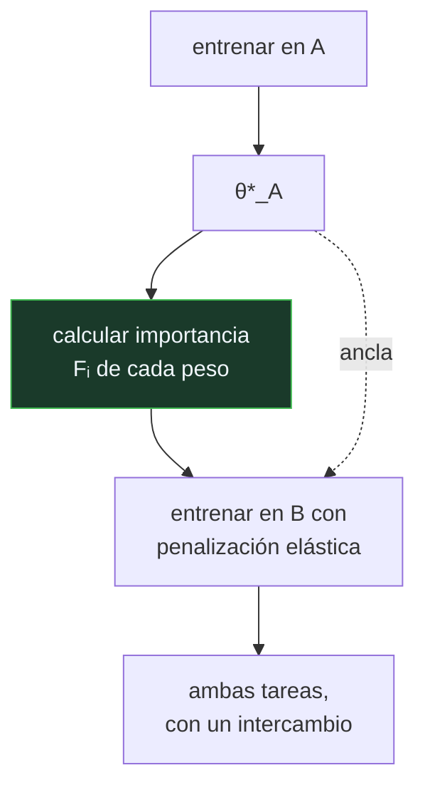

# P145 — Superar el olvido catastrófico

> Ruta de gobernanza · Si aprender lo nuevo mueve los pesos que sostenían lo viejo,
> la solución es frenar solo esos y dejar libres los demás.

**Nivel:** L3 · **Motor:** `ewc` · **Notebook:** [`P145_ewc.ipynb`](../../../notebooks/papers/P145_ewc.ipynb)
· **Anexo:** [cálculo y gradientes](../../annexes/A03_CALCULO_Y_GRADIENTES.md)

## 1. Identificación

| Campo | Valor |
|---|---|
| **Título original** | *Overcoming catastrophic forgetting in neural networks* |
| **Autoría** | James Kirkpatrick, Razvan Pascanu, Neil Rabinowitz, Joel Veness, Guillaume Desjardins, Andrei A. Rusu y otros |
| **Año** | 2017 |
| **Venue** | PNAS, 114(13), 3521–3526 |
| **Fuente primaria** | [doi:10.1073/pnas.1611835114](https://doi.org/10.1073/pnas.1611835114) |
| **Acceso** | Abierto |
| **Fecha de consulta** | 2026-08-18 |

## 2. Problema anterior

[El olvido catastrófico](../P142_olvido_catastrofico/README.md) llevaba casi treinta años
documentado y sin remedio práctico.

La solución obvia —reentrenar con todos los datos anteriores— funciona y exige **conservarlos**, que
es justo lo que a menudo no se puede: por volumen, por normativa de retención, o porque los datos
eran de otra organización.

Y hay un problema conceptual detrás: no se sabía **qué** hay que preservar. Congelar toda la red
impide aprender; dejarla libre borra lo anterior. Hacía falta una noción de «qué parte de la red
sostiene lo que ya sabe».

## 3. Propuesta

Estimar **cuánto importa cada peso** para lo ya aprendido, y frenar solo esos.

La medida es la **información de Fisher**: cuánto cambia la verosimilitud de los datos de la tarea
anterior al mover ese peso. Un peso con Fisher alto es crítico; uno con Fisher bajo se puede mover
sin consecuencias.

Con eso, se añade a la pérdida una penalización cuadrática ponderada:

```text
L(θ) = L_B(θ)  +  (λ/2) · Σᵢ Fᵢ · (θᵢ − θ*A,ᵢ)²
                            ↑ importancia del peso i para la tarea A
```

El nombre —consolidación elástica de pesos— viene de la analogía: cada peso importante queda unido a
su valor anterior por un muelle cuya rigidez es su importancia.

## 4. Intuición sin fórmulas

Reorganizar una casa para que quepa algo nuevo. Puedes tener prohibido mover nada —y entonces no
cabe— o mover lo que sea —y entonces pierdes cosas.

Lo razonable es marcar qué es imprescindible y moverlo poco, dejando libre todo lo demás. Y hay que
marcarlo **antes** de empezar a reorganizar, porque después ya no se distingue.

**Dónde deja de funcionar la analogía:** en la casa los objetos son separables. En una red, un mismo
peso participa en muchas cosas a la vez, y por eso la importancia es una cantidad continua y no una
etiqueta.

## 5. Matemática mínima

```text
Fᵢ ≈ E[ (∂ log p(y|x,θ) / ∂θᵢ)² ]      ← información de Fisher, aproximación diagonal

L(θ) = L_B(θ)  +  (λ/2) · Σᵢ Fᵢ · (θᵢ − θ*A,ᵢ)²
```

La miniatura entrena en A, calcula la importancia y aprende B con distintos valores de λ:

| λ | Exactitud en A | Exactitud en B | Media |
|---:|---:|---:|---:|
| **0** (sin protección) | **0,655** | 0,975 | 0,815 |
| 1 | 0,955 | 0,725 | 0,840 |
| **10** | **0,970** | 0,725 | **0,847** |
| **60** | **0,545** | **0,535** | 0,540 |

Tres lecturas. Con λ = 10, A se recupera de 0,655 a 0,97 — pero **B paga 0,25 puntos**. Es un
intercambio explícito entre estabilidad y plasticidad, no una solución sin coste.

Con λ = 60, **ambas colapsan al azar**: la penalización domina al gradiente y no se aprende nada. λ
no es un dial de seguridad que se sube.

Y la importancia no es uniforme —va de 0,303 a 1,000— pero en un clasificador lineal casi todos los
pesos sirven al único hiperplano que hay, así que queda poco margen libre y B lo nota. En una red
profunda hay muchísimo más margen, y ahí es donde el método luce.

<!-- puente:inicio -->
> [!TIP]
> **Puente matemático.** Esta sección da por sabido lo siguiente. Si algo no te suena,
> léelo primero: está explicado una sola vez, en un solo sitio, y sirve para todas las fichas.

| Dónde | Qué necesitas de ahí |
|---|---|
| [**A03 §5** · Comprobación numérica del gradiente](../../annexes/A03_CALCULO_Y_GRADIENTES.md#5-comprobación-numérica-del-gradiente) | de dónde sale la aproximación de Fisher por el gradiente al cuadrado, y qué se pierde al usar solo la diagonal |
<!-- puente:fin -->

## 6. Arquitectura o flujo



## 7. Qué observar en el paper original

- La **justificación bayesiana**: la penalización sale de aproximar la posterior de la tarea
  anterior por una gaussiana centrada en los pesos aprendidos, con precisión dada por Fisher.
- Los experimentos en **MNIST permutado** y en **juegos de Atari**, que es donde el método demuestra
  que escala a tareas de verdad.
- La **aproximación diagonal** de la matriz de Fisher, que ignora las correlaciones entre pesos.
  Es la simplificación que hace el método viable y también su límite.
- La analogía con la **consolidación sináptica** en neurociencia, que da nombre al método y que
  conviene leer como inspiración y no como evidencia.

## 8. Evidencia y resultados

Experimentos en tareas de clasificación secuenciales y en una secuencia de juegos de Atari, con
comparación contra entrenamiento sin protección y contra reproducción de datos anteriores.

> Publicado en PNAS, con revisión y código. La evidencia es sólida en las tareas evaluadas; trabajos
> posteriores señalan que los protocolos de evaluación de aprendizaje continuo eran demasiado
> favorables.

La miniatura usa un clasificador lineal y aproxima Fisher con el gradiente al cuadrado. El
intercambio que exhibe es más duro que en una red profunda, precisamente porque no hay margen libre.

## 9. Impacto

- Reactivó el área del **aprendizaje continuo** y es su referencia más citada.
- La familia de métodos basados en regularización —inteligencia sináptica, MAS y otros— parte
  directamente de aquí.
- Es relevante en producción cada vez que un modelo se **ajusta por etapas**: cada ajuste es
  aprendizaje secuencial, y este método da una forma de acotar el daño.
- Y aporta un hábito: **medir la importancia antes de reentrenar** en lugar de descubrir después qué
  se rompió.

## 10. Limitaciones

1. **Con muchas tareas en secuencia**, las penalizaciones se acumulan y acaban congelando la red.
   Frena la degradación, no la elimina.
2. **La aproximación diagonal de Fisher** ignora las correlaciones entre pesos, que es donde vive
   buena parte de la estructura.
3. **Exige saber cuándo termina una tarea** y empieza otra. En un flujo continuo sin fronteras, hay
   que detectarlas.
4. **λ es un hiperparámetro delicado**: en la miniatura, λ = 60 colapsa ambas tareas.
5. **Kemker et al. (2018)** mostraron que los protocolos con los que se evaluaban estos métodos
   favorecían resultados optimistas.

## 11. Errores comunes

| Error | Corrección |
|---|---|
| «EWC permite aprender la tarea nueva sin coste» | B paga 0,25 puntos por lo que A recupera. Es un intercambio explícito entre estabilidad y plasticidad. |
| «Cuanto mayor sea λ, mejor se conserva lo anterior» | Con λ = 60 ambas tareas caen al azar (0,545 y 0,535): la penalización domina al gradiente y no se aprende nada. |
| «La penalización frena todos los pesos por igual» | Es proporcional a la importancia de cada uno. Frenar uniformemente impediría aprender la tarea nueva sin proteger mejor la antigua. |
| «Resuelve el aprendizaje continuo» | Con muchas tareas las penalizaciones se acumulan y la red se congela. Frena la degradación, no la elimina. |
| «La importancia se puede calcular en cualquier momento» | Hay que calcularla al terminar la tarea, con sus datos. Después, los pesos ya se han movido y la medida no dice lo mismo. |

## 12. Relación con trabajos anteriores

- **[P142 Interferencia catastrófica](../P142_olvido_catastrofico/README.md) (1989)** — el problema
  que este artículo ataca, planteado casi treinta años antes.
- **[P02 Retropropagación](../P02_backpropagation/README.md) (1986)** — la regla de actualización a
  la que se añade la penalización.
- **[P40 Dropout](../P40_dropout/README.md) (2014)** — otra forma de regularización, con un objetivo
  distinto.

## 13. Relación con trabajos posteriores

- **Zenke et al. (2017)** — inteligencia sináptica: la misma idea calculada en línea.
  [proceedings.mlr.press](https://proceedings.mlr.press/v70/zenke17a.html)
- **Kemker et al. (2018)** — qué miden realmente los métodos de aprendizaje continuo.
  [doi:10.1609/aaai.v32i1.11651](https://doi.org/10.1609/aaai.v32i1.11651)
- **[P48 LoRA](../P48_lora/README.md) (2021)** — la vía arquitectónica: añadir capacidad nueva en
  vez de proteger la existente.

## 14. Notebook asociado

[`P145_ewc.ipynb`](../../../notebooks/papers/P145_ewc.ipynb)

**Qué implementa:** la exactitud en las dos tareas para varios valores de λ, la importancia estimada de cada peso, y qué ocurre cuando λ es demasiado grande.

**Qué NO implementa:** es un clasificador lineal con Fisher aproximado por el gradiente al cuadrado. En una red profunda, la aproximación diagonal ignora correlaciones y hay mucho más margen libre.

```bash
ai-evolution paper-lab P145 --seed 7
```

## 15. Actividades Bloom

| Nivel | Actividad |
|---|---|
| **Recordar** | Escribe la pérdida con la penalización elástica. |
| **Explicar** | Explica qué mide la información de Fisher en este contexto. |
| **Aplicar** | Ejecuta el notebook y localiza el mejor λ. |
| **Analizar** | Analiza por qué λ demasiado grande colapsa ambas tareas. |
| **Evaluar** | «Subimos λ hasta que la tarea antigua dejó de degradarse». Evalúa la decisión. |
| **Crear** | Si mantienes un modelo que se reentrena, mide su rendimiento en una tarea antigua antes y después del último ajuste. |

## 16. Autoevaluación

1. ¿Qué mide la información de Fisher aquí?
2. ¿Qué forma tiene la penalización?
3. ¿Es gratis conservar la tarea antigua?
4. ¿Qué pasa con λ muy grande?
5. ¿Cuándo hay que calcular la importancia?
6. ¿Resuelve el aprendizaje continuo?
7. ¿Cuál es la simplificación clave del método?

## 17. Respuestas esperadas

1. Cuánto cambia la verosimilitud de los datos de la tarea anterior al mover cada peso. Un peso con Fisher alto es crítico para lo ya aprendido.
2. Cuadrática y ponderada: tira de cada peso hacia su valor anterior con fuerza proporcional a su importancia. De ahí el nombre «elástica».
3. No. En la miniatura, B paga 0,25 puntos por lo que A recupera. Es un intercambio explícito entre estabilidad y plasticidad.
4. Ambas tareas colapsan al azar: con λ = 60, A queda en 0,545 y B en 0,535. La penalización domina al gradiente y no se aprende nada.
5. Al terminar la tarea y con sus datos. Después los pesos ya se han movido y la medida no dice lo mismo.
6. No. Con muchas tareas en secuencia, las penalizaciones se acumulan y la red se congela. Frena la degradación, no la elimina.
7. La aproximación diagonal de la matriz de Fisher: ignora las correlaciones entre pesos, lo que la hace viable y a la vez limita lo que puede capturar.

## 18. Fuentes primarias

- Kirkpatrick, J. et al. (2017). *Overcoming catastrophic forgetting in neural networks*.
  **PNAS**, 114(13), 3521–3526.
  [doi:10.1073/pnas.1611835114](https://doi.org/10.1073/pnas.1611835114) · consultado 2026-08-18.
- Zenke, F., Poole, B. y Ganguli, S. (2017). *Continual Learning Through Synaptic Intelligence*.
  [proceedings.mlr.press](https://proceedings.mlr.press/v70/zenke17a.html) · consultado 2026-08-18.
- Kemker, R. et al. (2018). *Measuring Catastrophic Forgetting in Neural Networks*.
  [doi:10.1609/aaai.v32i1.11651](https://doi.org/10.1609/aaai.v32i1.11651) · consultado 2026-08-18.

---

[⬅️ Anterior: P144 Fuera del mundo cerrado](../P144_ml_en_seguridad/README.md) ·
[📇 Índice](../../catalog/PAPERS_INDEX.md) ·
[📝 Evaluación](../../../assessments/papers/P145_ewc.md) ·
[🏫 Clase 176 · Aprendizaje continuo y adaptación](../../../classes/part-14-frontier-research-and-capstones/176-aprendizaje-continuo-y-adaptacion/README.md) ·
[➡️ Siguiente: P146 Aprendizaje federado](../P146_federado/README.md)
