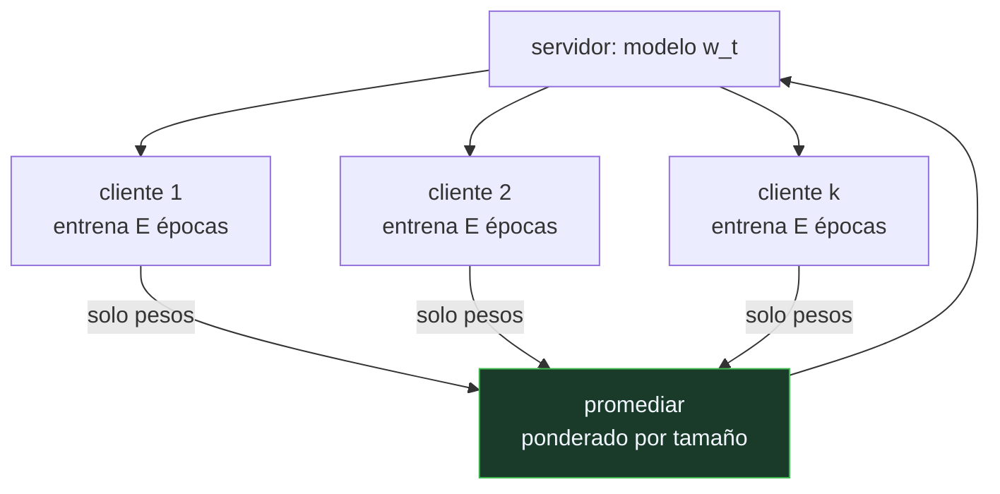

# P146 — Aprendizaje federado

> Ruta de gobernanza · Los datos más útiles son los más sensibles y viven en millones
> de dispositivos. Promediar modelos en vez de recoger registros cambia el problema.

**Nivel:** L2 · **Motor:** `federado` · **Notebook:** [`P146_federado.ipynb`](../../../notebooks/papers/P146_federado.ipynb)
· **Anexo:** [complejidad y coste](../../annexes/A05_COMPLEJIDAD_Y_COSTE.md)

## 1. Identificación

| Campo | Valor |
|---|---|
| **Título original** | *Communication-Efficient Learning of Deep Networks from Decentralized Data* |
| **Autoría** | H. Brendan McMahan, Eider Moore, Daniel Ramage, Seth Hampson, Blaise Agüera y Arcas |
| **Año** | 2017 |
| **Venue** | AISTATS 2017, PMLR 54, 1273–1282 |
| **Fuente primaria** | [arXiv:1602.05629](https://arxiv.org/abs/1602.05629) |
| **Acceso** | Abierto |
| **Fecha de consulta** | 2026-08-18 |

## 2. Problema anterior

Los datos más valiosos para entrenar —lo que se escribe en el teclado, lo que se fotografía, lo
que se dicta— son también los más sensibles, y viven en millones de dispositivos con conexión lenta,
intermitente y a menudo medida.

Centralizarlos tiene dos costes. Uno de **comunicación**: subir todos esos datos es caro y lento. Y
otro de **exposición**: una vez recogidos, existen en un sitio, con todo lo que eso implica de
custodia, brechas y peticiones legales.

La pregunta era si se puede entrenar un modelo compartido sin que los datos se muevan.

## 3. Propuesta

**Promediado federado**, con una ronda que se repite:

```text
1. el servidor manda el modelo actual a un subconjunto de clientes
2. cada cliente entrena E épocas en LOCAL sobre sus propios datos
3. cada cliente devuelve solo los PESOS resultantes
4. el servidor los promedia ponderando por el tamaño de cada cliente
```

La idea clave es el paso 2: **más cómputo local a cambio de menos rondas**. En este escenario la
comunicación es el recurso caro y el cómputo del dispositivo está ocioso, así que conviene gastar
mucho de lo segundo para ahorrar lo primero.

Y el diseño asume desde el principio lo que hace difícil el problema: clientes que aparecen y
desaparecen, con cantidades de datos muy distintas y distribuciones no idénticas.

## 4. Intuición sin fórmulas

Un estudio médico en el que ningún hospital envía historiales. Cada uno analiza los suyos y manda
solo las **conclusiones**; alguien las promedia y devuelve la conclusión conjunta, que cada hospital
vuelve a refinar con sus datos.

Nadie ve los historiales de los demás y el resultado se parece al que se obtendría juntándolos.

**Dónde deja de funcionar la analogía:** las conclusiones también filtran. De los gradientes de un
modelo se pueden reconstruir ejemplos de entrenamiento, así que «no salen datos» no es lo mismo que
«no se filtra nada».

## 5. Matemática mínima

```text
w_{t+1} = Σ_k (n_k / n) · w_{t+1}^k        ← promedio ponderado por tamaño de cliente
```

La miniatura usa 20 clientes con 60 registros cada uno y 12 rondas:

| Distribución | Épocas locales | Exactitud final |
|---|---:|---:|
| homogénea | 1 | 0,990 |
| **homogénea** | **5** | **0,993** |
| heterogénea (una clase por cliente) | 1 | 0,982 |
| heterogénea | 5 | 0,988 |

Se llega a **0,993 sin transmitir un solo registro**. Y más cómputo local acelera: en la ronda 1 se
va de 0,975 con una época a 0,985 con cinco.

**Un aviso sobre la heterogeneidad.** Con cada cliente viendo una sola clase, la caída es de apenas
0,005. Esta maqueta **no reproduce** el fallo por heterogeneidad que documenta la literatura: con 20
clientes repartidos simétricamente y un modelo lineal, promediar cancela los sesgos locales. El
fallo real aparece con redes profundas, participación desigual y clientes que no se compensan.

Lo que sí cambia de naturaleza es lo transmitido: **1 200 registros personales** frente a **240
vectores de 10 pesos**.

<!-- puente:inicio -->
> [!TIP]
> **Puente matemático.** Esta sección da por sabido lo siguiente. Si algo no te suena,
> léelo primero: está explicado una sola vez, en un solo sitio, y sirve para todas las fichas.

| Dónde | Qué necesitas de ahí |
|---|---|
| [**A05 §3** · La cuenta que decide el hardware: memoria](../../annexes/A05_COMPLEJIDAD_Y_COSTE.md#3-la-cuenta-que-decide-el-hardware-memoria) | por qué aquí el recurso escaso es la comunicación y no el cómputo, y cómo eso invierte el diseño del algoritmo |
<!-- puente:fin -->

## 6. Arquitectura o flujo



## 7. Qué observar en el paper original

- El **compromiso central**: épocas locales frente a rondas de comunicación. Es la palanca del
  método y el artículo la barre sistemáticamente.
- Los experimentos con **datos no idénticamente distribuidos**, que es donde el método sufre y donde
  el artículo es honesto sobre sus límites.
- El manejo de la **participación parcial**: solo un subconjunto de clientes responde en cada ronda,
  que es el caso realista con teléfonos.
- Que el artículo **no reclama privacidad**: reclama que los datos no se muevan, que es distinto y
  el propio texto lo distingue.

## 8. Evidencia y resultados

Experimentos sobre clasificación de imágenes y modelado de lenguaje, con barridos de épocas
locales, fracción de clientes participantes y grado de heterogeneidad, midiendo rondas de
comunicación hasta alcanzar un objetivo.

> La métrica elegida —rondas hasta el objetivo— es la correcta para el problema, y es lo que
> distingue este trabajo de una simple demostración de que funciona.

La miniatura es regresión logística sobre datos sintéticos, y no reproduce la degradación por
heterogeneidad. Eso está declarado en la propia evidencia del motor en lugar de sugerido.

## 9. Impacto

- Creó el área del **aprendizaje federado**, hoy con congresos, bibliotecas y despliegues reales.
- Está en producción en la predicción de teclado de Android, en modelos de voz y en varios
  consorcios médicos.
- Encaja con [privacidad diferencial](../P143_privacidad_diferencial/README.md) y agregación segura
  para formar una pila donde cada pieza cubre lo que las otras no.
- Y cambió el planteamiento por defecto: la pregunta «¿dónde centralizamos los datos?» pasó a tener
  una alternativa que antes no existía.

## 10. Limitaciones

1. **No da privacidad por sí solo.** De los gradientes se pueden reconstruir datos de
   entrenamiento; hace falta combinarlo con otras técnicas.
2. **La heterogeneidad degrada el promediado**, y es el problema práctico central del área. Esta
   maqueta no lo reproduce.
3. **Los clientes son poco fiables**: se caen, tienen capacidades muy distintas y participan de
   forma sesgada.
4. **Un cliente malicioso puede envenenar** el modelo enviando actualizaciones manipuladas, y el
   promedio simple no lo detecta.
5. **Depurar es dificilísimo**: no se pueden mirar los datos que causan un problema.

## 11. Errores comunes

| Error | Corrección |
|---|---|
| «Aprendizaje federado es sinónimo de privacidad» | El artículo no lo reclama. De los gradientes se reconstruyen ejemplos; hace falta combinarlo con privacidad diferencial y agregación segura. |
| «Más rondas de comunicación es lo que hace falta» | Es al revés: la comunicación es el recurso caro. Se gasta cómputo local para reducir rondas, y esa es la palanca del método. |
| «Si los datos no salen, no hay riesgo» | El riesgo cambia de forma, no desaparece. Y aparece uno nuevo: un cliente puede envenenar el modelo con actualizaciones manipuladas. |
| «La heterogeneidad es un detalle» | Es el problema práctico central del área. Esta maqueta no lo reproduce y lo dice, precisamente para que no se lea como que no existe. |
| «Es equivalente a entrenar centralizado» | Se acerca en condiciones favorables. Con clientes desiguales, participación parcial y datos no idénticos, la diferencia es real. |

## 12. Relación con trabajos anteriores

- **[P143 Calibrar el ruido a la sensibilidad](../P143_privacidad_diferencial/README.md) (2006)** —
  la pieza que aporta la garantía formal que este método no da.
- **[P41 Adam](../P41_adam/README.md) (2014)** — la optimización local que cada cliente ejecuta.
- **[P134 La protección de la información](../P134_minimo_privilegio/README.md) (1975)** — el
  principio de mecanismo mínimo compartido, del que esto es una aplicación literal.

## 13. Relación con trabajos posteriores

- **Kairouz et al. (2021)** — avances y problemas abiertos del aprendizaje federado.
  [doi:10.1561/2200000083](https://doi.org/10.1561/2200000083)
- **Zhu et al. (2019)** — reconstruir datos de entrenamiento a partir de los gradientes.
  [arXiv:1906.08935](https://arxiv.org/abs/1906.08935)
- **[P133 Colapso de modelo](../P133_colapso_de_modelo/README.md) (2024)** — la otra restricción
  sobre de dónde pueden venir los datos.

## 14. Notebook asociado

[`P146_federado.ipynb`](../../../notebooks/papers/P146_federado.ipynb)

**Qué implementa:** la exactitud alcanzada promediando modelos sin transmitir datos, el efecto de gastar más cómputo local, y qué se transmite en cada enfoque.

**Qué NO implementa:** es regresión logística sobre datos sintéticos y **no reproduce** la degradación por heterogeneidad, que es el problema central del área. Tampoco modela caída de clientes ni actualizaciones envenenadas.

```bash
ai-evolution paper-lab P146 --seed 7
```

## 15. Actividades Bloom

| Nivel | Actividad |
|---|---|
| **Recordar** | Describe los cuatro pasos de una ronda federada. |
| **Explicar** | Explica por qué se gasta cómputo local para ahorrar comunicación. |
| **Aplicar** | Ejecuta el notebook y compara una y cinco épocas locales. |
| **Analizar** | Analiza por qué esta maqueta no muestra el fallo por heterogeneidad. |
| **Evaluar** | «Usamos aprendizaje federado, así que los datos están protegidos». Evalúa la afirmación. |
| **Crear** | Identifica datos que no puedas centralizar por normativa y estima si el promediado federado sería viable con su volumen y conectividad. |

## 16. Autoevaluación

1. ¿Qué se transmite en cada ronda?
2. ¿Por qué más épocas locales ayudan?
3. ¿Da privacidad el método?
4. ¿Cuál es su problema práctico central?
5. ¿Por qué esta maqueta no lo muestra?
6. ¿Qué riesgo nuevo introduce?
7. ¿Con qué se combina en la práctica?

## 17. Respuestas esperadas

1. Solo los pesos del modelo entrenado en local, nunca los registros. El servidor los promedia ponderando por el tamaño de cada cliente.
2. Porque la comunicación es el recurso caro y el cómputo del dispositivo está ocioso. Más trabajo local significa menos rondas para llegar al mismo objetivo.
3. No por sí solo, y el artículo no lo reclama. De los gradientes se pueden reconstruir ejemplos de entrenamiento.
4. La heterogeneidad: cuando los clientes ven distribuciones muy distintas, sus modelos divergen y el promedio deja de ser un buen punto de encuentro.
5. Porque con 20 clientes repartidos simétricamente y un modelo lineal, promediar cancela los sesgos locales. El motor lo declara en su propia evidencia.
6. Un cliente malicioso puede enviar actualizaciones manipuladas para envenenar el modelo, y el promedio simple no lo detecta.
7. Con privacidad diferencial y agregación segura. Las tres piezas cubren cosas distintas y ninguna sustituye a las otras.

## 18. Fuentes primarias

- McMahan, H. B. et al. (2017). *Communication-Efficient Learning of Deep Networks from
  Decentralized Data*. **AISTATS 2017**, PMLR 54, 1273–1282.
  [arxiv.org/abs/1602.05629](https://arxiv.org/abs/1602.05629) · consultado 2026-08-18.
- Kairouz, P. et al. (2021). *Advances and Open Problems in Federated Learning*.
  [doi:10.1561/2200000083](https://doi.org/10.1561/2200000083) · consultado 2026-08-18.
- Zhu, L., Liu, Z. y Han, S. (2019). *Deep Leakage from Gradients*.
  [arXiv:1906.08935](https://arxiv.org/abs/1906.08935) · consultado 2026-08-18.

---

[⬅️ Anterior: P145 Superar el olvido catastrófico](../P145_ewc/README.md) ·
[📇 Índice](../../catalog/PAPERS_INDEX.md) ·
[📝 Evaluación](../../../assessments/papers/P146_federado.md) ·
[🏫 Clase 177 · Privacidad diferencial y aprendizaje federado](../../../classes/part-14-frontier-research-and-capstones/177-privacidad-diferencial-y-aprendizaje-federado/README.md) ·
[➡️ Siguiente: P147 Modelos del mundo](../P147_world_models/README.md)
