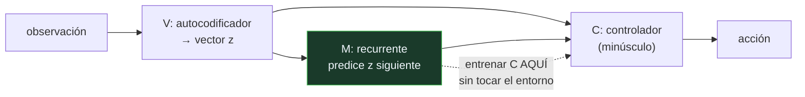

# P147 — Modelos del mundo

> Ruta de gobernanza · Si el agente aprende un modelo del entorno, puede entrenar
> dentro de él. El problema es que encontrará sus grietas si le das tiempo.

**Nivel:** L3 · **Motor:** `world_models` · **Notebook:** [`P147_world_models.ipynb`](../../../notebooks/papers/P147_world_models.ipynb)
· **Anexo:** [complejidad y coste](../../annexes/A05_COMPLEJIDAD_Y_COSTE.md)

## 1. Identificación

| Campo | Valor |
|---|---|
| **Título original** | *Recurrent World Models Facilitate Policy Evolution* |
| **Autoría** | David Ha, Jürgen Schmidhuber |
| **Año** | 2018 |
| **Venue** | NeurIPS 2018 · arXiv:1803.10122 |
| **Fuente primaria** | [arXiv:1803.10122](https://arxiv.org/abs/1803.10122) |
| **Acceso** | Abierto |
| **Fecha de consulta** | 2026-08-18 |

## 2. Problema anterior

Aprender por refuerzo exige millones de interacciones con el entorno. En simulación es caro; en un
robot, inviable — cada interacción es tiempo real, desgaste y riesgo.

Y hay un desperdicio estructural: el agente pasa la mayor parte de esas interacciones **reaprendiendo
cómo funciona el mundo**, no cómo actuar en él. La física de la escena, la dinámica del vehículo, qué
pasa al pulsar un botón: todo eso se vuelve a inferir en cada episodio.

Si esa parte se pudiera aprender una vez y reutilizar, quedaría separada del problema de decidir.

## 3. Propuesta

Separar el agente en tres piezas con responsabilidades distintas:

```text
V (visión)   : autocodificador variacional  → comprime la observación a un vector
M (memoria)  : red recurrente mixta          → predice el siguiente vector
C (controlador): política diminuta           → decide, mirando V y M
```

Lo llamativo es el tamaño: el controlador tiene **unos pocos centenares de parámetros** frente a los
millones de V y M. Casi todo el modelo se dedica a entender el mundo, y muy poco a actuar en él.

Y la consecuencia que da nombre al artículo: como M predice el futuro, se puede **entrenar el
controlador dentro de M** —lo que los autores llaman «soñar»— sin tocar el entorno ni una sola vez.
La política resultante se transfiere al entorno real.

## 4. Intuición sin fórmulas

Aprenderse un circuito de carreras. Primero das vueltas mirando: dónde están las curvas, cómo
responde el coche. Después puedes practicar la estrategia **mentalmente**, visualizando la vuelta,
sin gastar gasolina.

Funciona en la medida en que tu visualización sea fiel. Si tu modelo mental exagera el agarre en una
curva, la estrategia que practiques será justamente la que se aprovecha de ese error.

**Dónde deja de funcionar la analogía:** una persona sabe cuándo está imaginando y desconfía. Una
política optimizada no desconfía: busca sistemáticamente el punto donde el modelo le promete más, y
ese punto suele ser un error del modelo.

## 5. Matemática mínima

No hay formalismo nuevo: es una arquitectura. Lo medible es la **brecha** entre lo que el modelo
promete y lo que el mundo entrega.

La miniatura busca la mejor política **dentro** del modelo y luego la ejecuta en el entorno real:

| Error del modelo | Promete | Entrega | **Brecha** |
|---:|---:|---:|---:|
| 0,00 | −0,057 | −0,057 | **0,000** |
| 0,05 | −0,049 | −0,058 | 0,009 |
| 0,15 | −0,037 | −0,059 | 0,022 |
| **0,30** | **−0,026** | **−0,063** | **0,037** |

Con un modelo exacto, entrenar dentro equivale a entrenar fuera. Según el modelo se desvía, la
política se optimiza contra **sus errores** y la brecha crece de forma sistemática.

Y el ahorro es lo que justifica correr ese riesgo:

| Dónde se busca la política | Interacciones reales |
|---|---:|
| en el mundo | **9 600** |
| en el modelo | **0** |

En un robot, esa diferencia es entre semanas y minutos.

<!-- puente:inicio -->
> [!TIP]
> **Puente matemático.** Esta sección da por sabido lo siguiente. Si algo no te suena,
> léelo primero: está explicado una sola vez, en un solo sitio, y sirve para todas las fichas.

| Dónde | Qué necesitas de ahí |
|---|---|
| [**A05 §8** · Checklist antes de creerte una cifra de rendimiento](../../annexes/A05_COMPLEJIDAD_Y_COSTE.md#8-checklist-antes-de-creerte-una-cifra-de-rendimiento) | por qué una cifra medida dentro del simulador no es una cifra de rendimiento |
<!-- puente:fin -->

## 6. Arquitectura o flujo



## 7. Qué observar en el paper original

- El **tamaño del controlador**: unos centenares de parámetros. Que una política tan pequeña baste
  cuando la representación es buena es el resultado más provocador del artículo.
- El experimento de entrenar **enteramente dentro del sueño** y transferir al entorno real. Es la
  demostración de la tesis.
- Cómo los autores **detectan y frenan la explotación del modelo**: añadir incertidumbre —subir la
  temperatura del modelo— para que la política no pueda aprovechar sus grietas.
- La presentación **interactiva** del artículo, que permite manipular el modelo y ver sus
  predicciones. Es una forma de comunicar resultados que sigue siendo poco común.

## 8. Evidencia y resultados

Experimentos en dos entornos —conducción por vista superior y un juego en primera persona— con
comparación contra los métodos del estado del arte de la época y con el experimento de
entrenamiento íntegramente dentro del modelo.

> La evidencia de la tesis principal es directa: una política entrenada sin tocar el entorno
> funciona en el entorno. Y el artículo documenta también cuándo eso falla.

La miniatura usa un entorno unidimensional determinista y un «modelo del mundo» que es una fórmula
con un sesgo controlado. Sirve para exhibir la brecha; no reproduce ni la compresión visual ni la
predicción estocástica.

## 9. Impacto

- Reactivó el **aprendizaje por refuerzo con modelo** y abrió la línea que siguen Dreamer,
  DreamerV3 y los modelos del mundo actuales.
- La descomposición **visión / memoria / control** es hoy un patrón de diseño reconocible.
- La idea de **entrenar dentro de un modelo aprendido** es lo que hace viable la robótica moderna
  con aprendizaje, junto con la aleatorización de dominio.
- Y dejó una advertencia que se aplica mucho más allá: **una política optimizada explota los errores
  de su simulador**, y cuanto mejor sea la optimización, más los explota.

## 10. Limitaciones

1. **La política explota los errores del modelo**, y el problema empeora cuanto mejor sea la
   búsqueda. Es el fallo característico del aprendizaje con modelo.
2. **Los entornos evaluados son relativamente simples.** Escalar a entornos ricos exige modelos del
   mundo mucho mejores.
3. **El modelo se entrena con datos de una política aleatoria**, y por tanto solo conoce la parte
   del entorno que esa política visita.
4. **La compresión pierde información** que puede resultar relevante para la tarea, y el
   autocodificador no sabe cuál es.
5. **Añadir incertidumbre para frenar la explotación es un ajuste manual**, no un principio: hay que
   calibrarlo por entorno.

## 11. Errores comunes

| Error | Corrección |
|---|---|
| «Si el modelo predice bien, la política transferirá bien» | Predice bien en promedio y mal en los rincones que la política busca. En la miniatura, con sesgo 0,3 el modelo promete −0,026 y el mundo entrega −0,063. |
| «Una búsqueda más potente da siempre una política mejor» | Dentro de un modelo imperfecto, una búsqueda mejor encuentra mejor sus grietas. Puede dar una política peor en el mundo real. |
| «El controlador tiene que ser grande» | Tiene unos centenares de parámetros. Casi toda la capacidad está en entender el mundo, no en decidir. |
| «La cifra del simulador es el rendimiento» | Es lo que el modelo promete. La única cifra que cuenta es la del entorno real, y la diferencia entre ambas es la brecha. |
| «Entrenar dentro del modelo elimina la necesidad de interactuar» | Elimina las interacciones de la búsqueda de política. El modelo hay que aprenderlo con interacciones reales, y su calidad las limita. |

## 12. Relación con trabajos anteriores

- **[P38 Autocodificador variacional](../P38_vae/README.md) (2013)** — la pieza que comprime la
  observación.
- **[P03 LSTM](../P03_lstm/README.md) (1997)** — la memoria recurrente que predice el futuro.
- **[P26 DQN](../P26_dqn/README.md) (2015)** — el aprendizaje por refuerzo sin modelo, con su coste
  en interacciones.

## 13. Relación con trabajos posteriores

- **Hafner et al. (2020)** — Dreamer: aprender comportamientos imaginando, con mejores modelos.
  [arXiv:1912.01603](https://arxiv.org/abs/1912.01603)
- **[P103 Aleatorización de dominio](../P103_domain_randomization/README.md) (2017)** — la otra vía
  para cruzar el hueco entre simulación y realidad.
- **Sutton (1991)** — Dyna, la idea original de planificar con un modelo aprendido.
  [doi:10.1145/122344.122377](https://doi.org/10.1145/122344.122377)

## 14. Notebook asociado

[`P147_world_models.ipynb`](../../../notebooks/papers/P147_world_models.ipynb)

**Qué implementa:** la brecha entre lo que promete un modelo del entorno y lo que entrega el entorno real según lo sesgado que esté el modelo, y el ahorro en interacciones reales.

**Qué NO implementa:** el entorno es unidimensional y determinista, y el «modelo del mundo» es una fórmula con un sesgo escalar. No hay compresión visual, ni predicción estocástica, ni el remedio de añadir incertidumbre.

```bash
ai-evolution paper-lab P147 --seed 7
```

## 15. Actividades Bloom

| Nivel | Actividad |
|---|---|
| **Recordar** | Describe las tres piezas de la arquitectura. |
| **Explicar** | Explica qué significa entrenar la política dentro del modelo. |
| **Aplicar** | Ejecuta el notebook y observa cómo crece la brecha con el sesgo. |
| **Analizar** | Analiza por qué una búsqueda más potente puede empeorar el resultado real. |
| **Evaluar** | «La política obtiene una recompensa excelente en el simulador». Evalúa la afirmación. |
| **Crear** | Si usas un simulador, mide la diferencia entre el rendimiento simulado y el real de una política tuya. |

## 16. Autoevaluación

1. ¿Qué hace cada una de las tres piezas?
2. ¿Qué tamaño tiene el controlador?
3. ¿Qué significa «soñar» en este contexto?
4. ¿Qué es la brecha y de qué depende?
5. ¿Por qué una mejor búsqueda puede dar peor política?
6. ¿Qué remedio propone el artículo?
7. ¿Elimina la necesidad de interactuar con el entorno?

## 17. Respuestas esperadas

1. V comprime la observación en un vector, M predice el siguiente vector, y C decide la acción mirando los dos.
2. Unos pocos centenares de parámetros, frente a los millones de V y M. Casi toda la capacidad está en entender el mundo.
3. Entrenar el controlador dentro del modelo aprendido, sin tocar el entorno real ni una sola vez, y transferir después la política resultante.
4. La diferencia entre lo que el modelo promete y lo que el entorno entrega. Crece con el error del modelo: en la miniatura, de 0,000 a 0,037.
5. Porque optimiza contra el modelo, incluidas sus grietas. Cuanto mejor busca, mejor las encuentra, y esas grietas no existen en el mundo real.
6. Añadir incertidumbre al modelo —subir su temperatura— para que la política no pueda aprovechar sus errores. Es un ajuste manual, no un principio.
7. Elimina las interacciones de la búsqueda de política. El modelo hay que aprenderlo con interacciones reales, y su calidad limita todo lo demás.

## 18. Fuentes primarias

- Ha, D. y Schmidhuber, J. (2018). *Recurrent World Models Facilitate Policy Evolution*.
  **NeurIPS 2018**. [arxiv.org/abs/1803.10122](https://arxiv.org/abs/1803.10122) ·
  consultado 2026-08-18.
- Hafner, D. et al. (2020). *Dream to Control: Learning Behaviors by Latent Imagination*.
  [arXiv:1912.01603](https://arxiv.org/abs/1912.01603) · consultado 2026-08-18.
- Sutton, R. S. (1991). *Dyna, an Integrated Architecture for Learning, Planning, and Reacting*.
  [doi:10.1145/122344.122377](https://doi.org/10.1145/122344.122377) · consultado 2026-08-18.

---

[⬅️ Anterior: P146 Aprendizaje federado](../P146_federado/README.md) ·
[📇 Índice](../../catalog/PAPERS_INDEX.md) ·
[📝 Evaluación](../../../assessments/papers/P147_world_models.md) ·
[🏫 Clase 174 · World models y simulación interna](../../../classes/part-14-frontier-research-and-capstones/174-world-models-y-simulacion-interna/README.md) ·
[➡️ Siguiente: P148 Cerrar la brecha de responsabilidad](../P148_auditoria_interna/README.md)
