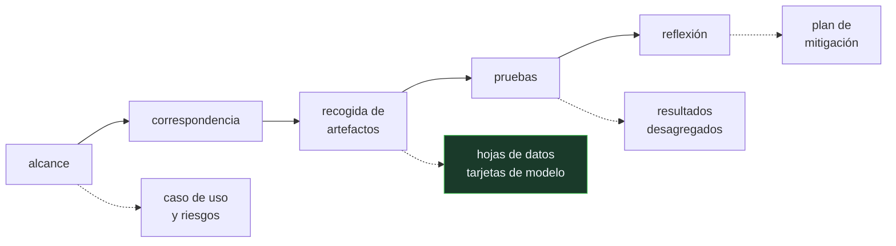

# P148 — Cerrar la brecha de responsabilidad

> Ruta de gobernanza · «Faltan las etiquetas de subgrupo» es barato al recoger los
> datos e imposible después. Auditar al final es auditar cuando ya no se puede corregir.

**Nivel:** L1 · **Motor:** `auditoria_interna` · **Notebook:** [`P148_auditoria_interna.ipynb`](../../../notebooks/papers/P148_auditoria_interna.ipynb)
· **Anexo:** [complejidad y coste](../../annexes/A05_COMPLEJIDAD_Y_COSTE.md)

## 1. Identificación

| Campo | Valor |
|---|---|
| **Título original** | *Closing the AI Accountability Gap: Defining an End-to-End Framework for Internal Algorithmic Auditing* |
| **Autoría** | Inioluwa Deborah Raji, Andrew Smart, Rebecca N. White, Margaret Mitchell, Timnit Gebru, Ben Hutchinson, Jamila Smith-Loud, Daniel Theron, Parker Barnes |
| **Año** | 2020 |
| **Venue** | FAT* '20, 33–44 |
| **Fuente primaria** | [doi:10.1145/3351095.3372873](https://doi.org/10.1145/3351095.3372873) |
| **Acceso** | Abierto |
| **Fecha de consulta** | 2026-08-18 |

## 2. Problema anterior

La auditoría algorítmica se hacía —cuando se hacía— **al final**, sobre un sistema ya construido,
en forma de revisión ética antes del lanzamiento.

En ese punto los hallazgos importantes son incorregibles. Si faltan las etiquetas de subgrupo, no se
puede desagregar la evaluación, y recogerlas exigiría rehacer el conjunto de datos. Si nadie definió
a quién afecta el sistema, no hay contra qué comprobar nada.

Y hay un vacío más profundo: entre lo que una organización **dice** que hace y lo que se puede
**comprobar** que hace no había ningún puente. Esa es la brecha de responsabilidad del título.

## 3. Propuesta

Convertir la auditoría en un **proceso con cinco etapas**, cada una con artefactos obligatorios
que se producen mientras el sistema se construye:

```text
alcance → correspondencia → recogida de artefactos → pruebas → reflexión
```

- **alcance**: declaración de caso de uso y de riesgos previstos;
- **correspondencia**: mapa de interesados y de responsabilidades;
- **recogida de artefactos**: [hojas de datos](../P115_hojas_de_datos/README.md) y
  [tarjetas de modelo](../P114_tarjetas_de_modelo/README.md);
- **pruebas**: resultados desagregados y pruebas adversarias;
- **reflexión**: análisis de riesgo y plan de mitigación.

La auditoría produce una **traza**, no un veredicto. Y el marco es explícito sobre lo que **no**
hace: la audita quien la construye.

## 4. Intuición sin fórmulas

La documentación de un edificio. Los planos, los cálculos de estructura y los certificados de
materiales se producen **mientras** se construye.

Un inspector que llega al final con el edificio en pie puede mirar las grietas visibles. Con los
planos y los certificados puede comprobar si el forjado aguanta. Y si nadie los hizo, no hay forma
de averiguarlo sin demoler.

**Dónde deja de funcionar la analogía:** al inspector de edificios lo paga alguien externo. La
auditoría interna la hace la propia organización, y ese conflicto de interés es estructural — el
artículo lo dice.

## 5. Matemática mínima

No hay formalismo: es un marco de proceso. Lo que se puede exhibir es el coste de llegar tarde.

La miniatura asigna a cada etapa un coste relativo de corregir un hallazgo ahí:

| Etapa | Artefacto | Coste de cambiar |
|---|---|---:|
| alcance | declaración de caso de uso y riesgos | 1 |
| correspondencia | mapa de interesados | 2 |
| recogida de artefactos | hojas de datos, tarjetas de modelo | 5 |
| pruebas | resultados desagregados | 13 |
| **reflexión** | análisis de riesgo y mitigación | **34** |

Los mismos cinco hallazgos cuestan **55** si aparecen cuando corresponde y **170** si aparecen todos
en la revisión final: **3,1× más**.

Y hay hallazgos que no es que cuesten más: es que **ya no se pueden corregir**. «Faltan las etiquetas
de subgrupo» al recoger los datos es una tarde de trabajo; con el sistema construido, exige rehacer
el conjunto.

<!-- puente:inicio -->
> [!TIP]
> **Puente matemático.** Esta sección da por sabido lo siguiente. Si algo no te suena,
> léelo primero: está explicado una sola vez, en un solo sitio, y sirve para todas las fichas.

| Dónde | Qué necesitas de ahí |
|---|---|
| [**A05 §8** · Checklist antes de creerte una cifra de rendimiento](../../annexes/A05_COMPLEJIDAD_Y_COSTE.md#8-checklist-antes-de-creerte-una-cifra-de-rendimiento) | el mismo hábito llevado al proceso: qué artefactos hay que exigir antes de aceptar que un sistema es auditable |
<!-- puente:fin -->

## 6. Arquitectura o flujo



## 7. Qué observar en el paper original

- Que el marco **exige artefactos y no opiniones**. Un auditor sin artefactos solo puede preguntar;
  con ellos, puede comprobar.
- La **matriz de fallos** que el artículo propone para la etapa de pruebas: qué puede salir mal, con
  qué probabilidad y con qué consecuencia.
- La sección sobre **lo que la auditoría interna no hace**, que es lo que le da credibilidad: no da
  cuenta pública, no tiene poder de veto y cubre lo que la organización decide mirar.
- Cómo el marco **encadena** los artefactos de trabajos anteriores —hojas de datos, tarjetas de
  modelo— en un proceso en vez de dejarlos como documentos sueltos.

## 8. Evidencia y resultados

El artículo propone el marco y lo ilustra con casos de aplicación, describiendo los artefactos y
las plantillas concretas.

> No hay evaluación de su efecto: no se mide si las organizaciones que lo aplican tienen menos
> incidentes. Es un marco propuesto y argumentado, no un resultado medido.

La miniatura asigna costes relativos por etapa que son **ilustrativos, no medidos**. Lo que el
artículo sostiene cualitativamente es que corregir tarde es caro, no una escala concreta.

## 9. Impacto

- Es la referencia estándar de auditoría algorítmica interna, y su vocabulario —etapas, artefactos,
  traza— se ha incorporado a marcos de gobernanza.
- El **NIST AI Risk Management Framework** (2023) recoge la misma estructura de proceso con
  artefactos por etapa.
- El **Reglamento de IA de la Unión Europea** exige documentación técnica cuyo contenido se solapa
  fuertemente con estos artefactos.
- Y cierra el círculo del eje: [tarjetas de modelo](../P114_tarjetas_de_modelo/README.md) y
  [hojas de datos](../P115_hojas_de_datos/README.md) dejan de ser documentos aislados y pasan a ser
  entregables de un proceso con responsables.

## 10. Limitaciones

1. **La audita quien la construye.** El conflicto de interés es estructural, y el artículo lo
   reconoce sin resolverlo.
2. **No da cuenta pública**: los resultados pueden quedarse dentro de la organización.
3. **No tiene poder de veto.** Si la dirección decide lanzar, la auditoría no lo impide.
4. **Cubre lo que la organización decide mirar**, así que un riesgo no contemplado en la etapa de
   alcance no aparece en ninguna etapa posterior.
5. **No hay evaluación de su efecto**, y sin incentivo externo —regulación, responsabilidad legal,
   presión pública— el marco no se adopta solo.

## 11. Errores comunes

| Error | Corrección |
|---|---|
| «La revisión ética se hace antes del lanzamiento» | En ese punto los hallazgos importantes ya no se pueden corregir. Los mismos cinco hallazgos cuestan 3,1× más si aparecen todos al final. |
| «La auditoría interna sustituye a la externa» | El artículo es explícito: no da cuenta pública, no tiene poder de veto y la hace quien construye el sistema. Prepara el terreno, no sustituye. |
| «Auditar es emitir un juicio sobre el sistema» | Es producir una traza de artefactos comprobables. Un auditor sin artefactos solo puede preguntar. |
| «Si el sistema funciona bien, la auditoría es un trámite» | La auditoría comprueba si se puede saber cómo funciona y para quién falla. Eso es independiente de que funcione. |
| «Basta con tener tarjeta de modelo y hoja de datos» | Son dos de los artefactos. Sin el alcance, el mapa de interesados y el plan de mitigación, no hay proceso ni responsables. |

## 12. Relación con trabajos anteriores

- **[P114 Tarjetas de modelo](../P114_tarjetas_de_modelo/README.md) (2019)** — uno de los artefactos
  que el marco exige.
- **[P115 Hojas de datos](../P115_hojas_de_datos/README.md) (2021)** — el artefacto equivalente para
  los datos.
- **[P112 ML Test Score](../P112_ml_test_score/README.md) (2017)** — la rúbrica de preparación
  técnica, complementaria a este proceso.

## 13. Relación con trabajos posteriores

- **NIST AI Risk Management Framework (2023)** — la misma estructura, en forma de norma.
  [doi:10.6028/NIST.AI.100-1](https://doi.org/10.6028/NIST.AI.100-1)
- **Costanza-Chock et al. (2022)** — cómo es realmente el ecosistema de auditoría de IA.
  [doi:10.1145/3531146.3533213](https://doi.org/10.1145/3531146.3533213)
- **Reglamento de IA de la UE (2024)** — documentación técnica obligatoria para sistemas de alto
  riesgo.

## 14. Notebook asociado

[`P148_auditoria_interna.ipynb`](../../../notebooks/papers/P148_auditoria_interna.ipynb)

**Qué implementa:** las cinco etapas con su artefacto, el coste relativo de corregir un hallazgo en cada una, y la diferencia entre auditar de forma continua o solo antes de lanzar.

**Qué NO implementa:** los costes relativos por etapa son ilustrativos, no medidos. Y el artículo tampoco evalúa el efecto del marco: no se mide si quien lo aplica tiene menos incidentes.

```bash
ai-evolution paper-lab P148 --seed 7
```

## 15. Actividades Bloom

| Nivel | Actividad |
|---|---|
| **Recordar** | Enumera las cinco etapas y su artefacto. |
| **Explicar** | Explica por qué un hallazgo tardío puede ser incorregible. |
| **Aplicar** | Ejecuta el notebook y compara los dos costes. |
| **Analizar** | Analiza por qué exigir artefactos hace el proceso auditable. |
| **Evaluar** | «Hacemos revisión ética antes de cada lanzamiento». Evalúa el proceso. |
| **Crear** | Elige un sistema tuyo y comprueba cuáles de los cinco artefactos existen. Los que falten son tu deuda de auditoría. |

## 16. Autoevaluación

1. ¿Cuáles son las cinco etapas?
2. ¿Qué produce la auditoría?
3. ¿Por qué importa el momento?
4. ¿Qué hallazgo es incorregible al final?
5. ¿Qué NO hace la auditoría interna?
6. ¿Por qué artefactos y no opiniones?
7. ¿Qué la conecta con el resto del eje?

## 17. Respuestas esperadas

1. Alcance, correspondencia, recogida de artefactos, pruebas y reflexión. Cada una produce un entregable concreto.
2. Una traza de artefactos comprobables, no un veredicto. Es lo que permite que alguien externo compruebe en vez de preguntar.
3. Porque corregir tarde es caro y a veces imposible. Los mismos cinco hallazgos cuestan 3,1× más si aparecen todos en la revisión final.
4. «Faltan las etiquetas de subgrupo». Al recoger los datos es una tarde; con el sistema construido, exige rehacer el conjunto de datos.
5. No da cuenta pública, no tiene poder de veto, la hace quien construye el sistema y cubre solo lo que la organización decide mirar.
6. Porque una opinión no se puede comprobar. Un auditor con hojas de datos y resultados desagregados puede verificar; sin ellos, solo puede preguntar.
7. Encadena las tarjetas de modelo y las hojas de datos en un proceso con responsables, en vez de dejarlas como documentos sueltos.

## 18. Fuentes primarias

- Raji, I. D. et al. (2020). *Closing the AI Accountability Gap*. **FAT* '20**, 33–44.
  [doi:10.1145/3351095.3372873](https://doi.org/10.1145/3351095.3372873) · consultado 2026-08-18.
- NIST (2023). *AI Risk Management Framework 1.0*.
  [doi:10.6028/NIST.AI.100-1](https://doi.org/10.6028/NIST.AI.100-1) · consultado 2026-08-18.
- Costanza-Chock, S., Raji, I. D. y Buolamwini, J. (2022). *Who Audits the Auditors?*
  [doi:10.1145/3531146.3533213](https://doi.org/10.1145/3531146.3533213) · consultado 2026-08-18.

---

[⬅️ Anterior: P147 Modelos del mundo](../P147_world_models/README.md) ·
[📇 Índice](../../catalog/PAPERS_INDEX.md) ·
[📝 Evaluación](../../../assessments/papers/P148_auditoria_interna.md) ·
[🏫 Clase 169 · Gobernanza, roles y gestión de riesgo](../../../classes/part-13-evaluation-safety-security-and-governance/169-gobernanza-roles-y-gestion-de-riesgo/README.md) ·
[➡️ Índice de papers](../../catalog/PAPERS_INDEX.md)
